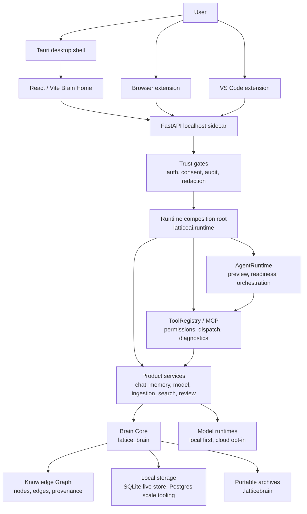
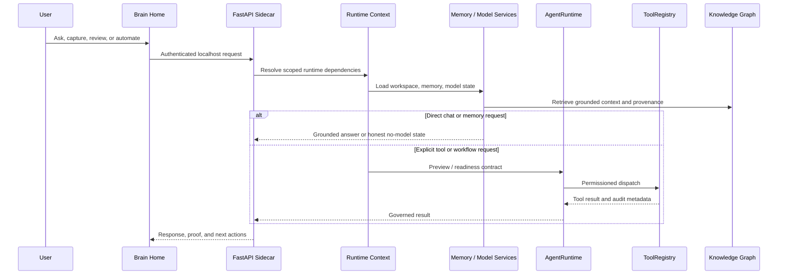

# Lattice AI Current Architecture

> **Status: canonical** — current-truth architecture document, kept in sync
> with the current release. Historical subsystem detail lives in
> [`docs/architecture.md`](docs/architecture.md).

Current release: **9.9.3 — Closed Loops**.

Lattice AI is a local-first Digital Brain platform. The current architecture is
organized around a private Brain, replaceable model runtimes, explicit tool
registries, and import-safe server composition.

## System Map

Key boundaries:

- `frontend/src` owns product UX and static app behavior.
- `latticeai.app_factory` is the FastAPI composition root.
- `latticeai.runtime` owns typed config, security, Brain, model, platform, and
  router assembly stages (`config_runtime`, `security_runtime`,
  `brain_runtime`, `persistence_runtime`, `history_runtime`,
  `router_registration`, ...); no stage exports ambient `locals()` state.
- `latticeai.api` owns route-level behavior through router-factory modules
  (chat, memory, search, local_files/ingestion, brain_intelligence,
  automation_intelligence, command_center, change_proposals, review_queue,
  workspace, admin, ...). Chat contracts, history, documents, and streaming
  are focused modules over service-owned logic.
- `latticeai.services` owns product and execution services (`chat_service`,
  `memory_service`, `model_service`, `ingestion`, `search_service`,
  `review_queue`, `command_center`, `automation_intelligence`,
  `brain_intelligence`, `change_proposals`, ...).
- `latticeai.core` owns lower-level registries and helpers (`agent`,
  `agent_eval`, `tool_governor`, `context_builder`, `workspace_os`,
  `mcp_registry`, `marketplace`, `tool_registry`, `config`, ...).
- `lattice_brain` owns Brain Core, graph, memory, ingestion, and storage.
  `lattice_brain/graph/store.py` composes `KnowledgeGraphStore` from focused
  mixins (retrieval, retrieval_vector, ingest, discovery, provenance,
  projection, documents, write_master). `lattice_brain/graph/proactive.py`
  provides read-only proactive intelligence (duplicate discovery,
  contradictions, quality reports, the observe-mode ingest quality gate) over
  the store's public APIs. Storage engines live in `lattice_brain/storage/`
  (SQLite live engine, optional Postgres scale/migration tooling).

## Runtime Flow

## Product Flow

The current first-run and daily-use flow is:

1. Wake Brain / login.
2. Pick owner/workspace context.
3. Review recommended local model setup.
4. Prepare/install/load a model when the user opts in.
5. Land on Brain Home with the living Brain, conversation composer, and
   evidence-backed Brain Brief visible together.
6. Add a first source through upload, note, browser capture, or folder indexing.
7. Ask a grounded question, inspect proof, then open the memory graph when
   deeper source evidence is needed.
8. Choose model, automate, or manage from
   explicit navigation.

The graph is available when users need proof or exploration. It is not forced
into the first screen as a dashboard.

Action-aware Brain Chat sits on the same product path: ordinary questions stay
on direct chat generation, while explicit file create/write/save/edit requests
enter the governed workspace file tool path.

## Frontend

The app is a React/Vite static bundle served by the local FastAPI sidecar.
Current UX rules:

- Brain Home is the default product surface.
- The composer is the primary action.
- Source capture, model setup, graph exploration, automation, and admin controls
  are reachable but not mixed into the first screen.
- Mobile layouts preserve the Brain and composer in the first viewport.
- Static release assets are generated under `static/app` and must match
  `asset-manifest.json`.
- Critical API failures produce an explicit unavailable state and are never
  normalized into healthy empty Brain data.

## FastAPI Sidecar

`latticeai.app_factory` builds the local app without import-time MLX/GPU
initialization, filesystem writes, or network calls. Runtime assembly is
dependency-injected through immutable typed stages instead of ambient locals or
global mutable model state.

Important expectations:

- bind to `127.0.0.1` by default;
- require auth for sensitive endpoints;
- keep static serving, API routers, MCP install state, and runtime context
  separately testable;
- keep model and tool execution behind explicit runtime boundaries.
- keep API-specific HTTP errors at the route boundary and domain/model errors in
  services.

## Brain Core

`lattice_brain` is the durable product core. It owns:

- conversations and memories;
- Knowledge Graph nodes, edges, provenance, and traversal;
- ingestion and document/source capture;
- local storage and backup/restore behavior;
- `.latticebrain` archive compatibility.

The Honest Knowledge Pipeline hardens retrieval and ingestion:

- `graph/retrieval.py` `hybrid_search` blends lexical (FTS) and vector evidence
  and reports a `context_quality` signal that chat consumes so grounding is
  honest about how strong the retrieved context is.
- `graph/retrieval_vector.py` tracks vector freshness (embedded vs. total
  content) so the Brain can report stale embeddings and reindex on demand.
- `ingestion.py` supports folder ingestion (`ingest_folder`) with
  `.latticeignore` filtering and resumable background jobs
  (`/api/ingestion/jobs`), plus per-source `extraction_quality` scoring and an
  observe-mode `quality_gate` that flags low-quality extractions instead of
  silently accepting them.

Knowledge Graph changes must preserve read compatibility, rollback paths,
migration safety, and equivalence tests.

## Runtime Contracts

The 8.0 architecture contract remains active in 9.9.3:

- AgentRuntime has explicit preview/readiness contracts and does not execute
  tools during preview.
- ToolRegistry owns dispatch, permissions, manifest, diagnostics, and MCP
  install state, with direct HTTP/MCP policy gates enforced before execution.
- Config values are centralized through runtime config objects.
- Server decomposition uses typed stages and an explicit legacy export allowlist.
- Model routing/loading uses injected state; request snapshots prevent
  concurrent generations from changing one another's selected model.
- Knowledge Graph hardening remains guarded by compatibility, equivalence, and
  fail-closed workspace-scope tests. Unknown scope is private; legacy-global
  reads require explicit compatibility opt-in.
- Legacy compatibility shims are tracked in a managed inventory with owners,
  replacements, and removal phases.
- AgentRuntime and WorkflowEngine expose release-checkable orchestration
  boundaries while preserving legacy run compatibility.

Change governance and agent-eval extend the contract:

- `core/tool_governor.py` owns a `MUTATING_TOOL_INVENTORY` so every mutating
  tool is either governed (proposal-first) or explicitly exempt, and coverage is
  release-checked rather than assumed.
- File edits/deletions to existing content flow through change proposals
  (`services/change_proposals.py`, `/api/proposals`): each proposal records a
  base content hash, and application re-checks that hash to detect conflicting
  edits before writing atomically.
- `core/agent_eval.py` runs a fail-closed verifier: unverifiable or failing
  outcomes resolve to `NEEDS_REVIEW` and enter the review queue rather than
  being reported as success.

## Storage And Portability

SQLite is the live local Brain store. PostgreSQL/pgvector remains optional
scale/migration tooling and must be explicitly configured; it is not the
default live KnowledgeGraphStore backend in 9.9.3. Backups and `.latticebrain`
archives are user-controlled portability paths.

## Local-First Boundary

The default runtime does not send prompts, files, graph content, or archives to
Lattice-owned servers. Cloud models, downloads, Telegram, Brain Network,
Docker/Postgres setup, marketplace refresh, and update checks are opt-in paths.

## Release Artifact Map

9.9.3 exact artifact names:

- `dist/ltcai-9.9.3-py3-none-any.whl`
- `dist/ltcai-9.9.3.tar.gz`
- `ltcai-9.9.3.tgz`
- `dist/ltcai-9.9.3.vsix`
- `src-tauri/target/release/bundle/dmg/Lattice AI_9.9.3_aarch64.dmg`

Do not document or use wildcard artifact upload commands.

## Known Limitations

- The repo root keeps exactly one compatibility module (`server.py` for
  `uvicorn server:app`); all other root shims were removed in 9.9.1 and a
  legacy debt gate (`scripts/check_legacy_debt.mjs`) keeps the root clean.
- PostgreSQL scale/migration tooling, Docker, cloud models, Telegram, Brain
  Network, update checks, and marketplace refreshes are not default local
  behavior.
- Package registry publication is owner-run and can lag behind the GitHub
  release.
- Local data protection depends on the user's machine, OS account, backups, and
  disk encryption outside Lattice AI.
