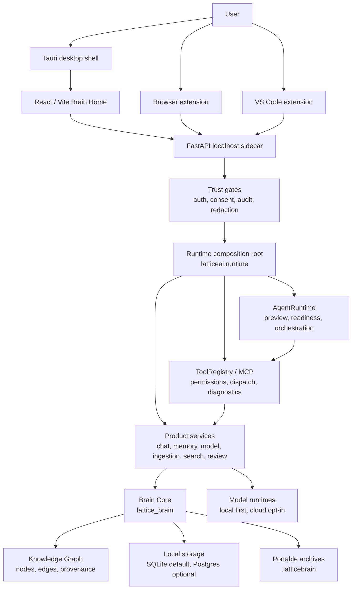
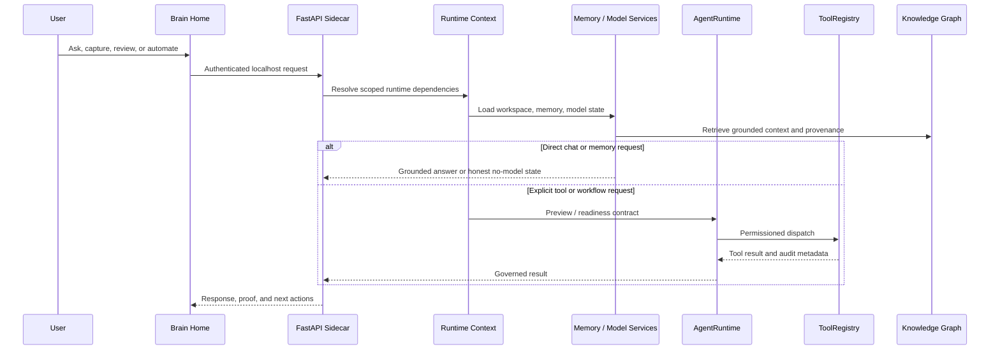

# Lattice AI Current Architecture

Current release: **8.8.0 — Brain Core Extraction & Recall Proof Hardening**.

Lattice AI is a local-first Digital Brain platform. The current architecture is
organized around a private Brain, replaceable model runtimes, explicit tool
registries, and import-safe server composition.

## System Map

Key boundaries:

- `frontend/src` owns product UX and static app behavior.
- `latticeai.app_factory` is the FastAPI composition root.
- `latticeai.runtime` owns runtime assembly seams for config, security, Brain,
  model, tool, and server construction.
- `latticeai.api` owns route-level behavior.
- `latticeai.services` owns product services and execution services.
- `latticeai.core` owns lower-level registries and helpers.
- `lattice_brain` owns Brain Core, graph, memory, ingestion, and storage.

## Runtime Flow

## Product Flow

The 8.8.0 first-run and daily-use flow is:

1. Wake Brain / login.
2. Pick owner/workspace context.
3. Review recommended local model setup.
4. Prepare/install/load a model when the user opts in.
5. Land on Brain Home with the living Brain, conversation composer, and
   evidence-backed Brain Brief visible together.
6. Add a first source through upload, note, browser capture, or folder indexing.
7. Ask a grounded question, inspect proof, then open the memory graph when
   deeper source evidence is needed.
8. Choose model, automate, or manage from
   explicit navigation.

The graph is available when users need proof or exploration. It is not forced
into the first screen as a dashboard.

Action-aware Brain Chat sits on the same product path: ordinary questions stay
on direct chat generation, while explicit file create/write/save/edit requests
enter the governed workspace file tool path.

## Frontend

The app is a React/Vite static bundle served by the local FastAPI sidecar.
Current UX rules:

- Brain Home is the default product surface.
- The composer is the primary action.
- Source capture, model setup, graph exploration, automation, and admin controls
  are reachable but not mixed into the first screen.
- Mobile layouts preserve the Brain and composer in the first viewport.
- Static release assets are generated under `static/app` and must match
  `asset-manifest.json`.

## FastAPI Sidecar

`latticeai.app_factory` builds the local app without import-time MLX/GPU
initialization, filesystem writes, or network calls. Runtime assembly is
dependency-injected through focused runtime modules instead of global mutable
state.

Important expectations:

- bind to `127.0.0.1` by default;
- require auth for sensitive endpoints;
- keep static serving, API routers, MCP install state, and runtime context
  separately testable;
- keep model and tool execution behind explicit runtime boundaries.

## Brain Core

`lattice_brain` is the durable product core. It owns:

- conversations and memories;
- Knowledge Graph nodes, edges, provenance, and traversal;
- ingestion and document/source capture;
- local storage and backup/restore behavior;
- `.latticebrain` archive compatibility.

Knowledge Graph changes must preserve read compatibility, rollback paths,
migration safety, and equivalence tests.

## Runtime Contracts

The 8.0 architecture contract remains active in 8.8.0:

- AgentRuntime has explicit preview/readiness contracts and does not execute
  tools during preview.
- ToolRegistry owns dispatch, permissions, manifest, diagnostics, and MCP
  install state.
- Config values are centralized through runtime config objects.
- Server decomposition continues to shrink monolithic app factory helpers.
- Knowledge Graph hardening remains guarded by compatibility and equivalence
  tests.
- Legacy compatibility shims are tracked in a managed inventory with owners,
  replacements, and removal phases.
- AgentRuntime and WorkflowEngine expose release-checkable orchestration
  boundaries while preserving legacy run compatibility.

## Storage And Portability

SQLite is the default local store. PostgreSQL/pgvector remains optional scale
mode and must be explicitly configured. Backups and `.latticebrain` archives are
user-controlled portability paths.

## Local-First Boundary

The default runtime does not send prompts, files, graph content, or archives to
Lattice-owned servers. Cloud models, downloads, Telegram, Brain Network,
Docker/Postgres setup, marketplace refresh, and update checks are opt-in paths.

## Release Artifact Map

8.8.0 exact artifact names:

- `dist/ltcai-8.8.0-py3-none-any.whl`
- `dist/ltcai-8.8.0.tar.gz`
- `ltcai-8.8.0.tgz`
- `dist/ltcai-8.8.0.vsix`
- `src-tauri/target/release/bundle/dmg/Lattice AI_8.8.0_aarch64.dmg`

Do not document or use wildcard artifact upload commands.

## Known Limitations

- Legacy root compatibility shims remain while public import paths still depend
  on them.
- PostgreSQL, Docker, cloud models, Telegram, Brain Network, update checks, and
  marketplace refreshes are not default local behavior.
- Package registry publication is owner-run and can lag behind the GitHub
  release.
- Local data protection depends on the user's machine, OS account, backups, and
  disk encryption outside Lattice AI.
