# Lattice AI v4.3.3 Architecture

This is the current v4.3.3 system map. It describes the shipped local-first
desktop product after the dead-code cleanup audit, not historical
v3/v4.0/v4.1/v4.2 plans.

## High-Level System Map

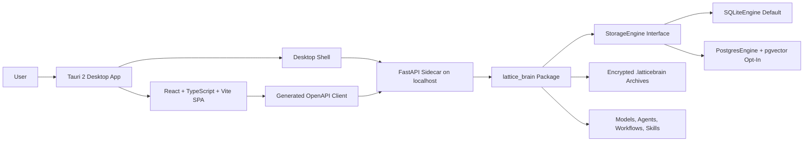

The frontend never calls Python directly. The desktop app and browser UI talk to
FastAPI over localhost APIs, and FastAPI imports `lattice_brain` as the Brain
Core boundary.

## Desktop Startup

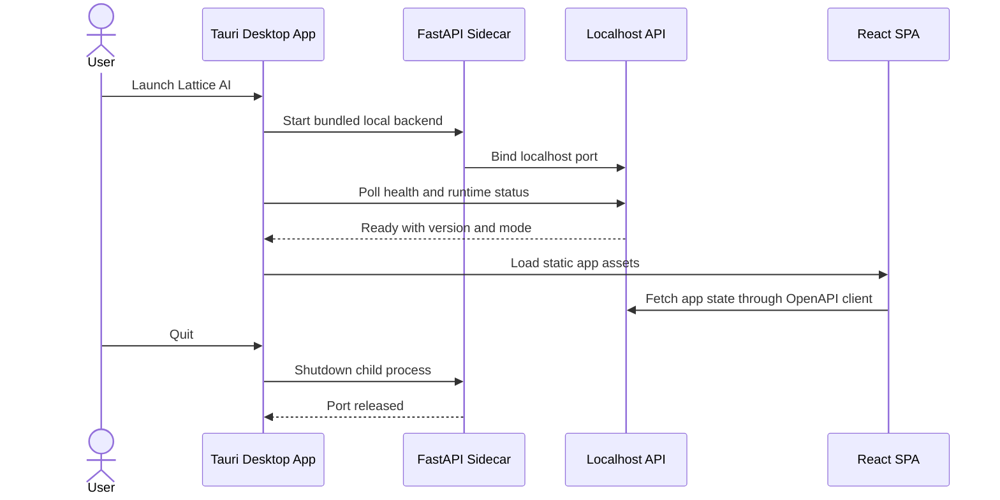

Startup is local-only. Missing dependencies surface as actionable unavailable
states; they are not hidden behind fake success.

## Tauri Shell And Sidecar

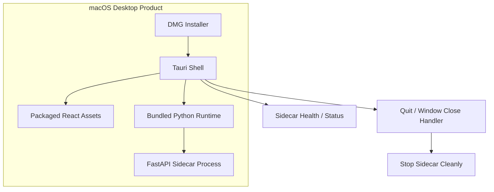

Tauri is the primary desktop shell. Electron exists as a fallback-only shell and
is not the release target for v4.3.3.

## React/Vite Frontend

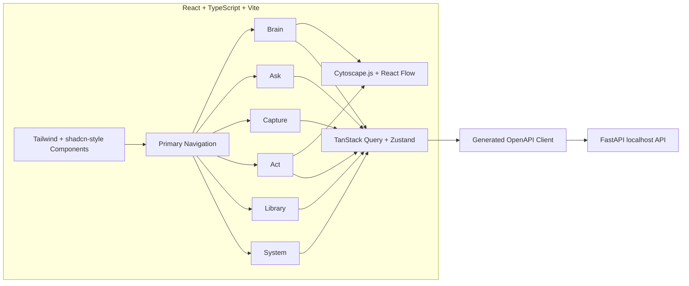

Visible controls must either call real backend APIs or show an honest
unavailable state. v4.3.3 keeps the graph-first navigation: Brain, Ask,
Capture, Act, Library, and System.

## FastAPI Localhost API

```mermaid
flowchart TB
  FastAPI["FastAPI App on localhost"]
  Health["/health and runtime status"]
  Graph["Knowledge Graph APIs"]
  Search["Hybrid Search APIs"]
  Conversations["Conversation and Memory APIs"]
  Capture["Document Upload and Ingestion APIs"]
  Models["Model Catalog and Runtime APIs"]
  Agents["Agent Runtime APIs"]
  Workflows["Workflow Runtime APIs"]
  Admin["Workspace, Policy, Audit, Admin APIs"]
  Portability["Backup, Restore, Archive APIs"]
  Network["Brain Network and Device Identity APIs"]

  FastAPI --> Health
  FastAPI --> Graph
  FastAPI --> Search
  FastAPI --> Conversations
  FastAPI --> Capture
  FastAPI --> Models
  FastAPI --> Agents
  FastAPI --> Workflows
  FastAPI --> Admin
  FastAPI --> Portability
  FastAPI --> Network
  FastAPI --> BrainCore["lattice_brain"]
```

FastAPI is the product API source of truth. The frontend consumes generated
OpenAPI types and does not import or execute Python.

## `lattice_brain` Package

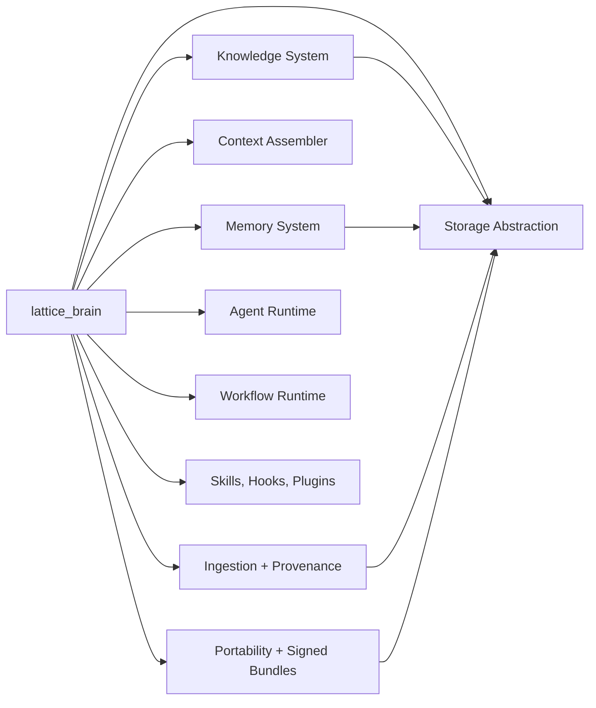

`lattice_brain` is usable by FastAPI, CLI, tests, and future tools. Compatibility
shims remain for older imports, but new runtime construction flows through the
package and application services.

Packaging note (verified v4.3.3): `lattice_brain.core`, `lattice_brain.archive`,
and `lattice_brain.storage.*` are standalone implementations. The knowledge
graph, memory, context, conversation, and ingestion modules are physically
hosted in `latticeai/brain/` and re-exported through `lattice_brain.*` module
paths, so importing those `lattice_brain` modules currently pulls in
`latticeai.brain`. The Brain Core boundary is therefore an import-path contract,
not yet a fully independent distribution.

## StorageEngine

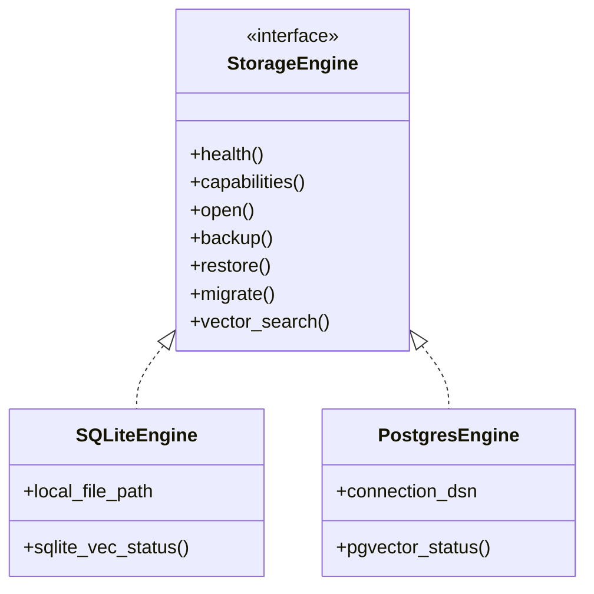

SQLite is the default local brain engine. PostgreSQL is optional scale mode and
must be explicitly configured.

## SQLite Default And PostgreSQL Opt-In

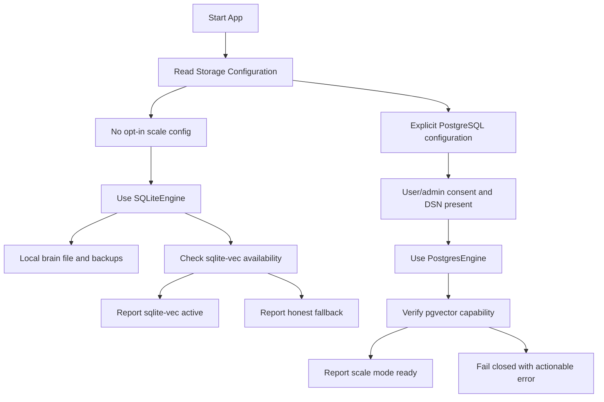

Docker and PostgreSQL are never auto-started by default. SQLite remains required
for normal local-first operation.

## `.latticebrain` Portability

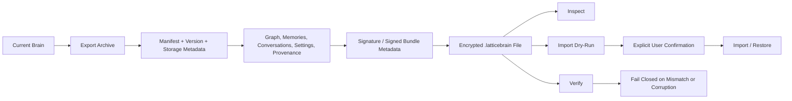

Archive import and restore do not destructively overwrite user data without
explicit confirmation. Unsupported versions, corrupt files, wrong passphrases,
and signature mismatches fail closed.

## Backup And Restore

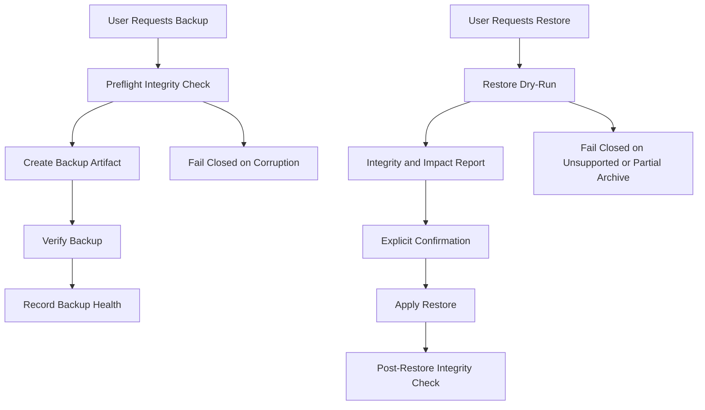

Restore dry-run and integrity checks are user-facing product flows, not only
developer utilities.

## Local-First Privacy Boundary

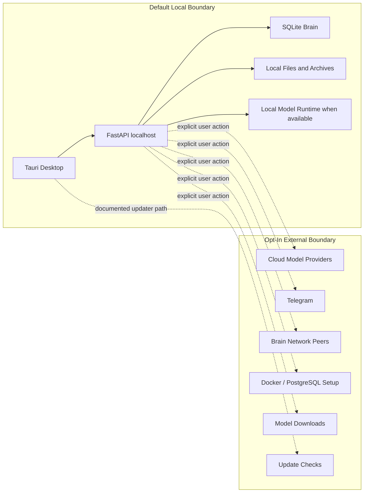

Token presence alone must not start external communication. External connectors,
Brain Network, Docker setup, downloads, and cloud model calls require explicit
opt-in paths.

## Release Artifact Map

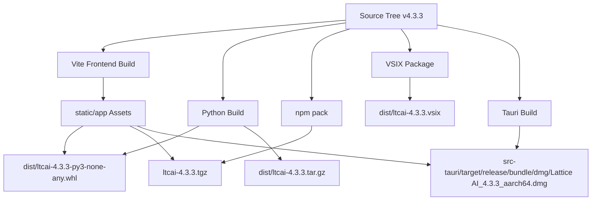

Release uploads must use exact filenames. Do not upload a broad `dist/`
wildcard because historical artifacts can remain there.

## Vercel Static Documentation Build

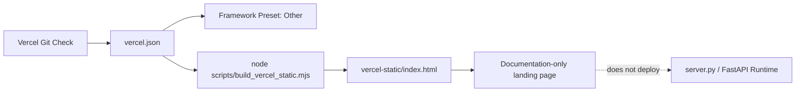

Vercel is configured as a harmless static documentation check. It must not
auto-detect `server.py`, deploy FastAPI, or host a fake desktop product.

## Known Limitations

- v4.3.3 is the GitHub Release target, but external registries are
  owner-published and can lag behind repository release preparation.
- PostgreSQL/pgvector is optional scale mode and needs explicit configuration.
- Docker is consent-gated and never starts automatically.
- Ask requires a loaded model for generated answers.
- Optional cloud providers require explicit keys and user action.
- Historical docs under `docs/` can describe older releases; use this file,
  `README.md`, `FEATURE_STATUS.md`, and v4.3.3 release notes for current
  behavior. v4.3.2 reports remain historical evidence for the product audit.

## Evidence Pointers

- Self-audit: `docs/V4_3_2_SELF_AUDIT_REPORT.md`
- Validation: `docs/V4_3_2_VALIDATION_REPORT.md`
- Cleanup audit: `docs/V4_3_2_DEADCODE_AUDIT_REPORT.md`
- Release notes: `RELEASE_NOTES_v4.3.3.md`
- Graph UX: `docs/V4_3_2_GRAPH_UX_REPORT.md`
- Product polish: `docs/V4_3_2_PRODUCT_POLISH_REPORT.md`
- GitHub/Vercel status: `docs/V4_3_2_GITHUB_VERCEL_CHECK_REPORT.md`
