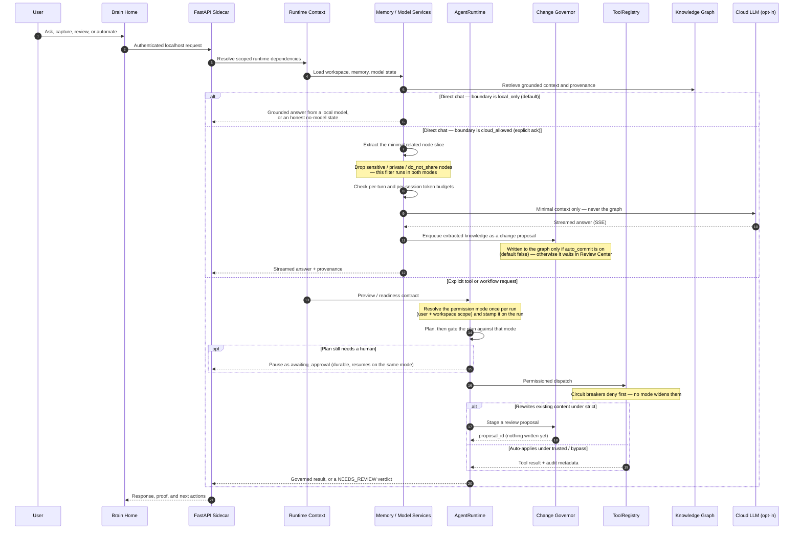
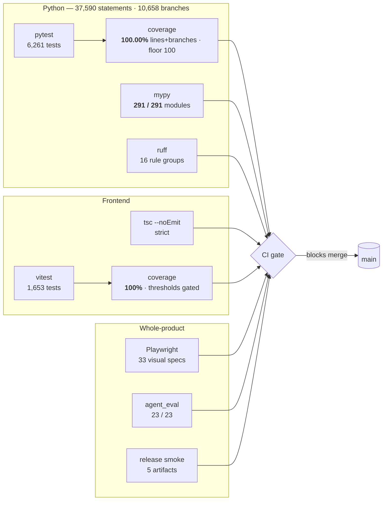

# Lattice AI Current Architecture

> **Status: canonical** — current-truth architecture document, kept in sync
> with the current release. Historical subsystem detail lives in
> [`docs/architecture.md`](docs/architecture.md).

Current release: **11.1.0 — Product Intelligence**.

Lattice AI is a local-first Digital Brain platform. The current architecture is
organized around a private Brain, replaceable model runtimes, explicit tool
registries, and import-safe server composition.

## System Map


The dashed node is the only thing in this diagram that can live off the
machine, and two independent gates stand in front of it: the boundary dial
must be `cloud_allowed`, and the sensitivity filter runs regardless of the
dial. The Knowledge Graph itself never crosses that edge — only the minimal
node slice the extractor selected for one turn.

Key boundaries:

- `frontend/src` owns product UX and static app behavior. Every route is a
  `React.lazy` boundary, and copy follows the route rather than the entry
  chunk: `i18n/registry.ts` holds one shared table, `shell` registers eagerly
  (app frame, language switcher, generic `ui.*`), and `brain` / `workspace` /
  `onboarding` register themselves when the lazy chunk that needs them is
  imported. That keeps the first-paint closure near 99 KiB gzip instead of
  carrying ~3,000 lines of copy for routes the user has not opened.
  `scripts/check_i18n_namespace_coverage.mjs` fails the build when a chunk
  reads a key whose namespace it never imports — otherwise `t()` silently
  returns the raw key and the UI renders an identifier instead of text.
- `latticeai.app_factory` is the FastAPI composition root.
- `latticeai.runtime` owns typed config, security, Brain, model, platform, and
  router assembly stages (`config_runtime`, `security_runtime`,
  `brain_runtime`, `persistence_runtime`, `history_runtime`,
  `history_writer`, `router_registration`, ...); no stage exports ambient
  `locals()` state. `history_writer` holds the redact → audit → store → ingest
  order for one chat turn; it was 66 lines inside the `_build` closure until
  10.3.0, which is why the function deciding what the audit log records about a
  message had never been tested.
- `latticeai.api` owns route-level behavior through router-factory modules
  (chat, memory, search, local_files/ingestion, brain_intelligence,
  automation_intelligence, command_center, change_proposals, review_queue,
  network_boundary, workspace, admin, ...). Chat contracts, history, documents,
  and streaming are focused modules over service-owned logic; `chat_hybrid`
  is the branch `chat` delegates to when the boundary allows cloud.
- `latticeai.services` owns product and execution services (`chat_service`,
  `memory_service`, `model_service`, `ingestion`, `search_service`,
  `review_queue`, `command_center`, `automation_intelligence`,
  `brain_intelligence`, `change_proposals`, ...). The hybrid path is a
  self-contained group inside it (`hybrid_chat`, `hybrid_context`,
  `hybrid_policy`, `cloud_streaming`, `cloud_extraction`, `cloud_token_guard`,
  `openai_compatible_adapter`, `multimodal_streaming`,
  `network_boundary_service`) so the local path carries none of it.
- `latticeai.core` owns lower-level registries and helpers (`agent`,
  `agent_state`, `agent_helpers`, `agent_eval`, `tool_governor`,
  `network_boundary`, `context_builder`, `workspace_os`, `mcp_registry`,
  `marketplace`, `tool_registry`, `config`, ...).
- `lattice_brain` owns Brain Core, graph, memory, ingestion, and storage.
  `lattice_brain/graph/store.py` composes `KnowledgeGraphStore` from focused
  mixins (retrieval, retrieval_vector, ingest, discovery, provenance,
  projection, documents, write_master). `lattice_brain/graph/proactive.py`
  provides read-only proactive intelligence (duplicate discovery,
  contradictions, quality reports, the observe-mode ingest quality gate) over
  the store's public APIs. Storage engines live in `lattice_brain/storage/`
  (SQLite live engine, optional Postgres scale/migration tooling).

## First Screen Composition

The Brain home is four zones. Capture is part of the composer, not a panel
beside it, and nothing graph-shaped renders here — the knowledge graph opens by
clicking the Brain itself.

```mermaid
flowchart TB
  subgraph shell["Top bar — on every screen"]
    direction LR
    nav["대화 · 자료 · 기억 · 작업"]
    lang["한국어 / English"]
    theme["light / dark"]
    more["더보기"]
    nav ~~~ lang ~~~ theme ~~~ more
  end

  subgraph home["Brain home — brain-centered-home"]
    direction TB
    hero["1 · BrainHomeHero<br/>living Brain · greeting · what is remembered"]

    subgraph composer["2 · BrainComposer"]
      direction TB
      input["textarea — the one thing you do here"]
      capture["문서 · 이미지 · 파일 · 폴더 · 노트 · 웹<br/>BrainIngestionDock variant=inline"]
      dial["3 · BrainQuickControls — autonomy dial"]
      input --> capture --> dial
    end

    chips["suggested questions"]
    quiet["4 · quiet row — 지난 대화 · Brain이 정리한 내용"]
    hero --> composer --> chips --> quiet
  end

  graph["Knowledge graph<br/>#/knowledge-graph"]
  shelf["Insights shelf<br/>automation · briefing · health · garden"]

  hero -- "click the Brain" --> graph
  quiet -- "one click" --> shelf
```

Everything not in those four zones is one click away in the shelf; nothing was
removed to get here.

## Runtime Flow



## Product Flow

The current first-run and daily-use flow is:

1. Wake Brain / login.
2. Pick owner/workspace context.
3. Review recommended local model setup.
4. Prepare/install/load a model when the user opts in.
5. Land on Brain Home with the living Brain, conversation composer, and
   evidence-backed Brain Brief visible together.
6. Add a first source through upload, note, browser capture, or folder indexing.
7. Ask a grounded question, inspect proof, then open the memory graph when
   deeper source evidence is needed.
8. Choose model, automate, or manage from
   explicit navigation.

The graph is available when users need proof or exploration. It is not forced
into the first screen as a dashboard.

Action-aware Brain Chat sits on the same product path: ordinary questions stay
on direct chat generation, while explicit file create/write/save/edit requests
enter the governed workspace file tool path.

## Frontend

The app is a React/Vite static bundle served by the local FastAPI sidecar.
Current UX rules:

- Brain Home is the default product surface, composed of exactly four zones
  (see First Screen Composition).
- The composer is the primary action, and capture (file · folder · note · web)
  renders inside its toolbar rather than as a separate panel.
- Nothing graph-shaped renders on the home; the knowledge graph opens by
  clicking the living Brain.
- Model setup, automation, briefings, and admin controls are reachable in one
  click but are not mixed into the first screen.
- Copy is fully bilingual. Backend payloads are labeled by their stable id
  (`ui.field.*`, `ui.entity.*`, `act.agentRole.*`, `brain.memoryTier.*`), so the
  server keeps one vocabulary and the reader sees their own language.
- Identifiers are never shown where a name belongs: `humanizeModelId` and
  `plainText` (`frontend/src/lib/utils.ts`) turn package coordinates and
  model-written Markdown into readable text. The same rule covers records: a
  run is titled by its workflow name, and its database id renders only in
  advanced mode.
- Enum-shaped payload values are translated per token with a named fallback
  (`act.runStatus.<token>` → "알 수 없음"), never printed raw. A token the table
  does not know must degrade to a written phrase, not to itself.
- Where two surfaces show the same setting, the copy has one home. Permission
  modes live in `frontend/src/lib/permissionCopy.ts`, read by both the home
  dial and the Settings panel; lookup is by mode id with the server's own
  localized label as fallback, so a server-added mode still renders and the
  translation table cannot become an accidental allowlist.
- Basic mode is a plain-language surface, not a reduced one: engineering panels
  (raw payloads, node canvases, storage engines, ids) move behind the advanced
  switch rather than disappearing. `tests/visual/v3.spec.js` sweeps ten
  plain-mode routes and fails on engine vocabulary reaching that reader.
- Mobile layouts preserve the Brain and composer in the first viewport.
- Static release assets are generated under `static/app` and must match
  `asset-manifest.json`.
- Critical API failures produce an explicit unavailable state and are never
  normalized into healthy empty Brain data.

## FastAPI Sidecar

`latticeai.app_factory` builds the local app without import-time MLX/GPU
initialization, filesystem writes, or network calls. Runtime assembly is
dependency-injected through immutable typed stages instead of ambient locals or
global mutable model state.

Important expectations:

- bind to `127.0.0.1` by default;
- require auth for sensitive endpoints;
- keep static serving, API routers, MCP install state, and runtime context
  separately testable;
- keep model and tool execution behind explicit runtime boundaries.
- keep API-specific HTTP errors at the route boundary and domain/model errors in
  services.

## Brain Core

`lattice_brain` is the durable product core. It owns:

- conversations and memories;
- Knowledge Graph nodes, edges, provenance, and traversal;
- ingestion and document/source capture;
- local storage and backup/restore behavior;
- `.latticebrain` archive compatibility.

The Honest Knowledge Pipeline hardens retrieval and ingestion:

- `graph/retrieval.py` `hybrid_search` blends lexical (FTS) and vector evidence
  and reports a `context_quality` signal that chat consumes so grounding is
  honest about how strong the retrieved context is.
- `graph/retrieval_vector.py` tracks vector freshness (embedded vs. total
  content) so the Brain can report stale embeddings and reindex on demand.
  `vector_freshness_breakdown()` splits that backlog into
  embedded / missing / stale / queued, because "12 pending" hides the
  difference between twelve never-embedded imports and twelve edits whose
  current answers are quietly wrong.
- `ingestion.py` supports folder ingestion (`ingest_folder`) with
  `.latticeignore` filtering and resumable background jobs
  (`/api/ingestion/jobs`), plus per-source `extraction_quality` scoring and an
  observe-mode `quality_gate` that flags low-quality extractions instead of
  silently accepting them.

### Vector index backends (11.1.0)

`graph/vector_index/` is the seam between "which rows are candidates" (SQL,
workspaces, citations — still `retrieval_vector.py`) and "which of them score
highest" (a `VectorIndex` implementation). Three ship:

| backend | approx | exhaustive | needs |
| --- | --- | --- | --- |
| `brute` (default) | no | yes | nothing |
| `quantized` | yes (int8 scores) | yes | nothing |
| `hnsw` | yes | no | `pip install "ltcai[hnsw]"` |

`LATTICEAI_VECTOR_INDEX` selects one. Two failure modes are made loud rather
than silent: an unknown name and `hnsw` without the compiled extra both fall
back to the exact scan and carry the reason in `index_status().storage
.vector_index` and in every search result's `index` block. Approximate
backends set `approx: true`, which flows into `hybrid_search`'s `vector` block
and into `context_quality` — but only when there is a caveat, so an exact
complete scan leaves the four-key quality contract untouched.

The exact scan feeds the index in fixed batches (`VECTOR_SCAN_BATCH`) so peak
memory stays bounded; exhaustive backends score each batch independently, so
the union is identical to one pass. The HNSW path is genuinely two-phase —
ask the graph for ids, then read only those rows — which is where its speedup
comes from, and it persists a `.hnsw` sidecar next to the brain database.
That sidecar is a **derivative**: it is keyed by
`model:dim:rows:newest-indexed_at`, so any write to `vector_embeddings`
invalidates it, and deleting it costs only a rebuild. The built graph is also
held on the store for the process's lifetime, because reading it back from
disk costs about as much as the search it enables; the same fingerprint is
what makes that cache safe.

`graph/vector_index/jobs.py` closes the other half. `indexing_status:
"pending"` was always honest and never resolved — nobody came back for the
node. `VectorEmbedQueue` is that worker's memory: a durable `vector_jobs`
table in the brain database, `schedule()` on a failed inline sync,
`tick()`/`tick_async()` to drain, bounded retries, then a terminal `failed`
row that stays visible. It is caller-driven on purpose (`IngestionPipeline
.drain_vector_queue`), because who runs the worker is a deployment decision.

`graph/fusion.py` gains two opt-in retrieval options, both off by default so
the shipped ranking is the one every existing assertion describes:
`LATTICEAI_FUSION_STRATEGY=rrf` fuses channel *positions* instead of their
incomparable score scales, and `LATTICEAI_GRAPH_EXPANSION=1` pulls the
one-hop neighbours of the top hits into the candidate pool (capped, damped,
and counted in the result's `graph_expansion` block).

### Multi-modal memories (11.1.0)

Pictures and recordings are ordinary graph citizens behind one flag:
`allow_multimodal` (constructor argument or `LATTICEAI_ALLOW_MULTIMODAL`),
**default off**. With it off, `IngestionPipeline._modality_for` returns
`"text"` for everything and no routing decision is reached — the folder-scan
allow-list, node ids, and node types are what they were before this release.

With it on, `lattice_brain/multimodal.py` decides the modality (declared MIME
first, this module's extension tables second, `mimetypes` last) and the
pipeline routes:

- **image** → an `Image` node written by `write_image_memory`, with an
  `ImageText` child when OCR produced text and fixed-width `Chunk`s when that
  text outgrows the summary. Node ids are content-addressed
  (`image:sha256(workspace|file)`), so re-ingesting is idempotent.
- **audio** → an `Audio` node (`NodeType.AUDIO`, an additive schema member
  since 11.1.0). The transcript still rides the ordinary text door —
  `ingest_source(node_type="Audio")`, so chunks, concepts, provenance and
  content-hash dedupe are the text path's, unchanged — but the node is a
  recording, because it exists whether or not anyone could hear it. Its own
  facts travel in metadata (`modality`, `audio_path`, `transcription`,
  `searchable`), and with no transcriber the memo is still kept with a body
  that says the words were never recognized. `Audio` is listed everywhere
  `Image` is (graph view, context sections, doc-gen sources) so a first-class
  type is not a type that disappeared from the surfaces.
- **video** → recognized and refused, `status: "unavailable"` with
  `VIDEO_OUT_OF_SCOPE` as the reason. Keyframe extraction is not implemented
  in this release.

Brain Core ships **no models**. Every model-backed capability arrives as an
injected callable in `MultimodalPorts`, built by
`latticeai/services/multimodal_ports.py` from
`latticeai/core/embedding_providers.py`:

| capability | source | absent ⇒ |
| --- | --- | --- |
| `ocr_text` | `pytesseract` (guarded import) | `ocr_status: "unavailable"`, no text |
| `caption` | `VisionCaptioner` — a loaded VLM only | no `caption` key at all |
| `embedding` | `VisionEmbeddingProvider` (CLIP-family) | `vision_embedding: "unavailable"` |
| transcript | `VoiceCaptureService`'s transcriber port | memo kept, `searchable: false` |

The caption rule is absolute: **a caption exists only when a vision-language
model wrote one.** 11.1.0 removed `lattice_brain.embeddings.VisionStub`, which
synthesized `Image pic.png (PNG 12x8)` from the filename and stored it in the
same field a real description would occupy, along with an "image embedding"
that was a hash of that string.

Image vectors live in their own table and their own search
(`graph/image_vectors.py`), keyed by the vision model that produced them, with
mismatched widths skipped rather than truncated. They reach `hybrid_search`
only by **late fusion**: `hybrid_search(..., image_vector=…)` ranks the image
index separately and blends the two rankings at the end
(`image_fusion_weight`, default 0.5), reporting `candidates`/`fused`/`weight`
in the result's `multimodal` block. A text query never produces an image
vector — it finds pictures through their OCR text and captions, which are text
and live in the text index — unless a genuinely shared-space model is
configured (`LATTICEAI_VISION_SPACE=shared`), which is the only case where
`VisionEmbeddingProvider.embed_batch` will embed a query at all.

Retrieval honesty follows the existing present-only-when-true rule:
`multimodal_signal` adds a `multimodal` key to `context_quality` only when
`Image`/`ImageText` nodes are actually in the context, so all-text answers keep
the four-key shape existing consumers pin. It counts pictures, so an `Audio`
node does not set it — a transcript is retrieved as text and the signal would
be claiming an image that is not there. Extraction quality for a picture scores
*what can be retrieved later* (OCR text, caption, vector) rather than the
photograph.

The Evidence panel renders the thumbnail stored on the node — a 96px inline
`data:` URI written at ingest and capped at 24 KB. That is deliberate: serving
the original file would mean either a new static route over the user's disk or
reusing `/local/serve`, which exists precisely so every read passes an explicit
approval. `brainData.dataImageValue` accepts nothing but `data:image/…`, so a
citation card can never become an outbound request.

### Temporal knowledge

`nodes_v2` and `edges_v2` carry `valid_from`, `valid_to`, and `superseded_by`
(`graph/schema.py`). The convention is **NULL, never `''`**: a NULL
`valid_from` means "valid since `created_at`", a NULL `valid_to` means "still
true". The migration is a plain additive `ALTER TABLE ADD COLUMN` healed on
schema init, so an existing Brain upgrades in place, idempotently, without a
backfill — and reads exactly as it did before, because the fallback to
`created_at` is part of the read predicate
(`schema.TEMPORAL_PREDICATE_SQL`), not a written value.

`graph/retrieval_reads.py` adds the read side:

- `as_of(timestamp)` returns the graph slice whose `[valid_from, valid_to)`
  window covers that instant — "what did I know in June?" — with an edge
  included only when both endpoints are in the slice.
- `neighbors(..., as_of=…)` takes the same slice; the argument defaults to
  `None`, so every existing call is byte-for-byte unchanged.
- Validity is always read from `nodes_v2`/`edges_v2`, the authoritative
  projection — the legacy compatibility tables have no temporal dimension, and
  slicing them would silently answer "everything".
- `get_node` records one access (`importance_score` / `last_used`), which is
  what `access_stats` and the decay report read. A failure there is swallowed:
  an access counter must never break a read.

### Proactive synthesis (proposal-first)

`lattice_brain/synthesis.py` is the Brain noticing things on its own —
contradicting memories, a topic that recurs without ever being named, two
notes that always co-occur but were never linked, and episodic fragments that
have decayed into noise. It is deterministic (token overlap, degree, clock
arithmetic — an optional `summarizer` may reword the weekly brief but never
its numbers) and event-driven: `SynthesisTrigger` counts *successful,
non-duplicate* ingests and fires every `LATTICEAI_SYNTHESIS_THRESHOLD` (25)
new nodes.

**Nothing in that module writes knowledge.** Every finding leaves it as a
review proposal (`ReviewQueueService.create`, source `kg_change_digest`, with
a plain-language Korean summary the Review Center renders as-is), and a
subject already waiting for a decision is never proposed twice.
`resolve_contradiction` is the single door to the graph and it opens only
after `approve()` has returned — it then stamps the chosen outcome
(`replace` / `keep_old` / `keep_both_temporal`) onto the pair's validity
windows. `latticeai/services/brain_intelligence.py` exposes the loop
(`/api/brain/synthesize`, `/api/brain/contradictions/propose|resolve`,
`/api/brain/importance`, `/api/brain/proactive-brief`) and reports
`available: false` when no review queue is present rather than falling back to
a direct write.

The trigger is driven by ordinary capture, not by a scheduler.
`latticeai/runtime/persistence_runtime.py` wraps the ingestion pipeline's audit
seam — the one place a *landed* ingest already passes through — and hands each
`kg_ingest` event to `BrainIntelligenceService.note_ingest` beside the funnel
counter. Both are best-effort sinks on that seam and are isolated separately:
a trigger that raises is recorded by `quiet()` and the ingest still returns
`ok`, because a Brain that notices things must never cost a person the memory
they were saving.

### The Self-Model subgraph (11.1.0)

`lattice_brain/self_model.py` holds what the Brain knows about *its owner*. It
is a normal part of the graph — `Self` / `Preference` / `Habit` /
`Relationship` node types added additively next to the existing `Decision`,
one `self:root` node, and a `PART_OF` edge from every fact — but it is
governed apart from the rest, because being wrong here is not a retrieval miss.

Membership is the id prefix (`self:<kind>:<digest>`), not a type heuristic, so
a `Decision` about the user can never be confused with a decision recorded in a
meeting note, and the digest makes the same statement land on the same node
however often it is read.

Two write paths, deliberately asymmetric:

- **The Brain proposes.** `propose_self_model` runs a deterministic phrase
  table over conversation/ingest text (first-person Korean and English forms)
  and files each candidate through the same `ProposalDesk` synthesis uses —
  source `kg_change_digest`, kind `self_model_fact`, one subject proposed once.
  `apply_self_model_proposal` is the only route from a proposal to a node and
  it writes after `approve()` returns, never before. An optional `refiner`
  callable may improve a candidate's *wording*; it cannot add, drop, or
  reclassify one, and a refiner that raises is ignored.
- **The user writes.** `upsert_self_model_fact` / `delete_self_model_fact` are
  direct, because a person editing their own profile is not something to queue
  for review. `latticeai/services/self_model_service.py` exposes both on the
  memory router (`/api/memory/self-model*`); it derives the graph and the
  review queue from the `MemoryService` the router already holds, so the
  feature needs no new wiring at the composition root and reports
  `available: false` when this Brain has no graph.

`self_model_summary(limit_tokens)` renders the subgraph as deterministic plain
text for injection. `latticeai/core/context_builder.py` calls it through the
`summary_for_prompt` seam, which never raises: an unreadable profile injects
exactly what an empty one does — nothing. The injection is additive by
construction: the block is charged to the caller's own budget (never more than
half of it), the existing result keys and `context_quality` shape are
untouched, and the trace gains a `self_model` section only when a block was
really injected.

Knowledge Graph changes must preserve read compatibility, rollback paths,
migration safety, and equivalence tests.

## Runtime Contracts

The 8.0 architecture contract remains active in 10.3.0:

- AgentRuntime has explicit preview/readiness contracts and does not execute
  tools during preview.
- ToolRegistry owns dispatch, permissions, manifest, diagnostics, and MCP
  install state, with direct HTTP/MCP policy gates enforced before execution.
- Config values are centralized through runtime config objects.
- Server decomposition uses typed stages and an explicit legacy export allowlist.
- Model routing/loading uses injected state; request snapshots prevent
  concurrent generations from changing one another's selected model.
- Knowledge Graph hardening remains guarded by compatibility, equivalence, and
  fail-closed workspace-scope tests. Unknown scope is private; legacy-global
  reads require explicit compatibility opt-in.
- Legacy compatibility shims are tracked in a managed inventory with owners,
  replacements, and removal phases.
- AgentRuntime and WorkflowEngine expose release-checkable orchestration
  boundaries while preserving legacy run compatibility.

Change governance and agent-eval extend the contract:

- `core/tool_governor.py` owns a `MUTATING_TOOL_INVENTORY` so every mutating
  tool is either governed (proposal-first) or explicitly exempt, and coverage is
  release-checked rather than assumed.
- File edits/deletions to existing content flow through change proposals
  (`services/change_proposals.py`, `/api/proposals`): each proposal records a
  base content hash, and application re-checks that hash to detect conflicting
  edits before writing atomically.
- `core/agent_eval.py` runs a fail-closed verifier: unverifiable or failing
  outcomes resolve to `NEEDS_REVIEW` and enter the review queue rather than
  being reported as success.
- `core/permission_mode.py` adds an autonomy dial (`strict` / `trusted` /
  `bypass`) *on top of* those gates rather than replacing them: a mode only
  widens what may run without an extra approval prompt. Circuit breakers —
  destructive risk, root/home paths, `rm -rf /` style commands, binary
  overwrites — are mode-invariant. The mode is resolved per user and per
  workspace, and stamped once per agent run so a plan and its execution are
  judged by one dial (`services/permission_mode_service.py`,
  `runtime/permission_mode_wiring.py`, `/api/permission-mode`).

## Verification Surface

What is measured, and what is not. Every number here is produced by a command
in CI rather than asserted in prose — the point of 10.3.0 was to replace
estimates with figures.



Since 11.0.0 there is no dashed box: both coverage figures are enforced
floors. Python coverage is `fail_under = 100` — every statement that ships
executes under the suite, with exactly eight reasoned `pragma: no cover`
lines (each names why its branch is unreachable) plus the generic
`TYPE_CHECKING` / `NotImplementedError` / `@abstractmethod` patterns.
Frontend coverage has pinned 100% on all four vitest metrics since 10.10.0.

Two figures moved earlier for reasons worth recording:

- Python coverage was first reported as 80%, which was wrong. The `omit`
  pattern `*/tests/*` does not match the repo-relative `tests/...` paths
  coverage records, so the suite was counting itself — and test files run
  ~100% by construction. Corrected to `tests/*`, the real figure is 71.6%.
- Frontend coverage was first reported as 54%, also wrong: without `all: true`
  vitest only reports files a test already imports, so a module with no test
  simply left the denominator.

## Single-Agent Runtime Composition

The Discover→Plan→Implement→Verify loop is three modules, split by what each
one is allowed to touch:

```
core/agent_state.py     AgentState, AGENT_TERMINAL_STATES
                        no imports from the other two — the shared vocabulary
        ▲                                    ▲
        │                                    │
core/agent_helpers.py                core/agent.py
pure functions:                      the state machine:
 extract_action(_details)             AgentRunContext
 normalize_plan                       AgentDeps  (the ports)
 filter_learnings                     SingleAgentRuntime
 compact_transcript                          │
 files_written                               │ imports
 artifact_checklist                          ▼
 requirement_coverage                 core/agent_helpers.py
 format_* reporters
 TranscriptBudget, PhaseBudgets
deterministic, no I/O
```

Two rules hold this shape:

- **`agent_state.py` depends on neither sibling.** It exists because both need
  the enum and neither can own it: if `AgentState` lived in `agent.py`, the
  helpers could not import it — `agent.py` imports *them* — and would fall back
  to comparing against the literal `"EXECUTING"`. A rename of an enum value
  would then stop matching silently, with no failing test.
- **`latticeai.core.agent` re-exports every moved name** and declares the set in
  `__all__`. The import path callers have always used is the contract; the file
  layout behind it is not. `chat_agent_http`, `chat_intents`, `computer_use`,
  `run_store`, `tool_dispatch`, both bench scripts, and the agent test modules
  import from `latticeai.core.agent` and are unaffected by the split.

Anything deterministic and I/O-free belongs in `agent_helpers.py`; anything that
advances or inspects run state belongs in `agent.py`.

### Agent-native workspace reorganization (11.1.0)

`latticeai/core/workspace_reorganization.py` answers "이 프로젝트를 정리해줘"
without handing an agent the filesystem. It scans a workspace-relative folder
through the caller's sandboxed `resolve_path`, asks the graph what each file is
about (one `graph()` window for the file-node index, then one `neighbors()` hop
per matched file, strongest edge first with ties broken on the topic title),
and returns a plan of moves into `topics/<주제>/`.

Three properties are structural rather than configured:

- **No delete path exists.** The planner emits moves; `apply_reorganization`
  moves and creates directories. There is no code here that removes a file, so
  the worst outcome of a bad proposal is a file in the wrong folder.
- **Only justified moves.** A file the graph cannot tie to a topic is reported
  in `unplaced` with a reason (`brain_has_no_topic`, `already_in_place`,
  `target_taken`) instead of being swept somewhere plausible by extension.
- **One proposal, the existing door.** The whole reorganization is staged as a
  single `change_proposal` (kind `folder_reorganization`) by
  `ChangeProposalService.propose_reorganization`, so approving it from the
  Review Center applies it through `approve_and_apply` like every other staged
  change. Each move is re-checked at apply time: a vanished source or an
  occupied target is skipped and reported, never forced.
  `WorkspaceOSStore.propose_reorganization` is the Workspace OS seam and
  records the request on the timeline whether or not there was anything to
  propose.

The other half of "an agent that finishes the job" is the prompt:
`core/agent_prompts.executor_prompt_for` appends profile-aware file-writing
hints to the executor turn (the `compact` profile gets a three-step numbered
form) and injects a Self-Model summary only when a caller passes one — the
agent runtime does not, so today that argument is used by document generation
rather than by a run (FEATURE_STATUS.md records it as a limitation).
`EXECUTOR_PROMPT` itself is unchanged, so every caller that wants the
historical prompt still gets it.

## Storage And Portability

SQLite is the live local Brain store. PostgreSQL/pgvector remains optional
scale/migration tooling and must be explicitly configured; it is not the
default live KnowledgeGraphStore backend in 10.3.0. Backups and `.latticebrain`
archives are user-controlled portability paths.

### External vault interop (11.1.0)

`services/obsidian_bridge.py` reads an Obsidian vault the user owns and feeds it
to `IngestionPipeline.ingest` — the same single door as files, folders, web
captures, and chat. It is deliberately *not* a second write path: the bridge
parses, resolves, and reports; the pipeline hashes, dedupes, embeds, and records
provenance.

Two structural writes sit on top of the ingest, and both go through the store's
public `import_graph_data` seam rather than reaching into graph internals:

| Vault concept | Graph shape |
| --- | --- |
| `[[wikilink]]`, `![[embed]]`, relative `.md` link | `REFERENCES` edge between the two note nodes |
| frontmatter `tags` | `Topic` node (scoped-slug id, so a vault tag and an extracted topic are one node) + `TAGGED_AS` edge |

Three rules keep it honest. A link is resolved by exact relative path, then by
*unique* basename; anything else is reported as `missing` or `ambiguous` rather
than pointed at a guess. A note that fails to ingest gets no edges, so a
relation never implies content that is not there. And ids are deterministic —
edge ids hash `(from, type, to)`, topic ids are workspace-scoped slugs — so a
second sync updates instead of duplicating. Direct edge writes are legitimate
here because a vault sync is *user-initiated ingestion*; agent-side graph
changes still go through the review queue.

The bridge is a manual one-shot sync by design (see FEATURE_STATUS.md): link
edges need node ids that only a completed inline ingest has.

### Selective subgraph share (11.1.0, opt-in)

`lattice_brain/portability.py` gains a *partial* bundle beside the whole-graph
export: `export_subgraph` takes node ids / node types / source types (optionally
one hop out) and emits the selected nodes, their chunks, the edges *between*
selected nodes, and their provenance. Four properties are structural rather
than advisory:

1. **Nothing leaves by accident.** A selector is required — the door that
   exports everything is `export()`, and it is a different method. Knowledge
   source rows (connected folder registrations, with local paths) are never
   included, and one-hop expansion refuses to admit `Person` or `Source`
   neighbours, whose label *is* an email address or a local file path.
   `redact_provenance` (default on) strips owner / source URI / permissions
   from node metadata and provenance rows, and the header records that it did.
2. **The signature covers the contents.** The header pins a sha256 of the
   canonical payload and the header is signed with the device Ed25519 identity,
   so editing a node invalidates the bundle. Verification is fail-closed and
   names which check failed; an unsigned bundle is refused on this path (the
   pre-v4 `unsigned-legacy` tolerance stays on local file imports only).
3. **Receipt is proposal-first.** `import_subgraph_proposals` files each node as
   a `ReviewQueueService` item stamped with the sender's fingerprint and the
   verification verdict. The graph changes only in `accept_subgraph_proposal`,
   one item at a time, which stamps the accepting workspace onto the node and
   defers any edge whose other endpoint is absent — reported, not written.
4. **Off by default.** Every mutating surface is behind
   `LATTICEAI_BRAIN_NETWORK`; while it is unset they answer 403 with the flag
   name, and the status route still answers so a UI can say why.

The encrypted `.latticebrain` bundle reuses the archive's PBKDF2-SHA256 →
AES-256-GCM mechanism under its own `latticebrain.subgraph` format, keeping the
signed header outside the ciphertext so a recipient can identify the sender
before typing a passphrase. Encrypting to a recipient public key is out of
scope for this release and is reported as such.

## Local-First Boundary

The default runtime does not send prompts, files, graph content, or archives to
Lattice-owned servers. Cloud models, downloads, Telegram, Brain Network,
Docker/Postgres setup, marketplace refresh, and update checks are opt-in paths.

### The network boundary dial

`core/network_boundary.py` makes "may knowledge leave this machine" a single
explicit decision rather than a property of whichever model happens to be
selected. It is deliberately **orthogonal to `PermissionMode`**: that dial
answers "may this tool run without asking", this one answers "may anything
leave". A session can be `cloud_allowed` and `strict` at the same time.

| Mode | Meaning |
| --- | --- |
| `local_only` | Default. No chat context reaches a cloud provider. |
| `cloud_allowed` | Explicitly acknowledged. Only the minimal extracted node slice may be sent. |

Four properties hold regardless of the mode:

1. **Unknown input fails safe.** `normalize_network_mode` maps anything it does
   not recognize — a typo, a stale env var, `None` — to `local_only`.
2. **Sensitivity filters are mode-invariant.** Nodes carrying `sensitive`,
   `private`, `do_not_share`, or `local_only` metadata are dropped before the
   payload is assembled, exactly like the agent circuit breakers that no
   permission mode can widen.
3. **The graph never travels.** What leaves is a `MinimalContext` — the node
   slice the extractor chose for one turn — not the store, not a subgraph
   export, not an archive.
4. **Cloud-derived memory is proposed, not written.** `cloud_extraction.py`
   output is enqueued as a Review Center change proposal with provenance;
   it reaches the graph only when `auto_commit` is explicitly enabled
   (default `false`) *and* a store write API is bound. Multimodal requires a
   second, separate `allow_multimodal` flag (also default `false`).

Token budgets (`cloud_token_guard.py`) cap per-turn and per-session spend, so
an opted-in session has a ceiling rather than an open tap.

**Surface (10.1.1):** `NetworkBoundaryPanel` in **환경설정 → 내 지식이 나가는
범위**, beside the autonomy dial. Like that dial it renders the server's own
catalog rather than a hardcoded mode list, and it will not send a switch to
`cloud_allowed` until the acknowledgement the server requires is ticked — the
client refuses the request the server would refuse.

It carries one thing the autonomy dial does not: a **preview**. Type a question
and `/api/network-boundary/preview` answers with the actual node titles that
question would send, its token estimate, and whether the token guard would
refuse the turn. The preview works in `local_only` too, and says so — you can
look before deciding, not only after. A promise that "only minimal related
nodes leave" is worth less than a list of which ones.

The write-back switches (`auto_commit`, `allow_multimodal`) render only while
the boundary permits cloud, because a switch that cannot do anything invites
the belief that it did.

10.1.0 shipped this feature's contracts, API, and `/chat` branch with no way to
reach any of it from the app; that gap is what 10.1.1 closes.

## Release Artifact Map

11.1.0 exact artifact names:

- `dist/ltcai-11.1.0-py3-none-any.whl`
- `dist/ltcai-11.1.0.tar.gz`
- `ltcai-11.1.0.tgz`
- `dist/ltcai-11.1.0.vsix`
- `src-tauri/target/release/bundle/dmg/Lattice AI_11.1.0_aarch64.dmg`

Do not document or use wildcard artifact upload commands.

## Known Limitations

- The repo root keeps exactly one compatibility module (`server.py` for
  `uvicorn server:app`); all other root shims were removed in 9.9.1 and a
  legacy debt gate (`scripts/check_legacy_debt.mjs`) keeps the root clean.
- PostgreSQL scale/migration tooling, Docker, cloud models, Telegram, Brain
  Network, update checks, and marketplace refreshes are not default local
  behavior.
- Package registry publication is owner-run and can lag behind the GitHub
  release.
- Local data protection depends on the user's machine, OS account, backups, and
  disk encryption outside Lattice AI.
