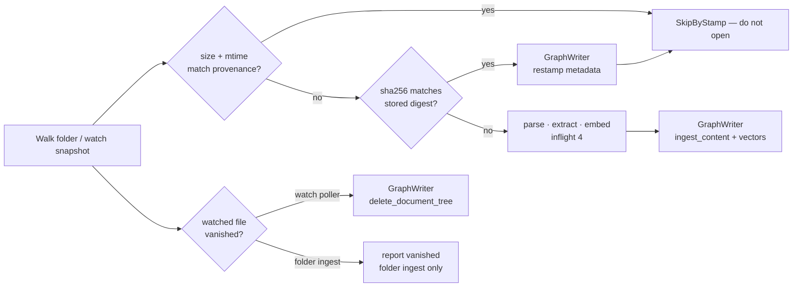
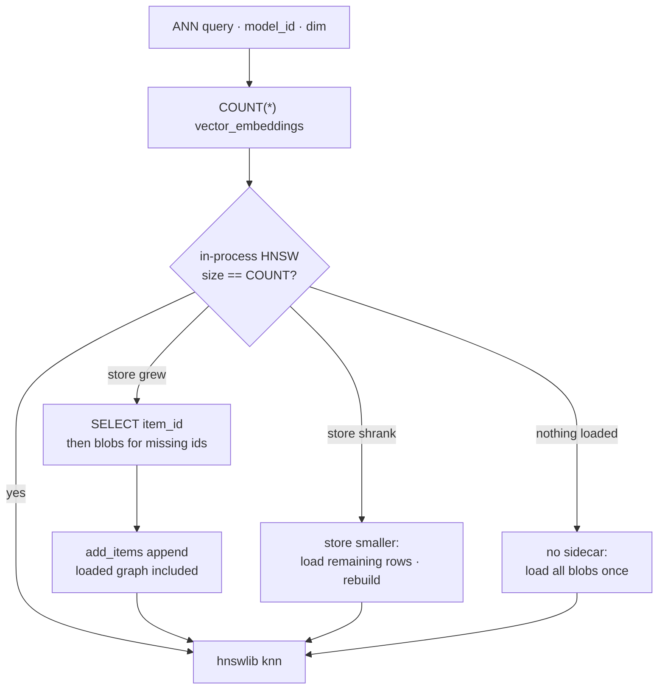
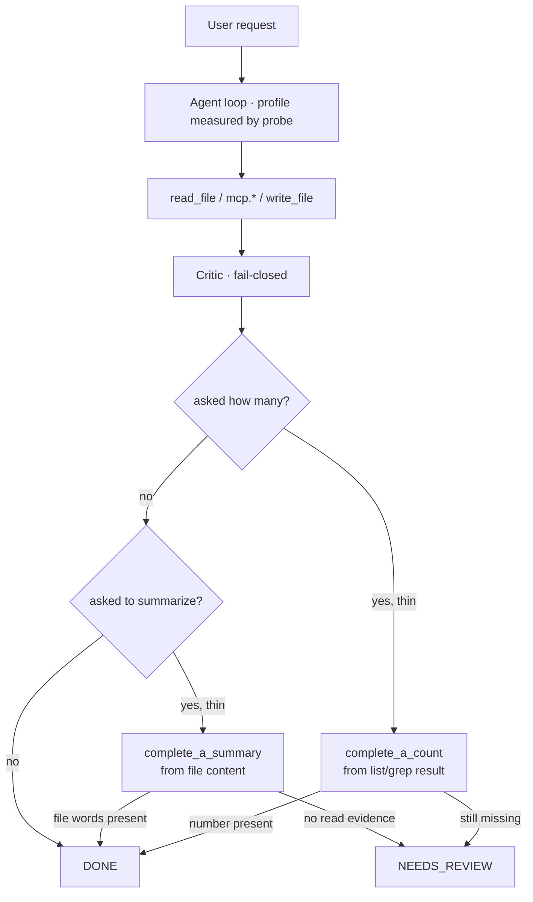
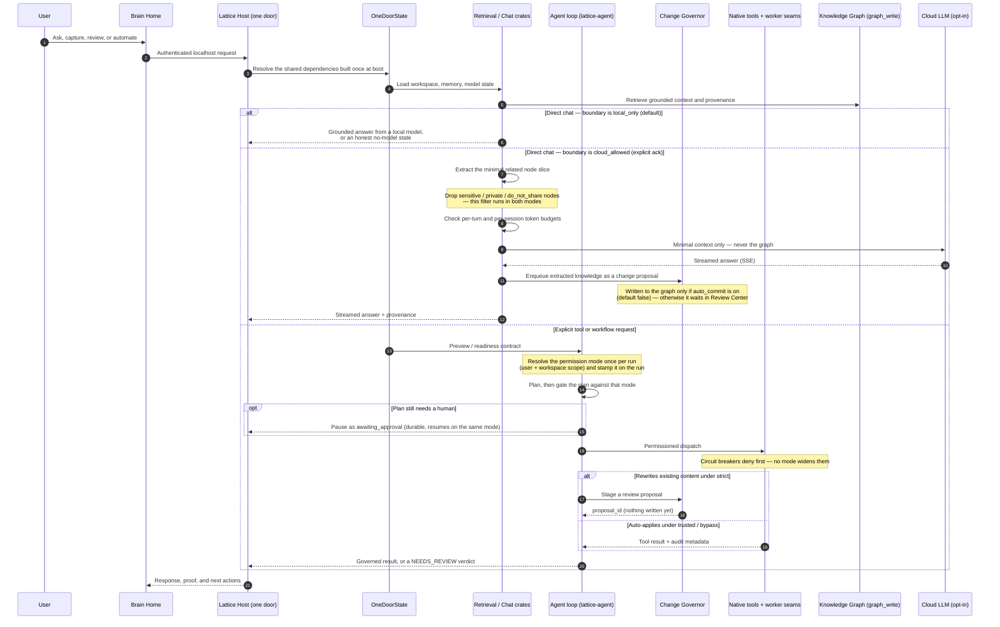
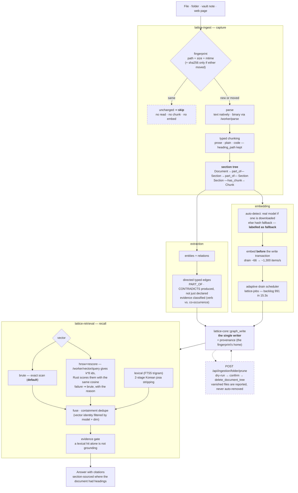
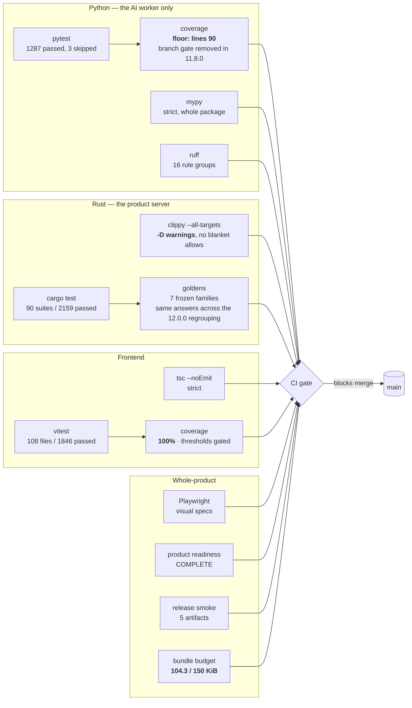
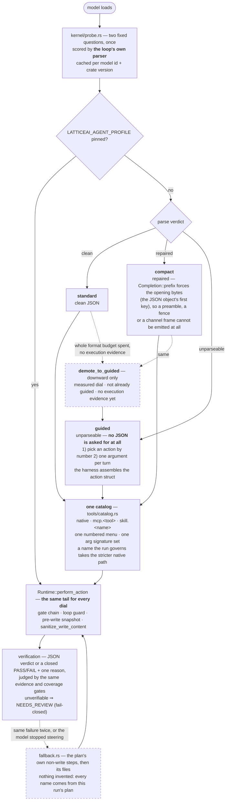

# Lattice AI Current Architecture

> **Status: canonical** — current-truth architecture document, kept in sync
> with the current release. Historical subsystem detail lives in
> [`docs/architecture.md`](docs/architecture.md).

Current release: **12.2.1 — True Count**.

Lattice AI is a local-first Digital Brain platform. The current architecture is
organized around a private Brain, replaceable model runtimes, explicit tool
registries, and import-safe server composition.

## System Map

```mermaid
flowchart TB
  user(["User"])

  subgraph surfaces["Surfaces"]
    direction LR
    ui["React / Vite app<br/>ink night · paper day · elevation, no glass<br/>lazy routes · per-route i18n · ko · en"]
    desktop["Tauri desktop shell<br/>boots the host topology"]
    editor["VS Code<br/>extension"]
    browser["Browser<br/>extension"]
    desktop ~~~ ui ~~~ editor ~~~ browser
  end

  subgraph host["Lattice Host — the product server (Rust, 127.0.0.1)"]
    direction TB
    door["One door: 422 native operations · 41 route families<br/>mounted at their original paths<br/>anything not native and not on the allowlist ⇒ 404"]
    subgraph crates["Nine crates — every port pinned by goldens"]
      direction TB
      plat["lattice-platform (317 ops) — <b>7 domains (12.0.0)</b><br/>workspaceos · toolsurface · governance · adminops<br/>knowledge · modelops · shell"]
      retr["lattice-retrieval (65 ops)<br/>search · knowledge_graph · brain · memory<br/>hybrid + hnsw+rescore · chronicle clock seam"]
      ingestc["lattice-ingest (28 ops)<br/>browser · local_files · fingerprint · sections<br/>vault-watch poller · folder prune<br/>ingest inflight 4 · one embed body"]
      chatc["lattice-chat (8 ops)<br/>chat + history · native ingest_generated"]
      jobsc["lattice-jobs (4 ops)<br/>index · adaptive drain scheduler"]
      authc["lattice-auth<br/>password login · sessions · CSRF"]
      agentc["lattice-agent — <b>6 groups (12.0.0)</b><br/>kernel · parse · content · tools · surface · prompts"]
      corec["lattice-core<br/>store (generation epoch) · embeddings · <b>graph_write</b>"]
      hostc["lattice-host<br/>gateway · supervisor · static UI"]
    end
    subgraph closures["Native closures (11.7.0 → 12.0.0)"]
      direction LR
      hooks["HooksStore → HookSink<br/>user hooks fire on native tools"]
      sanitize["sanitize on every write path<br/>loop + /tools/write_file"]
      selfm["native Self-Model writes<br/>9 recorded bodies match"]
      osstore["one WorkspaceOsStore<br/>registry + ports"]
      watch["vault-watch poller<br/>diff-skip · restamp · prune vanished"]
      epoch["store generation epoch<br/>restore is live — no restart"]
    end
    supervisor["Supervisor<br/>uvicorn factory spawn · /health gate ·<br/>backoff restart · graceful stop ·<br/>CSRF + CORS origin injection"]
    door --> crates
    crates --> closures
    door --> supervisor
  end

  subgraph gates["Trust boundary — every request crosses this"]
    direction LR
    trust["auth · consent<br/>audit · redaction"]
    mode["PermissionMode dial<br/>strict · trusted · bypass<br/><i>may this tool run?</i>"]
    net["NetworkBoundary dial<br/>local_only · cloud_allowed<br/><i>may knowledge leave?</i>"]
    breakers["Circuit breakers<br/>mode-invariant — enforced in the Rust kernel"]
    trust ~~~ mode ~~~ net ~~~ breakers
  end

  subgraph worker["Python AI Worker — compute only (latticeai.worker_app)"]
    direction LR
    llm["Inference<br/>/agent/llm · /worker/llm/stream<br/>Completion::prefix forces the opening bytes"]
    compute["Compute seams — 20 routes since 12.0.0<br/>/worker/{embed,extract,parse,asr,<br/>render/docx|pdf|pptx|xlsx,<br/><b>vector/query</b> — COUNT then delta}"]
    catalog["Model + engine catalog<br/>/models · /engines/* · /worker/sysinfo<br/>(+ capabilities · python_version) · /health"]
    llm ~~~ compute ~~~ catalog
  end

  subgraph data["Brain — one SQLite file"]
    direction LR
    kg["Knowledge Graph<br/>nodes · edges · provenance"]
    store["Local storage<br/>SQLite live"]
    archive["Portable archives<br/>.latticebrain"]
    kg ~~~ store ~~~ archive
  end

  cloud["Cloud LLM lane — opt-in, off by default<br/>api_key (GET /models probe) · cli_oauth (agy / grok)<br/>ReviewSink + shape-only EgressAudit"]

  user --> surfaces
  surfaces --> host
  door -- "20 allow-listed routes only<br/>(streaming, SSE, X-Forwarded-*)" --> gates
  gates --> worker
  compute -- "/worker/parse · /worker/render/*" --> ingestc
  corec -- "<b>single writer — RUST</b>" --> data
  osstore -- "workspace_os.json + SQLite row" --> data
  crates -- "reads (WAL, busy-timeout)" --> data
  watch -- "native ingest" --> corec
  selfm -- "GraphWriter" --> corec
  hooks -. "run records" .-> osstore
  epoch -. "a restore bumps it —<br/>handles from the old generation close" .-> corec

  mode -. "widens approval only" .-> agentc
  breakers -. "no mode ever widens these" .-> agentc

  chatc -- "minimal extracted slice only<br/>never the graph" --> cloud
  cloud -- "streamed answer + Review Center<br/>kg_cloud_expansion proposal" --> chatc
  net -. "local_only blocks this edge entirely" .-> cloud
  breakers -. "sensitive · private · do_not_share<br/>filtered in BOTH modes" .-> cloud

  style cloud stroke-dasharray: 5 5
```



## Ingest, skip, and watch (12.2.1)

One writer. The scan decides whether a file is work; the graph is never
opened for write by a second process.



## Vector search COUNT+delta (12.2.1)

The Python sidecar next to the Brain answers `POST /worker/vector/query`.
Native search still re-scores. Env default remains `brute`.



## Agent deliverables (12.2.1)

The critic still fail-closes. Deterministic facts on the transcript
outrank a thin sentence.



One Door is still the top of this diagram. 11.7.0 filled in what that door
was missing; 11.8.0 took away what it was carrying for nobody; 11.9.0 made
the remaining Current stubs and the dashed cloud lane actually run; 12.0.0
gave the two biggest crates a domain map and closed four named gaps:

- **The two largest crates are grouped by what a file is *for*.**
  `lattice-agent` is six groups — `kernel` (the loop and every decision
  that can refuse), `parse`, `content`, `tools`, `surface`, `prompts` —
  under one rule: *the kernel decides, the surface carries*.
  `lattice-platform` is seven domains — `workspaceos`, `toolsurface`,
  `governance`, `adminops`, `knowledge`, `modelops`, `shell` — under
  another: *this crate is the product's surface; it offers things, it does
  not decide whether they are allowed and it does not own what is true.*
  Both moves are `git mv` only, and both crates carry their own map
  ([`rust/lattice-agent/ARCHITECTURE.md`](rust/lattice-agent/ARCHITECTURE.md),
  [`rust/lattice-platform/ARCHITECTURE.md`](rust/lattice-platform/ARCHITECTURE.md)).
  Each `src/lib.rs` ends with a compatibility map, so every pre-12.0.0
  import path still resolves exactly as it was spelled.
- **The worker is not a server of the product, and it is still small.**
  11.8.0 cut it from **28 routes to 19** by deleting nine that no caller
  anywhere in the tree reached — route, implementation, allowlist entry
  and gateway table together, with negative tests asserting the door now
  answers `404` instead of forwarding. 12.0.0 adds exactly one back:
  **`POST /worker/vector/query`**, the HNSW sidecar that returns candidate
  ids for the native exact rescore, bringing the allowlist to **20**.
  `/worker/parse` (binary upload / watched PDF) and `/worker/render/*`
  (including the xlsx security export) stay on the committed allowlist;
  nothing product-shaped and no KG write went back into Python. A
  decoy-proven static gate fails the build if a source file names a
  stranded worker path.
- **`POST /mcp` is a declared product operation.** It moved into the
  mount table as a single JSON-RPC envelope operation, which puts it
  inside the OpenAPI product contract instead of beside it. Because it is
  natively mounted, it is answered in-process and never forwarded to the
  worker. The door is **422 operations across 41 families** — 11.9.0's 420
  plus `POST /mcp` and `POST /api/ingestion/folder/prune`.
- **Hooks, sanitize, Self-Model, and `workspace_os.json` are native.**
  One `HooksStore` feeds `HookSink` on the loop. `sanitize_write_content`
  runs on the loop write and on `POST /tools/write_file`. Self-Model
  writes go through `GraphWriter`, not the retired `/worker/graph/mutate`.
  One `WorkspaceOsStore` (directory-keyed registry + ports) is the only
  document authority.
- **Vault-watch is a poller, not a fixture — and since 12.0.0 it skips
  what did not change.** Detection and native note ingest are joined; a
  watched binary goes through `/worker/parse` and the same enrich chain as
  upload. Chat `ingest_generated` is the same native door, not a POST to a
  schema it never matched. A file whose fingerprint is unchanged is not
  re-read, re-chunked or re-embedded. 12.2.1 restamps provenance on
  skip-by-hash so a `touch` is not re-hashed forever, and the **watch
  poller** prunes vanished files through `delete_document_tree` (disk is
  never touched). A one-shot folder ingest still reports vanished files
  and waits for `POST /api/ingestion/folder/prune`. 12.1.0 overlaps up
  to four changed files (`INGEST_INFLIGHT`) so parse and embed no longer
  stand in a single file's shadow, and one `/worker/embed` body carries
  the document vector plus every chunk.
- **Restore is live.** `lattice_core::db::Store` carries a generation
  epoch. A restore bumps it, every pooled connection opened under the old
  generation is stale on its next checkout and is closed, and the next
  read sees the restored bytes. Restarting the host after a restore is no
  longer part of the procedure.
- **The cloud lane is native, still dashed, and now wired.** Two
  independent gates still stand in front of it: the boundary dial must be
  `cloud_allowed`, and the sensitivity filter runs regardless. The
  Knowledge Graph itself never crosses that edge. 11.9.0 bound ReviewSink
  and EgressAudit in production, added dual credentials (`api_key`
  live-probes `GET /models` with the key and fail-closes when the
  provider is unreachable; `cli_oauth` via locally OAuth-authenticated
  `agy` / `grok`, live-checked with zero billing), and an escalation policy
  (`auto` default / `manual` / `always`) that a per-request
  `network_mode:"local_only"` always beats. Extracted cloud knowledge
  stages as a Review Center `kg_cloud_expansion` proposal; the egress
  record is shape — provider, model, reason — never content.

The Telegram bridge is gone from this diagram because it is gone from the
product: it lived in the platform code that became the worker (see
[docs/releases/RELEASE_NOTES_v11.6.0.md](docs/releases/RELEASE_NOTES_v11.6.0.md) §5.1).

Key boundaries:

- `frontend/src` owns product UX and static app behavior. Every route is a
  `React.lazy` boundary, and copy follows the route rather than the entry
  chunk: `i18n/registry.ts` holds one shared table, `shell` registers eagerly
  (app frame, language switcher, generic `ui.*`), and `brain` / `workspace` /
  `onboarding` register themselves when the lazy chunk that needs them is
  imported. That keeps the first-paint closure at 104.2 KiB gzip — measured by
  `scripts/check_bundle_budget.mjs` against a 150 KiB budget — instead of
  carrying ~3,000 lines of copy for routes the user has not opened. 12.0.0
  splits the Act and Brain sub-routes into their own lazy chunks and wraps
  every route **and every heavy panel** in an `ErrorBoundary` with a 다시 시도
  action, so one panel that throws costs its own card rather than the screen.
  `scripts/check_i18n_namespace_coverage.mjs` fails the build when a chunk
  reads a key whose namespace it never imports — otherwise `t()` silently
  returns the raw key and the UI renders an identifier instead of text.
- `rust/lattice-host` is the product composition root. `gateway/onedoor.rs`
  builds every shared dependency exactly once — one `RuntimeConfig`, one
  SQLite `Store`, one `GraphWriter` (whose `open` *is* the schema bootstrap,
  so it runs before any route serves), one `AuthState`, one loopback client,
  one agent `Workspace`, one workspace-membership resolver, one
  `WorkspaceOsStore` (the `workspace_os.json` authority), one `HooksStore`
  shared with `NativeHookSink`, and `GovernanceState::with_store` over that
  same handle — and hands them to the family routers.
  `gateway/product.rs::mount_table()` is the declared union of every crate's
  `MOUNTED` const, so a `(method, path)` claimed twice fails as a named
  assertion before the router is built rather than as an axum panic inside a
  constructor.
- `rust/lattice-platform` owns the product route families that are not
  retrieval, ingest, chat or jobs, and since 12.0.0 they live in **seven
  domains** rather than thirty-one flat modules:
  `workspaceos/` (workspace, invitations, permissions, permission_mode,
  features, project_sessions, realtime), `toolsurface/` (mcp — the
  streamable-HTTP JSON-RPC server at `POST /mcp` — tools with sanitize on
  `POST /tools/write_file`, plugins, marketplace, agents, agent_registry,
  computer_use), `governance/` (review_queue, change_proposals, automation,
  workflow_designer, hooks), `knowledge/` (portability, network,
  network_boundary, voice), `modelops/` (models_catalog, setup),
  `adminops/` (admin, security_dashboard, funnel_metrics) and `shell/`
  (static UI and the page redirects). Four couplings cross a domain line and
  each is named in the relevant `mod.rs`. The xlsx security export posts to
  `/worker/render/xlsx`.
- `rust/lattice-core` owns the store and — since 11.6.0 — `graph_write`, the
  knowledge-graph **write** engine: ingest doors, curation, provenance,
  taxonomy, the vector queue and the schema bootstrap. It is the single writer.
  11.7.0 added `delete_node` and `stamp_node_validity` as generic primitives
  (Self-Model uses them; they do not name it).
- `rust/lattice-agent` owns the safety kernel and the loop, and since 12.0.0
  says so in its layout: `kernel/` holds the loop, the permission modes, the
  circuit breakers, the `run_command` validator, the profile dial and the
  probe, plus `proposals::ProposalStore` (the port through which a paused run
  stages into the Review Center's own document, with an installed
  `DocumentWriter` over the same `WorkspaceOsStore` lock); `parse/` turns
  untrusted model text into typed values; `content/` holds
  `sanitize_write_content` and `pydiff` (a port of CPython's `difflib`, so
  the reviewer reads the diff that will actually be applied); `tools/` holds
  the sandbox, the native tool handlers and the one catalog; `surface/` is
  HTTP in, HTTP out, plus the worker client; `prompts/` is the words used
  when the caller supplies none. Arrows point down only — `kernel` never
  imports `surface`, and `parse`/`content`/`tools` never import `kernel`.
- `latticeai.worker_app` is the only application the Python package builds.
  `create_worker_app` is a seven-phase bootstrap (platform, config, identity,
  brain, domain, web, features) over a 47-field runtime context, and since
  12.0.0 it serves **20** routes: `/agent/{llm,tool}`,
  `/worker/{llm/stream,sysinfo,embed,extract,parse,asr,
  render/{docx,pdf,pptx,xlsx},vector/query}`, the model and engine catalog,
  `GET /api/embeddings/status`, and `/health`. 11.9.0 made `/worker/sysinfo`
  answer additive `capabilities` (`pointer_tools`) and `python_version`;
  12.0.0 added `POST /worker/vector/query`, the ANN candidate fetch behind
  the native exact rescore. `create_app` no longer exists.
- `lattice_brain` is now the compute half of the Brain: the local embedding
  model, the multimodal fact extractors, and the text/extraction helpers. The
  graph store, conversations, storage engines, portability and the workflow
  engine moved to Rust; `ingestion` kept only the shared vocabulary (routing
  constants, DTOs, hashing, the advisory extraction score) after 11.8.0
  deleted the capability-probe `IngestionPipeline` with the route that was
  its only caller.

## First Screen Composition

The Brain home is four zones. Capture is part of the composer, not a panel
beside it, and nothing graph-shaped renders here — the knowledge graph opens by
clicking the Brain itself.

```mermaid
flowchart TB
  subgraph shell["Top bar — on every screen"]
    direction LR
    nav["대화 · 자료 · 기억 · 작업"]
    lang["한국어 / English"]
    theme["light / dark"]
    more["더보기"]
    nav ~~~ lang ~~~ theme ~~~ more
  end

  subgraph home["Brain home — brain-centered-home"]
    direction TB
    hero["1 · BrainHomeHero<br/>living Brain · greeting · what is remembered"]

    subgraph composer["2 · BrainComposer"]
      direction TB
      input["textarea — the one thing you do here"]
      capture["문서 · 이미지 · 파일 · 폴더 · 노트 · 웹<br/>BrainIngestionDock variant=inline"]
      dial["3 · BrainQuickControls — autonomy dial"]
      input --> capture --> dial
    end

    chips["suggested questions"]
    quiet["4 · quiet row — 지난 대화 · Brain이 정리한 내용"]
    hero --> composer --> chips --> quiet
  end

  graph["Knowledge graph<br/>#/knowledge-graph"]
  shelf["Insights shelf<br/>automation · briefing · health · garden"]

  hero -- "click the Brain" --> graph
  quiet -- "one click" --> shelf
```

Everything not in those four zones is one click away in the shelf; nothing was
removed to get here.

## Runtime Flow



## Knowledge Pipeline (12.0.0)

What a file goes through on its way to being an answer. Three things on this
path are new in 12.0.0 and each of them removes work rather than adding a
stage: the fingerprint skip, the section tree, and the ANN candidate fetch in
front of the exact rescore.



Two properties are worth stating in words. **The fingerprint has no table of
its own** — it rides in `ingestion_provenance.metadata_json`, because the
absolute path is already that row's `source_uri` and inventing a second
registry of "files we have seen" is how two answers to one question start.
And **nothing on the ingest path deletes**: a vanished file is counted and
reported, and only the explicit prune door removes its subtree — through
`delete_document_tree`, never `delete_node`, which leaves `PART_OF` dangling.

## Product Flow

The current first-run and daily-use flow is:

1. Wake Brain / login.
2. Pick owner/workspace context.
3. Review recommended local model setup.
4. Prepare/install/load a model when the user opts in.
5. Land on Brain Home with the living Brain, conversation composer, and
   evidence-backed Brain Brief visible together.
6. Add a first source through upload, note, browser capture, or folder indexing.
7. Ask a grounded question, inspect proof, then open the memory graph when
   deeper source evidence is needed.
8. Choose model, automate, or manage from
   explicit navigation.

The graph is available when users need proof or exploration. It is not forced
into the first screen as a dashboard.

Action-aware Brain Chat sits on the same product path: ordinary questions stay
on direct chat generation, while explicit file create/write/save/edit requests
enter the governed workspace file tool path.

## Frontend

The app is a React/Vite static bundle served by the Rust host (`static_ui`).
Current UX rules:

- Brain Home is the default product surface, composed of exactly four zones
  (see First Screen Composition).
- The composer is the primary action, and capture (file · folder · note · web)
  renders inside its toolbar rather than as a separate panel.
- Nothing graph-shaped renders on the home; the knowledge graph opens by
  clicking the living Brain.
- Model setup, automation, briefings, and admin controls are reachable in one
  click but are not mixed into the first screen.
- Copy is fully bilingual. Backend payloads are labeled by their stable id
  (`ui.field.*`, `ui.entity.*`, `act.agentRole.*`, `brain.memoryTier.*`), so the
  server keeps one vocabulary and the reader sees their own language.
- Identifiers are never shown where a name belongs: `humanizeModelId` and
  `plainText` (`frontend/src/lib/utils.ts`) turn package coordinates and
  model-written Markdown into readable text. The same rule covers records: a
  run is titled by its workflow name, and its database id renders only in
  advanced mode.
- Enum-shaped payload values are translated per token with a named fallback
  (`act.runStatus.<token>` → "알 수 없음"), never printed raw. A token the table
  does not know must degrade to a written phrase, not to itself.
- Where two surfaces show the same setting, the copy has one home. Permission
  modes live in `frontend/src/lib/permissionCopy.ts`, read by both the home
  dial and the Settings panel; lookup is by mode id with the server's own
  localized label as fallback, so a server-added mode still renders and the
  translation table cannot become an accidental allowlist.
- Basic mode is a plain-language surface, not a reduced one: engineering panels
  (raw payloads, node canvases, storage engines, ids) move behind the advanced
  switch rather than disappearing. `tests/visual/v3.shell.spec.js` sweeps eleven
  plain-mode routes and fails on engine vocabulary reaching that reader.
- Mobile layouts preserve the Brain and composer in the first viewport.
- Static release assets are generated under `static/app` and must match
  `asset-manifest.json`.
- Critical API failures produce an explicit unavailable state and are never
  normalized into healthy empty Brain data.

## Python AI Worker

`latticeai.worker_app.create_worker_app` builds the only application this
package produces. It is not a product server: it is the process that does what
a model does, reached over loopback by the Rust host that supervises it.

The bootstrap is seven phases (`platform`, `config`, `identity`, `brain`,
`domain`, `web`, `features`) with no import-time MLX/GPU initialization,
filesystem writes, or network calls, and every phase is dependency-injected
through an immutable typed context instead of ambient locals.

| Phase | What it builds |
|---|---|
| `platform` | the MLX device |
| `config` | `Config.from_env`, the data dir, rate-limit switch. `APP_VERSION` is `latticeai.__version__` |
| `identity` | the seam gate: `users.json`, an in-memory session store, `require_user` / `require_admin`, rate limiting. No audit, SSO, VPC, MCP state or invitations — those are the host's |
| `brain` | the resolved embedder, `MultimodalPorts`, a capability-only ingestion pipeline. No graph store, no conversations, no workspace OS |
| `domain` | `LLMRouter`, tool-dispatch configuration |
| `web` | lifespan (model autoload + idle unload), the FastAPI shell, the model runtime |
| `features` | four routers — `/health`, the MLX model lifecycle, the embedder report, and the Rust loop's `/agent/*` seam. It mounted three more until 11.8.0 (the `/tools/*` document parser, the multi-modal capability probe, the voice capability probe); none had a caller |

Important expectations:

- bind to `127.0.0.1`; the host supervises it on an internal port;
- the compute seams are gated on `LATTICEAI_AGENT_TOOL_SEAM`, which only the
  host injects, and auth runs **before** any decode or compute so a 401 costs
  nothing;
- the CSRF origin guard stays, because browser-facing writes on a handful of
  paths (`/models/load`, `/engines/prepare-model`) are still proxied and arrive
  carrying the gateway's `Origin`. That is why the supervisor injects
  `LATTICEAI_CSRF_TRUSTED_ORIGINS`;
- keep HTTP errors at the route boundary and model errors in services;
- **launch through uvicorn's factory form.** `python -m latticeai.worker_app`
  exports `main()` but has no `__main__` guard, so the module form imports and
  exits without binding. The supervisor runs
  `python -m uvicorn latticeai.worker_app:create_worker_app --factory`.

The 20 routes, by group:

| Group | Routes |
|---|---|
| Agent seam (2) | `POST /agent/llm` · `POST /agent/tool` |
| State seams (2) | `GET /worker/sysinfo` · `POST /worker/llm/stream` |
| Compute seams (9) | `POST /worker/{embed,extract,parse,asr}` · `POST /worker/render/{docx,pdf,pptx,xlsx}` · `POST /worker/vector/query` |
| Models + engines (5) | `GET /models` · `POST /models/load` · `DELETE /models/unload/{id}` · `POST /engines/{prepare-model,prepare-model/stream}` |
| Status (2) | `GET /health` · `GET /api/embeddings/status` |

`POST /worker/vector/query` is 12.0.0's one addition: with
`LATTICEAI_VECTOR_INDEX=hnsw` the native search asks this route for `k * 8`
candidate ids (capped at 200) and then scores those rows itself with the same
cosine the brute path uses — approximate recall, exact ordering, reported as
`hnsw+rescore`. Any failure falls back to the exact scan carrying its reason.
The default is still `brute`, which never touches this route.

**11.8.0 deleted nine routes** that no caller in the tree reached, and the
groups above are what is left. The nine were `GET /api/embeddings/providers`,
`POST /tools/read_document`, `GET /tools/pdf_pages`,
`POST /worker/multimodal/describe`, `GET /api/ingestion/multimodal`,
`POST /models/switch/{model_id}`, `DELETE /models/unload-all`,
`POST /engines/pull-model` and `GET /api/capture/voice/status`. Their modules
(`latticeai/api/{tools,local_files,voice_capture}.py`,
`lattice_brain/ingestion/pipeline.py`) went with them, `pypdfium2` left with
`/tools/pdf_pages`, and `rust/lattice-host/src/gateway/allowlist.rs` carries a
test asserting the gateway no longer forwards any of the nine. Document parsing
was never lost: `POST /worker/parse` is the door the product actually uses.

`rust/fixtures/worker_allowlist.json` is that list projected into the gateway,
generated by `scripts/gen_worker_allowlist_fixture.py` from
`worker_profile.worker_route_keys()`, `include_str!`-compiled into the binary
(a shipped binary has no `fixtures/` directory) and pinned from Python by
`tests/unit/test_worker_allowlist.py`.

## The Rust workspace (11.4.0 → 11.6.0)

`rust/` is a cargo workspace of **nine** crates. 11.4.0 landed Phase 1 of
[`docs/v11.4.0_RUST_FOUNDATION_PLAN.md`](docs/v11.4.0_RUST_FOUNDATION_PLAN.md),
11.5.0 landed Phases 2-4 of
[`docs/v11.5.0_RUST_COMPLETE_PLAN.md`](docs/v11.5.0_RUST_COMPLETE_PLAN.md),
11.5.1 landed the loop orchestrator, and 11.6.0 finished the job in
[`docs/v11.6.0_ONE_DOOR_PLAN.md`](docs/v11.6.0_ONE_DOOR_PLAN.md): the product
server itself. The rule that got it here did not change — a ported path is
locked by a golden that both runtimes are held to — but the split it enforces
did: Python is no longer "everything that is not pure computation", it is
**only** what a model does. The workspace is deliberately **not** a member of
`src-tauri`'s build — none of it depends on `tauri`, so a bare ubuntu CI runner
compiles and tests all of it with no desktop system libraries installed.

| Crate | Role | Route families it mounts |
|---|---|---|
| `lattice-core` | Data-directory resolution (`LATTICEAI_DATA_DIR`, else `~/.ltcai`), the SQLite store, a 1:1 port of `lattice_brain/embeddings.py`, and **`graph_write`** — the knowledge-graph write engine (ingest doors, curation, provenance, taxonomy, vector queue, schema bootstrap). The single writer. | — (a library every family writes through) |
| `lattice-auth` | Password login, sessions, roles, rate limits, CSRF policy. One `AuthState` per process. | `auth` (6 paths) |
| `lattice-retrieval` | Keyword / vector / hybrid search, the service-layer three-channel fusion, KG relationship and traversal reads, durable history reads, the budgeted context assembler and doc-gen. Command-search knowledge reads `matches`. Self-Model writes are native (`self_model_write`). Replay clocks go through `BrainState::now_utc()`. | `search`, `knowledge_graph`, `brain`, `memory`, `chronicle`, `command_center`, `evidence`, `garden` — **65 ops** |
| `lattice-ingest` | Watch, parse, chunk, hash: four typed chunking strategies, chunk-id and content-hash conventions, PDF page-offset arithmetic, the folder filter chain, the vault-watch **poller** (11.7.0 — detection joined to native note ingest through `enrich`, binaries via `/worker/parse`) — and, since 11.6.0, the writes themselves through `graph_write`. | `browser`, `local_files` — **27 ops** |
| `lattice-jobs` | The scheduler for the embed queue. Since 11.6.0 it holds a `GraphWriter` and drains **natively**; before that every tick was an HTTP call to a path the worker no longer served. | `index` — **4 ops** |
| `lattice-agent` | The safety kernel (permission modes, auto-approve, circuit breakers, the `run_command` validator, the sandbox), the loop orchestrator, the native mutating tool handlers, `pydiff`, and `proposals::ProposalStore`. | `/rust/agent/{preflight,exec,contract,run,resume,approvals}` |
| `lattice-chat` | The chat turn end to end: redact → audit → store → ingest, history, and the opt-in cloud lane behind the network-boundary dial — dual credentials (`api_key` / `cli_oauth`), ReviewSink + shape-only EgressAudit, escalation `auto`/`manual`/`always`. | `chat` + `history` — **7 ops** |
| `lattice-platform` | Everything else the product serves: workspace, admin, review_queue, change_proposals, automation, hooks, mcp, marketplace, plugins, tools, permissions, portability, network, setup, agents, realtime, voice, workflow_designer, models_catalog, static UI, page redirects. | 28 families — **317 ops** |
| `lattice-host` | The composition root, the gateway, the worker supervisor and the static UI resolution. Usable as a library (the desktop shell consumes it) and as a `lattice-host` binary. | the door itself |

`mounted_route_count()` is **420** over **41** families, and a unit test proves
no `(method, path)` is claimed twice *before* the router is built.

### The parity contract runs both ways

`scripts/generate_rust_parity_fixtures.py` built `rust/fixtures/parity_store.sqlite`
and the golden files through the **real Python write and read paths** while those
paths still existed. Both runtimes were then held to them; since 11.6.0 removed
the Python side, the surviving half is `rust/lattice-retrieval/tests/{parity,
suites}.rs` (plus `lattice-core`'s `tests/golden_embeddings.rs`) running against
the committed files. Comparison is exact `serde_json::Value` equality over the
whole response, so a drifting float, a renamed key, a missing honesty field and a
reordered tie all fail the same way. A Rust port cannot quietly narrow the claim,
and the fixtures cannot be quietly re-cut to match it — that is what the
`FROZEN.md` beside each family is for.

Since 11.6.0 the generators are frozen: the Python sources several of them
imported no longer exist, so every fixture family carries a `FROZEN.md` naming
the last tree that could regenerate it, and the committed files are the
contract. 11.8.0 finished that accounting — it deleted the two generators that
were still on disk but could no longer run
(`scripts/generate_agent_parity_fixtures.py`,
`scripts/generate_chunking_parity_fixtures.py`, whose Python chunker and agent
permission module went with them) and added the missing
`rust/fixtures/chunking/FROZEN.md`. A generator that cannot regenerate its own
output is not a tool, it is a claim; the gates below are what actually holds
these files. That is stated rather than hidden, because a golden nothing can
reproduce is a spec nobody can check.

**Seven** golden families exist, each generated from the real Python original.
The "Held by" column names what fails when a port drifts — for the frozen
families that is a committed fixture plus its test, not a regeneration:

| Family | What is pinned | Held by |
|---|---|---|
| Retrieval | 142 goldens: keyword / vector / hybrid answers, the service-layer three-channel fusion, graph search, relationship search and traversal | `rust/lattice-retrieval/tests/{parity,suites}.rs` over `rust/fixtures/golden/` (frozen at `fc65e60`) |
| Chunking | The four typed strategies over boundary cases, Korean and English, and the PDF page-offset arithmetic | `rust/lattice-ingest/tests/chunking_parity.rs` over the committed `rust/fixtures/chunking/` (frozen at `e94ae6d`) |
| Agent kernel | Mode normalization, effective auto-approve, circuit breakers, proposal staging, tool classification, and the `run_command` validator verdicts. 11.8.0 deleted the `decisions__trusted` and `decisions__bypass` grids (702 rows each) in favour of named unit tests per verdict class, and trimmed `decisions__strict` and `calls` from 702 rows to **171 representative rows** — one per equivalence class, with a drift guard that fails when the kernel grows a class the sample does not cover | `rust/lattice-agent/tests/parity.rs` over the committed `rust/fixtures/agent/golden/` (frozen at `e94ae6d`) |
| Context / history | 109 goldens: the assembler's section order and greedy budget truncation, the live `build_recent_chat_context` (a family added in 11.5.2 — it caught Rust returning empty for Python's keep-everything `limit=0` tail slice), the history reads with their scoping and grouping, doc-gen search and multi-hop context | `rust/lattice-retrieval/tests/{parity,suites}.rs` over `rust/fixtures/golden/` (frozen at `fc65e60`) |
| Agent loop | Ten scripted trajectories replayed byte-identically against the real Python runtime (audit trail included), plus the helper tables — plan normalization, action extraction, and since 11.5.2 `document_targets` and `agent_profiles` (97 rows), the last two `/agent` hot-path twins | `rust/lattice-agent/tests/agent_loop.rs` over `rust/fixtures/agent_loop/` (frozen at `fc65e60`) |
| **Graph write** (11.6.0) | A **32-step battery** driven through the real Python store, dumping **every table after every step**, plus the final store and a `sqlite_master` master of all **67 objects** (implicit indexes and FTS shadow tables included). Zero tolerated differences | `rust/lattice-core/tests/graph_write_{parity,schema}.rs` over `rust/fixtures/graph_write/` (frozen at `fc65e60`) |
| **HTTP surface** (11.6.0) | **1,487 recorded request/response cases** across twelve fixture files — admin, auth/security, chat, knowledge/search, mcp/ecosystem, memory/brain, platform, review/proposals, static UI, tools, worker tools, workspace — captured from the real Python app while it still served them, and replayed against the native routes | the per-crate `*_replay.rs` / `*_parity.rs` tests over `rust/fixtures/http/` (frozen at `fc65e60`) |

The clock is a parameter, not a call: `hybrid_search` takes `now_secs`, because a
golden file that reads the wall clock is not a golden file.

### Gateway topology — the one door

The gateway binds 127.0.0.1 and refuses any other address outright. Since
11.6.0 it is not a proxy with a few native lanes; it is the product server, and
the proxy is the fallback.

- **Product routes** — the 420 native operations, mounted at the paths they
  always had (`/api/*`, `/workspace/*`, `/models` pages, `/chat`, the SPA shell,
  the page redirects). They are real routes, assembled before the fallback, so
  nothing native can be shadowed by the proxy.
- `/host/health` — the host answers itself, always: liveness only, no data.
  `/host/status` and `/host/jobs` (added by `lattice-jobs` when a scheduler is
  wired) share the native lanes' posture gate below. Anything else under
  `/host/` is a 404 from the host, never leaked to the worker.
- `/rust/...` — the credential-free lanes, gated on the rule Python calls
  `trusted_local_owner`: they answer only while the worker reports an open
  posture (auth not required, loopback-only bind). The gateway reads those facts
  from the worker's `/health`, caches them briefly, and **fails closed** —
  posture closed *or unknown* is a 401 `native_lane_requires_open_posture`,
  never an unauthenticated graph read. Within an open posture: bad input is a
  422 naming the field; a machine with no brain yet gets a 404 that says so
  rather than an empty result set that reads like "nothing matched". SQLite work
  runs on `spawn_blocking`, so a search never stalls an in-flight SSE stream.
- **The allowlist, then 404.** Everything else is checked against
  `gateway/allowlist.rs` — the committed projection of the worker's own route
  keys. A match is reverse-proxied with the response body streamed (so
  `/worker/llm/stream` and the agent step feed keep flowing); a miss is
  `404 {"detail":"Not Found"}`, FastAPI's own body, because this process is the
  product server now. Matching is on method **and** path; `HEAD` follows `GET`
  (whether that is a 200 or a 405 is the worker's call, and inventing one here
  would be claiming authority this hop does not have); `{id:path}` converters
  are prefix matches with a non-empty tail.
- A proxied `text/event-stream` response picks up `X-Accel-Buffering: no` when
  the worker did not set it. The proxy never follows a redirect on the app's
  behalf: a 3xx passes through with `Set-Cookie` and `Location` intact, and an
  absolute `Location` naming the internal worker origin is rewritten to the
  gateway origin. Every proxied request carries `X-Forwarded-For`,
  `X-Forwarded-Proto` and `X-Forwarded-Host`, honoured only from a loopback peer
  or a listed trusted proxy. The hop deliberately carries no request timeout: a
  blanket timeout would kill long-lived SSE.

The mount map is declared, not discovered — `gateway/product.rs::mount_table()`
is the union of every crate's `MOUNTED` const:

| Group | Families | Ops |
|---|---|---|
| `lattice-platform` | admin, agent_registry, agents (+ agent loop), automation, change_proposals, computer_use, features, funnel_metrics, hooks, invitations, marketplace, mcp, models_catalog, network, network_boundary, permission_mode, permissions, plugins, portability, project_sessions, realtime, review_queue, security_dashboard, setup, tools, voice, workflow_designer, workspace | 317 |
| `lattice-retrieval` | knowledge_graph, search, brain, chronicle, command_center, evidence, garden, memory | 65 |
| `lattice-ingest` | browser, local_files | 27 |
| `lattice-chat` | chat + history | 7 |
| `lattice-jobs` | index | 4 |

Declared as routers rather than tables, and so not counted in the 420:
`lattice_auth::router` (6 paths), `static_ui::router` (`/`, `/account`, `/app`,
`/manifest.json`, `/sw.js`, `/favicon.ico`, `/static/**`, `/icons/**`), the page
redirects, `static_ui::sysinfo_router`, and the pre-existing `/rust/*` and
`/host/*` lanes:

| Route family | Crate |
|---|---|
| `rust/search/{hybrid,keyword,vector}` | `lattice-host` (the Phase 1 lanes, unmoved — the committed hybrid goldens are asserted through these handlers) |
| `rust/search/service-hybrid`, `rust/graph/*`, `rust/history*`, `rust/context/assemble`, `rust/context/document` | `lattice-retrieval` |
| `rust/ingest/{plan,chunk}` | `lattice-ingest` |
| `rust/agent/{preflight,exec,contract}` | `lattice-agent` |
| `rust/agent/{run,resume,approvals}` | `lattice-agent` (the 11.5.1 loop orchestrator) |
| `host/jobs`, `host/jobs/tick` | `lattice-jobs` |

### The desktop is the front door

In 11.4.0 the gateway was an opt-in binary. In 11.5.0 the **desktop runs it by
default**: the Tauri process serves the gateway on the public port and
supervises the worker on an internal port behind it, `backend_origin` returns
the gateway origin, and the webview navigates there once health answers through
the proxy. That is what makes the native surfaces reachable from the app at all.

One thing had to be fixed for the origin switch to be safe: the worker's CSRF
guard builds its trust set from **its own** host and port, and a proxy strips
`Host` as hop-by-hop, so a page served on the gateway port would have every
cookie-authenticated write rejected. The supervisor therefore injects
`LATTICEAI_CSRF_TRUSTED_ORIGINS=http://127.0.0.1:{gateway},http://localhost:{gateway}`
into the worker environment — and, since 11.5.2, the matching
`LATTICEAI_CORS_ALLOWED_ORIGINS`, so a browser-side caller on the gateway
origin gets real preflight answers too. Both are injected only when a gateway
port exists, because the direct topology has no second origin to trust. An
*adopted* worker (`--no-spawn`) gets neither injection; that topology works
because the proxy sends `X-Forwarded-Host` and the worker's CSRF fallback
compares `Origin` against the effective external host when the peer is
loopback or a listed trusted proxy — a browser cannot set `X-Forwarded-Host`,
and a local non-browser caller could already forge `Origin`, so the fallback
widens nothing. The same effective-origin rule feeds every absolute URL the
product hands out (invite links, permission notifications, the SSO redirect
default), which used to name the internal worker port when fronted.

Escape hatches, resolved in `src-tauri/src/topology.rs`:

| Environment | Topology | Webview origin | Spawns |
|---|---|---|---|
| *(none)* | `gateway` | the gateway port | worker + in-process gateway |
| `LATTICEAI_DESKTOP_DIRECT=1` | `direct` | the worker port | worker only (11.4.0 behaviour) |
| `LATTICEAI_DESKTOP_BACKEND_ORIGIN=…` | `external` | that origin, verbatim | nothing |
| `LATTICEAI_DESKTOP_NO_BACKEND=1` | `disabled` | the worker port | nothing |

An explicit origin outranks every other switch; the kill switch outranks the
topology choice. `LATTICEAI_PORT` is still honoured verbatim, as the port the
person visits. The five IPC commands (`backend_origin`, `backend_status`,
`restart_backend`, `shutdown_backend`, `select_folder`) keep their names and
their response shapes; `backend_status` gained `topology`, `worker_origin`,
`gateway_origin` and `jobs_running` as additive fields.

The shell also inherits what the supervisor already gave it in 11.4.0: an HTTP
`GET /health` boot gate instead of a TCP connect, crash restart with exponential
backoff, SIGTERM-then-SIGKILL shutdown so the worker closes its SQLite handles,
and the unified 4825 port scan.

### The boundary, stated rather than discovered

The boundary the previous four releases were converging on is the one 11.6.0
arrived at. Two rules keep it honest, and both inverted:

- **Single writer — Rust.** Every write to `knowledge_graph.sqlite` goes
  through `lattice_core::graph_write`. Seventeen graph tables changed owner
  from WORKER to RUST_PLATFORM, `knowledge_graph_blobs/` came with them, and
  `db_write_ownership.rs::no_table_in_the_graph_database_is_written_by_the_worker`
  is the assertion that keeps it that way. One writer means one write
  connection, and one write connection means one write lock — `GraphWriter`
  clones share the `Arc<Store>`, so two writers are the same writer.
- **AI Worker — only what a model does.** Inference, embedding production,
  extraction, the document parser matrix, the four renderers, speech-to-text,
  multimodal description, and the model/engine catalog. Nothing else. Mutating
  tool execution came back to Rust (`lattice_agent::tools`), and so did the
  graph writes.

What that costs, said plainly:

- The **Telegram bridge** and the **SSO OIDC login/callback flows** left with
  the platform code. The SSO configuration surface remains and password login
  is native; the bridge is simply gone.
- The six `pyautogui` pointer tools deliberately stayed on `POST /agent/tool`.
  They call a library that is not a declared dependency, so on a stock install
  they answer "unavailable" exactly as before — and a user who installed it into
  the worker venv keeps working pointer control. Closing that properly needs a
  native actuator, which is a decision rather than an oversight.
- 11.7.0 drove the stranded-path register to **zero**. Chat `ingest_generated`,
  vault-watch notes, Self-Model writes, and the xlsx export no longer post
  into retired product routes. A static gate over `rust/*/src/**/*.rs` fails
  the build if a new literal names a path that is not on the allowlist, on
  `NOT_WORKER_CALLS`, or on a file-scoped exemption.

## Travel Light — what 11.8.0 took out (and what replaced it)

11.7.0 emptied the backlog. 11.8.0 removed what the tree was still carrying for
nobody. Every deletion below either had no caller or had a second, better owner;
none of them was traded for a smaller claim without saying so.

| Removed | Why it was carrying nothing | What holds the ground now |
|---|---|---|
| Nine worker routes (`/api/embeddings/providers`, `/tools/read_document`, `/tools/pdf_pages`, `/worker/multimodal/describe`, `/api/ingestion/multimodal`, `/models/switch/{id}`, `/models/unload-all`, `/engines/pull-model`, `/api/capture/voice/status`) | No caller anywhere in the tree — not the SPA, not the extensions, not the host | The allowlist is 19; `gateway/allowlist.rs` asserts the nine are no longer forwarded, and the Rust KEEP tables name them as deliberately dropped |
| `latticeai/api/{tools,local_files,voice_capture}.py`, `lattice_brain/ingestion/pipeline.py`, the `pypdfium2` dependency | The modules existed only to serve those routes | Document parsing is `POST /worker/parse`; the ingestion vocabulary (constants, DTOs, hashing, quality) stayed |
| `latticeai/core/agent_permission.py` and dead security helpers (`hash_password`/`verify_password`, `check_ip_rate_limit`, `configure_trusted_proxies`, `client_ip`, `bytes_match_extension`) | Second implementations of decisions the Rust front door has owned since 11.6.0 | `lattice-auth` and `lattice-agent`'s kernel — one implementation each |
| The dead chunker in `_kg_common/text.py` and nine zero-caller functions | Chunking moved to `lattice-ingest` in 11.5.0 | `rust/lattice-ingest/tests/chunking_parity.rs` over the frozen chunking goldens |
| `scripts/{generate_agent_parity_fixtures,generate_chunking_parity_fixtures,agent_eval,brain_quality_eval,check_python,bench_agent_smoke}.py`, `scripts/check_legacy_debt.mjs` | Generators whose sources are gone; harnesses that had stopped being gates; an mjs mirror that had drifted from the Python rule it copied | `FROZEN.md` per fixture family; the Python legacy-shim test is authoritative; ruff parses every file on every CI leg |
| Two 702-row agent decision grids | Three files repeating the same equivalence classes in different modes; a red diff nobody could read | Named unit tests per verdict class, plus 171 representative rows and a drift guard on the two surviving files |
| `.github/workflows/agent-smoke.yml` | Hosted runners have no MLX model, so it failed open and then reported that fail-open as a pass | Nothing — stated rather than replaced. Restoring it needs a real-model runner |
| Rust `workspace_scope`, `WORKSPACE_OS_VERSION`, 16 zero-caller items, 42 test binaries' worth of file splitting | Dead or duplicated | `WorkspaceOsStore` stamps `CARGO_PKG_VERSION`; 56 test binaries carry the same 1,733 tests |
| `FeedbackState.tsx`, `DepthEmergence.tsx` | Rendered nowhere after the home redesign | The redesigned Brain home |

Two changes in that pass are **reductions in what is enforced**, and they are
listed as such rather than as cleanups: the Python coverage gate went from
`fail_under = 100` on lines and branches to line-only 90, and the local lint
chain went from thirteen gates to ten. The measured coverage figure did not
move; the promise did.

## Working Order — what 11.9.0 closed

11.8.0 took weight off the door. 11.9.0 made the remaining Current stubs and
the half-wired lanes actually run. The door was unchanged in that release —
420 operations / 41 families over a 19-route worker, the figures 12.0.0 grew
to 422 and 20 — and the work was on the product surfaces that document
already called Current.

- **Thirteen documented-Current stubs now answer.** `/models/recommendations`
  is a native RAM/AS probe plus the worker catalog and a RAM-tier
  `top_pick`. `/setup/scan` and `/setup/auto` are real probes;
  `/setup/install` is real-or-manual (brew/pip stay manual by design).
  Computer-use status reads `/worker/sysinfo` `capabilities`.
  `/agent/eval` is a deterministic skill eval that says `requires_model`
  when it must. `/agents/api/run` is a live single-agent pass with honest
  health. Automation suggestions mine `conversation_messages`
  deterministically. Workflow run is a per-step executor with terminal
  states; resume honours the approval gate; Review Center `run_now` uses
  the same executor. `build` / `deploy_project` run the governed scripts.
  Backup carries blobs.
- **Live-audit N1–N9.** The agent loop is bound at the host and the run
  body carries the real policy table. Memory APIs no longer 500 on a
  fresh Brain. Chat, memory, chronicle and command see knowledge (null
  workspace = personal). Brain health does not award a vacuous 100.
  Backup is `VACUUM INTO` + blobs + an honest manifest + atomic restore.
  Export carries edges and chunks. Folder ingest accepts the trusted
  owner and unified `LocalApprovals` tokens. Voice-memo text is stored.
- **Hybrid cloud is wired**, not sketched. ReviewSink and EgressAudit
  are bound in production. Dual credentials: `api_key` (OpenAI-compatible,
  mock-server verified only) and `cli_oauth` (`agy` → gemini-3.7-flash,
  `grok` → grok-4.6), resolved `cloud_provider.json` → env → agy → grok
  → none. Escalation is `auto` / `manual` / `always`;
  `network_mode:"local_only"` always wins. Live OAuth E2E ran at zero
  API billing.
- **MCP is a real JSON-RPC server** at `POST /mcp`. `/mcp/call`
  dispatches. `/mcp` stays outside the OpenAPI contract.
- **The 8GB-tier default (gemma-4-e2b) actually runs**, and chat file
  generation — the v9.2.0 headline deleted in the 11.6.0 port — is
  restored. Agent-loop *quality* on that 2B is gated honestly: it writes
  the requested file and can still fail the critic on the summary.

What 11.9.0 did not close is listed in the section below, in Known
Limitations, and in [docs/releases/RELEASE_NOTES_v11.9.0.md](docs/releases/RELEASE_NOTES_v11.9.0.md).

## Open House — what 12.0.0 closed

11.9.0 made the doors answer. 12.0.0 made the house readable and closed four
gaps that release wrote down rather than fixed. The door grew by two
operations (`POST /mcp`, `POST /api/ingestion/folder/prune`) and the worker
by one (`POST /worker/vector/query`); nothing else about the topology moved.

- **Two crates are grouped by purpose, with the map committed beside the
  code.** `lattice-agent` is six groups over 43 moved files;
  `lattice-platform` is seven domains over 100. Both are `git mv` only, both
  keep a compatibility map at the end of `src/lib.rs`, and each group's
  `mod.rs` states what belongs in it, what must never go in it, and its
  invariants. [`docs/DEVELOPMENT.md`](docs/DEVELOPMENT.md) is the contributor
  path into that structure; [`docs/ROADMAP.md`](docs/ROADMAP.md) is the
  prioritized list of what is still open.
- **Four honest gaps closed.** Restore is live in-process through the store
  generation epoch (no restart). `/setup/install` executes brew/pip/uv on
  explicit per-item consent against a **server-derived allowlist** — a name
  the plan did not produce is refused, and the default stays manual.
  `POST /mcp` is a declared operation inside the OpenAPI contract and is
  answered natively, never proxied. Pointer tools are declared as
  `pip install "ltcai[pointer]"` instead of being an undocumented capability
  a stock install silently lacks.
- **Graph RAG got both halves.** Quality: two-stage Korean josa stripping
  with an evidence gate, containment dedupe, directed typed edges
  (`PART_OF` / `CONTRADICTS` now *produced*, evidence classified), a section
  tree so a fact can name the heading it came from (549 of 555 triples carry
  a section source in the measured run), and embedding auto-detection that
  adopts a real downloaded model and labels the hash path as fallback.
  Speed: unchanged reindex **33s → 0.26s** (waste ratio 1.00 → 0.00), first
  index **25.8s → 7.2s**, drain **~66 → ~1,300 items/s** (embed moved ahead
  of the write transaction), a 991-item backlog **40min → 15.3s**, HNSW
  incremental append plus real search use, and vault-watch skipping
  unchanged notes.
- **The harness stopped requiring JSON of models that cannot produce it.**
  `guided` is a third profile, chosen by a measured probe rather than a size
  regex, with mid-run self-demotion downward only and one catalog covering
  native + `mcp.*` + `skill.*`. A 0.5B model reached `DONE` in 3.9s with a
  real file on disk.

What 12.0.0 does not close is listed in Known Limitations and in
[docs/releases/RELEASE_NOTES_v12.0.0.md](docs/releases/RELEASE_NOTES_v12.0.0.md).

## Brain Core

`lattice_brain` is the durable product core. It owns:

- conversations and memories;
- Knowledge Graph nodes, edges, provenance, and traversal;
- ingestion and document/source capture;
- local storage and backup/restore behavior;
- `.latticebrain` archive compatibility.

The Honest Knowledge Pipeline hardens retrieval and ingestion:

- `graph/retrieval/` `hybrid_search` blends lexical (FTS) and vector evidence
  and reports a `context_quality` signal that chat consumes so grounding is
  honest about how strong the retrieved context is.
- `graph/retrieval_vector/` tracks vector freshness (embedded vs. total
  content) so the Brain can report stale embeddings and reindex on demand.
  `vector_freshness_breakdown()` splits that backlog into
  embedded / missing / stale / queued, because "12 pending" hides the
  difference between twelve never-embedded imports and twelve edits whose
  current answers are quietly wrong. `BrainIntelligenceService.vector_freshness`
  attaches that split to `GET /api/brain/vector-freshness` as an additive
  `breakdown` key — omitted entirely when the store cannot compute it, so a
  reader never mistakes an unmeasured split for a measured zero, and the four
  keys the freshness chip pins are untouched.
- `ingestion/` supports folder ingestion (`ingest_folder`) with
  `.latticeignore` filtering and resumable background jobs
  (`/api/ingestion/jobs`), plus per-source `extraction_quality` scoring and an
  observe-mode `quality_gate` that flags low-quality extractions instead of
  silently accepting them.
- `graph/provenance.py` identifies a provenance row by its **origin** —
  `(node, content hash, source type, source URI, pipeline)` — and never by when
  it was written. Through 11.0.x the id also hashed a second-resolution
  timestamp, so re-ingesting unchanged content deduplicated or duplicated
  depending on which side of a second the second run landed on; a repeated
  folder or vault scan grew the table (and the ingestion-sources list built from
  it) without bound. Re-ingesting the same origin now updates one row and moves
  its `created_at`, while new content or a genuinely different origin still
  appends. Per-event history stays in the `kg_ingest` audit log, which is what
  an event log is for.

### Vector index backends (11.1.0)

`graph/vector_index/` is the seam between "which rows are candidates" (SQL,
workspaces, citations — still `retrieval_vector/`) and "which of them score
highest" (a `VectorIndex` implementation). Three ship:

| backend | approx | exhaustive | needs |
| --- | --- | --- | --- |
| `brute` (default) | no | yes | nothing |
| `quantized` | yes (int8 scores) | yes | nothing |
| `hnsw` | candidates only — **ordering is exact** | no | `pip install "ltcai[hnsw]"` in the worker |

`LATTICEAI_VECTOR_INDEX` selects one. Two failure modes are made loud rather
than silent: an unknown name and `hnsw` without the compiled extra both fall
back to the exact scan and carry the reason in `index_status().storage
.vector_index` and in every search result's `index` block. Approximate
backends set `approx: true`, which flows into `hybrid_search`'s `vector` block
and into `context_quality` — but only when there is a caveat, so an exact
complete scan leaves the four-key quality contract untouched.

**12.0.0 made `hnsw` a search path rather than a benchmark.** The native
search asks the worker sidecar (`POST /worker/vector/query`) for `k * 8`
candidate ids, capped at 200, and then scores exactly those rows with the same
cosine the brute path uses — so recall is approximate and *ordering is not*.
The result names itself `hnsw+rescore`, and every failure mode (no sidecar, no
extra installed, an empty answer) falls back to the exact scan carrying its
reason instead of silently returning fewer hits. The sidecar also appends
incrementally now, so a single write no longer invalidates the whole index.
The default is still `brute`: exact, byte-compatible with every previous
release, and the only backend that needs nothing installed anywhere.

The exact scan feeds the index in fixed batches (`VECTOR_SCAN_BATCH`) so peak
memory stays bounded; exhaustive backends score each batch independently, so
the union is identical to one pass. The HNSW path is genuinely two-phase —
ask the graph for ids, then read only those rows — which is where its speedup
comes from, and it persists a `.hnsw` sidecar next to the brain database.
That sidecar is a **derivative** — deleting it costs only a rebuild. Through
11.9.0 it was keyed by `model:dim:rows:newest-indexed_at`, so *any* write to
`vector_embeddings` invalidated it and the next search paid a whole rebuild;
12.0.0 appends new vectors into the existing index instead, so ordinary
ingest no longer throws the index away. The built graph is also
held on the store for the process's lifetime, because reading it back from
disk costs about as much as the search it enables; the same fingerprint is
what makes that cache safe.

`graph/vector_index/jobs.py` closes the other half. `indexing_status:
"pending"` was always honest and never resolved — nobody came back for the
node. `VectorEmbedQueue` is that worker's memory: a durable `vector_jobs`
table in the brain database, `schedule()` on a failed inline sync,
`tick()`/`tick_async()` to drain, bounded retries, then a terminal `failed`
row that stays visible. Draining is caller-driven on purpose, because who runs
the worker is a deployment decision; since 11.6.0 the caller is
`lattice-jobs`'s scheduler, which holds a `GraphWriter` and drains natively.

`graph/fusion.py` gains two opt-in retrieval options, both off by default so
the shipped ranking is the one every existing assertion describes:
`LATTICEAI_FUSION_STRATEGY=rrf` fuses channel *positions* instead of their
incomparable score scales, and `LATTICEAI_GRAPH_EXPANSION=1` pulls the
one-hop neighbours of the top hits into the candidate pool (capped, damped,
and counted in the result's `graph_expansion` block).

### Multi-modal memories (11.1.0)

Pictures and recordings are ordinary graph citizens behind one flag:
`allow_multimodal` (constructor argument or `LATTICEAI_ALLOW_MULTIMODAL`),
**default off**. With it off the routing tables answer `"text"` for everything
and no modality decision is reached — the folder-scan allow-list, node ids, and
node types are what they were before this release. The gate lives in
`lattice_brain.ingestion.constants` and is read by `lattice-ingest`, which owns
the routing decision since 11.6.0.

Since 11.2.0 that flag is read through a :class:`lattice_brain.gates.FeatureGate`
rather than copied into `self` at construction, so a settings surface can move
it at runtime; the environment variable is still the answer for an untouched
install, and a constructor `True` is still a permanent yes.

With it on, `lattice_brain/multimodal/` decides the modality (declared MIME
first, this module's extension tables second, `mimetypes` last) and the
pipeline routes:

- **image** → an `Image` node written by `write_image_memory`, with an
  `ImageText` child when OCR produced text and fixed-width `Chunk`s when that
  text outgrows the summary. Node ids are content-addressed
  (`image:sha256(workspace|file)`), so re-ingesting is idempotent.
- **audio** → an `Audio` node (`NodeType.AUDIO`, an additive schema member
  since 11.1.0). The transcript still rides the ordinary text door —
  `ingest_source(node_type="Audio")`, so chunks, concepts, provenance and
  content-hash dedupe are the text path's, unchanged — but the node is a
  recording, because it exists whether or not anyone could hear it. Its own
  facts travel in metadata (`modality`, `audio_path`, `transcription`,
  `searchable`), and with no transcriber the memo is still kept with a body
  that says the words were never recognized. `Audio` is listed everywhere
  `Image` is (graph view, context sections, doc-gen sources) so a first-class
  type is not a type that disappeared from the surfaces.
- **video** (11.2.0) → a `Video` node (`NodeType.VIDEO`, additive) plus, for
  each extracted keyframe, an ordinary `Image` node joined by `CONTAINS_IMAGE`.
  The stills go through the **existing image door** — `extract_image_facts` +
  `write_image_memory`, so OCR, caption, vector and thumbnail are the ones a
  photograph already gets — and a companion `.srt`/`.vtt` with the same
  basename becomes ordinary text chunks. Video adds a node type, not a
  retrieval path. Extraction needs `ffmpeg` on PATH (`shutil.which`, seamed as
  `multimodal._which_ffmpeg`) or an injected `MultimodalPorts.
  keyframe_extractor`; with neither, the ingest still answers
  `status: "unavailable"` and names which of the three reasons applies
  (multi-modal off, `LATTICEAI_ALLOW_VIDEO` off, no decoder). 11.8.0 deleted
  the HTTP probe that reported that verdict without ingesting
  (`GET /api/ingestion/multimodal`) because nothing called it; the refusal
  itself still travels with the ingest attempt. Frames are written under
  `blob_dir/video_frames/<hash>/` so a
  cited still is still there next time, and a backup that copies blobs copies
  them.

Brain Core ships **no models**. Every model-backed capability arrives as an
injected callable in `MultimodalPorts`, built by
`latticeai/services/multimodal_ports.py` from
`latticeai/core/embedding_providers/`:

| capability | source | absent ⇒ |
| --- | --- | --- |
| `ocr_text` | `pytesseract` (guarded import) | `ocr_status: "unavailable"`, no text |
| `caption` | `VisionCaptioner` — a loaded VLM only | no `caption` key at all |
| `embedding` | `VisionEmbeddingProvider` (CLIP-family) | `vision_embedding: "unavailable"` |
| transcript | `VoiceCaptureService`'s transcriber port | memo kept, `searchable: false` |

**Since 11.8.0 the image and video halves of this module have no HTTP door.**
`POST /worker/multimodal/describe` was the only one, and what it wrapped was a
native image ingest that was never built — so the seam answered a question
nobody asked. The audio half still has one (`POST /worker/asr`). The observation
functions stay in Brain Core under direct unit test, the module header says so
in the file itself, and restoring the seam is a handful of lines on the day a
native image ingest needs it. Documenting the gap is the point: a route kept
"just in case" is surface that has to be defended anyway.

The caption rule is absolute: **a caption exists only when a vision-language
model wrote one.** 11.1.0 removed `lattice_brain.embeddings.VisionStub`, which
synthesized `Image pic.png (PNG 12x8)` from the filename and stored it in the
same field a real description would occupy, along with an "image embedding"
that was a hash of that string.

Image vectors live in their own table and their own search
(`graph/image_vectors.py`), keyed by the vision model that produced them, with
mismatched widths skipped rather than truncated. They reach `hybrid_search`
only by **late fusion**: `hybrid_search(..., image_vector=…)` ranks the image
index separately and blends the two rankings at the end
(`image_fusion_weight`, default 0.5), reporting `candidates`/`fused`/`weight`
in the result's `multimodal` block. A text query never produces an image
vector — it finds pictures through their OCR text and captions, which are text
and live in the text index — unless a genuinely shared-space model is
configured (`LATTICEAI_VISION_SPACE=shared`), which is the only case where
`VisionEmbeddingProvider.embed_batch` will embed a query at all.

11.2.0 turns that last case into a supplied capability rather than an
API-only one: `multimodal_ports.text_to_image_port` builds a
`text_to_image_embedder` **only** for a shared-space provider, and
`SearchService.hybrid_search(image_fusion=True)` uses it to produce the query
vector itself. It is opt-in twice over — the per-request parameter and the
`LATTICEAI_TEXT_IMAGE_FUSION` gate — and when either is missing the response
carries the reason in `multimodal.image_fusion.detail` instead of returning the
text-only ranking as though fusion had run. `GET /api/search/image-query`
reports the same verdict before a query is spent.

Retrieval honesty follows the existing present-only-when-true rule:
`multimodal_signal` adds a `multimodal` key to `context_quality` only when
`Image`/`ImageText` nodes are actually in the context, so all-text answers keep
the four-key shape existing consumers pin. It counts pictures, so an `Audio`
node does not set it — a transcript is retrieved as text and the signal would
be claiming an image that is not there. Extraction quality for a picture scores
*what can be retrieved later* (OCR text, caption, vector) rather than the
photograph. Both shipped producers of `context_quality` pass it:
`api/chat_helpers.build_context_quality` on the chat path (hybrid *and* lexical
arms) and `core/context_builder.retrieve_context_for_generation` on the
document path. A signal only the retrieval layer can raise is a signal the
product does not have.

The Evidence panel renders the thumbnail stored on the node — a 96px inline
`data:` URI written at ingest and capped at 24 KB. That is deliberate: serving
the original file would mean either a new static route over the user's disk or
reusing `/local/serve`, which exists precisely so every read passes an explicit
approval. `brainData.dataImageValue` accepts nothing but `data:image/…`, so a
citation card can never become an outbound request.

### Temporal knowledge

`nodes_v2` and `edges_v2` carry `valid_from`, `valid_to`, and `superseded_by`
(`graph/schema.py`). The convention is **NULL, never `''`**: a NULL
`valid_from` means "valid since `created_at`", a NULL `valid_to` means "still
true". The migration is a plain additive `ALTER TABLE ADD COLUMN` healed on
schema init, so an existing Brain upgrades in place, idempotently, without a
backfill — and reads exactly as it did before, because the fallback to
`created_at` is part of the read predicate
(`schema.TEMPORAL_PREDICATE_SQL`), not a written value.

`graph/retrieval_reads.py` adds the read side:

- `as_of(timestamp)` returns the graph slice whose `[valid_from, valid_to)`
  window covers that instant — "what did I know in June?" — with an edge
  included only when both endpoints are in the slice.
- `neighbors(..., as_of=…)` takes the same slice; the argument defaults to
  `None`, so every existing call is byte-for-byte unchanged.
- Validity is always read from `nodes_v2`/`edges_v2`, the authoritative
  projection — the legacy compatibility tables have no temporal dimension, and
  slicing them would silently answer "everything".
- `get_node` records one access (`importance_score` / `last_used`), which is
  what `access_stats` and the decay report read. A failure there is swallowed:
  an access counter must never break a read.

### Proactive synthesis (proposal-first)

`lattice_brain/synthesis.py` is the Brain noticing things on its own —
contradicting memories, a topic that recurs without ever being named, two
notes that always co-occur but were never linked, and episodic fragments that
have decayed into noise. It is deterministic (token overlap, degree, clock
arithmetic — an optional `summarizer` may reword the weekly brief but never
its numbers) and event-driven: `SynthesisTrigger` counts *successful,
non-duplicate* ingests and fires every `LATTICEAI_SYNTHESIS_THRESHOLD` (25)
new nodes.

**Nothing in that module writes knowledge.** Every finding leaves it as a
review proposal (`ReviewQueueService.create`, source `kg_change_digest`, with
a plain-language Korean summary the Review Center renders as-is), and a
subject already waiting for a decision is never proposed twice.
`resolve_contradiction` is the single door to the graph and it opens only
after `approve()` has returned — it then stamps the chosen outcome
(`replace` / `keep_old` / `keep_both_temporal`) onto the pair's validity
windows. `latticeai/services/brain_intelligence/` exposes the loop
(`/api/brain/synthesize`, `/api/brain/contradictions/propose|resolve`,
`/api/brain/importance`, `/api/brain/proactive-brief`) and reports
`available: false` when no review queue is present rather than falling back to
a direct write.

The trigger is driven by ordinary capture, not by a scheduler.
`latticeai/runtime/persistence_runtime.py` wraps the ingestion pipeline's audit
seam — the one place a *landed* ingest already passes through — and hands each
`kg_ingest` event to `BrainIntelligenceService.note_ingest` beside the funnel
counter. Both are best-effort sinks on that seam and are isolated separately:
a trigger that raises is recorded by `quiet()` and the ingest still returns
`ok`, because a Brain that notices things must never cost a person the memory
they were saving.

### The Self-Model subgraph (11.1.0)

`lattice_brain/self_model.py` holds what the Brain knows about *its owner*. It
is a normal part of the graph — `Self` / `Preference` / `Habit` /
`Relationship` node types added additively next to the existing `Decision`,
one `self:root` node, and a `PART_OF` edge from every fact — but it is
governed apart from the rest, because being wrong here is not a retrieval miss.

Membership is the id prefix (`self:<kind>:<digest>`), not a type heuristic, so
a `Decision` about the user can never be confused with a decision recorded in a
meeting note, and the digest makes the same statement land on the same node
however often it is read.

Two write paths, deliberately asymmetric:

- **The Brain proposes.** `propose_self_model` runs a deterministic phrase
  table over conversation/ingest text (first-person Korean and English forms)
  and files each candidate through the same `ProposalDesk` synthesis uses —
  source `kg_change_digest`, kind `self_model_fact`, one subject proposed once.
  `apply_self_model_proposal` is the only route from a proposal to a node and
  it writes after `approve()` returns, never before. An optional `refiner`
  callable may improve a candidate's *wording*; it cannot add, drop, or
  reclassify one, and a refiner that raises is ignored.
- **The user writes.** `upsert_self_model_fact` / `delete_self_model_fact` are
  direct, because a person editing their own profile is not something to queue
  for review. `latticeai/services/self_model_service.py` exposes both on the
  memory router (`/api/memory/self-model*`); it derives the graph and the
  review queue from the `MemoryService` the router already holds, so the
  feature needs no new wiring at the composition root and reports
  `available: false` when this Brain has no graph.

`self_model_summary(limit_tokens)` renders the subgraph as deterministic plain
text for injection. `latticeai/core/context_builder.py` calls it through the
`summary_for_prompt` seam, which never raises: an unreadable profile injects
exactly what an empty one does — nothing. The injection is additive by
construction: the block is charged to the caller's own budget (never more than
half of it), the existing result keys and `context_quality` shape are
untouched, and the trace gains a `self_model` section only when a block was
really injected.

Knowledge Graph changes must preserve read compatibility, rollback paths,
migration safety, and equivalence tests.

## Runtime Contracts

The 8.0 architecture contract remains active in 10.3.0:

- AgentRuntime has explicit preview/readiness contracts and does not execute
  tools during preview.
- ToolRegistry owns dispatch, permissions, manifest, and diagnostics. A
  streamable-HTTP JSON-RPC MCP server at `POST /mcp` (`initialize` /
  `tools/list` / `tools/call`) exposes a curated safe subset of native
  tools plus the seven installed skills with parsed schemas, through the
  same policy gates as the REST tool routes. Governance refusals are
  JSON-RPC errors, not successful tool results. `/mcp/call` really
  dispatches; `/mcp/install` is honest (enables skills/plugins, says
  remotes need a manual step). `/mcp` is outside the OpenAPI product
  contract by design. The catalog in `docs/mcp-tools.md` describes this
  surface.
- Config values are centralized through runtime config objects.
- Server decomposition uses typed stages and an explicit legacy export allowlist.
- Model routing/loading uses injected state; request snapshots prevent
  concurrent generations from changing one another's selected model.
- Knowledge Graph hardening remains guarded by compatibility, equivalence, and
  fail-closed workspace-scope tests. Unknown scope is private; legacy-global
  reads require explicit compatibility opt-in.
- Legacy compatibility shims are tracked in a managed inventory with owners,
  replacements, and removal phases.
- AgentRuntime and WorkflowEngine expose release-checkable orchestration
  boundaries while preserving legacy run compatibility.

Change governance extends the contract:

- `core/tool_governor.py` owns a `MUTATING_TOOL_INVENTORY` so every mutating
  tool is either governed (proposal-first) or explicitly exempt, and coverage is
  release-checked rather than assumed.
- File edits/deletions to existing content flow through change proposals
  (`services/change_proposals.py`, `/api/proposals`): each proposal records a
  base content hash, and application re-checks that hash to detect conflicting
  edits before writing atomically.
- The loop's verifier fails closed: unverifiable or failing outcomes resolve to
  `NEEDS_REVIEW` and enter the review queue rather than being reported as
  success. It is `lattice-agent`'s (`agentloop/verification.rs`) since the loop
  moved to Rust in 11.5.1; the Python `core/agent_eval.py` and its
  `scripts/agent_eval.py` harness are gone, the last of them deleted in 11.8.0.
  No gate was lost with them: the harness ran a scripted model over a scenario
  list and had already stopped being invoked by CI, while the fail-closed
  verdict itself is covered by the kernel's own tests.
- `core/permission_mode.py` adds an autonomy dial (`strict` / `trusted` /
  `bypass`) *on top of* those gates rather than replacing them: a mode only
  widens what may run without an extra approval prompt. Circuit breakers —
  destructive risk, root/home paths, `rm -rf /` style commands, binary
  overwrites — are mode-invariant. The mode is resolved per user and per
  workspace, and stamped once per agent run so a plan and its execution are
  judged by one dial (`services/permission_mode_service.py`,
  `runtime/permission_mode_wiring.py`, `/api/permission-mode`).

## Verification Surface

What is measured, and what is not. Every number here is produced by a command
in CI rather than asserted in prose — the point of 10.3.0 was to replace
estimates with figures.



Test counts move on every commit, so this diagram states the *gates* and
leaves the counts to the release run that produces them; the figures for this
release are in [docs/releases/RELEASE_NOTES_v12.0.0.md](docs/releases/RELEASE_NOTES_v12.0.0.md) §게이트.
Both coverage figures are enforced floors, but they are not the same floor.
Frontend coverage has pinned 100% on all four vitest metrics since 10.10.0 and
still does. **Python coverage moved in 11.8.0 from `fail_under = 100` on lines
*and* branches to `fail_under = 90` on lines, with branch measurement off** —
the enforced claim is the floor, not whatever the run measured. The reasoned
`pragma: no cover` lines and the generic `TYPE_CHECKING` /
`NotImplementedError` / `@abstractmethod` exclusions are unchanged.

The 12.0.0 crate regrouping is held by the same wall: the frozen golden
families and the contract tests answer identically before and after the moves,
which is what makes "43 + 100 files moved, zero behaviour change" a checked
statement rather than an intention.

Two figures moved earlier for reasons worth recording:

- Python coverage was first reported as 80%, which was wrong. The `omit`
  pattern `*/tests/*` does not match the repo-relative `tests/...` paths
  coverage records, so the suite was counting itself — and test files run
  ~100% by construction. Corrected to `tests/*`, the real figure is 71.6%.
- Frontend coverage was first reported as 54%, also wrong: without `all: true`
  vitest only reports files a test already imports, so a module with no test
  simply left the denominator.

## Single-Agent Runtime Composition (12.0.0)

The Discover→Plan→Implement→Verify loop is `lattice-agent`'s, and since 12.0.0
the crate's layout states who may touch what. The kernel decides; the surface
carries; the three groups underneath the kernel never import it back.

```
surface/            HTTP in, HTTP out — and the client out to the worker
   │                router · looproutes · runbody · worker
   │  calls, never decides
kernel/             the loop, and every decision that can refuse
   │                agentloop/ (execution · guided · planning · verification ·
   │                            fallback · gates · recovery · harness)
   │                policy · mode · permission · breaker · governor · proposals
   │                state · transcript · trace · plan · profile · probe · runs
   ├── parse/       untrusted model text in, typed values out
   │                action · channel · inference · pyjson · pyliteral · pystr
   ├── content/     the bytes a run is about to write
   │                sanitize/ · pydiff
   └── tools/       what a tool does, and the ground it may do it on
                    catalog · host · sandbox · command · exec · authorize · …

prompts/            the words the model is given when the caller supplies none
```

The dial is measured, not guessed, and one tail runs every mode:



Three rules hold this shape:

- **`guided` is not a shortcut past governance, only past the JSON.** The
  micro-turns produce an action struct that the harness hands to
  `Runtime::perform_action` — the same tail `standard` and `compact` run — so
  the gate chain, the loop guard, the pre-write snapshot and
  `sanitize_write_content` are identical. Verification gets the same
  treatment: a closed `PASS`/`FAIL` plus one line of reason, judged by the
  evidence and coverage gates a JSON verdict passes.
- **Self-correction goes downward only.** A run measured `standard` or
  `compact` that spends its whole format budget producing nothing demotes
  itself to `guided` and finishes there. It never promotes, an injected dial
  is never overridden, and a run with execution evidence is left alone.
- **The loop refuses to act on its own words.** A `write_file` whose content
  is the crate's own `WRITE_EXAMPLE_CONTENT` verbatim is recorded as
  `COPIED_EXAMPLE` and written nowhere; a guided answer that opens with one of
  our instruction lines has that line stripped; the critic's placeholder
  reason is blanked rather than shown. Every comparison is against a constant
  this crate owns, so none of them can reject a genuine answer.

`src/lib.rs` ends with the compatibility map: every `lattice_agent::…` path
that existed before the regrouping still resolves, spelled exactly as it was.
New code inside the crate uses the real path (`crate::kernel::state`), because
the aliases exist for the consumers, not for us.

### Agent-native workspace reorganization (11.1.0)

`latticeai/core/workspace_reorganization.py` answers "이 프로젝트를 정리해줘"
without handing an agent the filesystem. It scans a workspace-relative folder
through the caller's sandboxed `resolve_path`, asks the graph what each file is
about (one `graph()` window for the file-node index, then one `neighbors()` hop
per matched file, strongest edge first with ties broken on the topic title),
and returns a plan of moves into `topics/<주제>/`.

Three properties are structural rather than configured:

- **No delete path exists.** The planner emits moves; `apply_reorganization`
  moves and creates directories. There is no code here that removes a file, so
  the worst outcome of a bad proposal is a file in the wrong folder.
- **Only justified moves.** A file the graph cannot tie to a topic is reported
  in `unplaced` with a reason (`brain_has_no_topic`, `already_in_place`,
  `target_taken`) instead of being swept somewhere plausible by extension.
- **One proposal, the existing door.** The whole reorganization is staged as a
  single `change_proposal` (kind `folder_reorganization`) by
  `ChangeProposalService.propose_reorganization`, so approving it from the
  Review Center applies it through `approve_and_apply` like every other staged
  change. Each move is re-checked at apply time: a vanished source or an
  occupied target is skipped and reported, never forced.
  `WorkspaceOSStore.propose_reorganization` is the Workspace OS seam and
  records the request on the timeline whether or not there was anything to
  propose.

The other half of "an agent that finishes the job" is the prompt:
`core/agent_prompts.executor_prompt_for` appends profile-aware file-writing
hints to the executor turn (the `compact` profile gets a three-step numbered
form) and injects a Self-Model summary only when a caller passes one. Since
11.2.0 the agent runtime is such a caller: `AgentDeps.self_model_summary` takes
a fixed string or a scoped resolver (the same "value or a way to get one" shape
`permission_mode` uses), `_executor_context` resolves it **once per run** —
the prompt is rebuilt on every turn, and one run should describe one person —
and `build_phases.self_model_port` supplies it from the workspace graph via
`summary_for_prompt`, which never raises. An empty or unreadable profile
injects nothing, so `EXECUTOR_PROMPT` and the prompt bytes for a Brain that
knows nothing about its owner are exactly what they were.

## Storage And Portability

SQLite is the live local Brain store. PostgreSQL/pgvector remains optional
scale/migration tooling and must be explicitly configured; it is not the
default live KnowledgeGraphStore backend in 10.3.0. Backups and `.latticebrain`
archives are user-controlled portability paths.

### External vault interop (11.1.0)

`services/obsidian_bridge.py` reads an Obsidian vault the user owns and feeds it
to the one ingest door — the same door as files, folders, web captures, and
chat, which is `lattice-ingest` calling `graph_write` since 11.6.0. It is
deliberately *not* a second write path: the bridge parses, resolves, and
reports; the ingest door hashes, dedupes, embeds, and records provenance.

Two structural writes sit on top of the ingest, and both go through the store's
public `import_graph_data` seam rather than reaching into graph internals:

| Vault concept | Graph shape |
| --- | --- |
| `[[wikilink]]`, `![[embed]]`, relative `.md` link | `REFERENCES` edge between the two note nodes |
| frontmatter `tags` | `Topic` node (scoped-slug id, so a vault tag and an extracted topic are one node) + `TAGGED_AS` edge |

Three rules keep it honest. A link is resolved by exact relative path, then by
*unique* basename; anything else is reported as `missing` or `ambiguous` rather
than pointed at a guess. A note that fails to ingest gets no edges, so a
relation never implies content that is not there. And ids are deterministic —
edge ids hash `(from, type, to)`, topic ids are workspace-scoped slugs — so a
second sync updates instead of duplicating. Direct edge writes are legitimate
here because a vault sync is *user-initiated ingestion*; agent-side graph
changes still go through the review queue.

The bridge stays a *whole-vault* sync by design: link edges need node ids that
only a completed inline ingest has, so there is no per-note incremental pass.
11.2.0 adds a **watch** on top of that rather than around it —
`FolderWatchService` gains `kind="vault"`, keeps its mtime snapshot only to
decide *whether* anything moved, and then runs the entire bridge sync (which is
idempotent by content hash). The bridge is injected (`vault_bridge=`) so the
watcher never learns how a vault is parsed, and the mode is gated by
`VAULT_WATCH_GATE` (`LATTICEAI_VAULT_WATCH`, default off) — re-checked on every
scan, so turning it off stops the background work immediately rather than at
the next restart.

### Interop bridges (11.2.0)

`services/interop_bridges.py` generalizes the vault bridge's skeleton — scan →
`dry_run`? → ingest → wire structure → report — so that Notion, Git, email and
calendar enter through the *same* native ingest door and share the same
row builders (`edge_row` / `topic_row`, which `obsidian_bridge` now calls too).
`InteropBridge` subclasses own exactly one thing: turning a local path into
`BridgeItem` values.

| bridge | reads | structure it contributes |
| --- | --- | --- |
| `NotionExportBridge` | an export directory or `.zip` (`.md` / `.csv`) | id-suffix stripped from titles (kept in metadata), relative page links → `REFERENCES` |
| `GitHistoryBridge` | a local repo via `git log` (argv list, never a shell) | one node per commit (idempotent on the hash), changed paths → `Topic` + `TAGGED_AS` |
| `MailCalendarBridge` | `.eml` (stdlib `email`) and `.ics` (a five-rule VEVENT parser) | event locations → `Topic`; an HTML-only mail is stored and marked unsearchable rather than tag-stripped into fake prose |

None of them calls a vendor API. That boundary is the design, not a gap: an
API bridge needs a token and a background sync, both of which contradict
"reads only what it was pointed at". Runtime prerequisites are reported, not
discovered — `GET /api/ingestion/interop` says whether `git` exists on this
machine before a caller spends an approval on it.

### Selective subgraph share (11.1.0, opt-in)

`lattice_brain/portability/` gains a *partial* bundle beside the whole-graph
export: `export_subgraph` takes node ids / node types / source types (optionally
one hop out) and emits the selected nodes, their chunks, the edges *between*
selected nodes, and their provenance. Four properties are structural rather
than advisory:

1. **Nothing leaves by accident.** A selector is required — the door that
   exports everything is `export()`, and it is a different method. Knowledge
   source rows (connected folder registrations, with local paths) are never
   included, and one-hop expansion refuses to admit `Person` or `Source`
   neighbours, whose label *is* an email address or a local file path.
   `redact_provenance` (default on) strips owner / source URI / permissions
   from node metadata and provenance rows, and the header records that it did.
2. **The signature covers the contents.** The header pins a sha256 of the
   canonical payload and the header is signed with the device Ed25519 identity,
   so editing a node invalidates the bundle. Verification is fail-closed and
   names which check failed; an unsigned bundle is refused on this path (the
   pre-v4 `unsigned-legacy` tolerance stays on local file imports only).
3. **Receipt is proposal-first.** `import_subgraph_proposals` files each node as
   a `ReviewQueueService` item stamped with the sender's fingerprint and the
   verification verdict. The graph changes only in `accept_subgraph_proposal`,
   one item at a time, which stamps the accepting workspace onto the node and
   defers any edge whose other endpoint is absent — reported, not written.
4. **Off by default.** Every mutating surface is behind
   `LATTICEAI_BRAIN_NETWORK`; while it is unset they answer 403 with the flag
   name, and the status route still answers so a UI can say why.

The encrypted `.latticebrain` bundle keeps the signed header outside the
ciphertext so a recipient can identify the sender before deciding to open it,
and offers two mechanisms under its own `latticebrain.subgraph` format:

- **passphrase** — the archive's PBKDF2-SHA256 → AES-256-GCM, unchanged from
  11.1.0. Simple, and it means a secret has to reach the receiver first.
- **recipient public key** (11.2.0, `lattice_brain/sealed_box.py`) — a standard
  X25519 sealed box assembled from primitives `cryptography` already ships: a
  single-use ephemeral keypair, `ephemeral × recipient` as the shared secret,
  HKDF-SHA256 (both public keys mixed into `info`) to a 256-bit key, then
  AES-256-GCM. Nothing secret travels, and forward secrecy is free — the
  ephemeral private key is discarded at seal time, so a later compromise of the
  recipient's long-term key does not open an already-sent bundle.

Choosing both mechanisms, or neither, is refused rather than resolved by
precedence. The receiving key is a **separate** X25519 pair
(`RecipientIdentity`, 0600 under the data dir) from the device's Ed25519
identity: signing says who wrote a bundle, sealing says who may read it, and a
key that does both costs twice when it leaks. The Ed25519 signature path is
untouched by any of this.

### Opt-in gates are answered at runtime (11.2.0)

Every opt-in switch used to be decided once, in a constructor
(`self._on = os.getenv(...)`). That is correct for a process that reads its
environment at boot and a dead end for a settings screen: a UI toggle cannot
move a boolean that was already copied into `self`.

`lattice_brain/gates.FeatureGate` is the seam. It answers at *call* time in a
fixed order — a **bound resolver**, an explicit **override**, the **environment
variable** (parsed exactly as the hand-written check it replaces did), then the
declared **default** — so an untouched install behaves identically while a
bound resolver wins without a single change at any construction site.
`describe()` reports both the state and which layer produced it, so a status
surface can say *why* something is off.

| gate | module | environment variable | default |
| --- | --- | --- | --- |
| `MULTIMODAL_GATE` | `lattice_brain/ingestion/constants.py` | `LATTICEAI_ALLOW_MULTIMODAL` | off |
| `VIDEO_GATE` | `lattice_brain/ingestion/constants.py` | `LATTICEAI_ALLOW_VIDEO` | on *within* multi-modal (so the effective default is still off) |
| `BRAIN_NETWORK_GATE` | `lattice_brain/portability/constants.py` | `LATTICEAI_BRAIN_NETWORK` | off |
| `VAULT_WATCH_GATE` | `latticeai/services/folder_watch.py` | `LATTICEAI_VAULT_WATCH` | off |
| `IMAGE_QUERY_FUSION_GATE` | `latticeai/services/search_service.py` | `LATTICEAI_TEXT_IMAGE_FUSION` | off |
| `AUTO_VECTOR_INDEX_GATE` | `lattice_brain/ingestion/constants.py` | `LATTICEAI_AUTO_VECTOR_INDEX` | **on** |
| `SYNTHESIS_GATE` | `lattice_brain/synthesis.py` | `LATTICEAI_SYNTHESIS` | **on** (governs the automatic pass only) |
| `FUSION_RRF_GATE` | `lattice_brain/graph/fusion.py` | `LATTICEAI_FUSION_RRF` | off |
| `GRAPH_EXPANSION_GATE` | `lattice_brain/graph/fusion.py` | `LATTICEAI_GRAPH_EXPANSION` | off |

Brain Core owns the module because Brain Core owns the gates that matter most,
and it may not import `latticeai`.

One setting is not a boolean and therefore cannot ride a gate: the vector index
backend is a pick-one-of-three. It gets the same *shape* of seam —
`vector_index/selector.bind_vector_index_resolver` installs a resolver consulted
ahead of `LATTICEAI_VECTOR_INDEX` — and a resolver that returns `None` falls
through to the environment, so "the settings service has no opinion" and "there
is no settings service" reach the same answer instead of two.

### The switchboard those gates are bound to (11.2.0)

Making the gates movable did not make them *reachable*: a person still had to
know a variable's name and restart the server. `FeatureToggleService`
(`latticeai/services/feature_toggles.py`) is the reachable half, mounted at
`GET/POST /api/features` and rendered as the home dock's **기능** drawer.

* **The server renders the catalog.** Ids, labels, one-line explanations,
  defaults, and which choices are installable all come from `CATALOG`, so the
  panel cannot offer a switch the server would refuse (the 10.1.1 rule).
* **Precedence is user → env → default**, and the catalog reports which layer
  answered. Persistence is one atomic JSON file under the data dir.
* **The panel speaks only for switches a person moved.** `bind_feature_gates`
  binds `service.resolver(id, gate.local)`: with no stored choice the gate
  answers from its own override → env → default, so binding the switchboard
  changes *nothing* for an install that never opened it — including the
  diagnostics that hang off the environment, like an unknown backend name being
  reported instead of quietly resolving to the default.
* **Uninstallable options are shown, disabled, with the import's own reason.**
  A hidden option is a mystery; a live one that silently falls back is a lie.

## Local-First Boundary

The default runtime does not send prompts, files, graph content, or archives to
Lattice-owned servers. Cloud models, downloads, Telegram, Brain Network,
Docker/Postgres setup, marketplace refresh, and update checks are opt-in paths.

### The network boundary dial

`core/network_boundary.py` makes "may knowledge leave this machine" a single
explicit decision rather than a property of whichever model happens to be
selected. It is deliberately **orthogonal to `PermissionMode`**: that dial
answers "may this tool run without asking", this one answers "may anything
leave". A session can be `cloud_allowed` and `strict` at the same time.

| Mode | Meaning |
| --- | --- |
| `local_only` | Default. No chat context reaches a cloud provider. |
| `cloud_allowed` | Explicitly acknowledged. Only the minimal extracted node slice may be sent. |

Four properties hold regardless of the mode:

1. **Unknown input fails safe.** `normalize_network_mode` maps anything it does
   not recognize — a typo, a stale env var, `None` — to `local_only`.
2. **Sensitivity filters are mode-invariant.** Nodes carrying `sensitive`,
   `private`, `do_not_share`, or `local_only` metadata are dropped before the
   payload is assembled, exactly like the agent circuit breakers that no
   permission mode can widen.
3. **The graph never travels.** What leaves is a `MinimalContext` — the node
   slice the extractor chose for one turn — not the store, not a subgraph
   export, not an archive.
4. **Cloud-derived memory is proposed, not written.** Extracted knowledge is
   enqueued as a Review Center `kg_cloud_expansion` change proposal with
   provenance; it reaches the graph only when `auto_commit` is explicitly
   enabled (default `false`) *and* a store write API is bound. Multimodal
   requires a second, separate `allow_multimodal` flag (also default `false`).

   **11.9.0 bound both sinks in production.** The host attaches the live
   Review Center and a shape-only EgressAudit: every cloud turn stages a
   proposal and writes a `cloud_egress` record (provider / model / reason,
   never content) before the provider is called. Both halves are arguments
   to the turn, not globals it reaches for: `POST /chat` resolves the live
   Review Center through `AppContext.review_queue` (a provider, because the
   queue is wired two build phases after the context) and the scoped
   `auto_commit` through `chat_hybrid.resolve_hybrid_auto_commit`, then
   hands both to `stream_hybrid_cloud_turn`. Through 11.1.x neither was
   passed, so every cloud answer's extracted knowledge was discarded after
   the `hybrid_done` frame while the unit tests — which built the ingestor
   directly — stayed green.

**Dual credentials and escalation (11.9.0).** Credentials resolve
`<data_dir>/cloud_provider.json` → `LATTICEAI_CLOUD_API_KEY` → a locally
OAuth-authenticated CLI (`agy` → gemini-3.7-flash, else `grok` →
grok-4.6) → none. `api_key` mode streams an OpenAI-compatible adapter;
this release verified that adapter against a mock server only and never
live-billed it. `cli_oauth` mode spawns the CLI in a fresh temp dir with
a 120s timeout; that path was live-verified at zero API billing. The
cloud model comes from the provider config, never the local MLX id, and
a cloud turn may run with no local model loaded. Escalation is
`hybrid_policy.json` `escalation`: `always` / `auto` (default) /
`manual`. `auto` sends only when no local model is loaded, local context
is thin, or the user prefixes `/cloud ` / `클라우드:`. A per-request
`network_mode: "local_only"` always wins. `GET /api/cloud/status` reports
`{configured, mode, provider, model, detail}`.

Token budgets (`cloud_token_guard.py`) cap per-turn and per-session spend, so
an opted-in session has a ceiling rather than an open tap.

**Surface (10.1.1):** `NetworkBoundaryPanel` in **환경설정 → 내 지식이 나가는
범위**, beside the autonomy dial. Like that dial it renders the server's own
catalog rather than a hardcoded mode list, and it will not send a switch to
`cloud_allowed` until the acknowledgement the server requires is ticked — the
client refuses the request the server would refuse.

It carries one thing the autonomy dial does not: a **preview**. Type a question
and `/api/network-boundary/preview` answers with the actual node titles that
question would send, its token estimate, and whether the token guard would
refuse the turn. The preview works in `local_only` too, and says so — you can
look before deciding, not only after. A promise that "only minimal related
nodes leave" is worth less than a list of which ones.

The write-back switches (`auto_commit`, `allow_multimodal`) render only while
the boundary permits cloud, because a switch that cannot do anything invites
the belief that it did.

10.1.0 shipped this feature's contracts, API, and `/chat` branch with no way to
reach any of it from the app; that gap is what 10.1.1 closes.

## Release Artifact Map

12.2.1 exact artifact names:

- `dist/ltcai-12.2.1-py3-none-any.whl`
- `dist/ltcai-12.2.1.tar.gz`
- `ltcai-12.2.1.tgz`
- `dist/ltcai-12.2.1.vsix`
- `src-tauri/target/release/bundle/dmg/Lattice AI_12.2.1_aarch64.dmg`

The dmg is **ad-hoc signed** — effectively unsigned — as in every release so
far. First launch needs the usual Gatekeeper step.

Do not document or use wildcard artifact upload commands.

## Known Limitations

- The Python package no longer ships a root compatibility module: `server.py`
  went with `create_app`, and `uvicorn server:app` has nothing to serve. The
  worker is started as `python -m uvicorn latticeai.worker_app:create_worker_app
  --factory`, and the product is started by the `lattice-host` binary. A Python
  test in `tests/unit/` keeps the root clean; 11.8.0 deleted the mjs mirror of
  that rule (`scripts/check_legacy_debt.mjs`) because the two implementations
  had already drifted and only one of them could be right.
- The **Telegram bridge** and the **SSO OIDC login/callback flows** were removed
  in 11.6.0 as consequences of the worker boundary. The SSO configuration
  surface remains and password login is native.
- `POST /worker/render/pdf` requires the `pdf` extra (`reportlab`). Without it
  the route answers "renderer unavailable" — a fact about the install, not the
  request.
- Cloud models, Docker, Brain Network, update checks and marketplace refreshes
  are not default local behavior. The optional PostgreSQL scale/migration
  tooling is not part of the 12.1.0 worker. Cloud is opt-in: `api_key`
  probes `GET /models` and fail-closes when unreachable; `cli_oauth` was
  live-checked at zero billing.
- The **image and video multimodal functions have no HTTP door** since 11.8.0.
  They stay in Brain Core under unit test with the reason in the module header.
- The **Python coverage gate is a line floor of 90** since 11.8.0. The
  enforced claim is the floor, whatever a given run measures.
- **Small-model *content* quality is gated honestly.** `guided` made the
  mechanical half reliable — the requested file gets written and a 0.5B model
  can reach `DONE`. 12.2.1 fills a thin summary from the file that was
  read; if those words are still missing the run is `NEEDS_REVIEW`, not a
  false success.
- **Vector search env still defaults to `brute`.** A Brain with 512 or more
  vectors and a bound worker sidecar now tries `hnsw+rescore` first and
  falls back to the exact scan with the original `brute` index block if
  the sidecar cannot answer. `LATTICEAI_VECTOR_INDEX=hnsw` is still the
  explicit opt-in.
- **Watch prune is graph-only.** A vanished watched file is removed from
  the Brain through `delete_document_tree`. Disk is never deleted. A
  one-shot folder ingest still reports and waits for the prune door.
- **The crate regrouping is a move, not a decoupling.** Seven domains and six
  groups draw the lines; the four couplings that cross a domain line in
  `lattice-platform` are named in the relevant `mod.rs` rather than resolved.
- Honest leftovers carried forward — `open_keys` pending-only, no extraction
  refiner, review events silent without an installed owner, KG-api ingest
  text-only, two store cycles per review mutation — are listed in
  [docs/releases/RELEASE_NOTES_v12.0.0.md](docs/releases/RELEASE_NOTES_v12.0.0.md), and the prioritized
  view of what is still open is [`docs/ROADMAP.md`](docs/ROADMAP.md).
- Package registry publication is owner-run and can lag behind the GitHub
  release.
- Local data protection depends on the user's machine, OS account, backups, and
  disk encryption outside Lattice AI.
