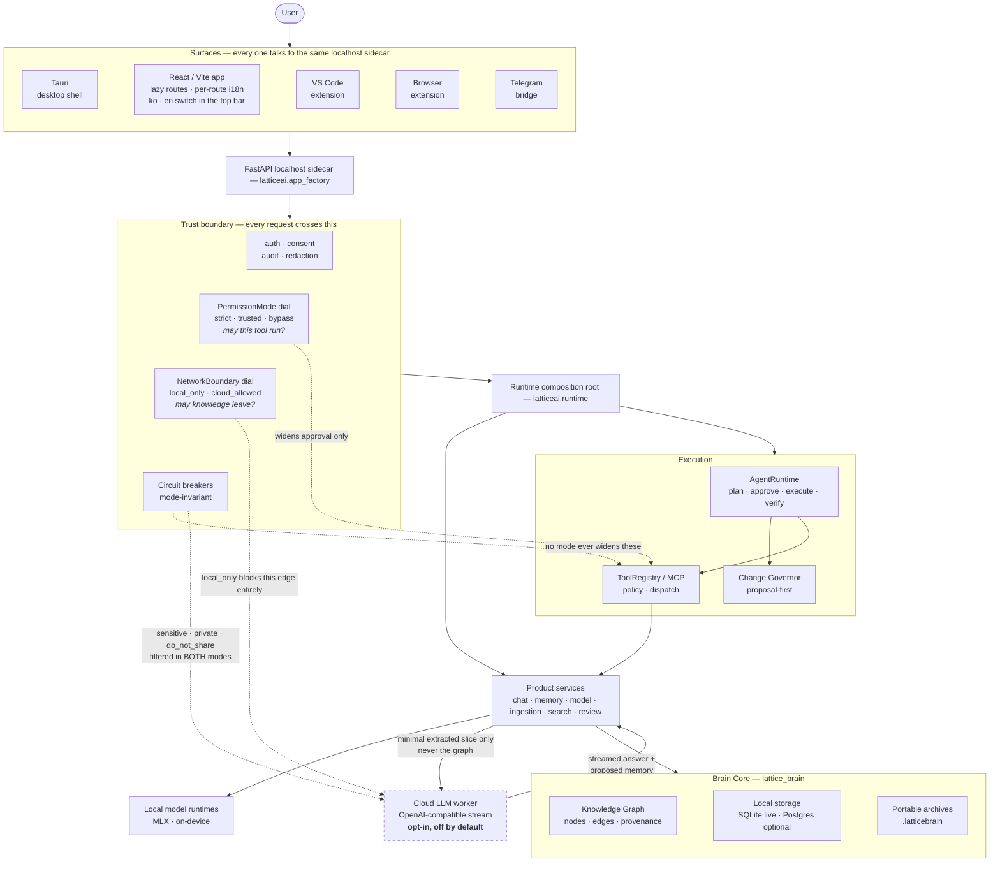
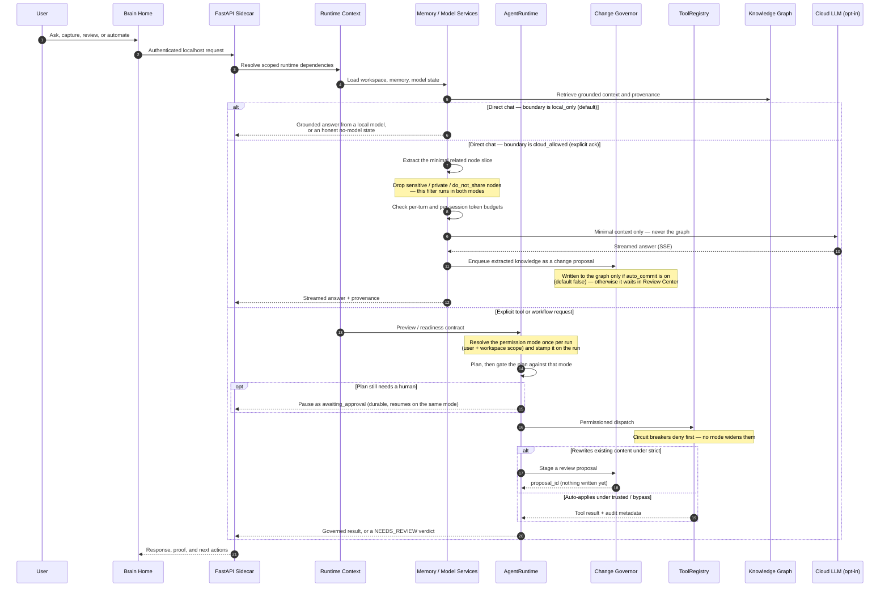
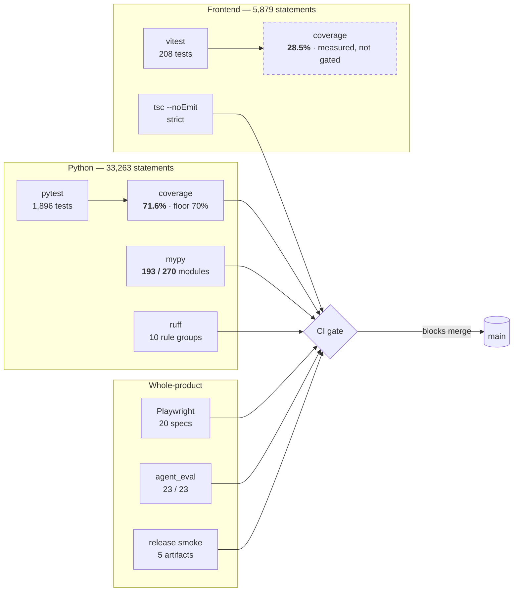

# Lattice AI Current Architecture

> **Status: canonical** — current-truth architecture document, kept in sync
> with the current release. Historical subsystem detail lives in
> [`docs/architecture.md`](docs/architecture.md).

Current release: **10.6.3 — Loud Limits**.

Lattice AI is a local-first Digital Brain platform. The current architecture is
organized around a private Brain, replaceable model runtimes, explicit tool
registries, and import-safe server composition.

## System Map



The dashed node is the only thing in this diagram that can live off the
machine, and two independent gates stand in front of it: the boundary dial
must be `cloud_allowed`, and the sensitivity filter runs regardless of the
dial. The Knowledge Graph itself never crosses that edge — only the minimal
node slice the extractor selected for one turn.

Key boundaries:

- `frontend/src` owns product UX and static app behavior. Every route is a
  `React.lazy` boundary, and copy follows the route rather than the entry
  chunk: `i18n/registry.ts` holds one shared table, `shell` registers eagerly
  (app frame, language switcher, generic `ui.*`), and `brain` / `workspace` /
  `onboarding` register themselves when the lazy chunk that needs them is
  imported. That keeps the first-paint closure near 99 KiB gzip instead of
  carrying ~3,000 lines of copy for routes the user has not opened.
  `scripts/check_i18n_namespace_coverage.mjs` fails the build when a chunk
  reads a key whose namespace it never imports — otherwise `t()` silently
  returns the raw key and the UI renders an identifier instead of text.
- `latticeai.app_factory` is the FastAPI composition root.
- `latticeai.runtime` owns typed config, security, Brain, model, platform, and
  router assembly stages (`config_runtime`, `security_runtime`,
  `brain_runtime`, `persistence_runtime`, `history_runtime`,
  `history_writer`, `router_registration`, ...); no stage exports ambient
  `locals()` state. `history_writer` holds the redact → audit → store → ingest
  order for one chat turn; it was 66 lines inside the `_build` closure until
  10.3.0, which is why the function deciding what the audit log records about a
  message had never been tested.
- `latticeai.api` owns route-level behavior through router-factory modules
  (chat, memory, search, local_files/ingestion, brain_intelligence,
  automation_intelligence, command_center, change_proposals, review_queue,
  network_boundary, workspace, admin, ...). Chat contracts, history, documents,
  and streaming are focused modules over service-owned logic; `chat_hybrid`
  is the branch `chat` delegates to when the boundary allows cloud.
- `latticeai.services` owns product and execution services (`chat_service`,
  `memory_service`, `model_service`, `ingestion`, `search_service`,
  `review_queue`, `command_center`, `automation_intelligence`,
  `brain_intelligence`, `change_proposals`, ...). The hybrid path is a
  self-contained group inside it (`hybrid_chat`, `hybrid_context`,
  `hybrid_policy`, `cloud_streaming`, `cloud_extraction`, `cloud_token_guard`,
  `openai_compatible_adapter`, `multimodal_streaming`,
  `network_boundary_service`) so the local path carries none of it.
- `latticeai.core` owns lower-level registries and helpers (`agent`,
  `agent_state`, `agent_helpers`, `agent_eval`, `tool_governor`,
  `network_boundary`, `context_builder`, `workspace_os`, `mcp_registry`,
  `marketplace`, `tool_registry`, `config`, ...).
- `lattice_brain` owns Brain Core, graph, memory, ingestion, and storage.
  `lattice_brain/graph/store.py` composes `KnowledgeGraphStore` from focused
  mixins (retrieval, retrieval_vector, ingest, discovery, provenance,
  projection, documents, write_master). `lattice_brain/graph/proactive.py`
  provides read-only proactive intelligence (duplicate discovery,
  contradictions, quality reports, the observe-mode ingest quality gate) over
  the store's public APIs. Storage engines live in `lattice_brain/storage/`
  (SQLite live engine, optional Postgres scale/migration tooling).

## First Screen Composition

The Brain home is four zones. Capture is part of the composer, not a panel
beside it, and nothing graph-shaped renders here — the knowledge graph opens by
clicking the Brain itself.

```mermaid
flowchart TB
  subgraph shell["Top bar — on every screen"]
    direction LR
    nav["대화 · 자료 · 기억 · 작업"]
    lang["한국어 / English"]
    theme["light / dark"]
    more["더보기"]
    nav ~~~ lang ~~~ theme ~~~ more
  end

  subgraph home["Brain home — brain-centered-home"]
    direction TB
    hero["1 · BrainHomeHero<br/>living Brain · greeting · what is remembered"]

    subgraph composer["2 · BrainComposer"]
      direction TB
      input["textarea — the one thing you do here"]
      capture["문서 · 이미지 · 파일 · 폴더 · 노트 · 웹<br/>BrainIngestionDock variant=inline"]
      dial["3 · BrainQuickControls — autonomy dial"]
      input --> capture --> dial
    end

    chips["suggested questions"]
    quiet["4 · quiet row — 지난 대화 · Brain이 정리한 내용"]
    hero --> composer --> chips --> quiet
  end

  graph["Knowledge graph<br/>#/knowledge-graph"]
  shelf["Insights shelf<br/>automation · briefing · health · garden"]

  hero -- "click the Brain" --> graph
  quiet -- "one click" --> shelf
```

Everything not in those four zones is one click away in the shelf; nothing was
removed to get here.

## Runtime Flow



## Product Flow

The current first-run and daily-use flow is:

1. Wake Brain / login.
2. Pick owner/workspace context.
3. Review recommended local model setup.
4. Prepare/install/load a model when the user opts in.
5. Land on Brain Home with the living Brain, conversation composer, and
   evidence-backed Brain Brief visible together.
6. Add a first source through upload, note, browser capture, or folder indexing.
7. Ask a grounded question, inspect proof, then open the memory graph when
   deeper source evidence is needed.
8. Choose model, automate, or manage from
   explicit navigation.

The graph is available when users need proof or exploration. It is not forced
into the first screen as a dashboard.

Action-aware Brain Chat sits on the same product path: ordinary questions stay
on direct chat generation, while explicit file create/write/save/edit requests
enter the governed workspace file tool path.

## Frontend

The app is a React/Vite static bundle served by the local FastAPI sidecar.
Current UX rules:

- Brain Home is the default product surface, composed of exactly four zones
  (see First Screen Composition).
- The composer is the primary action, and capture (file · folder · note · web)
  renders inside its toolbar rather than as a separate panel.
- Nothing graph-shaped renders on the home; the knowledge graph opens by
  clicking the living Brain.
- Model setup, automation, briefings, and admin controls are reachable in one
  click but are not mixed into the first screen.
- Copy is fully bilingual. Backend payloads are labeled by their stable id
  (`ui.field.*`, `ui.entity.*`, `act.agentRole.*`, `brain.memoryTier.*`), so the
  server keeps one vocabulary and the reader sees their own language.
- Identifiers are never shown where a name belongs: `humanizeModelId` and
  `plainText` (`frontend/src/lib/utils.ts`) turn package coordinates and
  model-written Markdown into readable text. The same rule covers records: a
  run is titled by its workflow name, and its database id renders only in
  advanced mode.
- Enum-shaped payload values are translated per token with a named fallback
  (`act.runStatus.<token>` → "알 수 없음"), never printed raw. A token the table
  does not know must degrade to a written phrase, not to itself.
- Where two surfaces show the same setting, the copy has one home. Permission
  modes live in `frontend/src/lib/permissionCopy.ts`, read by both the home
  dial and the Settings panel; lookup is by mode id with the server's own
  localized label as fallback, so a server-added mode still renders and the
  translation table cannot become an accidental allowlist.
- Basic mode is a plain-language surface, not a reduced one: engineering panels
  (raw payloads, node canvases, storage engines, ids) move behind the advanced
  switch rather than disappearing. `tests/visual/v3.spec.js` sweeps ten
  plain-mode routes and fails on engine vocabulary reaching that reader.
- Mobile layouts preserve the Brain and composer in the first viewport.
- Static release assets are generated under `static/app` and must match
  `asset-manifest.json`.
- Critical API failures produce an explicit unavailable state and are never
  normalized into healthy empty Brain data.

## FastAPI Sidecar

`latticeai.app_factory` builds the local app without import-time MLX/GPU
initialization, filesystem writes, or network calls. Runtime assembly is
dependency-injected through immutable typed stages instead of ambient locals or
global mutable model state.

Important expectations:

- bind to `127.0.0.1` by default;
- require auth for sensitive endpoints;
- keep static serving, API routers, MCP install state, and runtime context
  separately testable;
- keep model and tool execution behind explicit runtime boundaries.
- keep API-specific HTTP errors at the route boundary and domain/model errors in
  services.

## Brain Core

`lattice_brain` is the durable product core. It owns:

- conversations and memories;
- Knowledge Graph nodes, edges, provenance, and traversal;
- ingestion and document/source capture;
- local storage and backup/restore behavior;
- `.latticebrain` archive compatibility.

The Honest Knowledge Pipeline hardens retrieval and ingestion:

- `graph/retrieval.py` `hybrid_search` blends lexical (FTS) and vector evidence
  and reports a `context_quality` signal that chat consumes so grounding is
  honest about how strong the retrieved context is.
- `graph/retrieval_vector.py` tracks vector freshness (embedded vs. total
  content) so the Brain can report stale embeddings and reindex on demand.
- `ingestion.py` supports folder ingestion (`ingest_folder`) with
  `.latticeignore` filtering and resumable background jobs
  (`/api/ingestion/jobs`), plus per-source `extraction_quality` scoring and an
  observe-mode `quality_gate` that flags low-quality extractions instead of
  silently accepting them.

Knowledge Graph changes must preserve read compatibility, rollback paths,
migration safety, and equivalence tests.

## Runtime Contracts

The 8.0 architecture contract remains active in 10.3.0:

- AgentRuntime has explicit preview/readiness contracts and does not execute
  tools during preview.
- ToolRegistry owns dispatch, permissions, manifest, diagnostics, and MCP
  install state, with direct HTTP/MCP policy gates enforced before execution.
- Config values are centralized through runtime config objects.
- Server decomposition uses typed stages and an explicit legacy export allowlist.
- Model routing/loading uses injected state; request snapshots prevent
  concurrent generations from changing one another's selected model.
- Knowledge Graph hardening remains guarded by compatibility, equivalence, and
  fail-closed workspace-scope tests. Unknown scope is private; legacy-global
  reads require explicit compatibility opt-in.
- Legacy compatibility shims are tracked in a managed inventory with owners,
  replacements, and removal phases.
- AgentRuntime and WorkflowEngine expose release-checkable orchestration
  boundaries while preserving legacy run compatibility.

Change governance and agent-eval extend the contract:

- `core/tool_governor.py` owns a `MUTATING_TOOL_INVENTORY` so every mutating
  tool is either governed (proposal-first) or explicitly exempt, and coverage is
  release-checked rather than assumed.
- File edits/deletions to existing content flow through change proposals
  (`services/change_proposals.py`, `/api/proposals`): each proposal records a
  base content hash, and application re-checks that hash to detect conflicting
  edits before writing atomically.
- `core/agent_eval.py` runs a fail-closed verifier: unverifiable or failing
  outcomes resolve to `NEEDS_REVIEW` and enter the review queue rather than
  being reported as success.
- `core/permission_mode.py` adds an autonomy dial (`strict` / `trusted` /
  `bypass`) *on top of* those gates rather than replacing them: a mode only
  widens what may run without an extra approval prompt. Circuit breakers —
  destructive risk, root/home paths, `rm -rf /` style commands, binary
  overwrites — are mode-invariant. The mode is resolved per user and per
  workspace, and stamped once per agent run so a plan and its execution are
  judged by one dial (`services/permission_mode_service.py`,
  `runtime/permission_mode_wiring.py`, `/api/permission-mode`).

## Verification Surface

What is measured, and what is not. Every number here is produced by a command
in CI rather than asserted in prose — the point of 10.3.0 was to replace
estimates with figures.



The dashed box is the one figure that is reported but not enforced. Frontend
coverage became measurable in 10.3.0 (`all: true`, so untested files count
against the denominator instead of vanishing from it) and the honest number is
28.5% — too low to floor without freezing it there. `docs/MYPY_BACKLOG.md`
does the same job for the 77 modules mypy does not yet check: the boundary is
written down rather than implied.

Two figures moved for reasons worth recording:

- Python coverage was first reported as 80%, which was wrong. The `omit`
  pattern `*/tests/*` does not match the repo-relative `tests/...` paths
  coverage records, so the suite was counting itself — and test files run
  ~100% by construction. Corrected to `tests/*`, the real figure is 71.6%.
- Frontend coverage was first reported as 54%, also wrong: without `all: true`
  vitest only reports files a test already imports, so a module with no test
  simply left the denominator.

## Single-Agent Runtime Composition

The Discover→Plan→Implement→Verify loop is three modules, split by what each
one is allowed to touch:

```
core/agent_state.py     AgentState, AGENT_TERMINAL_STATES
                        no imports from the other two — the shared vocabulary
        ▲                                    ▲
        │                                    │
core/agent_helpers.py                core/agent.py
pure functions:                      the state machine:
 extract_action(_details)             AgentRunContext
 normalize_plan                       AgentDeps  (the ports)
 filter_learnings                     SingleAgentRuntime
 compact_transcript                          │
 files_written                               │ imports
 artifact_checklist                          ▼
 requirement_coverage                 core/agent_helpers.py
 format_* reporters
 TranscriptBudget, PhaseBudgets
deterministic, no I/O
```

Two rules hold this shape:

- **`agent_state.py` depends on neither sibling.** It exists because both need
  the enum and neither can own it: if `AgentState` lived in `agent.py`, the
  helpers could not import it — `agent.py` imports *them* — and would fall back
  to comparing against the literal `"EXECUTING"`. A rename of an enum value
  would then stop matching silently, with no failing test.
- **`latticeai.core.agent` re-exports every moved name** and declares the set in
  `__all__`. The import path callers have always used is the contract; the file
  layout behind it is not. `chat_agent_http`, `chat_intents`, `computer_use`,
  `run_store`, `tool_dispatch`, both bench scripts, and the agent test modules
  import from `latticeai.core.agent` and are unaffected by the split.

Anything deterministic and I/O-free belongs in `agent_helpers.py`; anything that
advances or inspects run state belongs in `agent.py`.

## Storage And Portability

SQLite is the live local Brain store. PostgreSQL/pgvector remains optional
scale/migration tooling and must be explicitly configured; it is not the
default live KnowledgeGraphStore backend in 10.3.0. Backups and `.latticebrain`
archives are user-controlled portability paths.

## Local-First Boundary

The default runtime does not send prompts, files, graph content, or archives to
Lattice-owned servers. Cloud models, downloads, Telegram, Brain Network,
Docker/Postgres setup, marketplace refresh, and update checks are opt-in paths.

### The network boundary dial

`core/network_boundary.py` makes "may knowledge leave this machine" a single
explicit decision rather than a property of whichever model happens to be
selected. It is deliberately **orthogonal to `PermissionMode`**: that dial
answers "may this tool run without asking", this one answers "may anything
leave". A session can be `cloud_allowed` and `strict` at the same time.

| Mode | Meaning |
| --- | --- |
| `local_only` | Default. No chat context reaches a cloud provider. |
| `cloud_allowed` | Explicitly acknowledged. Only the minimal extracted node slice may be sent. |

Four properties hold regardless of the mode:

1. **Unknown input fails safe.** `normalize_network_mode` maps anything it does
   not recognize — a typo, a stale env var, `None` — to `local_only`.
2. **Sensitivity filters are mode-invariant.** Nodes carrying `sensitive`,
   `private`, `do_not_share`, or `local_only` metadata are dropped before the
   payload is assembled, exactly like the agent circuit breakers that no
   permission mode can widen.
3. **The graph never travels.** What leaves is a `MinimalContext` — the node
   slice the extractor chose for one turn — not the store, not a subgraph
   export, not an archive.
4. **Cloud-derived memory is proposed, not written.** `cloud_extraction.py`
   output is enqueued as a Review Center change proposal with provenance;
   it reaches the graph only when `auto_commit` is explicitly enabled
   (default `false`) *and* a store write API is bound. Multimodal requires a
   second, separate `allow_multimodal` flag (also default `false`).

Token budgets (`cloud_token_guard.py`) cap per-turn and per-session spend, so
an opted-in session has a ceiling rather than an open tap.

**Surface (10.1.1):** `NetworkBoundaryPanel` in **환경설정 → 내 지식이 나가는
범위**, beside the autonomy dial. Like that dial it renders the server's own
catalog rather than a hardcoded mode list, and it will not send a switch to
`cloud_allowed` until the acknowledgement the server requires is ticked — the
client refuses the request the server would refuse.

It carries one thing the autonomy dial does not: a **preview**. Type a question
and `/api/network-boundary/preview` answers with the actual node titles that
question would send, its token estimate, and whether the token guard would
refuse the turn. The preview works in `local_only` too, and says so — you can
look before deciding, not only after. A promise that "only minimal related
nodes leave" is worth less than a list of which ones.

The write-back switches (`auto_commit`, `allow_multimodal`) render only while
the boundary permits cloud, because a switch that cannot do anything invites
the belief that it did.

10.1.0 shipped this feature's contracts, API, and `/chat` branch with no way to
reach any of it from the app; that gap is what 10.1.1 closes.

## Release Artifact Map

10.6.3 exact artifact names:

- `dist/ltcai-10.6.3-py3-none-any.whl`
- `dist/ltcai-10.6.3.tar.gz`
- `ltcai-10.6.3.tgz`
- `dist/ltcai-10.6.3.vsix`
- `src-tauri/target/release/bundle/dmg/Lattice AI_10.6.3_aarch64.dmg`

Do not document or use wildcard artifact upload commands.

## Known Limitations

- The repo root keeps exactly one compatibility module (`server.py` for
  `uvicorn server:app`); all other root shims were removed in 9.9.1 and a
  legacy debt gate (`scripts/check_legacy_debt.mjs`) keeps the root clean.
- PostgreSQL scale/migration tooling, Docker, cloud models, Telegram, Brain
  Network, update checks, and marketplace refreshes are not default local
  behavior.
- Package registry publication is owner-run and can lag behind the GitHub
  release.
- Local data protection depends on the user's machine, OS account, backups, and
  disk encryption outside Lattice AI.
