# Lattice AI Current Architecture

Last updated for the 6.4.0 Digital Brain Quality Hardening target.

Lattice AI is a local-first Digital Brain that keeps your knowledge durable
across any AI model. Product category is the Digital Brain; core capability is
the private AI memory layer; UX metaphor is the Living Brain. The model is a
replaceable voice, while the user's conversations, documents, decisions,
relationships, workflows, and project context are durable assets.

The architecture keeps Brain plus conversation as the normal user surface,
keeps graph exploration available without making it the product identity, and
preserves the trust boundary around CSP, local file reads, secret redaction,
model downloads, and external communication opt-in. The structured model
capability registry exposes HF verification, hardware fit, modality, download
strategy, load strategy, license, and safety notes before consent.

## System Map

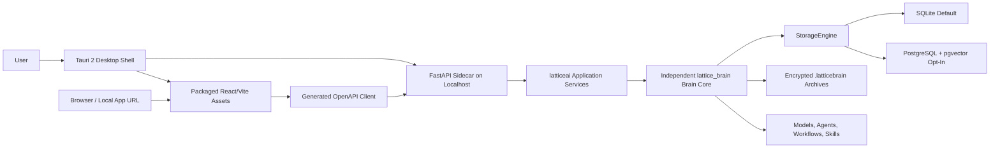

The frontend never imports Python. The desktop shell and browser UI call FastAPI
over localhost APIs. FastAPI composes application services around the independent
`lattice_brain` package.

## Product Flow

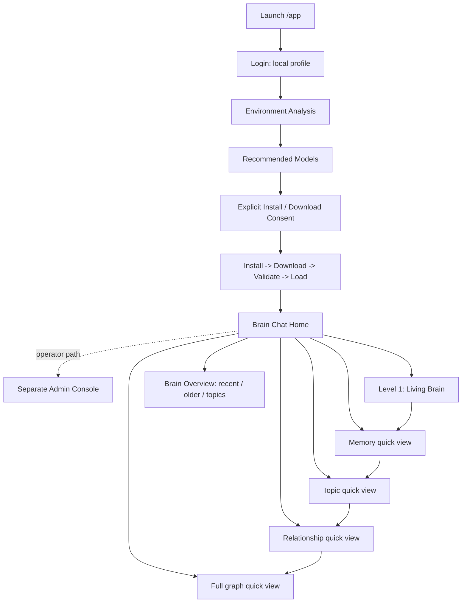

The graph is an implementation and exploration layer. It emerges from the Brain
after the user travels through memory, knowledge, and relationships; it is not
the first screen or a dashboard replacement.

The Admin Console is also separate from the normal user flow. Operators reach it
through `#/admin`; everyday users stay in the Brain surface unless they choose
to open admin controls.

## Tauri Shell

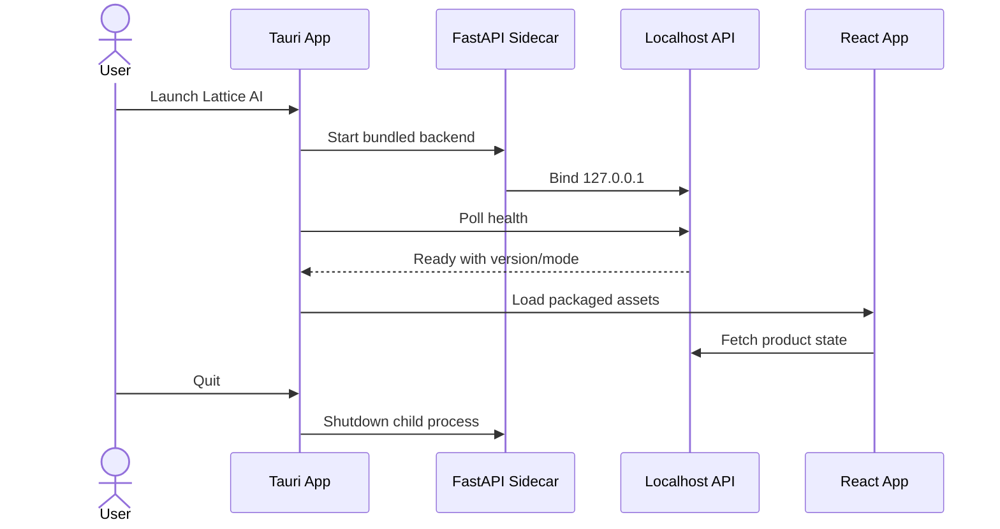

Tauri 2 is the release desktop shell. Electron remains fallback-only. The
sidecar runs on localhost, reports health/version/mode, and is stopped by the
desktop lifecycle handler. Packaged production builds use a non-null CSP that
defaults to local assets and localhost API/WebSocket endpoints, blocks external
scripts/frames/objects, and keeps development CSP separate.

## React/Vite Frontend

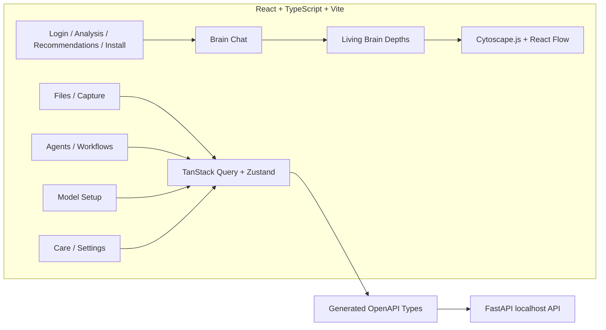

Visible controls either call real backend APIs or show an honest unavailable
state. Model install/download/load work remains explicit-consent only.

## FastAPI Localhost API

```mermaid
flowchart TB
  API["FastAPI App"]
  API --> Health["/health and runtime status"]
  API --> Accounts["Local account/session APIs"]
  API --> Conversations["Conversation and memory APIs"]
  API --> Graph["Knowledge Graph APIs"]
  API --> Search["Hybrid search APIs"]
  API --> Capture["Document upload and ingestion APIs"]
  API --> Models["Model recommendation and runtime APIs"]
  API --> Agents["Agent runtime APIs"]
  API --> Workflows["Workflow runtime APIs"]
  API --> Storage["Storage / backup / restore APIs"]
  API --> Archive[".latticebrain archive APIs"]
  API --> Network["Brain Network and device identity APIs"]
  API --> BrainCore["lattice_brain"]
```

FastAPI is the product API source of truth. The generated OpenAPI client keeps
frontend calls aligned with backend routes. `app_factory.py` now exposes builder
seams for config, security, and Brain runtime construction; future decomposition
should continue by moving app composition into focused modules without restoring
import-time side effects.

## Brain Core

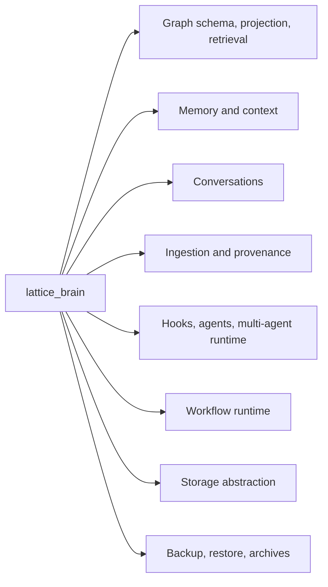

`lattice_brain` is the independent Brain Core used by FastAPI, CLI, tests, and
future tools. It contains graph, memory, context, conversations, ingestion,
agent/hook runtime, workflow, portability, archive, embeddings, and storage
modules. Compatibility shims remain in `latticeai`, but isolation tests prevent
`lattice_brain` from importing `latticeai`.

## Brain Quality Pipeline

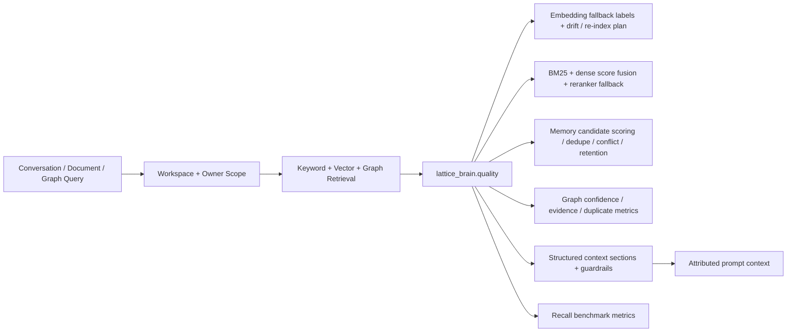

The 6.4.0 quality layer is intentionally non-destructive. It does not mutate
the graph schema or replace the existing ingestion pipeline. Instead it adds
explicit quality data structures around the existing Brain paths: fallback
embeddings are labelled fallback, provider/model drift produces a re-index
plan, retrieval combines lexical and dense signals through a local-safe fusion
contract, graph edges carry confidence/evidence metrics, and prompt context is
assembled with attribution, confidence, timestamp, and known/inferred/stale/
unknown guardrails.

Workspace scope is enforced before results enter the quality pipeline. Graph,
node, neighborhood, relationship, keyword, vector, graph, and hybrid retrieval
paths carry the caller's allowed workspace set. Memory Manager mutation paths
intersect requested ids/kinds with the caller's scoped memory set; global graph
clear is blocked until a workspace-safe graph delete path exists.

## StorageEngine

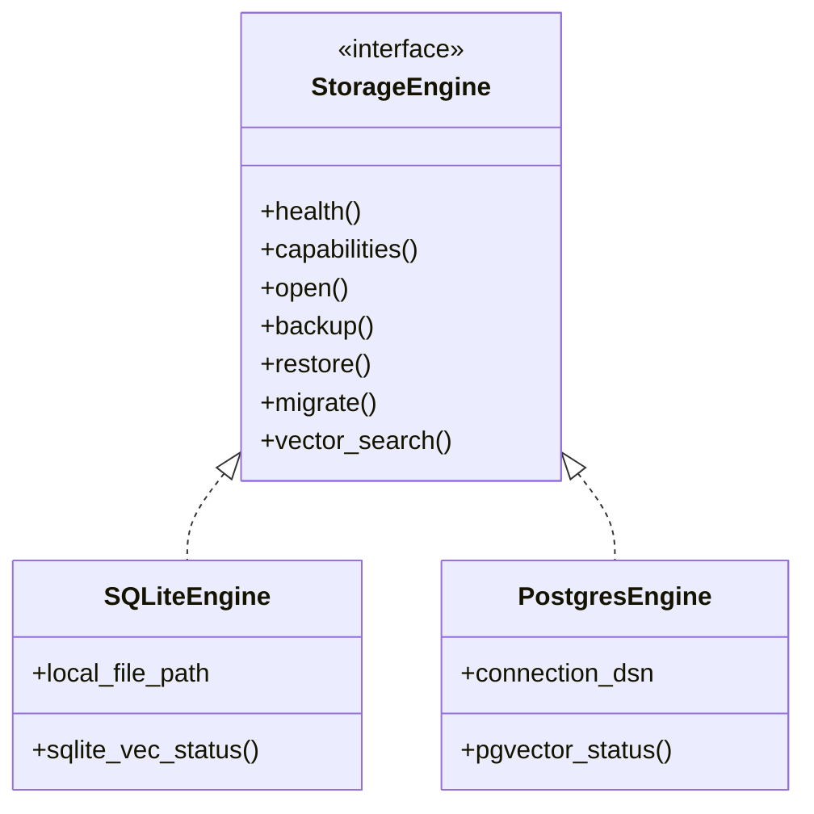

SQLite is the default local brain store. PostgreSQL/pgvector is optional scale
mode and requires explicit configuration. Docker/Postgres setup is consent-gated
and never starts automatically.

## Backup, Restore, And Portability

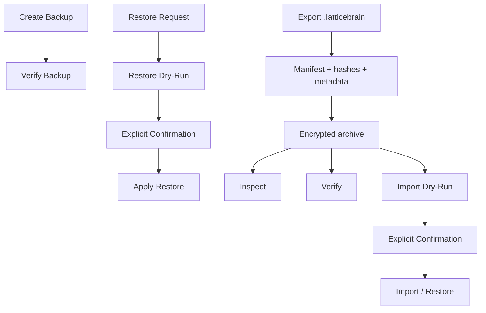

`.latticebrain` archives are portable encrypted brain bundles. Inspect, verify,
dry-run import, and confirmed import/restore keep rollback and safety paths
available. Corrupt, partial, tampered, wrong-passphrase, or unsupported-version
archives fail closed.

## Local-First Boundary

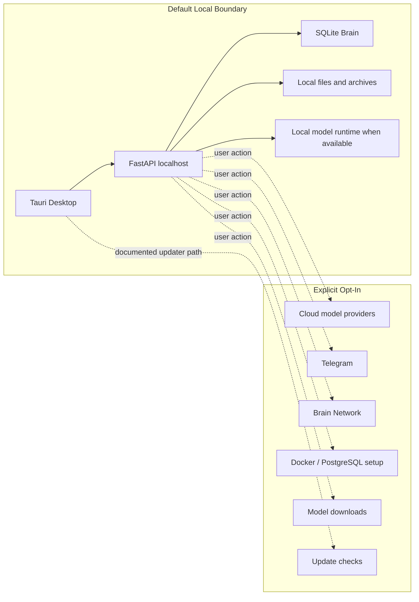

Token presence alone must not start external communication. External
connectors, downloads, Docker, Brain Network, and cloud model calls require
explicit opt-in paths.

## Release Artifact Map

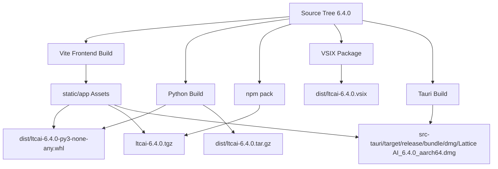

Release uploads must use exact filenames. Do not upload `dist/*`.

## Known Limitations

- 5.2.0 added a structured model capability registry and user-facing catalog
  filtering without a backend security redesign.
- External registries can lag behind the GitHub Release because package-store
  publishing is owner-controlled.
- PostgreSQL/pgvector is opt-in scale mode; SQLite is the default.
- Docker, model downloads, cloud calls, Telegram, and Brain Network require
  explicit user action.
- Model-free states are reported honestly. The UI should not fabricate answers
  when no model is loaded.
- Historical reports under `docs/` preserve older release behavior and should
  not be rewritten as 6.4.0 claims.
