# Lattice AI

[](https://pypi.org/project/ltcai/)
[](https://www.npmjs.com/package/ltcai)
[](https://marketplace.visualstudio.com/items?itemName=parktaesoo.ltcai)
[](https://open-vsx.org/extension/parktaesoo/ltcai)
[](https://github.com/TaeSooPark-PTS/LatticeAI/actions/workflows/ci.yml)
[](LICENSE)

**Lattice AI v4.5.1 is a local-first Digital Brain desktop workspace.** It runs
as a Tauri desktop app with a localhost FastAPI sidecar, stores the user's brain
locally by default, and presents the Knowledge Graph as the durable asset.

This README describes the v4.5.1 release-candidate tree, which preserves the
v4.4.0 physical `lattice_brain` extraction and v4.5.0 capability recovery while
reimagining the product surface from first principles: Home, Ask, Add,
Automate, Library, and Care replace the prior dashboard-style presentation.
External package registries are owner-published; the badges above link to
package pages and may show the most recently published owner-controlled registry
version, which can lag behind the GitHub Release.

## What Was Verified

- Desktop app starts and serves the React/Vite product shell from the FastAPI
  sidecar.
- Brain graph renders persisted local graph data with search, groups, focus,
  filtering, and hybrid-search results.
- Ask displays durable conversations, graph context, and honest unavailable
  state when no model is loaded.
- Capture uploads a document through `/upload/document` and shows indexed
  documents from the backend.
- Act exposes workflow create/run surfaces and agent runtime status without
  presenting simulation as real success. When no LLM-backed model is loaded,
  deterministic model-free agent simulation is reported honestly and does not call a model.
- Library shows model/runtime availability honestly.
- First-run setup guides Make it yours -> Choose a space -> Meet your Mac ->
  Pick a brain -> Install locally -> Try a question -> Set the pace -> Explore
  memory.
- Gemma 4 MLX models are checked against their local `config.json` before load:
  Gemma 4 12B `gemma4_unified` now shows **Runtime update needed** when the
  installed MLX-VLM lacks `mlx_vlm.models.gemma4_unified`, while Gemma 4 26B
  A4B stays on the working `gemma4` MLX-VLM path.
- System exposes storage, backup health, archive, Brain Network, device
  identity, and admin status through real APIs.
- Backup, restore dry-run, archive verify, archive import dry-run, and
  `.latticebrain` portability flows were exercised.

## Product Tour

### Desktop Startup

The v4.5.1 DMG build launches a visible Tauri app, starts the FastAPI sidecar on
localhost, and shuts that sidecar down on normal macOS quit.

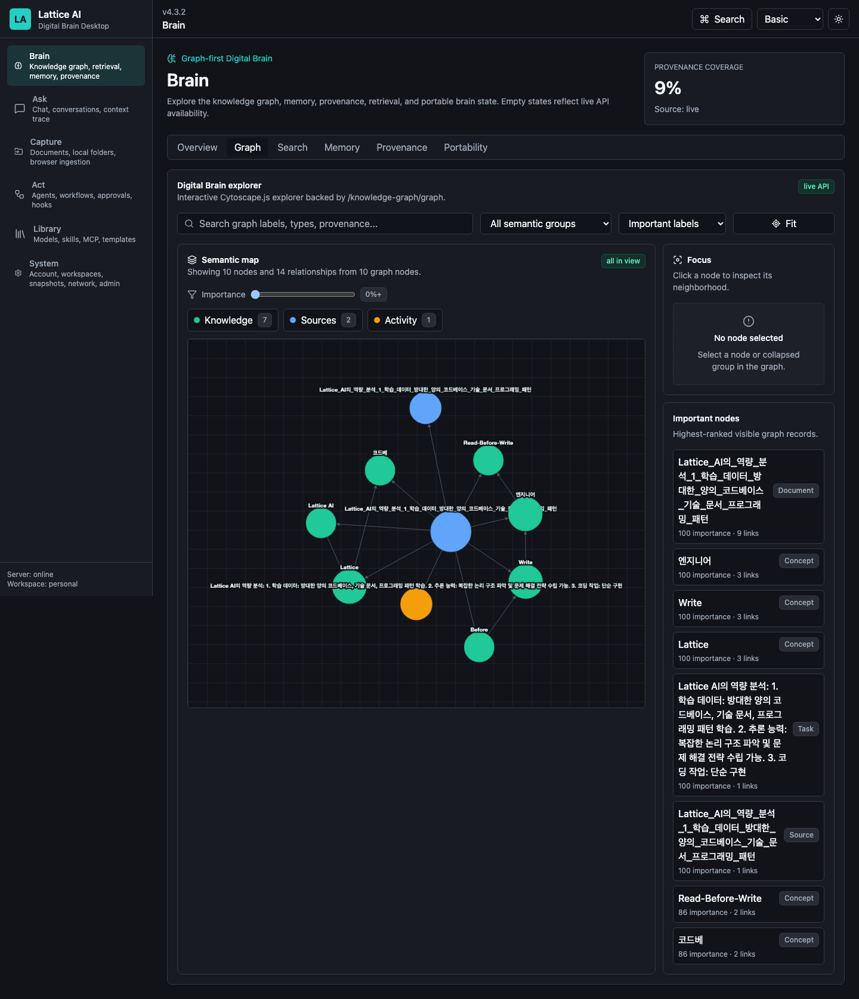

Evidence:

- Health log: `output/audits/v4.3.2-rc/logs/desktop-sidecar-health-after-shutdown-fix.json`
- Shutdown log: `output/audits/v4.3.2-rc/logs/desktop-shutdown-after-fix.txt`

### Brain Graph

Brain opens on the graph-first workspace. The graph uses real persisted nodes
and edges, then layers product controls for search, semantic grouping, focus
neighborhoods, label modes, group collapse/expand, and importance filtering.

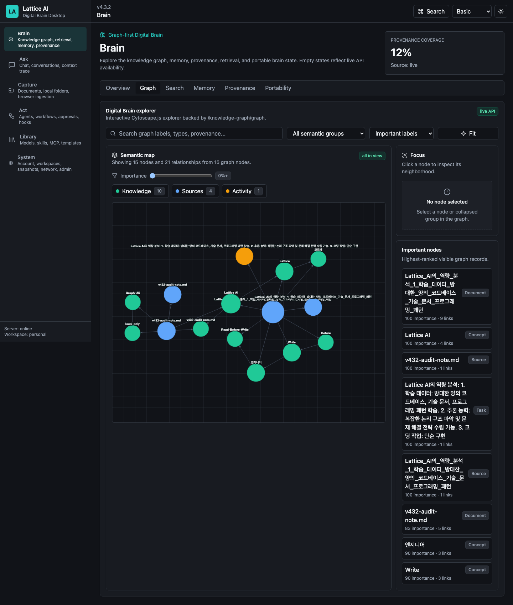

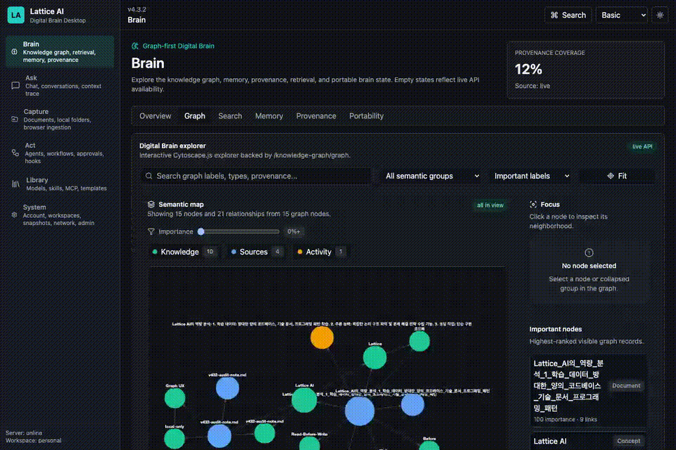

### Ask

Ask uses backend conversation, model, and graph context APIs. In the audited
state no model was loaded, so the UI showed a ready/unavailable state instead of
fabricating an answer while still surfacing graph context from local data.

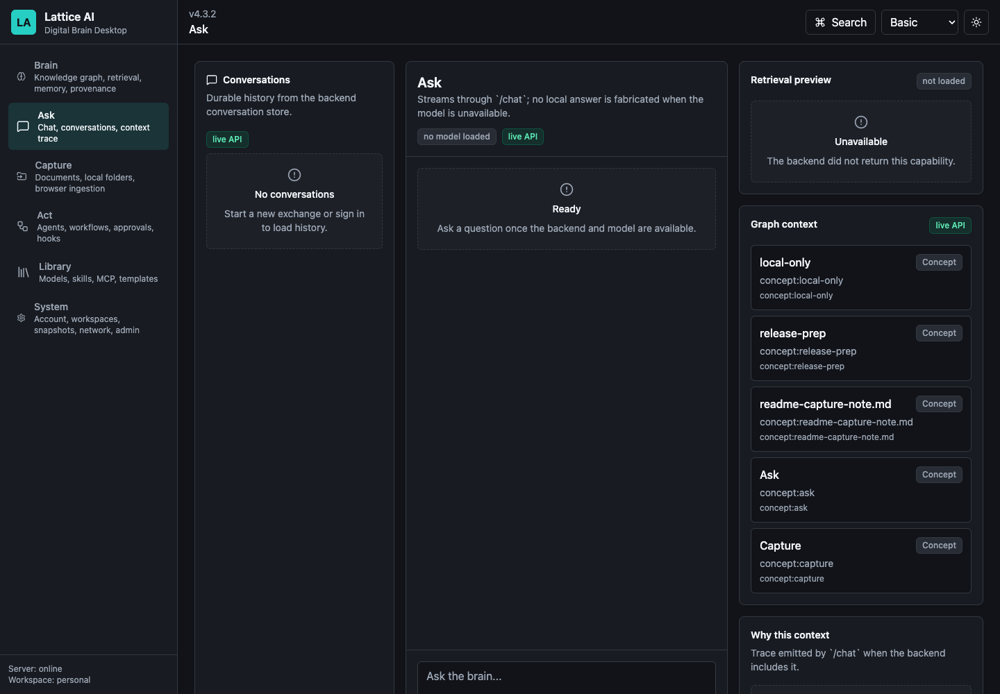

### Capture

Capture sends files through the backend upload/ingestion path and shows indexed
documents returned by the backend. The screenshot below includes a note uploaded
during release-prep evidence capture.

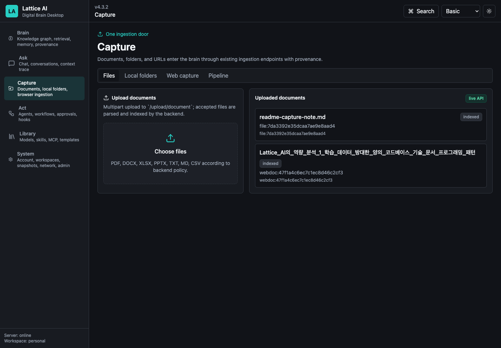

Upload evidence: `output/audits/v4.3.2-rc/logs/readme-upload-note.json`

### Act

Act exposes agents, workflows, approvals, hooks, and runtime status through
existing backend APIs. The audited workflow path created a real workflow record;
agent runtime simulation remains honestly unavailable as product success when no
LLM-backed model is loaded.

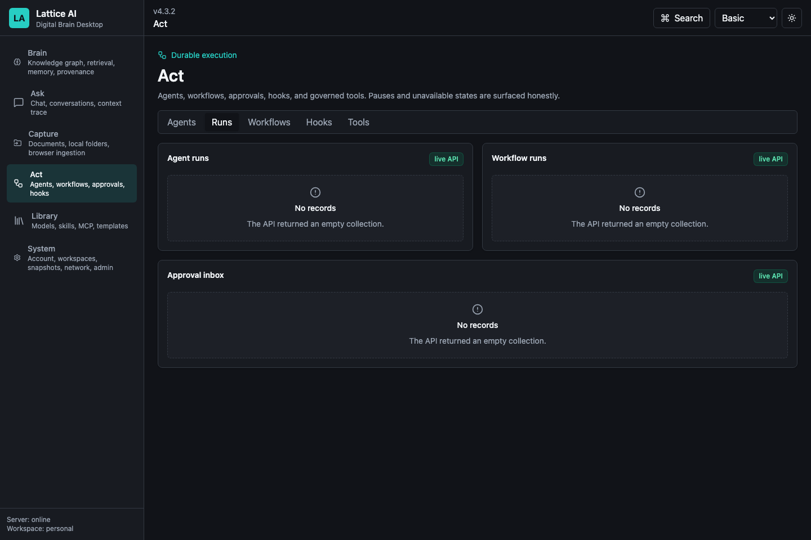

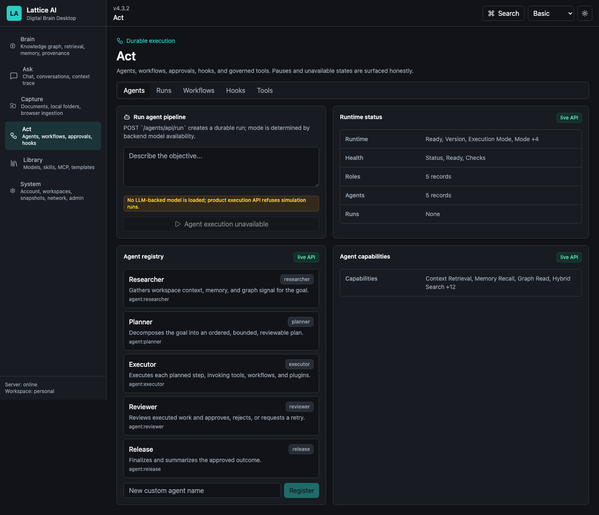

### Library

Library shows models, skills, MCP, and marketplace/configuration state with
availability reported from runtime APIs. Optional model runtimes are not treated
as loaded unless the runtime is actually available. Model setup now follows the
explicit Environment Analysis -> Recommended Models -> Install -> Download
Progress -> Validate -> Load -> Ready path, with download/install consent kept
visible.

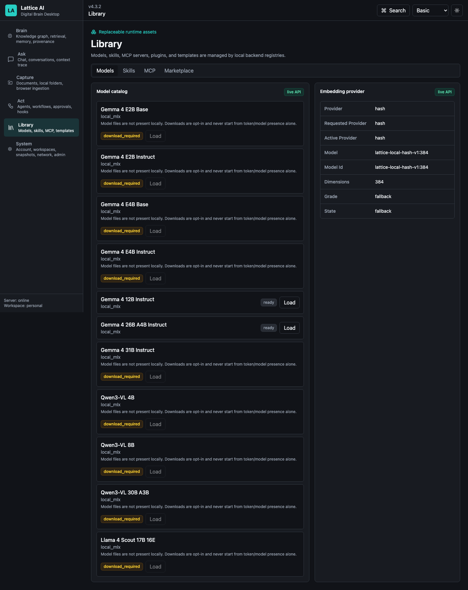

### System

System exposes account/workspace status, storage mode, backup health, archive
operations, device identity, Brain Network, and admin hardening state. External
integrations remain opt-in.

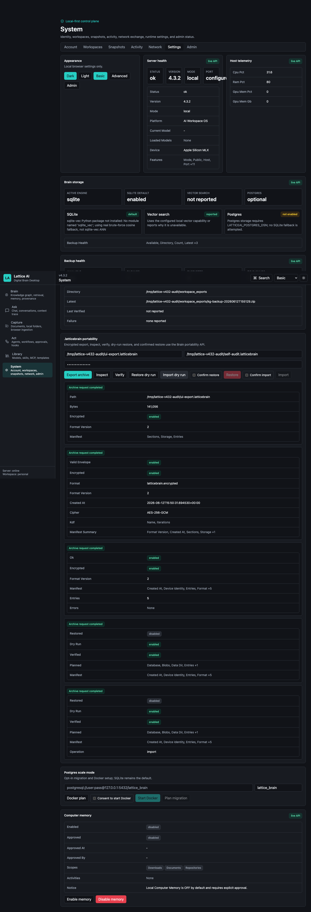

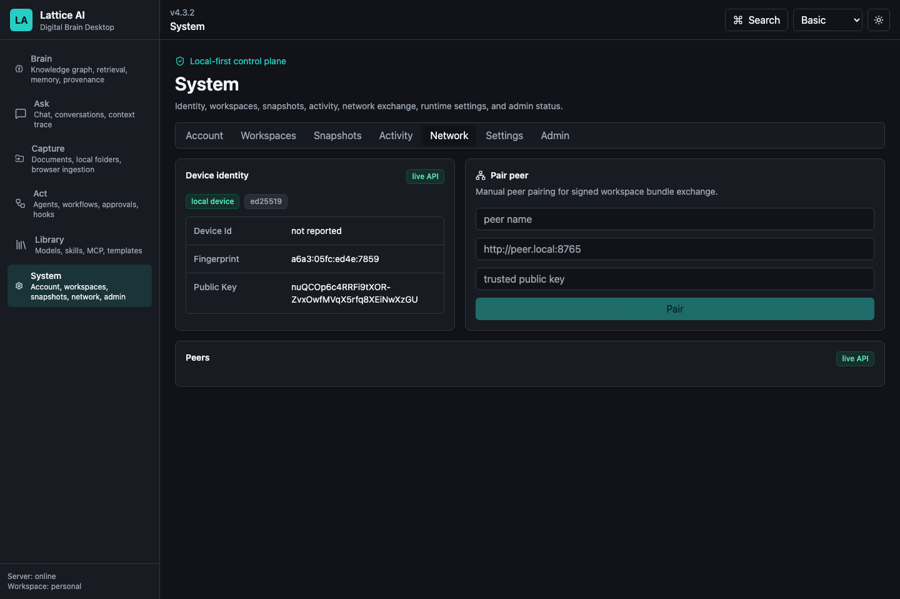

### Backup / Restore

Backup and restore flows are backed by the knowledge-graph portability APIs.
The retained v4.3.2 product audit exercised backup health, backup creation, restore dry-run, and
archive restore surfaces.

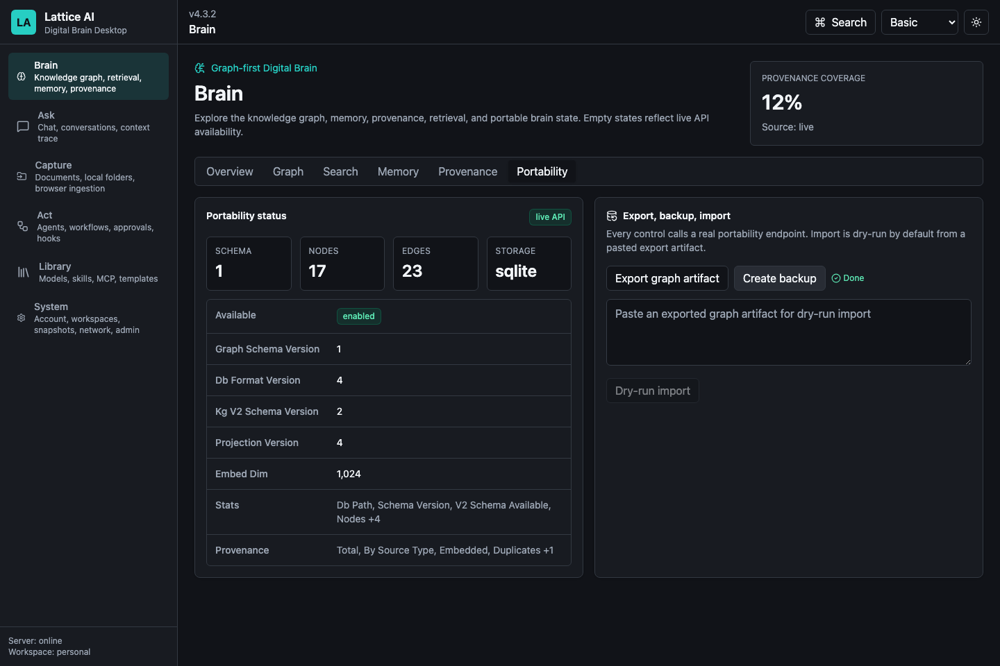

### `.latticebrain` Portability

The portable brain format is an encrypted `.latticebrain` archive. The audited
System flow exercised archive export, inspect, verify, import dry-run, and
restore dry-run/restore controls through FastAPI.


Archive evidence:

- Create: `output/audits/v4.3.2-rc/logs/archive-create.json`
- Verify: `output/audits/v4.3.2-rc/logs/archive-verify.json`
- Import dry-run: `output/audits/v4.3.2-rc/logs/archive-import-dry-run.json`

## Architecture At A Glance

- **Desktop shell**: Tauri 2 primary shell; Electron remains fallback-only.
- **Frontend**: React, TypeScript, Vite, TanStack Query, Zustand, Cytoscape.js,
  React Flow, Tailwind/shadcn-style primitives, generated OpenAPI client.
- **Backend**: FastAPI on localhost is the source of truth for the UI.
- **Brain Core**: independent Python package `lattice_brain` (graph, memory,
  context, conversations, ingestion, agent/hook runtime, workflow,
  portability, storage) physically hosted in the package, imported by FastAPI,
  CLI, tests, and future tools, and guaranteed by tests to never import
  `latticeai`.
- **Storage**: `StorageEngine` abstraction with SQLite default and optional
  PostgreSQL/pgvector scale mode.
- **Portability**: encrypted `.latticebrain` archive plus backup/restore and
  migration tooling.
- **Privacy**: local-first by default; cloud models, Telegram, Brain Network,
  Docker, model downloads, and update checks require explicit opt-in paths.

See [ARCHITECTURE.md](ARCHITECTURE.md) for the detailed v4 architecture. v4.5.1
does not redesign the v4.4.0 Brain Core extraction, StorageEngine, FastAPI,
Tauri, backup/restore, or portability architecture.

## Installation And Release Artifacts

Validated v4.5.1 RC artifacts are produced from the product-reimagining tree:

- `dist/ltcai-4.5.1-py3-none-any.whl`
- `dist/ltcai-4.5.1.tar.gz`
- `ltcai-4.5.1.tgz`
- `dist/ltcai-4.5.1.vsix`
- `src-tauri/target/release/bundle/dmg/Lattice AI_4.5.1_aarch64.dmg`

For a public release, attach only those exact artifacts to the GitHub Release.
Package-registry publishing is reserved for the owner.

## Local Development

```bash
npm install
npm run dev
```

Open the local app:

```text
http://127.0.0.1:4825/app
```

Build the release artifacts:

```bash
npm run release:artifacts
npm run release:validate
```

Run the main validation set:

```bash
npm run check:python
node scripts/run_python.mjs -m ruff check .
npm run lint
npm run typecheck
npm run test:unit
LTCAI_TEST_BASE_URL=http://127.0.0.1:4932 npm run test:integration
npm run test:visual
npm run desktop:tauri:check
node scripts/run_python.mjs scripts/wheel_smoke.py --wheel dist/ltcai-X.Y.Z-py3-none-any.whl
npm pack --dry-run
```

## Known Limitations

- External package registries are owner-published and can lag behind the GitHub
  Release.
- PostgreSQL/pgvector is optional scale mode and is not required for default
  local use.
- Docker is never auto-started by default.
- Model downloads and cloud model calls require explicit user action/consent.
- Ask does not fabricate answers when no model is loaded.
- Historical artifacts may remain in `dist/`; release uploads must use exact
  v4.5.1 filenames for this RC.

## Release History

| Version | Theme |
| --- | --- |
| 4.5.1 | Product Reimagining RC: replaced the desktop shell, navigation model, onboarding journey, first-viewport hierarchy, and visual system while preserving capabilities and local-first architecture |
| 4.5.0 | Product Experience Recovery RC: restored first-run setup, workspace/model onboarding, explicit model install/download/validate/load flow, Gemma 4 runtime compatibility gating, Basic-mode polish, and graph discoverability |
| 4.4.0 | Brain Engine Extraction: Brain Core physically moved into `lattice_brain` (graph/memory/context/conversation/ingestion/runtime/workflow/portability), latticeai paths reduced to compatibility shims, isolation tests guaranteeing no `latticeai` imports |
| 4.3.3 | Dead-Code Cleanup Release: post-audit cleanup, architecture documentation correction, Vercel/static-docs readiness, README badge restoration, exact-current artifacts |
| 4.3.2 | Product Polish & Graph UX Overhaul RC: evidence-based README, graph UX, structured product state, archive UX, desktop sidecar cleanup, publishing readiness |
| 4.3.1 | End-User Audit Repair RC: desktop sidecar startup, npm clean install, default-off downloads, honest agent/workflow states |
| 4.3.0 | Portability & Product Hardening RC: encrypted `.latticebrain` archives, backup/restore hardening, local-only startup guards |
| 4.2.0 | Brain Core & Storage Rebuild: independent `lattice_brain`, StorageEngine abstraction, SQLite default, opt-in Postgres/pgvector |
| 4.1.0 | Frontend & Desktop Rebuild: React/Vite SPA, Tauri shell, generated OpenAPI client |
| 4.0.1 | Digital Brain maintenance: durable async runs, identity/workspace state, `/app` parity |
| 4.0.0 | Digital Brain Platform foundation |
| 3.0.0 | v3 local-first AI workspace platform |

## Current Documentation

- [ARCHITECTURE.md](ARCHITECTURE.md) - v4 architecture.
- [FEATURE_STATUS.md](FEATURE_STATUS.md) - current feature status and historical
  status ledger.
- [RELEASE_NOTES.md](RELEASE_NOTES.md) - current release notes index.
- [RELEASE_NOTES_v4.5.1.md](RELEASE_NOTES_v4.5.1.md) - v4.5.1 RC release notes.
- [RELEASE_NOTES_v4.5.0.md](RELEASE_NOTES_v4.5.0.md) - v4.5.0 RC release notes.
- [RELEASE_NOTES_v4.4.0.md](RELEASE_NOTES_v4.4.0.md) - v4.4.0 release notes.
- [RELEASE_NOTES_v4.3.3.md](RELEASE_NOTES_v4.3.3.md) - v4.3.3 release notes.
- [RELEASE.md](RELEASE.md) - release checklist and exact artifact guidance.
- [SECURITY.md](SECURITY.md) - security posture.
- [docs/CHANGELOG.md](docs/CHANGELOG.md) - changelog.
- [docs/V4_3_2_DEADCODE_AUDIT_REPORT.md](docs/V4_3_2_DEADCODE_AUDIT_REPORT.md) - v4.3.3 cleanup basis.
- [docs/V4_3_3_VALIDATION_REPORT.md](docs/V4_3_3_VALIDATION_REPORT.md) - v4.3.3 validation report.
- [docs/V4_5_0_PRODUCT_EXPERIENCE_RECOVERY_REPORT.md](docs/V4_5_0_PRODUCT_EXPERIENCE_RECOVERY_REPORT.md) - v4.5.0 product recovery report.
- [docs/V4_5_0_VALIDATION_REPORT.md](docs/V4_5_0_VALIDATION_REPORT.md) - v4.5.0 validation report.
- [docs/V4_5_1_PRODUCT_REIMAGINING_REPORT.md](docs/V4_5_1_PRODUCT_REIMAGINING_REPORT.md) - v4.5.1 product reimagining report.
- [docs/V4_5_1_UX_REPORT.md](docs/V4_5_1_UX_REPORT.md) - v4.5.1 UX report.
- [docs/V4_5_1_VISUAL_DESIGN_REPORT.md](docs/V4_5_1_VISUAL_DESIGN_REPORT.md) - v4.5.1 visual design report.
- [docs/V4_5_1_NAVIGATION_REPORT.md](docs/V4_5_1_NAVIGATION_REPORT.md) - v4.5.1 navigation report.
- [docs/V4_5_1_ONBOARDING_REPORT.md](docs/V4_5_1_ONBOARDING_REPORT.md) - v4.5.1 onboarding report.
- [docs/V4_5_1_MODEL_EXPERIENCE_REPORT.md](docs/V4_5_1_MODEL_EXPERIENCE_REPORT.md) - v4.5.1 model experience report.
- [docs/V4_5_1_GRAPH_EXPERIENCE_REPORT.md](docs/V4_5_1_GRAPH_EXPERIENCE_REPORT.md) - v4.5.1 graph experience report.
- [docs/V4_5_1_VALIDATION_REPORT.md](docs/V4_5_1_VALIDATION_REPORT.md) - v4.5.1 validation report.
- [docs/V4_5_1_RC_ARTIFACTS.md](docs/V4_5_1_RC_ARTIFACTS.md) - v4.5.1 screenshot, GIF, and RC artifact manifest.
- [docs/V4_3_2_GRAPH_UX_REPORT.md](docs/V4_3_2_GRAPH_UX_REPORT.md) - graph UX report.
- [docs/V4_3_2_PRODUCT_POLISH_REPORT.md](docs/V4_3_2_PRODUCT_POLISH_REPORT.md) - product polish report.
- [docs/V4_3_2_SELF_AUDIT_REPORT.md](docs/V4_3_2_SELF_AUDIT_REPORT.md) - self-audit evidence.
- [docs/V4_3_2_VALIDATION_REPORT.md](docs/V4_3_2_VALIDATION_REPORT.md) - RC validation report.
- [docs/V4_3_2_DOCUMENTATION_CLEANUP_REPORT.md](docs/V4_3_2_DOCUMENTATION_CLEANUP_REPORT.md) - release-prep documentation cleanup report.
- [docs/V4_3_2_GITHUB_VERCEL_CHECK_REPORT.md](docs/V4_3_2_GITHUB_VERCEL_CHECK_REPORT.md) - GitHub/Vercel readiness report.
- [docs/V4_3_2_INDEPENDENT_AUDIT_PACKAGE.md](docs/V4_3_2_INDEPENDENT_AUDIT_PACKAGE.md) - package for an independent reviewer.
- [docs/V4_3_2_DEADCODE_AUDIT_REPORT.md](docs/V4_3_2_DEADCODE_AUDIT_REPORT.md) - independent dead-code, architecture, and runtime audit.
- [docs/V4_DIGITAL_BRAIN_RECOVERY.md](docs/V4_DIGITAL_BRAIN_RECOVERY.md) - transformation recovery file.

## License

MIT. See [LICENSE](LICENSE).
