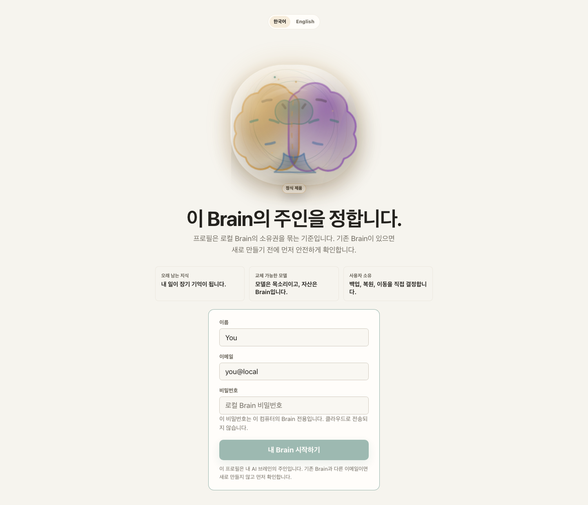
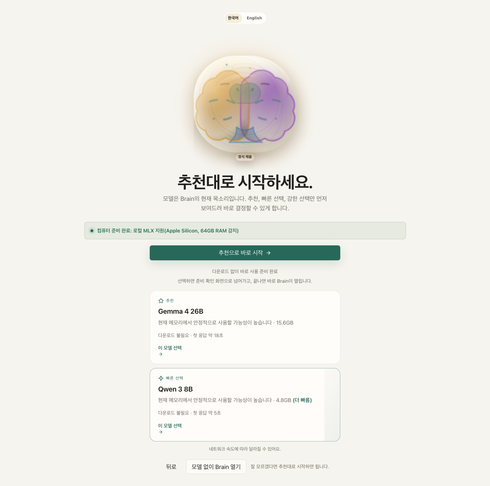
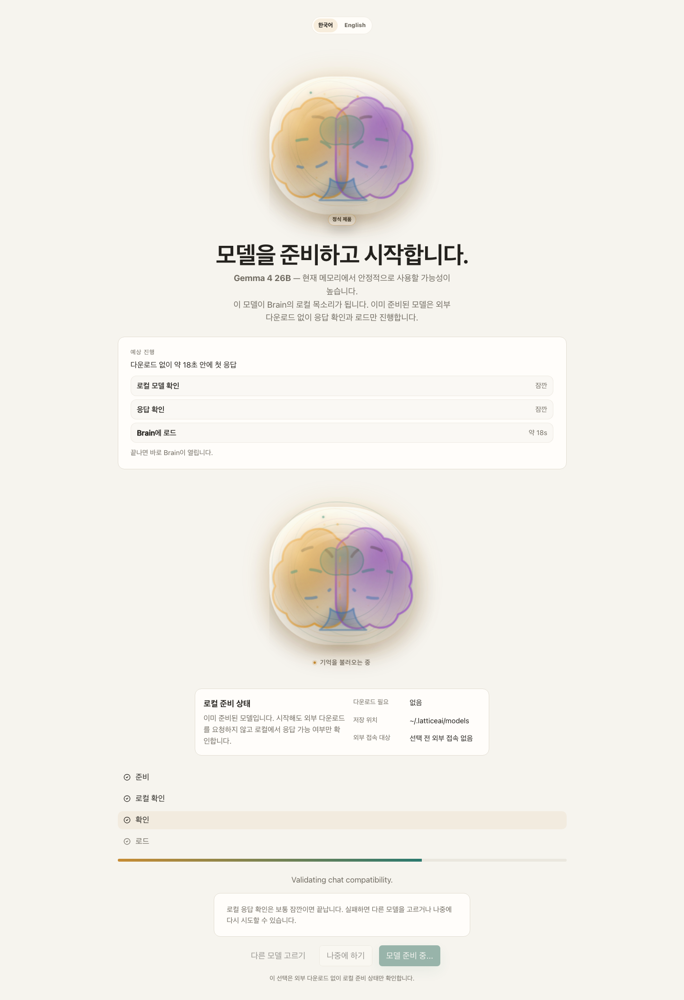
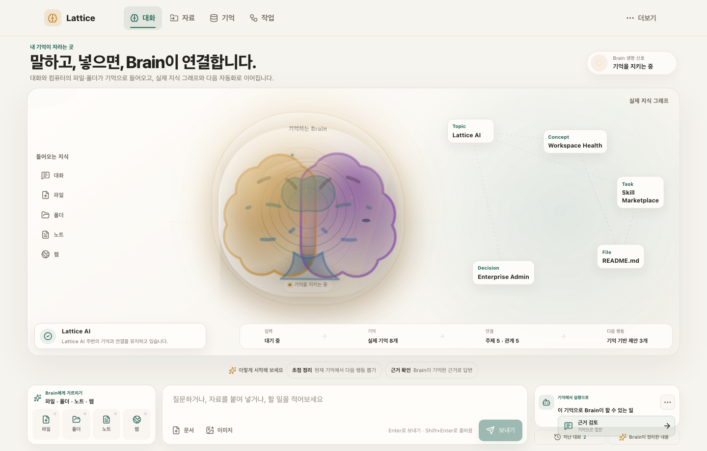
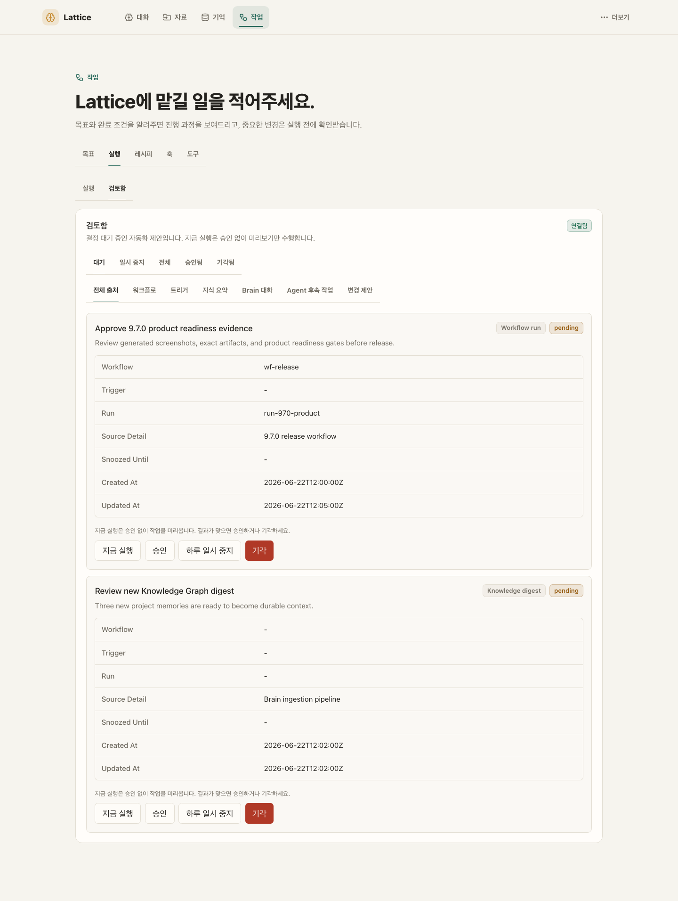
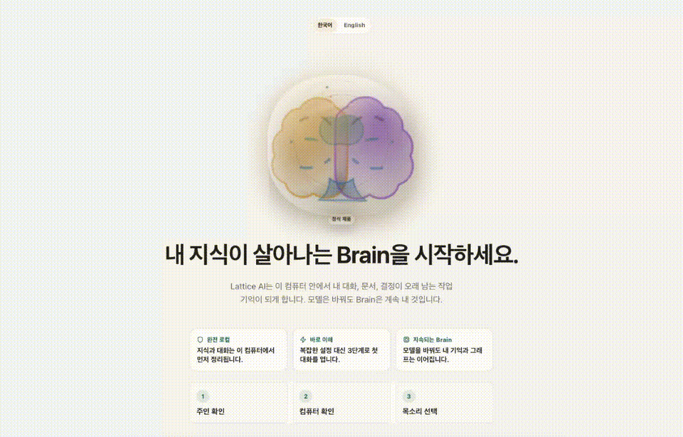

# Lattice AI

**Lattice AI 9.6.0 is the local-first Digital Brain platform. The Trusted Agent Loop makes autonomous work transparent and git-like: the reasoning loop reports every model call, format repair, and tool outcome; a deterministic evaluation harness gates every release on weak-model robustness; and change governance is proposal-first — creating new files is frictionless while edits and deletions of existing content become reviewable proposals you approve or reject before anything changes.**

**Lattice AI는 모델이 바뀌어도 내 지식과 맥락을 보존하는 로컬 우선 AI 브레인입니다.**

> The 9.6.0 release engineers trust into the agent loop: a structured
> LoopTrace makes every run observable (llm calls, parse recoveries, format
> repairs, corrections, tool outcomes — returned as `loop` in the agent API),
> weak-model tolerance gains python-literal repair and escalating format
> corrections, a deterministic agent evaluation harness gates CI, and a
> central change governor stages edits/deletions of existing files as review
> proposals (`/api/proposals`) applied exactly as reviewed — while new-file
> creation now runs without approval friction.
> The 9.5.0 release adds the Command Center: a deterministic, local
> `/api/command` surface serving a daily briefing (recent knowledge,
> conversation activity, automation state, pending reviews, health snapshot,
> top suggestions, state-derived quick actions) and a universal search across
> knowledge nodes, the user's own conversations, and installed automations —
> surfaced in the app as a Cmd+K command palette and a Today's Briefing panel.
> The 9.4.0 release adds question-driven automation: a deterministic local
> pattern miner clusters your recurring questions (the evidence shown is your
> own words, no model call), an /api/automation surface turns patterns and
> connected folders into one-click suggestions, and every accepted suggestion
> becomes a disabled, review-gated draft workflow you enable deliberately.
> The 9.3.0 release wired the previously dormant Brain quality layer into
> the product: /api/brain health diagnosis with recommended care actions, a
> proactive insights digest, contradiction surfacing across memories and the
> graph, dry-run-first duplicate consolidation, and hybrid recall that blends
> vector similarity with lexical evidence behind an honest quality gate.
> The 9.2.0 release hardened file creation end to end: chat file requests are
> routed to a deterministic direct-write path (including type-only requests
> like "html 파일 만들어줘"), model replies are treated as untrusted content
> and cleaned of fences, reasoning blocks, and chat framing, and the agent
> JSON loop tolerates small-model formatting slips instead of aborting.
> The 9.1.0 release added request-scoped model routing,
> workspace-isolated graph identities and frontend caches, fail-closed admin
> gates, SSRF-safe web capture, private local state permissions, and reproducible
> release/test isolation. The same release introduced a human-first UI:
> a visible knowledge journey from conversation or source capture into the
> living Brain, its real relationship graph, and memory-grounded automation;
> the empty Brain home now keeps that complete loop inside one viewport, with
> continuous vital motion and behavior-driven listening, recall, synthesis,
> and action states. Task navigation and technical detail stay calm and
> approachable.
> Telegram access requires an explicit chat allowlist and server session token;
> public invitation access uses signed, expiring authorization instead of a
> static cookie; and unknown or unreadable Knowledge Graph scope fails closed.

Your model is the voice you use today. Your Brain is the asset you keep.
Lattice AI preserves conversations, documents, decisions, project context,
relationships, and workflows on your computer by default. Cloud models, model
downloads, update checks, and other external communication happen only after
explicit consent.

It is not a ChatGPT clone, a model launcher, a graph database, or a note app.
It is a Living Brain: chatting or adding a file, folder, note, or web page grows
durable memory; the real graph shows how that knowledge connects; and reviewed,
user-enabled automations can act from the same evidence.

[](https://pypi.org/project/ltcai/)
[](https://www.npmjs.com/package/ltcai)
[](https://marketplace.visualstudio.com/items?itemName=parktaesoo.ltcai)
[](https://open-vsx.org/extension/parktaesoo/ltcai)
[](https://github.com/TaeSooPark-PTS/LatticeAI/actions/workflows/ci.yml)
[](LICENSE)

## Why You Need It

You need Lattice AI when:

- you ask different AI models about the same project and lose the context each time;
- your decisions are scattered across chats, notes, PDFs, folders, and tools;
- you want to switch models without rebuilding memory from zero;
- you want your AI Brain to stay on your computer by default;
- you want backup, restore, inspect, and export paths for your Brain.

이런 사람에게 필요합니다:

- 매번 AI를 바꿀 때마다 프로젝트 맥락을 다시 설명하는 사람
- 문서, 대화, 결정, 파일이 여기저기 흩어져 있는 사람
- 내 지식을 특정 AI 서비스 안에 묶어두고 싶지 않은 사람
- 로컬에 저장되는 개인 AI 브레인을 원하는 사람

## What You Can Do

- Chat with a Brain that remembers useful context instead of treating every
  session as disposable.
- Add documents, selected local folders, notes, screenshots, and web pages with
  source-aware memory.
- Watch new knowledge enter the Brain and appear in a lightweight, real
  relationship graph before opening the full graph explorer.
- See the Brain breathe, pulse, listen, recall, synthesize, and act while the
  source, graph, composer, and next memory-grounded action remain visible in a
  single desktop or mobile viewport.
- Create evidence-linked Brain automation drafts for memory digests, project
  reviews, and follow-up suggestions, then explicitly enable them when ready.
- Use a recommended local model without learning model internals first.
- Keep advanced controls, audit logs, roles, and retention in a separate Admin
  surface.
- Export or back up your Brain as an encrypted `.latticebrain` archive.

## One-Minute Flow

1. Launch the app and wake the Brain.
2. Create or open a local profile.
3. Let Lattice explain what this computer can run.
4. Start with the recommended model as the Brain's voice, or skip and choose later.
5. Talk to your Brain or add a file, folder, note, or web page.
6. Watch the source become memory and connect to the visible knowledge graph.
7. Ask, delegate, review, or explicitly enable a memory-grounded automation.
8. Back up, inspect, export, or restore the Brain when you need ownership actions.

## Living Brain Flow

The screenshots below are the latest checked-in visual evidence captures. They
keep the first-run Brain flow, memory graph, source capture, model library,
system view, admin console, and review center visible as release gates while
9.6.0 makes autonomous work trustworthy: agents create new things freely,
but every change to existing content becomes a reviewable proposal with a
diff, and the reasoning loop itself is observable and regression-gated. The
captures below are the checked-in 9.6.0 visual release evidence for that
product flow.

### 1. Wake Brain

The first screen makes the Brain the product. It explains the three-step path:
confirm owner, check the computer, choose the Brain voice.

### 2. Login

Choose the owner of the Brain. The profile is not a SaaS account by default; it
is the local identity for the knowledge you keep.



### 3. Recommended Models

Start with a short list: safest recommendation, faster model, stronger model.
Advanced details stay available without overwhelming first-time users.



### 4. Install And Load

Download and load only after consent. Lattice explains model size, local
execution, and network use before work starts.



### 5. Brain Chat

Talk normally or add a source from a single, living canvas. The default home
fits the complete knowledge lifecycle into one viewport: source controls feed
the breathing Brain, real nodes and animated relationships stay visible beside
it, and the composer plus grounded next action remain within reach. Brain motion
and its visible life signal follow real listening, recall, synthesis, and action
state. Detailed memory rings, provenance, conversation history, and
model/runtime proof open as overlays only when requested.



### 6. Review Center

Automation results are staged for review before they become durable decisions.
Snooze, unsnooze, run now, approve, and dismiss actions stay explicit.



## Brain Depths

The user travels inward from everyday memory to deeper structure:

| Level | User name | What the user gets |
| --- | --- | --- |
| Level 1 | Now memory | The living Brain presence and current conversation context |
| Level 2 | Older memory | Durable memories with source-aware recall |
| Level 3 | Topics | Recurring themes across chats and documents |
| Level 4 | Relationships | How decisions, people, files, and ideas connect |
| Level 5 | Full knowledge graph | Nodes, edges, search, and focused detail for advanced exploration |

Walkthrough:



Screenshot index and capture notes:
[output/release/v9.7.0/SCREENSHOT_INDEX.md](output/release/v9.7.0/SCREENSHOT_INDEX.md)

## Install

Run from Python:

```bash
pip install ltcai
LTCAI
```

Run from npm:

```bash
npm install -g ltcai
ltcai
```

Open the local app:

```text
http://127.0.0.1:4825/app
```

Apple Silicon local model extras:

```bash
pip install "ltcai[local]"
```

## Architecture At A Glance

- **Product category**: local-first Digital Brain.
- **Core capability**: private AI memory layer for conversations, documents,
  decisions, relationships, workflows, and project context.
- **UX metaphor**: a visible source-to-memory-to-graph-to-automation journey
  centered on the Living Brain, not a generic chat or operations dashboard.
- **Product navigation**: desktop task navigation and a mobile bottom bar expose
  Chat, Sources, Memory, and Work; model, workspace, and admin controls live in
  the secondary menu.
- **Desktop shell**: Tauri 2 starts a localhost sidecar.
- **Frontend**: React, TypeScript, Vite, TanStack Query, Zustand, Cytoscape.js,
  React Flow, and generated OpenAPI types.
- **Backend**: FastAPI on localhost is the UI source of truth.
- **Brain Core**: independent `lattice_brain` package for graph, memory,
  context, conversations, ingestion, runtime, workflow, storage, and portability.
- **Storage**: SQLite is the live local Brain store; PostgreSQL/pgvector tooling
  is optional scale-mode planning/migration support, not the default live graph
  backend.
- **Portability**: encrypted `.latticebrain` archives plus backup, restore,
  inspect, verify, import dry-run, and confirmed restore/import flows.
- **Trust boundary**: local-first by default; cloud calls, downloads, Telegram,
  Brain Network, Docker/Postgres setup, and update checks are opt-in.
- **Admin separation**: normal Brain use stays separate from users, audit logs,
  policies, security events, retention, and index rebuilds.

See [ARCHITECTURE.md](ARCHITECTURE.md) for the current architecture.

## Local Development

```bash
npm install
npm run dev
```

Main validation set:

```bash
npm run check:python
npm run lint
npm run typecheck
npm run test:unit
npm run test:integration
npm run test:visual
npm run desktop:tauri:check
npm run docs:check-links
```

`npm run lint` includes the Python Ruff baseline, frontend TypeScript lint
gate, visual smoke syntax checks, and i18n literal checks.

See [docs/DEVELOPMENT.md](docs/DEVELOPMENT.md) for developer workflow details.

## Current Release

The current release is **9.7.0 — Proactive Hybrid Brain**:

- Retrieval is unified: `KnowledgeGraphStore.hybrid_search()` fuses lexical
  and vector search in the graph layer itself (normalized scores, per-source
  provenance, rank fusion), degrades honestly to `lexical_only` when the
  vector index is unavailable, and `context_for_query()` can opt into it.
- The vector index stays in sync automatically: every successful ingest runs
  an incremental `index_node_incremental()` pass (opt-out via
  `LATTICEAI_AUTO_VECTOR_INDEX`), and failures downgrade to an explicit
  `pending` status that the next `rebuild_vector_index` picks up.
- Ingestion covers whole folders: `ingest_folder()` walks directories with
  `.latticeignore` support (gitignore-like globs), size/extension filters,
  and optional background scheduling; `ingest_web_page()` formalizes the
  web seam — fetching/parsing stays upstream, the graph receives clean text.
- The Brain is proactive in the graph layer: `lattice_brain/graph/proactive.py`
  finds duplicate and contradictory knowledge, produces a combined quality
  report with stale-node and edge-quality signals, and plans consent-first
  duplicate consolidation — surfaced at `GET /api/brain/duplicates`,
  `GET /api/brain/quality-report`, and the existing contradiction/consolidate
  endpoints.
- The change-governance loop is closed: Review Center approval now applies
  staged proposals through the single application path (no more
  status-only approvals), proposals carry tool/risk/change-class/conversation
  provenance, reject records a reason, and pending-proposal counts badge the
  review inbox.
- The agent evaluation gate grew to 12 scenarios, adding file-generation
  happy path and recovery, a 3-step multi-step workflow chain, and a
  governed-write proposal path that pins the approve()-excludes-governed-tools
  invariant.
- Engineering health: `SingleAgentRuntime.execute` decomposed into focused
  helpers, multi-agent/single-agent runtime consistency pinned by tests, all
  root legacy modules emit deprecation warnings pointing at their package
  homes, and `scripts/profile_kg.py` + `docs/PERFORMANCE.md` establish a
  measured KG performance baseline.

Expected artifacts for 9.7.0 release must use exact filenames:

- `dist/ltcai-9.7.0-py3-none-any.whl`
- `dist/ltcai-9.7.0.tar.gz`
- `ltcai-9.7.0.tgz`
- `dist/ltcai-9.7.0.vsix`
- `src-tauri/target/release/bundle/dmg/Lattice AI_9.7.0_aarch64.dmg`

Do not use wildcard artifact uploads. Package registry publishing remains owner-run.

See [docs/ROADMAP_RECOMMENDATIONS.md](docs/ROADMAP_RECOMMENDATIONS.md) for the
strategic roadmap slices applied through 9.7.0 and the follow-up tracks.

## Known Limitations

- External package registries are owner-published and can lag behind GitHub.
- PostgreSQL/pgvector is optional scale/migration tooling. SQLite remains the
  live local Brain store in 9.7.0.
- Docker, model downloads, cloud model calls, Telegram, Brain Network, and update
  checks require explicit user action.
- Conversation does not fabricate answers when no model is loaded.
- Agent/workflow simulation without a loaded LLM is deterministic and does not
  call a model; it is labeled as LLM-free/model-free rather than presented as
  autonomous model success.

## Release History

| Version | Theme |
| --- | --- |
| 9.7.0 | Proactive Hybrid Brain: graph-native hybrid lexical+vector retrieval with automatic incremental vector indexing, folder ingestion with `.latticeignore`, proactive duplicate/contradiction detection and quality reporting in the graph layer, and a fully closed proposal→Review Center→apply governance loop |
| 9.6.0 | Trusted Agent Loop: observable agent reasoning (LoopTrace + loop API payload), python-literal/fence/think weak-model repairs with escalating corrections, a deterministic CI agent-eval harness, and proposal-first change governance where edits/deletions of existing files become reviewable diffs |
| 9.5.0 | Command Center: a Cmd+K palette searching knowledge, conversations, automations, and pages in one query, plus a daily briefing with Brain state at a glance and state-derived one-click quick actions |
| 9.4.0 | Question-Driven Everyday Automation: the Brain mines recurring user questions and connected knowledge folders into one-click, consent-first automation suggestions installed as review-gated drafts |
| 9.3.0 | Proactive Brain Intelligence: the Brain diagnoses its own health, surfaces contradictions and stale knowledge, proposes consent-first duplicate consolidation, and recalls with hybrid lexical+semantic evidence behind an honest quality gate |
| 9.2.0 | Model-Agnostic File Generation: chat file requests always produce structurally valid files with any LLM via extraction, per-type validation, corrective retry, deterministic repair, inferred file targets, and a fault-tolerant agent JSON loop |
| 9.1.0 | Code Review Completion & Fail-Closed Runtime: all July 11 review findings closed across fail-closed security, typed runtime/model/chat boundaries, honest frontend failures and tests, and repository hygiene |
| 9.0.0 | Code Review Closure & Runtime Cleanup: July 8 code-review follow-ups fixed, chat/runtime reliability improved, duplicated utility surfaces consolidated, runtime audit append paths moved to JSONL, and release metadata/artifacts synchronized |
| 8.9.0 | Scoped Memory & Tool Policy Hardening: authenticated history/KG reads are workspace-scoped, direct Tool API paths enforce registry policy, local approvals hash tokens at rest, AgentRuntime approval semantics are explicit, and frontend/runtime seams are split |
| 8.8.0 | Brain Core Extraction & Recall Proof Hardening: internal-only Brain shim layers are removed, AgentRuntime run contracts/retry budgets are tighter, Brain Chat gains conversation controls, and citation recall exposes matched evidence |
| 8.7.0 | Runtime State Hygiene & Release Evidence Refresh: model-runtime internals prefer typed state over legacy globals, compatibility sync is deprecated, 8.7.0 visual evidence is refreshed, and all release metadata/docs are synchronized |
| 8.6.0 | Desktop Capture & Navigation Reliability: native folder selection works from the Tauri localhost app, picker failures surface in Capture, web saving remains one-action, and the Brain shell sidebar/admin flow is CI-covered |
| 8.5.0 | Tool Registry Readiness & Config DI: ToolRegistry drift removed, `tz_name` flows through central Config into automation runtimes, and current-release documentation is synchronized |
| 8.4.0 | Action-Aware Brain Chat: explicit file create/write/save/edit requests from Brain Chat route into the governed workspace file tool so files are actually created instead of returned as code-only answers |
| 8.3.0 | Orchestrated Brain Readiness: managed legacy shim inventory, stronger AgentRuntime/workflow boundaries, unified graph ingestion, workspace-safe duplicate content, first-run onboarding, and explicit community/plugin growth path |
| 8.2.0 | Brain Brief: evidence-backed home briefing, honest empty-state guidance, recall/graph/model-proof next actions, and continued model/workspace runtime extraction |
| 8.1.0 | Intuitive Brain Home: living Brain, recent memory, connected topic, next action, and composer are visible in one product-first screen with refreshed 8.1.0 evidence and artifacts |
| 8.0.0 | Runtime Architecture Contract: AgentRuntime, ToolRegistry, central Config, server decomposition, and KG hardening are captured as machine-checkable release boundaries with exact 8.0.0 artifacts |

## Documentation

- [docs/WHY_LATTICE.md](docs/WHY_LATTICE.md) - product philosophy.
- [docs/TRUST_MODEL.md](docs/TRUST_MODEL.md) - local-first trust model.
- [PRIVACY.md](PRIVACY.md) - privacy and external communication policy.
- [ARCHITECTURE.md](ARCHITECTURE.md) - current technical architecture.
- [FEATURE_STATUS.md](FEATURE_STATUS.md) - current feature status and known limitations.
- [docs/DEVELOPMENT.md](docs/DEVELOPMENT.md) - developer workflow.
- [docs/LEGACY_COMPATIBILITY.md](docs/LEGACY_COMPATIBILITY.md) - root legacy shim map.
- [RELEASE.md](RELEASE.md) - release guide and current release notes.
- [docs/CHANGELOG.md](docs/CHANGELOG.md) - historical changes.
- [SECURITY.md](SECURITY.md) - security posture.

## License

MIT. See [LICENSE](LICENSE).
