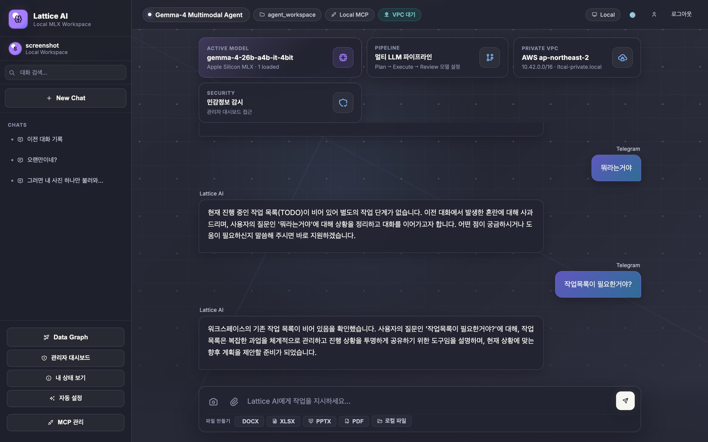
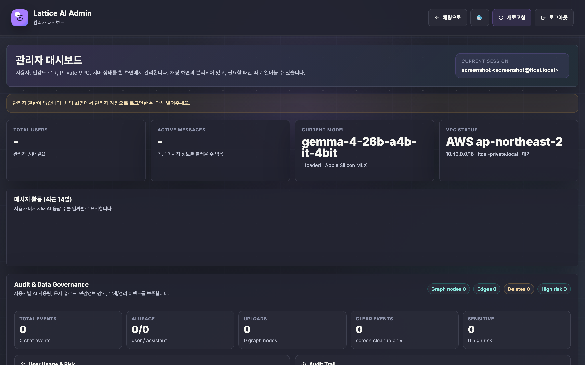
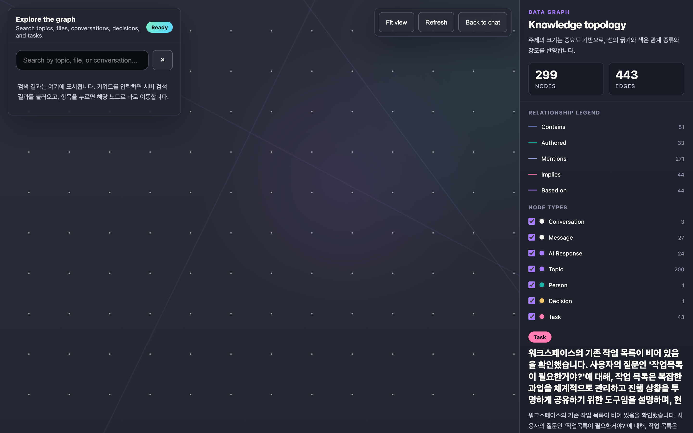

<div align="center">
  
  <br/>
  <strong>Your personal AI workspace server — local & cloud, one stack.</strong>
  <br/><br/>

[](https://pypi.org/project/ltcai/)
[](https://pypi.org/project/ltcai/)
[](https://www.npmjs.com/package/ltcai)
[](https://marketplace.visualstudio.com/items?itemName=parktaesoo.ltcai)
[](https://open-vsx.org/extension/parktaesoo/ltcai)
[](./LICENSE)
[](https://www.python.org/)

</div>

---

## What is Lattice AI?

**Lattice AI** is a self-hosted AI server that unifies local and cloud LLMs into one workspace — web chat, VS Code extension, Telegram bot, and MCP tools, all from a single `pip install`.

- 🖥️ **Web UI** — chat, file upload, admin dashboard, data graph
- 🧩 **VS Code / Cursor extension** — edit, explain, generate commands inline
- 📱 **Telegram bot** — access your AI from anywhere
- 🔌 **MCP server** — use Lattice tools inside Claude Desktop / Cursor
- 🔒 **Zero telemetry** — all data stays in `~/.ltcai/` on your machine

---

## 📸 Screenshots

<table>
<tr>
<td width="33%"><b>Chat UI</b><br/></td>
<td width="33%"><b>Admin Dashboard</b><br/></td>
<td width="33%"><b>Data Graph (Graph RAG)</b><br/></td>
</tr>
</table>

---

## ⚡ Quick Start (30 seconds)

```bash
# Install (cloud models)
pip install ltcai

# Install (+ Apple Silicon local models)
pip install "ltcai[local]"

# Start server
LTCAI
# → http://localhost:4825

# Start with public HTTPS tunnel (Cloudflare, no account needed)
LTCAI --tunnel
# → https://xxxx.trycloudflare.com
```

**First run:** open `http://localhost:4825` → sign up → first account auto-becomes admin → pick a model → start chatting.

---

## 🆚 Why Lattice AI?

| | Lattice AI | Open WebUI | Continue.dev | GitHub Copilot |
|---|:---:|:---:|:---:|:---:|
| Local model (offline, Apple Silicon) | ✅ | ✅ | ✅ | ❌ |
| Cloud models (OpenAI, Groq…) | ✅ | ✅ | ✅ | ✅ |
| VS Code extension | ✅ | ❌ | ✅ | ✅ |
| Telegram bot | ✅ | ❌ | ❌ | ❌ |
| Graph RAG (auto knowledge graph) | ✅ | ❌ | ❌ | ❌ |
| MCP registry & install | ✅ | ❌ | ✅ | ❌ |
| Admin dashboard + audit log | ✅ | ✅ | ❌ | ❌ |
| Self-hosted, zero telemetry | ✅ | ✅ | ✅ | ❌ |
| One-command public tunnel | ✅ | ❌ | ❌ | ❌ |
| Free | ✅ | ✅ | ✅ | ❌ |

---

## 🧠 Supported Models

**Local — Apple Silicon only (MLX):**

| Model | Best for | Size |
|-------|----------|------|
| `mlx-community/gemma-4-26b-a4b-it-4bit` | General / coding | ~14 GB |
| `mlx-community/Qwen2.5-Coder-32B-Instruct-4bit` | Coding | ~18 GB |
| `mlx-community/DeepSeek-R1-0528-4bit` | Reasoning | ~38 GB |
| `mlx-community/Phi-4-4bit` | Coding (fast) | ~8 GB |

**Cloud (any platform):**
OpenAI · Groq · Together · OpenRouter · any OpenAI-compatible endpoint

---

## ✨ Features

| Feature | Description |
|---------|-------------|
| **Web UI** | Responsive chat + admin panel + graph visualisation |
| **Auto Setup Wizard** | Detects → downloads → installs → verifies → repairs dependencies |
| **VS Code / Cursor** | Chat panel, Edit Selection, Explain, Generate command |
| **Telegram bot** | Local AI mirror + cloud Codex bot |
| **MCP server** | Use Lattice tools in Claude Desktop / Cursor |
| **MCP registry** | One-click install from registry.modelcontextprotocol.io |
| **Skills marketplace** | 77 official skills (Anthropic + Adobe · Airtable · Auth0 · Pydantic) |
| **Plugin directory** | Browse 149 open-source plugins |
| **Graph RAG** | Chat & docs auto-indexed as SQLite knowledge graph |
| **Multi-step agent** | File edit/create, grep, todo, terminal (25 steps) |
| **Multi-LLM pipeline** | Plan → Execute → Review with different models |
| **Human-in-the-loop** | Approve agent plan before execution |
| **Audit dashboard** | Per-user AI usage, sensitive data detection, event log |
| **PWA** | Install on iPad / Android home screen |
| **SSO** | Entra ID / Okta OIDC |

---

## 🖥️ Platform Support

| Feature | macOS Apple Silicon | macOS Intel / Windows / Linux |
|---------|:---:|:---:|
| Web UI + cloud models | ✅ | ✅ |
| VS Code / Cursor extension | ✅ | ✅ |
| Telegram bot | ✅ | ✅ |
| MLX local models | ✅ | ❌ |
| Ollama / LM Studio / vLLM | ✅ | ✅ |

---

## 🛠️ Setup & Usage

### Install & run

```bash
# Verify everything is ready
LTCAI doctor

# Run with cloud API key
OPENAI_API_KEY=sk-... LTCAI

# Run with local MLX model (Apple Silicon)
LATTICEAI_MODE=local \
LATTICEAI_LOCAL_MODEL=mlx-community/gemma-4-26b-a4b-it-4bit \
LTCAI
```

### VS Code extension

1. VS Code → Extensions → search `ltcai` → Install
2. `Cmd+Shift+A` — open chat panel (auto-connects to `localhost:4825`)

| Shortcut | Action |
|----------|--------|
| `Cmd+Shift+A` | Open chat |
| `Cmd+Shift+E` | Edit selected code |
| `Cmd+Shift+M` | Load / switch model |
| Right-click | Explain / Save to Knowledge Garden |

### Telegram bot

```bash
LATTICEAI_TELEGRAM_BOT_TOKEN=your-token LTCAI
```

### Public server (Render / Fly.io / Docker)

```bash
LATTICEAI_MODE=public \
LATTICEAI_PUBLIC_MODEL=openai:gpt-4o-mini \
OPENAI_API_KEY=sk-... \
LATTICEAI_INVITE_CODE=my-secret \
LTCAI
```

```bash
# Docker
docker build -t lattice-ai .
docker run --rm -p 4825:4825 \
  -e OPENAI_API_KEY="$OPENAI_API_KEY" \
  -e LATTICEAI_INVITE_CODE="my-secret" \
  -v "$PWD/.data:/data" \
  lattice-ai
```

---

## 🔒 Security

| Property | Detail |
|----------|--------|
| Binding | Default `127.0.0.1:4825` — local only |
| Auth | Session required when network-exposed or public mode |
| Cookies | `HttpOnly + SameSite=Lax` — no localStorage token |
| Local file access | Approval-token gated (path + user + action scope) |
| CORS | Localhost only by default; add origins via `LATTICEAI_CORS_ALLOWED_ORIGINS` |
| File upload | Magic-number signature check (blocks extension spoofing) |
| Rate limits | `/chat` 30/min · `/agent` 6/min · `/upload` 12/min per user |
| Telemetry | None — all data in `~/.ltcai/` |

Report vulnerabilities: [SECURITY.md](SECURITY.md)

---

## 🗂️ API Reference

| Method | Path | Description |
|--------|------|-------------|
| GET | `/health` | Server status & current model |
| GET | `/models` | Model list + load state |
| POST | `/models/load` | Load a model |
| POST | `/chat` | Chat (`stream=true/false`) |
| POST | `/agent` | Multi-step file agent |
| GET | `/mcp/installed` | Installed MCP servers |
| POST | `/mcp/install` | Install MCP server |
| GET | `/skills/marketplace` | Skills marketplace |
| POST | `/skills/install` | Install a skill |
| GET | `/plugins/directory` | Plugin directory |
| GET | `/permissions/pending` | Pending file-access approvals (admin) |
| POST | `/permissions/approve/{token}` | Approve file access (admin) |

Full reference: [docs/mcp-tools.md](docs/mcp-tools.md)

---

## 🔧 Troubleshooting

| Symptom | Cause | Fix |
|---------|-------|-----|
| Port 4825 in use | Previous process | `lsof -i :4825` → `kill <PID>` or `--port 4826` |
| `ModuleNotFoundError: mlx` | MLX not installed | `pip install "ltcai[local]"` (Apple Silicon only) |
| Python < 3.11 | Version mismatch | Upgrade: `python3 --version` |
| `LTCAI doctor` OPTIONAL | Optional dep missing | Safe to ignore if feature not needed |
| No API key warning | Cloud model not set | `OPENAI_API_KEY=sk-... LTCAI` or set in admin panel |
| Can't reach from iPad | Default bind 127.0.0.1 | `LATTICEAI_HOST=0.0.0.0 LTCAI` or use `--tunnel` |

---

## 🚀 Auto-start (Mac)

```bash
cat > ~/Library/LaunchAgents/com.ltcai.plist << 'EOF'
<?xml version="1.0" encoding="UTF-8"?>
<!DOCTYPE plist PUBLIC "-//Apple//DTD PLIST 1.0//EN" "http://www.apple.com/DTDs/PropertyList-1.0.dtd">
<plist version="1.0">
<dict>
  <key>Label</key><string>com.ltcai</string>
  <key>ProgramArguments</key><array><string>/usr/local/bin/LTCAI</string></array>
  <key>RunAtLoad</key><true/>
  <key>KeepAlive</key><true/>
  <key>StandardOutPath</key><string>/tmp/ltcai.log</string>
  <key>StandardErrorPath</key><string>/tmp/ltcai.err</string>
</dict>
</plist>
EOF
launchctl load ~/Library/LaunchAgents/com.ltcai.plist
```

Or: `./start_ai.sh` (auto-restart + caffeinate)

---

## 📦 Distribution

| Channel | Link |
|---------|------|
| PyPI | [pypi.org/project/ltcai](https://pypi.org/project/ltcai/) |
| npm | [npmjs.com/package/ltcai](https://www.npmjs.com/package/ltcai) |
| VS Code Marketplace | [marketplace.visualstudio.com](https://marketplace.visualstudio.com/items?itemName=parktaesoo.ltcai) |
| Open VSX | [open-vsx.org](https://open-vsx.org/extension/parktaesoo/ltcai) |

Current version: **0.1.22** — [Changelog](docs/CHANGELOG.md)

---

## 🤝 Contributing

See [CONTRIBUTING.md](CONTRIBUTING.md). All PRs welcome.

## 📄 License

MIT — [TaeSoo Park](https://github.com/TaeSooPark-PTS)

---

<details>
<summary>한국어 안내 (Korean)</summary>

## 한국어 안내

**Lattice AI**는 로컬/클라우드 LLM을 웹 UI · VS Code 확장 · Telegram 봇 · MCP 도구로 하나의 서버에서 운영하는 개인 AI 워크스페이스입니다.

### 설치

```bash
pip install ltcai                    # 클라우드 모델
pip install "ltcai[local]"           # + Apple Silicon MLX 로컬 모델
LTCAI                                # 서버 실행 → http://localhost:4825
LTCAI --tunnel                       # + Cloudflare 공개 URL 자동 발급
```

### 주요 기능

- 웹 UI 채팅 + 어드민 대시보드 + Data Graph 시각화
- VS Code / Cursor 확장 (`Cmd+Shift+A`)
- Telegram 봇 연동
- MCP 레지스트리 & Skills 마켓플레이스
- Graph RAG — 채팅·문서를 SQLite 지식 그래프로 자동 구조화
- 멀티 LLM 파이프라인 (Plan → Execute → Review)
- Human-in-the-loop 에이전트 승인
- 감사 로그 & 데이터 거버넌스 대시보드
- 텔레메트리 없음 — 모든 데이터 로컬 저장

### 추천 로컬 모델 (M-series Mac)

| 모델 | 용도 | 크기 |
|------|------|------|
| `mlx-community/gemma-4-26b-a4b-it-4bit` | 범용 | ~14GB |
| `mlx-community/Qwen2.5-Coder-32B-Instruct-4bit` | 코딩 | ~18GB |
| `mlx-community/DeepSeek-R1-0528-4bit` | 추론 | ~38GB |

자세한 내용: [docs/CHANGELOG.md](docs/CHANGELOG.md) · [보안](SECURITY.md) · [기여](CONTRIBUTING.md)

</details>
