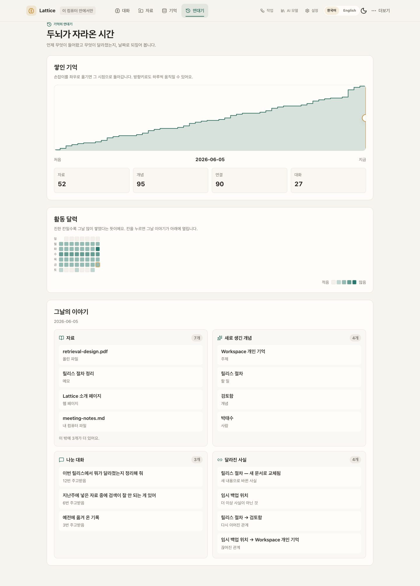
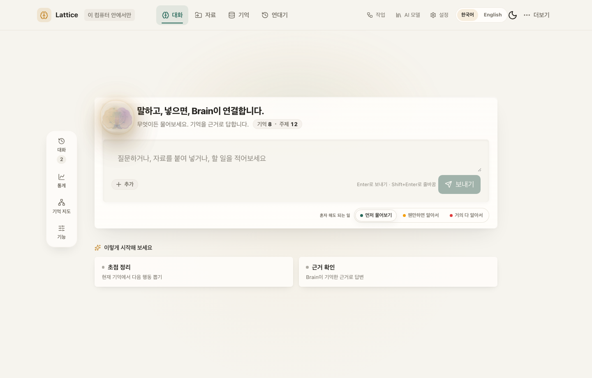
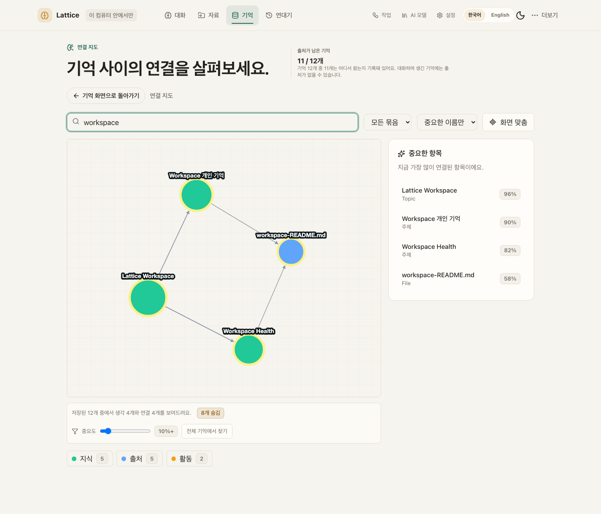
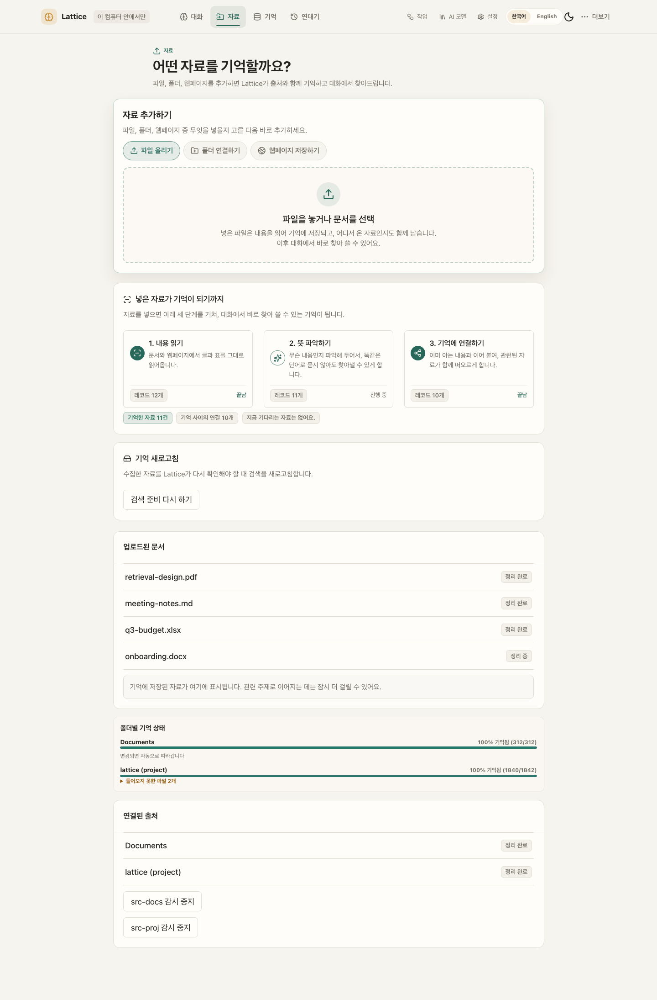
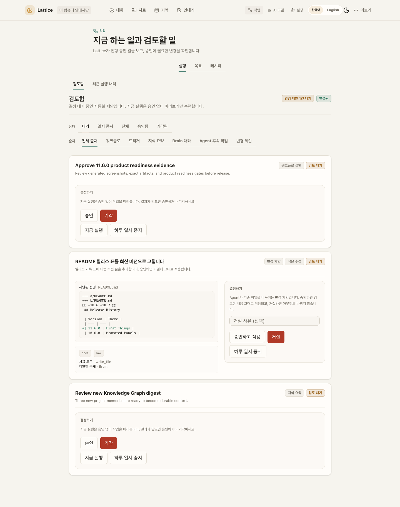
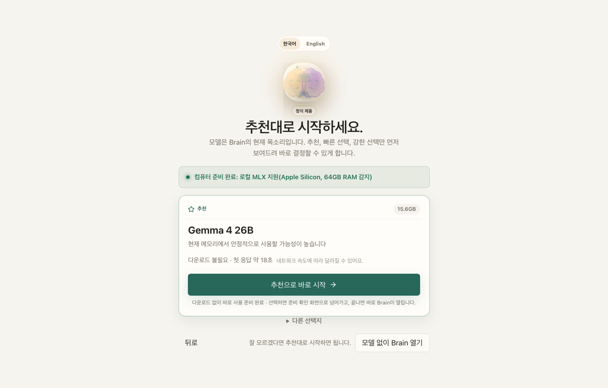
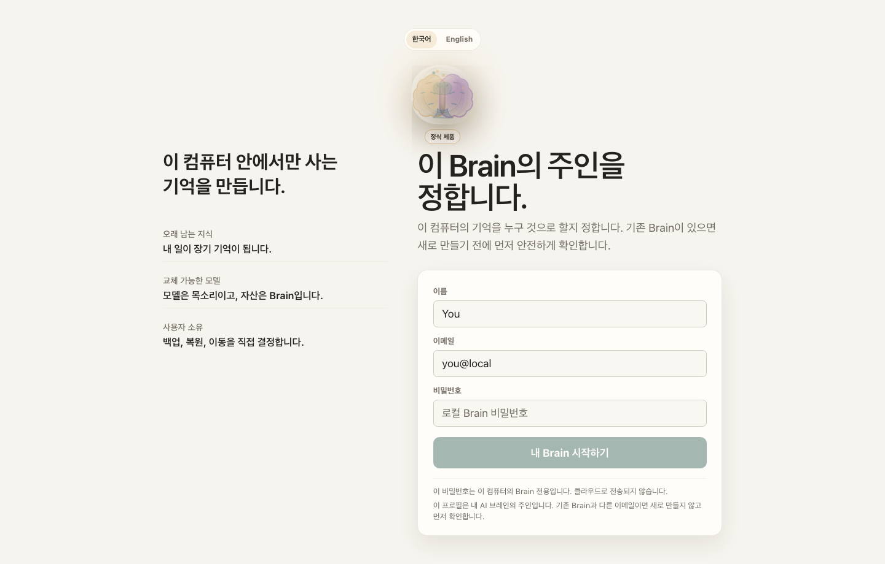
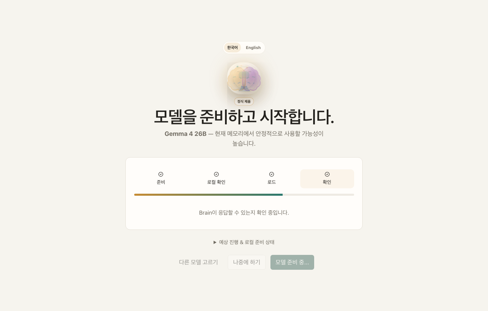

# Lattice AI

**Your model is the voice you use today. Your Brain is the asset you keep.**

**모델은 갈아타도, 내 지식은 내 컴퓨터에 남는 로컬 우선 AI 브레인.**

[](https://pypi.org/project/ltcai/)
[](https://www.npmjs.com/package/ltcai)
[](https://marketplace.visualstudio.com/items?itemName=parktaesoo.ltcai)
[](https://open-vsx.org/extension/parktaesoo/ltcai)
[](https://github.com/TaeSooPark-PTS/LatticeAI/actions/workflows/ci.yml)
[](LICENSE)


Chat, files, folders, notes, and web pages all flow into one durable knowledge
graph on your computer. Any model — local MLX or cloud — can speak with that
memory. Nothing leaves your machine without explicit consent.

대화·파일·폴더·웹페이지가 전부 내 컴퓨터 안의 지식 그래프로 쌓이고, 어떤
모델이든 그 기억을 이어받아 대화합니다.

## What You Can Do

| | |
| --- | --- |
| **See your Brain's story in time** — a growth curve, an activity heatmap, and each day's story, rewindable to any past moment  | **Chat with a Brain that remembers** — every conversation grows durable, source-linked memory  |
| **See how knowledge connects** — a real relationship graph, not a file list  | **Capture anything** — files, whole folders, notes, screenshots, web pages  |
| **Automate with review** — agent changes become proposals you approve first  | **Pick a model in one click** — recommended local models for your hardware  |
| **Watch a file become memory** — three named steps, not a pipeline diagram  | **Say how much it may do alone** — one dial in plain words; dangerous actions stay blocked either way  |

## Why Lattice AI

- **Own your memory** — knowledge lives in a local SQLite Brain you can back up,
  export, inspect, and restore (`.latticebrain` encrypted archive).
- **Model-independent** — switch between local MLX models and cloud models
  without rebuilding context from zero.
- **Honest by design** — the Brain tells you when retrieval context is limited,
  when captured pages extracted poorly, and when the vector index is catching up.
- **Safe automation** — automations are consent-first drafts; edits to existing
  content always pass through a reviewable proposal with a diff.

매번 AI에게 프로젝트 맥락을 다시 설명하고 있다면, 지식이 여러 서비스에 흩어져
있다면, 그 기억을 특정 회사가 아니라 내가 소유하고 싶다면 — Lattice AI가 그
브레인입니다.

## Quick Start

```bash
pip install ltcai        # or: npm install -g ltcai
LTCAI                    # then open http://127.0.0.1:4825/app
```

Apple Silicon local models: `pip install "ltcai[local]"`. Desktop app (Tauri)
ships as a dmg on each [GitHub Release](https://github.com/TaeSooPark-PTS/LatticeAI/releases).

First-run flow — wake the Brain, pick the owner, load a recommended model:

| | | |
| --- | --- | --- |
|  |  |  |

Screenshot index and capture notes:
[output/release/v11.6.0/SCREENSHOT_INDEX.md](output/release/v11.6.0/SCREENSHOT_INDEX.md)

## Current Release

The current release is **11.6.0 — One Door**:

The product now has one front door, and it is Rust. `lattice-host` serves
**420 operations across 41 route families** at the paths they always had,
and the Python package is no longer a web application at all — it is a
pure-compute **AI worker** with **28 routes**: LLM inference and streaming,
embedding, extraction, parsing, four document renderers, speech-to-text,
multimodal description, the model and engine catalog, `sysinfo`, and
`/health`. Nine crates hold the product; the door forwards exactly the 28
and answers `404 {"detail":"Not Found"}` for anything else, from a
committed allowlist that a drift gate regenerates and compares.

- **Every write is native.** The knowledge-graph write engine moved into
  `lattice-core`: ingest, curation, provenance, taxonomy and the vector
  queue. It is held to Python's bytes by a **32-step row-parity battery**
  that dumps every table after every step with zero tolerated differences,
  and by a schema comparison over all **67 objects** in `sqlite_master`
  (indexes and FTS shadow tables included). Seventeen graph tables changed
  owner from the worker to Rust, and the single-writer invariant is now a
  test rather than a convention.
- **The surface is replayed, not re-described.** **1,487 recorded HTTP
  cases** across twelve committed fixture files — captured from the real
  Python app while it still served them — are replayed against the native
  routes, status line and body compared. The retrieval, chunking, agent
  kernel and agent-loop golden families are unchanged and still green.
- **298 Python files and 73,617 lines were deleted.** What remains is 127
  files and about 20,900 lines, all of it compute, at **100.00% statement
  and branch coverage** with `fail_under=100` and no new pragmas.
- **What the port found.** The Python oracle's own bugs are documented
  rather than smoothed over: four graph-write divergences (a `kgv2_*` view
  that updates `type` on conflict where `nodes` does not; two writers that
  serialise without `sort_keys`; a hash computed from CPython's default
  JSON separators), a documented redaction rule that never fired, and a
  change-proposal kind whitelist that could never approve a folder
  reorganization. Three known-wrong behaviours were ported **as they are**
  so the surface does not change under users mid-release — they are listed
  in [RELEASE_NOTES_v11.6.0.md](RELEASE_NOTES_v11.6.0.md).
- **What was removed, and why.** The **Telegram bridge** is gone: it lived
  in the platform code that became the worker, and a bridge with no product
  server to bridge to is not a feature. **SSO/OIDC login and callback
  flows** are gone with it — the configuration surface remains, and
  password login is native. Both are consequences of the worker boundary,
  not decisions taken on their own merits.

Full disclosure of gaps, ported bugs and removed surfaces:
[RELEASE_NOTES_v11.6.0.md](RELEASE_NOTES_v11.6.0.md)

Expected artifacts for 11.6.0 release must use exact filenames:

- `dist/ltcai-11.6.0-py3-none-any.whl`
- `dist/ltcai-11.6.0.tar.gz`
- `ltcai-11.6.0.tgz`
- `dist/ltcai-11.6.0.vsix`
- `src-tauri/target/release/bundle/dmg/Lattice AI_11.6.0_aarch64.dmg`

Do not use wildcard artifact uploads. Package registry publishing remains owner-run.

Release notes: [RELEASE.md](RELEASE.md) · Full history: [docs/CHANGELOG.md](docs/CHANGELOG.md)

## Architecture At A Glance

One Rust server on localhost is the source of truth: `lattice-host` answers
every product route, owns every write to the Brain, and supervises a Python
**AI worker** it reaches over loopback for the things a model does — inference,
embedding, extraction, parsing, rendering, speech-to-text. The React/Vite
frontend and the Tauri desktop shell sit on top of that one door. Local-first
by default — cloud model calls, downloads, Brain Network, and update checks are
opt-in.

See [ARCHITECTURE.md](ARCHITECTURE.md) for details and
[docs/DEVELOPMENT.md](docs/DEVELOPMENT.md) for the developer workflow
(`npm install && npm run dev`, validation via `npm run lint`,
`npm run test:unit`, `npm run test:visual`).

## Known Limitations

- External package registries are owner-published and can lag behind GitHub.
- SQLite is the live local Brain store. The optional PostgreSQL/pgvector
  migration tooling is not part of the 11.6.0 worker.
- Docker, model downloads, cloud model calls, Brain Network, and update checks
  require explicit user action.
- **The Telegram bridge was removed in 11.6.0** — it lived in the platform code
  that became the AI worker. **SSO/OIDC login and callback flows were removed
  with it**; the configuration surface remains and password login is native.
- Conversation does not fabricate answers when no model is loaded. Agent and
  workflow simulation without a loaded LLM is deterministic and LLM-free (it
  does not call a model) — labeled as such, never presented as autonomous
  model success.
- `POST /worker/render/pdf` ships working out of the box: `reportlab` is a
  required dependency as of 11.6.0 (it used to be an undeclared lazy import
  that raised a 500; `ltcai[pdf]` remains as an empty alias for older
  install instructions).
- Known gaps carried openly into this release — upload extraction enrichment is
  UTF-8-text only, supplied vectors cover the primary ingest node, and the
  pointer-control tools still execute in the worker — are listed with their
  reasons in [RELEASE_NOTES_v11.6.0.md](RELEASE_NOTES_v11.6.0.md).

## Release History

Public history starts at 11.0.0. 11.6.0 rebuilt the product server in Rust and
reduced the Python package to an AI worker, so a 10.x or 9.x install is a
different program; `SECURITY.md` supports only 11.x, and this table states the
same boundary. Earlier notes stay in the tree as `RELEASE_NOTES_v*.md` files.

| Version | Theme |
| --- | --- |
| 11.6.0 | One Door |
| 11.5.2 | Tight Ship |
| 11.5.1 | Rust Full Loop |
| 11.5.0 | Rust Complete |
| 11.4.0 | Rust Foundation |
| 11.3.0 | Time Remembers |
| 11.2.0 | All Systems On |
| 11.1.0 | Product Intelligence |
| 11.0.1 | Both Branches |
| 11.0.0 | Full Measure |

Per-release details: [RELEASE_NOTES.md](RELEASE_NOTES.md)
