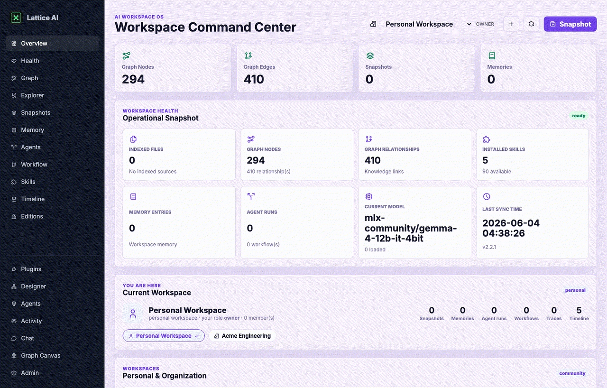
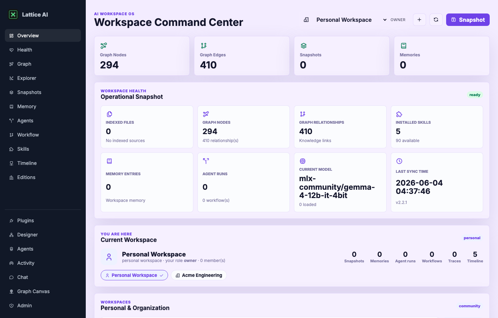
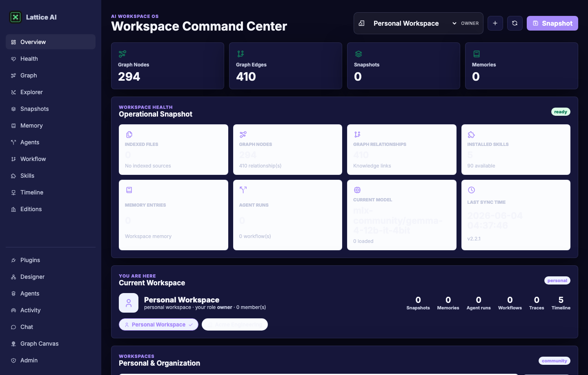
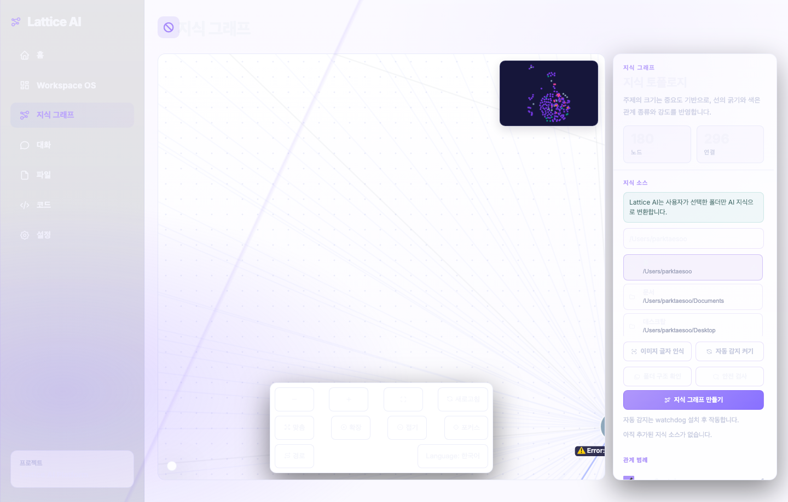
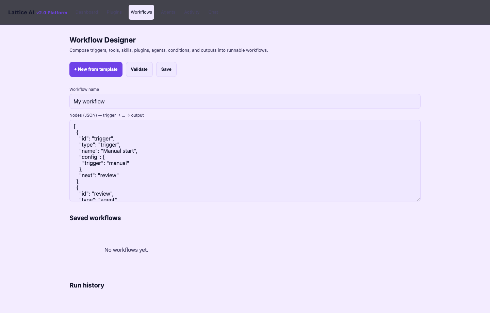
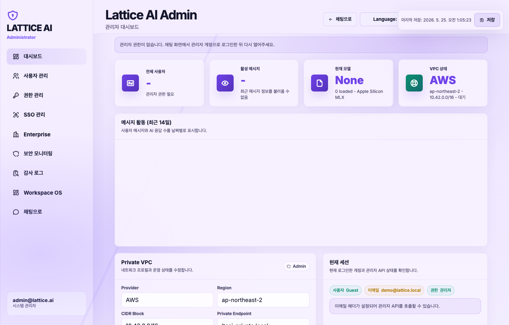
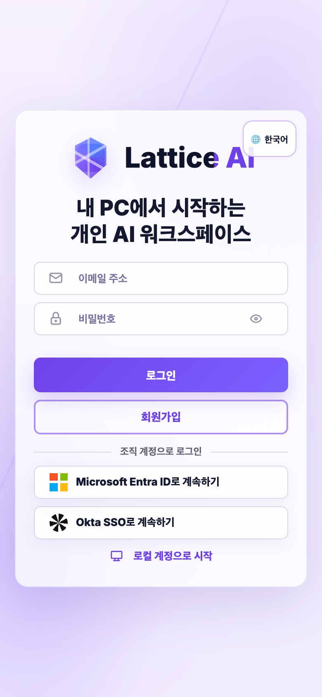

<div align="center">
  

  # Lattice AI

  **Local-first AI workspace for knowledge graphs, AI pipelines, and multi-agent coding workflows.**

  Plan, execute, review, and remember work across local models, cloud models,
  files, and team workflows.
</div>

<div align="center">

[](https://pypi.org/project/ltcai/)
[](https://www.npmjs.com/package/ltcai)
[](https://marketplace.visualstudio.com/items?itemName=parktaesoo.ltcai)
[](https://open-vsx.org/extension/parktaesoo/ltcai)
[](https://github.com/TaeSooPark-PTS/LatticeAI/releases/tag/v2.2.1)
[](LICENSE)
[](https://www.python.org/)
[](https://marketplace.visualstudio.com/items?itemName=parktaesoo.ltcai)

</div>



## Install

Install the local workspace:

```bash
pip install ltcai
```

Add Apple Silicon local model support:

```bash
pip install "ltcai[local]"
```

Install the npm CLI:

```bash
npm install -g ltcai
```

Install the coding extension:

- [VS Code Marketplace: parktaesoo.ltcai](https://marketplace.visualstudio.com/items?itemName=parktaesoo.ltcai)
- [Open VSX: parktaesoo.ltcai](https://open-vsx.org/extension/parktaesoo/ltcai)
- [GitHub Release v2.2.1](https://github.com/TaeSooPark-PTS/LatticeAI/releases/tag/v2.2.1)

## Quick Start

Start the workspace:

```bash
LTCAI
```

Then open:

```text
http://127.0.0.1:4825
```

Development checkout:

```bash
npm install
npm run dev
```

Useful validation commands:

```bash
npm run check:python
npm run test:unit
npm run build
```

## What Is Lattice AI?

Lattice AI is a local-first AI workspace for people and teams who want their
files, models, graph context, and agent workflows in one place.

- **Local-first AI Workspace**: work starts on your machine, with local data and
  workspace state by default.
- **AI Pipeline Platform**: plan, execute, review, retry, and replay work across
  local models, cloud models, tools, files, and generated artifacts.
- **Knowledge Graph Platform**: documents, images, screenshots, notes,
  conversations, and decisions become linked entities, relationships, evidence,
  and reusable context.
- **Multi-Agent Workflow Platform**: agents hand off structured context, review
  work, retry with reasons, and keep timelines inspectable.
- **Personal / Organization Workspace**: move between personal work and team
  workspaces with role-aware views.
- **Local Model Management**: choose current multimodal local models with source
  disclosure, hardware-aware recommendations, and cloud fallback options.
- **SSO for teams**: organization workspaces can be paired with Okta or
  Microsoft Entra ID patterns for team access.

## Why Lattice AI?

Most AI tools split your work across a chat window, a model picker, loose files,
and disconnected automations. Lattice AI keeps those parts together:

- files and conversations become graph context;
- graph context feeds pipelines and coding actions;
- model cards disclose country, company, run mode, internet usage, and model
  identity;
- personal and organization workspaces keep team workflows separate from local
  work;
- multi-agent workflows leave behind replayable plans, reviews, retries, and
  outcomes.

## v2.2.1 Highlights

- Mobile-first responsive UI for phone, tablet, laptop, desktop, ultrawide, and
  4K layouts.
- Light/Dark themes via design tokens.
- Zero `!important` CSS in the theme system.
- Keyboard-safe chat composer with mobile viewport handling.
- Knowledge Graph responsive UX with resize fit, zoom controls, fullscreen,
  minimap, filters, and mobile graph/card views.
- Admin table mobile card layout.
- Drag-and-drop and screenshot paste file attachment.
- Model cards with source disclosure.

## Screenshots

### Workspace





### Knowledge Graph



### AI Pipeline



### Admin Dashboard



### Mobile Responsive



## Knowledge Graph Flow

```text
files / documents / images / screenshots / conversations / decisions
  -> multimodal understanding
  -> entity and relationship extraction
  -> evidence and artifact storage
  -> Knowledge Graph update
  -> AI pipeline context
  -> coding actions / analysis / documents / team workflows
```

The graph keeps useful workspace context available even when you change models.

## Local Model Policy

Lattice AI recommends current-generation multimodal models for local use and
keeps local model choices explicit.

| Family | Default role | Example recommendation |
| --- | --- | --- |
| Gemma 4 | Default Google multimodal family | `mlx-community/gemma-4-12b-it-4bit` |
| Gemma 4 large | Higher-quality local multimodal work | `mlx-community/gemma-4-31b-it-4bit` |
| Qwen3-VL | Smaller, balanced multimodal options | `mlx-community/Qwen3-VL-4B-Instruct-4bit` |
| Llama 4 | Meta multimodal option | `mlx-community/Llama-4-Scout-17B-16E-Instruct-4bit` |

Every recommended model card shows maker country, maker company, run mode,
internet requirement, and model name. See [MODEL_POLICY.md](MODEL_POLICY.md).

## Architecture

```text
Personal / Organization Workspace
  -> files, chats, screenshots, model choices, workflow events
  -> Knowledge Graph
  -> AI Pipeline
  -> Multi-Agent Workflow
  -> coding actions, documents, analysis, team handoffs
```

Core areas:

- FastAPI local workspace app
- Knowledge Graph storage and graph APIs
- AI pipeline and workflow designer
- Multi-agent handoff, review, retry, and replay records
- Local model management and model recommendation catalog
- VS Code / Cursor / VSCodium extension surface
- Personal and organization workspace boundaries

## Documentation

- [ARCHITECTURE.md](ARCHITECTURE.md) — workspace, graph, pipeline, and model-management overview
- [docs/architecture.md](docs/architecture.md) — full architecture reference
- [PROJECT_PRINCIPLES.md](PROJECT_PRINCIPLES.md) — product principles
- [AI_PHILOSOPHY.md](AI_PHILOSOPHY.md) — how AI is used in the workspace
- [MODEL_POLICY.md](MODEL_POLICY.md) — local model recommendation policy
- [KNOWLEDGE_GRAPH.md](KNOWLEDGE_GRAPH.md) — graph model and behavior
- [docs/MULTI_AGENT_RUNTIME.md](docs/MULTI_AGENT_RUNTIME.md) — multi-agent workflow runtime
- [docs/WORKFLOW_DESIGNER.md](docs/WORKFLOW_DESIGNER.md) — AI pipeline designer
- [docs/REALTIME_COLLABORATION.md](docs/REALTIME_COLLABORATION.md) — realtime workspace events
- [docs/ENTERPRISE.md](docs/ENTERPRISE.md) — organization workspaces and SSO
- [docs/PLUGIN_SDK.md](docs/PLUGIN_SDK.md) — plugin SDK
- [RELEASE_NOTES.md](RELEASE_NOTES.md) and [docs/CHANGELOG.md](docs/CHANGELOG.md)

## Release history

| Version | Theme |
| --- | --- |
| **2.2.1** | Frontend and UX overhaul for responsive workspace, themes, graph UX, admin reflow, and file attachment |
| 2.2.0 | Multimodal-first Knowledge Graph and local model source disclosure |
| 2.1.0 | Multi-agent workflow maturity |
| 2.0.0 | AI pipeline, workflow, and plugin platform foundation |
| 1.7.0 | Graph and collaboration |
| 1.6.0 | Product experience deepening |

## License

MIT
