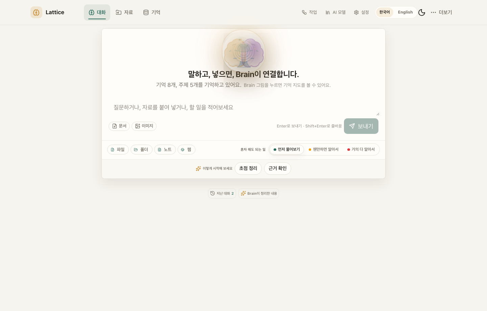
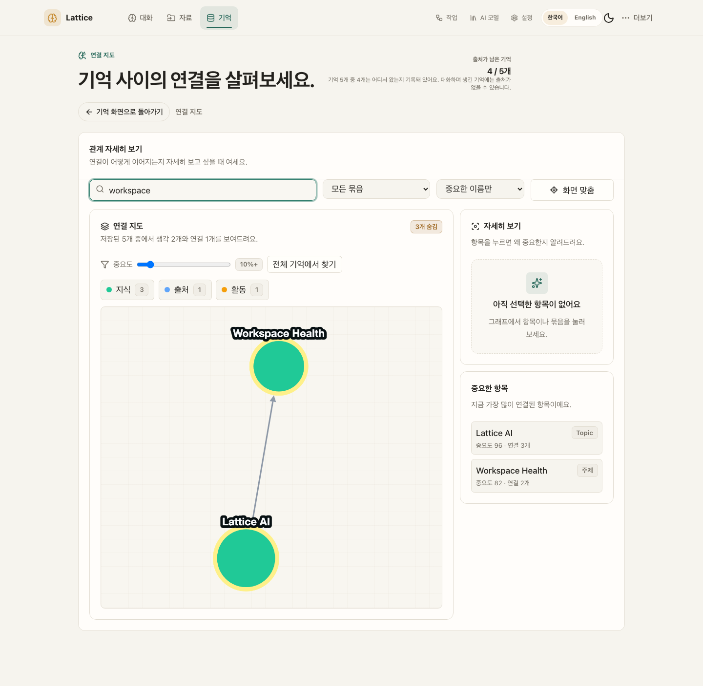
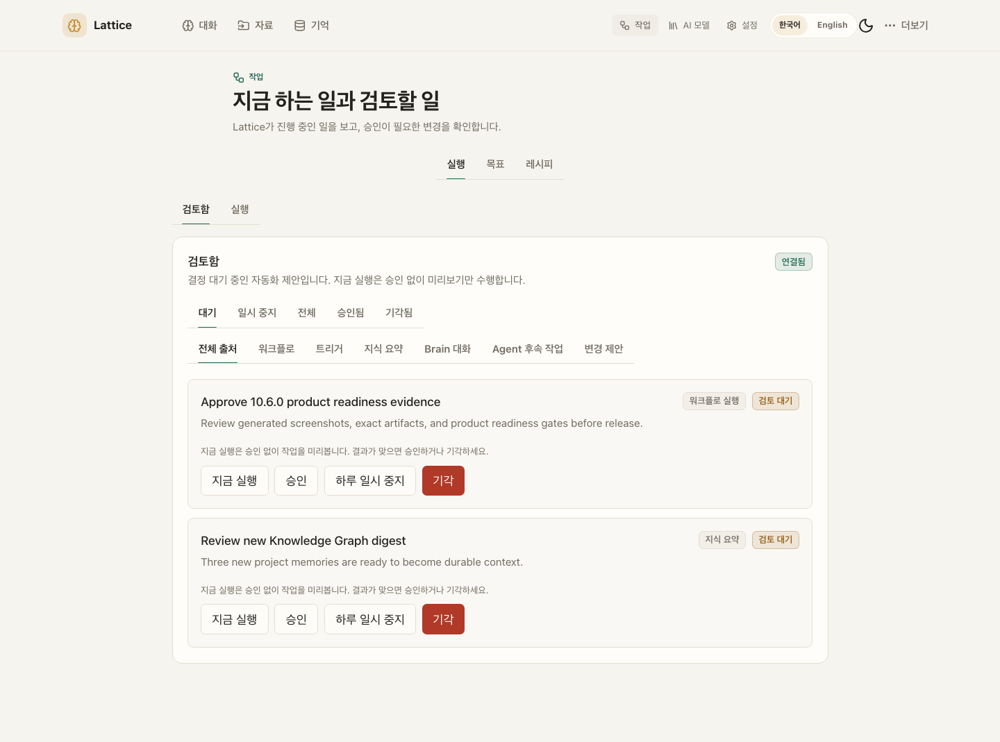
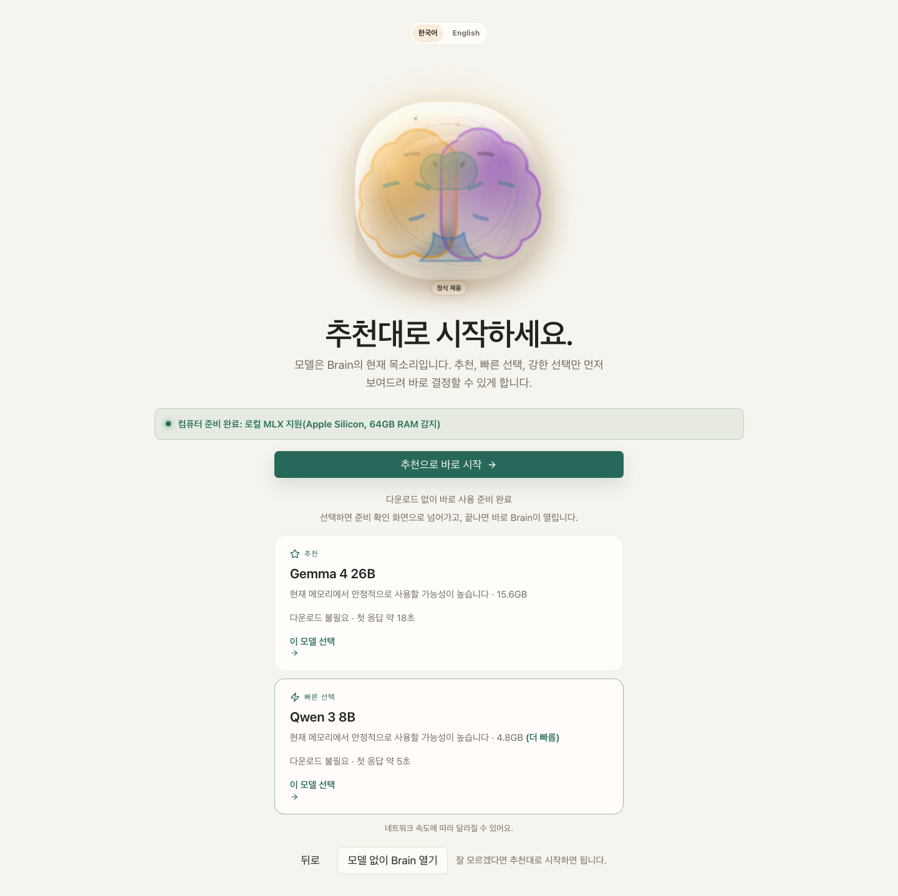
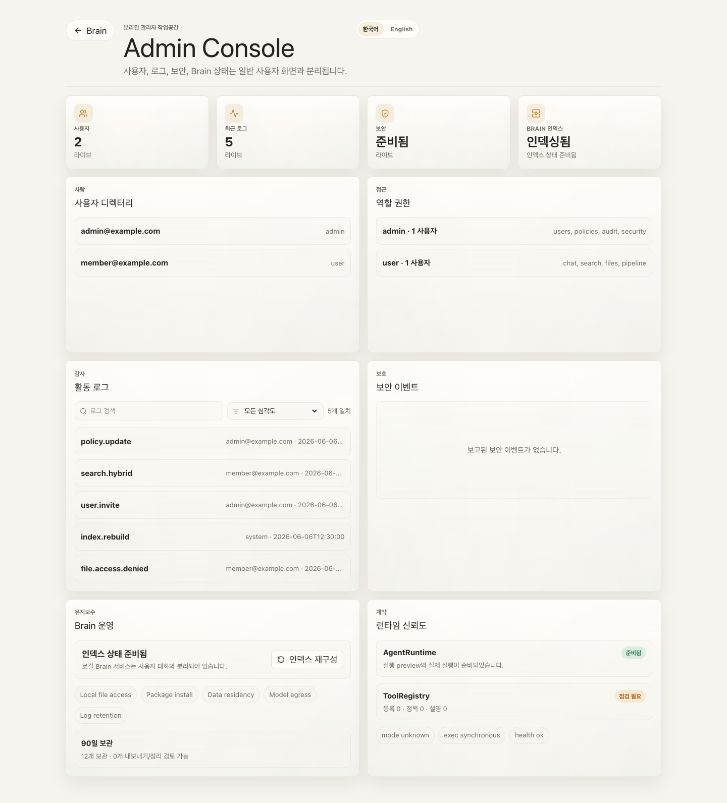
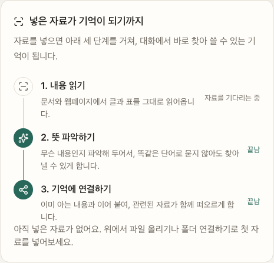
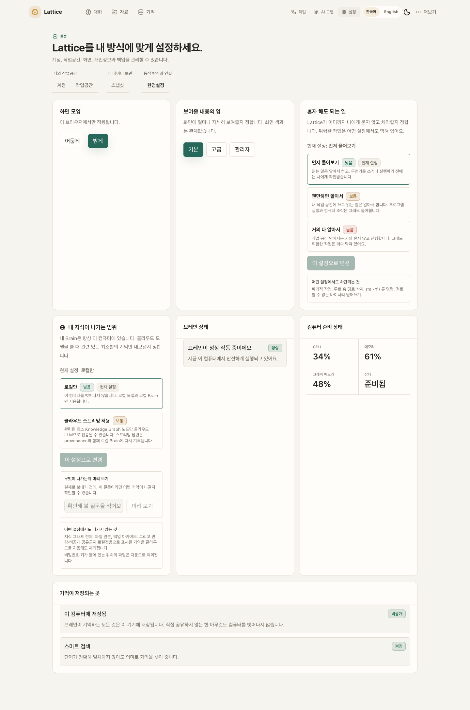
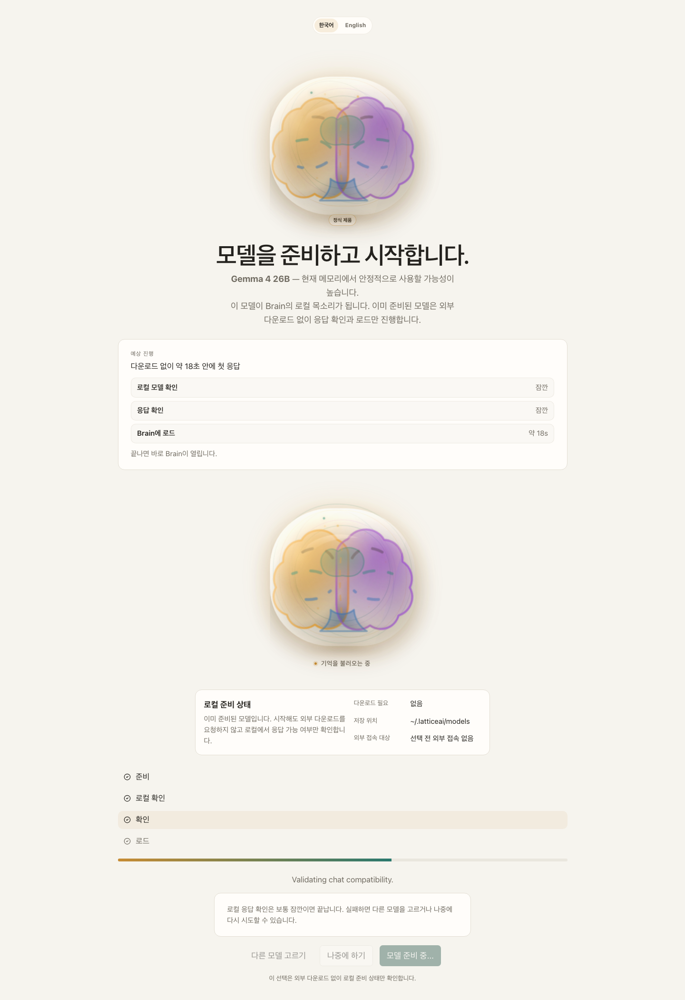
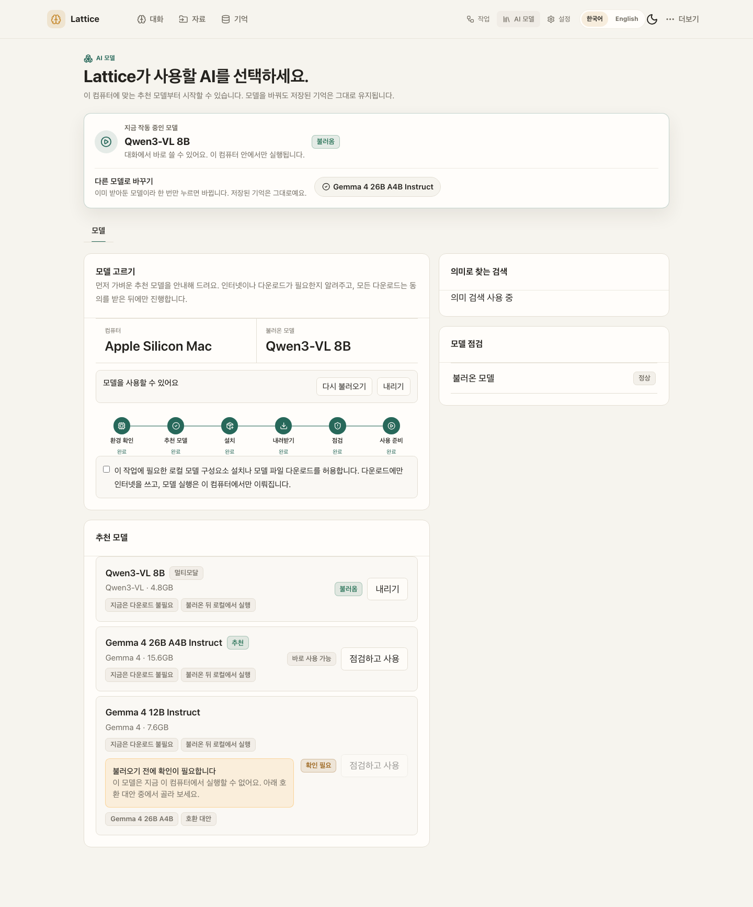

# Lattice AI

**Your model is the voice you use today. Your Brain is the asset you keep.**

**모델은 갈아타도, 내 지식은 내 컴퓨터에 남는 로컬 우선 AI 브레인.**

[](https://pypi.org/project/ltcai/)
[](https://www.npmjs.com/package/ltcai)
[](https://marketplace.visualstudio.com/items?itemName=parktaesoo.ltcai)
[](https://open-vsx.org/extension/parktaesoo/ltcai)
[](https://github.com/TaeSooPark-PTS/LatticeAI/actions/workflows/ci.yml)
[](LICENSE)


Chat, files, folders, notes, and web pages all flow into one durable knowledge
graph on your computer. Any model — local MLX or cloud — can speak with that
memory. Nothing leaves your machine without explicit consent.

대화·파일·폴더·웹페이지가 전부 내 컴퓨터 안의 지식 그래프로 쌓이고, 어떤
모델이든 그 기억을 이어받아 대화합니다.

## What You Can Do

| | |
| --- | --- |
| **Chat with a Brain that remembers** — every conversation grows durable, source-linked memory  | **See how knowledge connects** — a real relationship graph, not a file list  |
| **Capture anything** — files, whole folders, notes, screenshots, web pages  | **Automate with review** — agent changes become proposals you approve first  |
| **Pick a model in one click** — recommended local models for your hardware  | **Stay in control** — audit, roles, retention in a separate admin surface  |
| **Watch a file become memory** — three named steps, not a pipeline diagram  | **Say how much it may do alone** — one dial in plain words; dangerous actions stay blocked either way  |

## Why Lattice AI

- **Own your memory** — knowledge lives in a local SQLite Brain you can back up,
  export, inspect, and restore (`.latticebrain` encrypted archive).
- **Model-independent** — switch between local MLX models and cloud models
  without rebuilding context from zero.
- **Honest by design** — the Brain tells you when retrieval context is limited,
  when captured pages extracted poorly, and when the vector index is catching up.
- **Safe automation** — automations are consent-first drafts; edits to existing
  content always pass through a reviewable proposal with a diff.

매번 AI에게 프로젝트 맥락을 다시 설명하고 있다면, 지식이 여러 서비스에 흩어져
있다면, 그 기억을 특정 회사가 아니라 내가 소유하고 싶다면 — Lattice AI가 그
브레인입니다.

## Quick Start

```bash
pip install ltcai        # or: npm install -g ltcai
LTCAI                    # then open http://127.0.0.1:4825/app
```

Apple Silicon local models: `pip install "ltcai[local]"`. Desktop app (Tauri)
ships as a dmg on each [GitHub Release](https://github.com/TaeSooPark-PTS/LatticeAI/releases).

First-run flow — wake the Brain, pick the owner, load a recommended model:

| | | |
| --- | --- | --- |
|  |  |  |

Screenshot index and capture notes:
[output/release/v10.6.0/SCREENSHOT_INDEX.md](output/release/v10.6.0/SCREENSHOT_INDEX.md)

## Current Release

The current release is **10.6.0 — Promoted Panels**:

10.5.0 changed the words on each screen. 10.6.0 changes where things sit. Every
main screen used to open as a row of equal tabs, which asks a first-time user to
choose before they know what the choices are. Each screen now opens on the panel
that answers the question that brought you there, and everything else moves
below it. No feature was removed — every panel is still on the page, it just no
longer competes for the top of it.

- **Each screen leads with one panel instead of a row of equals.** Capture opens
  on a single 자료 추가하기 card holding all three ways to add material —
  파일 올리기 / 폴더 연결하기 / 웹페이지 저장하기 — as a choice inside one card
  rather than three tabs, with progress and connected folders moved to a quieter
  second row. Work opens on 검토함, what is waiting on you, instead of on the
  empty goal composer. The model library answers "which model is running, and
  can I switch it" in a card above the tabs.
- **The Brain home is one card, not five stacked blocks.** Greeting, composer,
  the add-material row and the autonomy dial now sit inside a single bordered
  station that lifts when you type anywhere in it. The Brain artwork shrank so
  that it introduces the composer rather than headlining the screen.
- **Everyday and management destinations stopped being one list.** 대화 · 자료 ·
  기억 stay in the primary nav; 작업 · AI 모델 · 설정 became topbar links at
  desktop widths and fold into the menu below that — built from one array so the
  two copies cannot drift, and shown by one breakpoint so they can never both
  appear or both vanish.
- **The knowledge graph became a subview rather than a third tab.** Memory opens
  on search, with 연결 지도 열기 one button away and a labelled way back.
- **Seven settings tabs became three named groups** — 나와 작업공간 · 내 데이터
  보관 · 동작 방식과 연결 — so the row reads as a short list of decisions.
- **Links that named a screen now open that screen.** `#/act/review` and its
  siblings landed on the Brain home for every caller that emitted them — the
  command palette, the daily briefing — because nothing parsed the
  `<screen>/<tab>` form they had always used. The palette also read a private
  second copy of the destination list, so 작업 opened a different screen
  depending on whether you clicked it or searched for it. One list, one parser.
- **Guarded, not asserted.** The visual sweep walks ten viewport widths and
  fails if a management link is visible in both places at once or in neither, if
  a navigation landmark is unnamed or shares its name with another, or if the
  topbar overflows.

Release notes: [RELEASE.md](RELEASE.md) · Full history: [docs/CHANGELOG.md](docs/CHANGELOG.md)

Expected artifacts for 10.6.0 release must use exact filenames:

- `dist/ltcai-10.6.0-py3-none-any.whl`
- `dist/ltcai-10.6.0.tar.gz`
- `ltcai-10.6.0.tgz`
- `dist/ltcai-10.6.0.vsix`
- `src-tauri/target/release/bundle/dmg/Lattice AI_10.6.0_aarch64.dmg`

Do not use wildcard artifact uploads. Package registry publishing remains owner-run.

## Architecture At A Glance

FastAPI on localhost is the source of truth; the React/Vite frontend and the
Tauri desktop shell sit on top; the independent `lattice_brain` package owns
the graph, memory, ingestion, and portability. Local-first by default — cloud
calls, downloads, Telegram, and update checks are opt-in.

See [ARCHITECTURE.md](ARCHITECTURE.md) for details and
[docs/DEVELOPMENT.md](docs/DEVELOPMENT.md) for the developer workflow
(`npm install && npm run dev`, validation via `npm run lint`,
`npm run test:unit`, `npm run test:visual`).

## Known Limitations

- External package registries are owner-published and can lag behind GitHub.
- PostgreSQL/pgvector is optional scale/migration tooling. SQLite remains the
  live local Brain store in 10.3.0.
- Docker, model downloads, cloud model calls, Telegram, Brain Network, and
  update checks require explicit user action.
- Conversation does not fabricate answers when no model is loaded. Agent and
  workflow simulation without a loaded LLM is deterministic and LLM-free (it
  does not call a model) — labeled as such, never presented as autonomous
  model success.
- Some backend-generated messages (for example the Postgres DSN notice) are
  produced server-side in English and are shown as-is; server-side i18n is not
  part of 10.3.0.

## Release History

| Version | Theme |
| --- | --- |
| 10.6.0 | Promoted Panels |
| 10.5.0 | Everyday Words |
| 10.4.0 | Named Ground |
| 10.3.0 | Measured Ground |
| 10.2.0 | Load-Bearing Fixes |
| 10.1.1 | Reachable Boundary |
| 10.1.0 | Hybrid Brain |
| 10.0.1 | One Source of Truth |
| 10.0.0 | Plain Language |
| 9.9.9 | Lean Shell |
| 9.9.8 | Autonomy Dial |
| 9.9.7 | No Gaps Left |
| 9.9.6 | Same Brain Everywhere |
| 9.9.5 | Closed Gaps |
| 9.9.4 | Durable Loops |
| 9.9.3 | Closed Loops |
| 9.9.2 | Artifact Trust |
| 9.9.1 | Clean Foundations |
| 9.9.0 | Fail-Closed Trust |
| 9.8.0 | Honest Knowledge Pipeline |
| 9.7.0 | Proactive Hybrid Brain |
| 9.6.0 | Trusted Agent Loop |
| 9.5.0 | Command Center |
| 9.4.0 | Question-Driven Everyday Automation |
| 9.3.0 | Proactive Brain Intelligence |
| 9.2.0 | Model-Agnostic File Generation |
| 9.1.0 | Code Review Completion & Fail-Closed Runtime |
| 9.0.0 | Code Review Closure & Runtime Cleanup |
| 8.9.0 | Scoped Memory & Tool Policy Hardening |
| 8.8.0 | Brain Core Extraction & Recall Proof Hardening |
| 8.7.0 | Runtime State Hygiene & Release Evidence Refresh |
| 8.6.0 | Desktop Capture & Navigation Reliability |
| 8.5.0 | Tool Registry Readiness & Config DI |
| 8.4.0 | Action-Aware Brain Chat |
| 8.3.0 | Orchestrated Brain Readiness |
| 8.2.0 | Brain Brief |
| 8.1.0 | Intuitive Brain Home |
| 8.0.0 | Runtime Architecture Contract |

Per-release details: [RELEASE_NOTES.md](RELEASE_NOTES.md)

## Documentation

- [docs/WHY_LATTICE.md](docs/WHY_LATTICE.md) — product philosophy
- [docs/TRUST_MODEL.md](docs/TRUST_MODEL.md) — local-first trust model
- [PRIVACY.md](PRIVACY.md) — privacy and external communication policy
- [FEATURE_STATUS.md](FEATURE_STATUS.md) — feature status and limitations
- [SECURITY.md](SECURITY.md) — security posture
- [RELEASE.md](RELEASE.md) — release guide and notes

## License

MIT. See [LICENSE](LICENSE).
