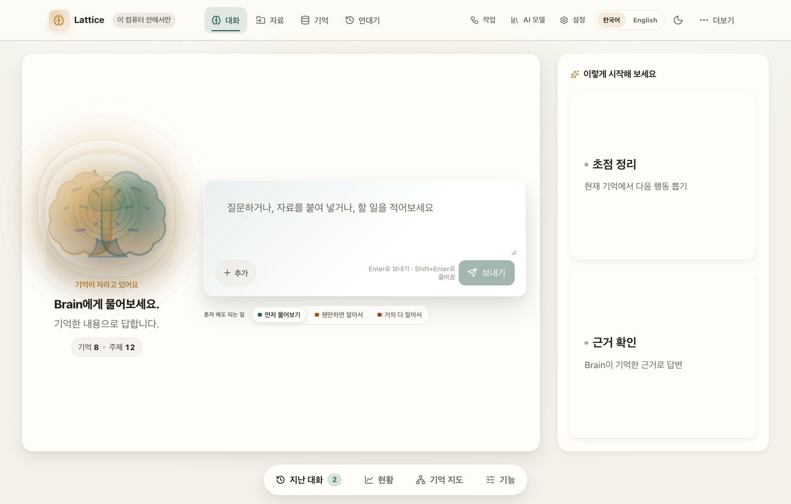
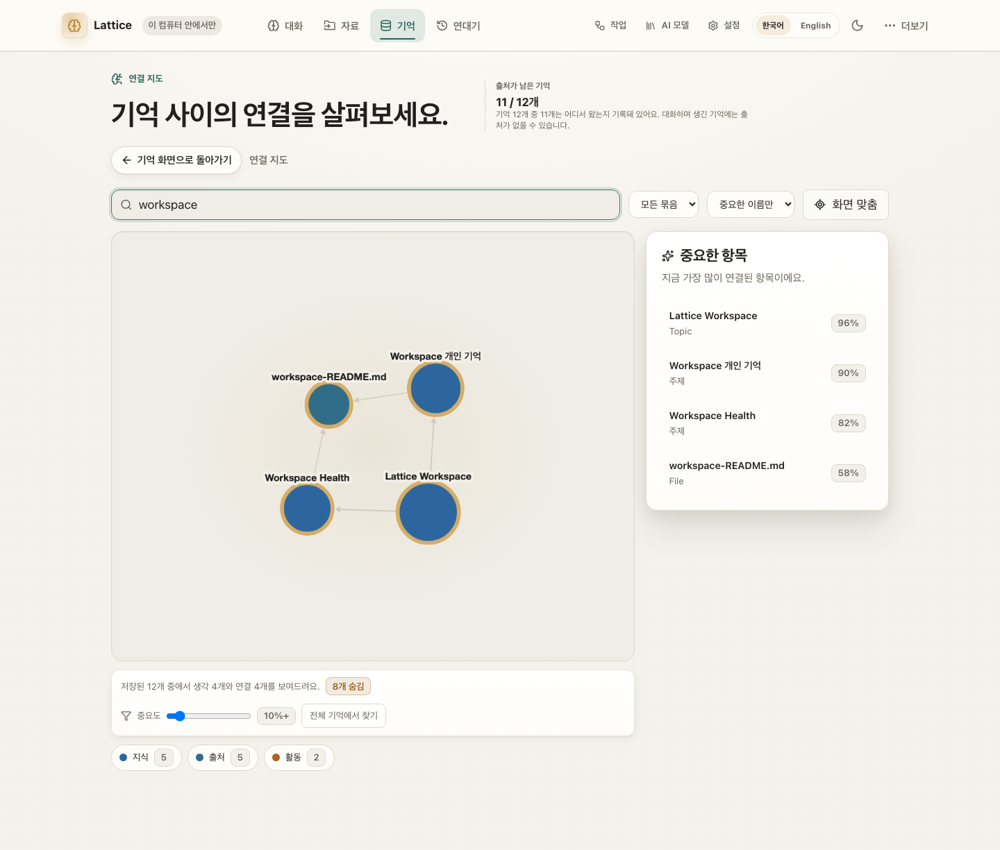
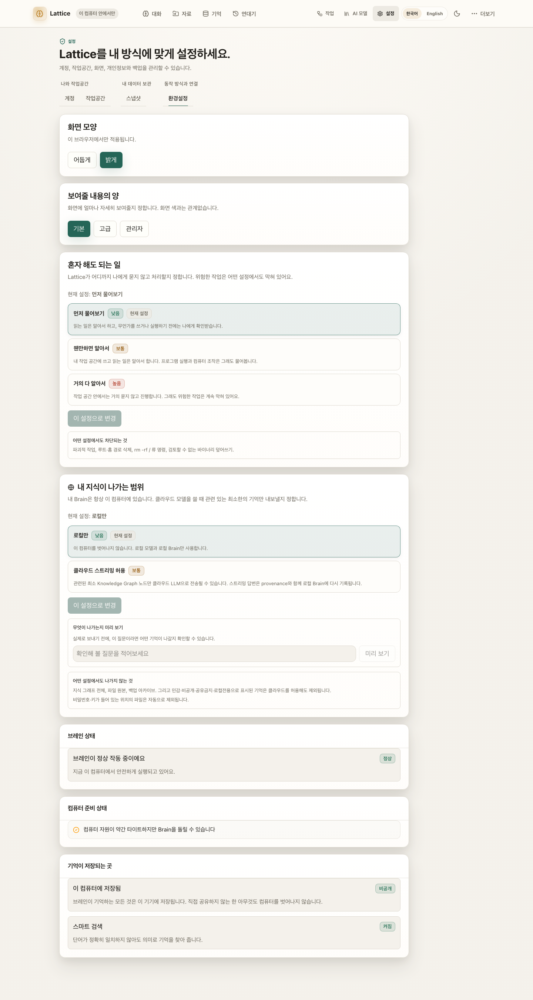
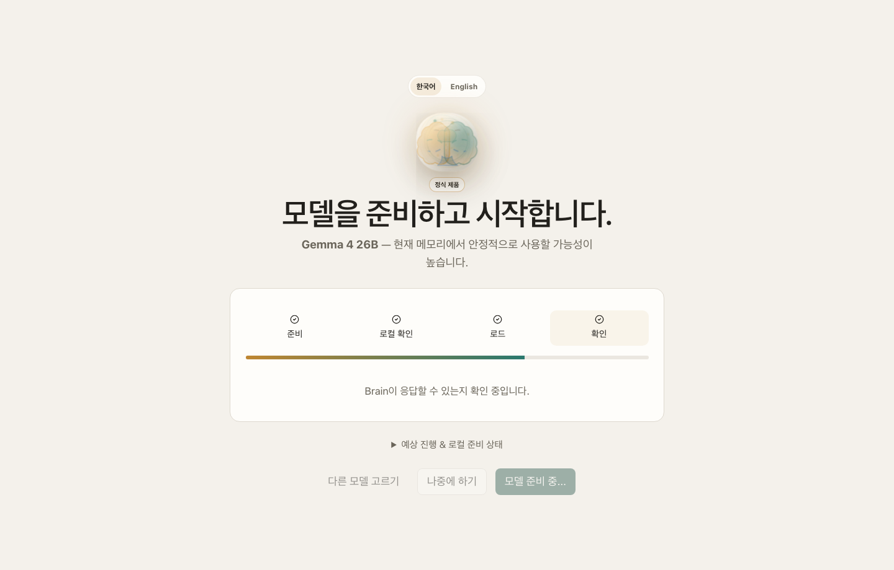
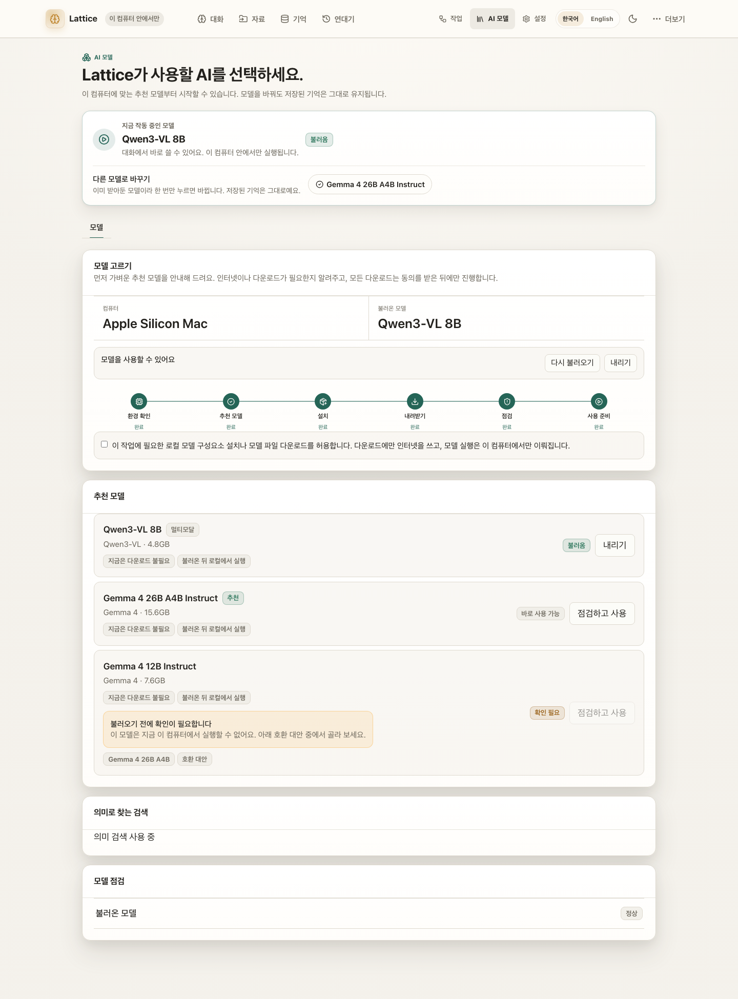

# Lattice AI

**Your model is the voice you use today. Your Brain is the asset you keep.**

**모델은 갈아타도, 내 지식은 내 컴퓨터에 남는 로컬 우선 AI 브레인.**

[](https://pypi.org/project/ltcai/)
[](https://www.npmjs.com/package/ltcai)
[](https://marketplace.visualstudio.com/items?itemName=parktaesoo.ltcai)
[](https://open-vsx.org/extension/parktaesoo/ltcai)
[](https://github.com/TaeSooPark-PTS/LatticeAI/actions/workflows/ci.yml)
[](https://github.com/TaeSooPark-PTS/LatticeAI/actions/workflows/publish.yml)
[](LICENSE)


Chat, files, folders, notes, and web pages all flow into one durable knowledge
graph on your computer. The default is local. Cloud is optional — an
OAuth-authenticated CLI (`agy` / `grok`) or an API key you configure — and
nothing leaves your machine without explicit consent.

대화·파일·폴더·웹페이지가 전부 내 컴퓨터 안의 지식 그래프로 쌓입니다.
기본은 로컬이고, 클라우드는 선택입니다 (OAuth CLI 지원).

## What You Can Do

| | |
| --- | --- |
| **See your Brain's story in time** — a growth curve, an activity heatmap, and each day's story, rewindable to any past moment  | **Chat with a Brain that remembers** — every conversation grows durable, source-linked memory  |
| **See how knowledge connects** — a real relationship graph, not a file list  | **Capture anything** — files, whole folders, notes, screenshots, web pages  |
| **Automate with review** — agent changes become proposals you approve first  | **Pick a model in one click** — recommended local models for your hardware  |
| **Watch a file become memory** — three named steps, not a pipeline diagram  | **Say how much it may do alone** — one dial in plain words; dangerous actions stay blocked either way  |

## Why Lattice AI

- **Own your memory** — knowledge lives in a local SQLite Brain you can back up,
  export, inspect, and restore (`.latticebrain` encrypted archive).
- **Model-independent** — switch between local MLX models and cloud models
  without rebuilding context from zero.
- **Honest by design** — the Brain tells you when retrieval context is limited,
  when captured pages extracted poorly, and when the vector index is catching up.
- **Safe automation** — automations are consent-first drafts; edits to existing
  content always pass through a reviewable proposal with a diff.
- **Runs on the model your machine can hold** — the loop measures what a model
  can actually produce and adapts: a model too small to emit a tool call is
  walked through numbered choices instead, with the same permission gates,
  snapshots and sanitizers as every other profile.

매번 AI에게 프로젝트 맥락을 다시 설명하고 있다면, 지식이 여러 서비스에 흩어져
있다면, 그 기억을 특정 회사가 아니라 내가 소유하고 싶다면 — Lattice AI가 그
브레인입니다.

## Quick Start

```bash
pip install ltcai        # or: npm install -g ltcai
LTCAI                    # then open http://127.0.0.1:4825/app
```

Apple Silicon local models: `pip install "ltcai[local]"`. Desktop app (Tauri)
ships as a dmg on each [GitHub Release](https://github.com/TaeSooPark-PTS/LatticeAI/releases).

First-run flow — wake the Brain, pick the owner, load a recommended model:

| | | |
| --- | --- | --- |
|  |  |  |

Screenshot index and capture notes:
[output/release/v12.0.0/SCREENSHOT_INDEX.md](output/release/v12.0.0/SCREENSHOT_INDEX.md)

## Current Release

The current release is **12.0.0 — Open House**:

11.9.0 made the doors answer. This release opens the house: the two
largest crates are grouped by what a file is *for*, the contributor
documentation is a real path in, and four gaps the last release wrote
down are closed. `lattice-host` serves **422 operations across 41 route
families** (`POST /mcp` and the folder-prune route are the two new ones),
and the AI worker is **20 routes** (`POST /worker/vector/query` is the
one addition). Cloud is still optional and the default is still local.

- **Complexity management first.** `lattice-agent` is six groups —
  `kernel` (the loop and every decision that can refuse), `parse`,
  `content`, `tools`, `surface`, `prompts` — and `lattice-platform` is
  seven domains. Every move is a rename, so the goldens answer
  identically; each crate carries its own `ARCHITECTURE.md`, and
  `docs/DEVELOPMENT.md` and the new `docs/ROADMAP.md` are the way in.
- **Small models become agents.** A measured probe (not a size regex)
  picks the profile, and the `guided` profile stops asking for JSON at
  all: pick an action by number, then one argument per turn, and the
  harness assembles the call. A 0.5B model finished a real file in 3.9s.
  The same gates, snapshots and sanitizers run on every profile.
- **Remembering got faster and more careful.** Re-indexing an unchanged
  folder went **33s → 0.26s**, a 991-item embedding backlog went 40
  minutes → 15.3s, and a document's own section outline is now in the
  graph, so an answer can name the heading it came from. Korean queries
  strip their particles properly, and deleted files get a **「삭제된 파일
  정리」** button instead of quietly lingering as memory.
- **Four honest gaps closed.** Restore takes effect without a restart,
  `/setup/install` really installs on per-item consent, `POST /mcp` is
  inside the OpenAPI contract, and pointer tools are declared as
  `pip install "ltcai[pointer]"`.

What this release does not close — small-model *content* quality, the
mock-only `api_key` path, `brute` still being the search default, watch
never deleting on its own, the ad-hoc-signed dmg — is listed in
[RELEASE_NOTES_v12.0.0.md](RELEASE_NOTES_v12.0.0.md).

Expected artifacts for 12.0.0 release must use exact filenames:

- `dist/ltcai-12.0.0-py3-none-any.whl`
- `dist/ltcai-12.0.0.tar.gz`
- `ltcai-12.0.0.tgz`
- `dist/ltcai-12.0.0.vsix`
- `src-tauri/target/release/bundle/dmg/Lattice AI_12.0.0_aarch64.dmg`

Do not use wildcard artifact uploads. Package registry publishing remains owner-run.

Release notes: [RELEASE.md](RELEASE.md) · Full history: [docs/CHANGELOG.md](docs/CHANGELOG.md)

## Architecture At A Glance

One Rust server on localhost is the source of truth: `lattice-host` answers
every product route, owns every write to the Brain, and supervises a Python
**AI worker** it reaches over loopback for the things a model does — inference,
embedding, extraction, parsing, rendering, speech-to-text. The React/Vite
frontend and the Tauri desktop shell sit on top of that one door. Local-first
by default — cloud is optional (OAuth CLI or an API key you configure),
and downloads, Brain Network, and update checks are opt-in.

See [ARCHITECTURE.md](ARCHITECTURE.md) for details and
[docs/DEVELOPMENT.md](docs/DEVELOPMENT.md) for the developer workflow
(`npm start` / `bin/ltcai.js` is the product; `npm run dev` is the
20-route worker). Each of the two largest crates carries its own domain
map — [rust/lattice-agent/ARCHITECTURE.md](rust/lattice-agent/ARCHITECTURE.md)
and [rust/lattice-platform/ARCHITECTURE.md](rust/lattice-platform/ARCHITECTURE.md)
— and open gaps are tracked in [docs/ROADMAP.md](docs/ROADMAP.md).
Validation via `npm run lint`, `npm run test:unit`, `npm run test:visual`.

## Known Limitations

- External package registries are owner-published and can lag behind GitHub.
- SQLite is the live local Brain store. The optional PostgreSQL/pgvector
  migration tooling is not part of the 12.0.0 worker.
- Docker, model downloads, cloud model calls, Brain Network, and update checks
  require explicit user action. Cloud is optional: `cli_oauth` (`agy` /
  `grok`) was live-checked at zero billing; the `api_key` path is
  mock-verified only.
- **The Telegram bridge was removed in 11.6.0** — it lived in the platform code
  that became the AI worker. **SSO/OIDC login and callback flows were removed
  with it**; the configuration surface remains and password login is native.
- Conversation does not fabricate answers when no model is loaded. Agent and
  workflow simulation without a loaded LLM is deterministic and LLM-free (it
  does not call a model) — labeled as such, never presented as autonomous
  model success.
- `POST /worker/render/pdf` ships working out of the box: `reportlab` is a
  required dependency as of 11.6.0 (it used to be an undeclared lazy import
  that raised a 500; `ltcai[pdf]` remains as an empty alias for older
  install instructions).
- The multimodal image and video analysis functions have no HTTP door as of
  11.8.0: their only route wrapped a native image ingest that was never
  built. The observation code stays in Brain Core under unit test, and its
  module header says so.
- The Python coverage gate is a **line floor of 90** since 11.8.0 (the
  100%-lines-and-branches gate was removed). The enforced claim is the
  floor, not whatever a given run measures.
- **Small-model *content* quality is gated honestly.** With the `guided`
  profile even a 0.5B model writes the requested file and reaches DONE;
  a weak summary still fails the critic and the run ends
  FAILED/NEEDS_REVIEW rather than claiming success.
- Vector search still defaults to `brute` — exact and byte-compatible.
  `hnsw+rescore` is real but opt-in, and falls back to the exact scan
  with its reason when the sidecar cannot answer.
- Watch never deletes on its own: a vanished file is reported, and
  cleanup runs only through the confirmed folder-prune flow.
- The macOS dmg is ad-hoc signed — effectively unsigned — so first launch
  needs the usual Gatekeeper step.
- Pointer-control tools execute in the worker and are installed with
  `pip install "ltcai[pointer]"`. Remaining honest gaps (`open_keys`
  pending-only, no Self-Model refiner, `delete_node` leaving `PART_OF`,
  review events silent without an owner, KG-api ingest text-only, two
  store cycles per review mutation) are listed with their reasons in
  [RELEASE_NOTES_v12.0.0.md](RELEASE_NOTES_v12.0.0.md) and prioritized in
  [docs/ROADMAP.md](docs/ROADMAP.md).

## Release History

Public history starts at 11.0.0. 11.6.0 rebuilt the product server in Rust and
reduced the Python package to an AI worker, so a 10.x or 9.x install is a
different program; `SECURITY.md` supports only 11.x, and this table states the
same boundary. Earlier notes stay in the tree as `RELEASE_NOTES_v*.md` files.

| Version | Theme |
| --- | --- |
| 12.0.0 | Open House |
| 11.9.0 | Working Order |
| 11.8.0 | Travel Light |
| 11.7.0 | Clean Sweep |
| 11.6.0 | One Door |
| 11.5.2 | Tight Ship |
| 11.5.1 | Rust Full Loop |
| 11.5.0 | Rust Complete |
| 11.4.0 | Rust Foundation |
| 11.3.0 | Time Remembers |
| 11.2.0 | All Systems On |
| 11.1.0 | Product Intelligence |
| 11.0.1 | Both Branches |
| 11.0.0 | Full Measure |

Per-release details: [RELEASE_NOTES.md](RELEASE_NOTES.md)
