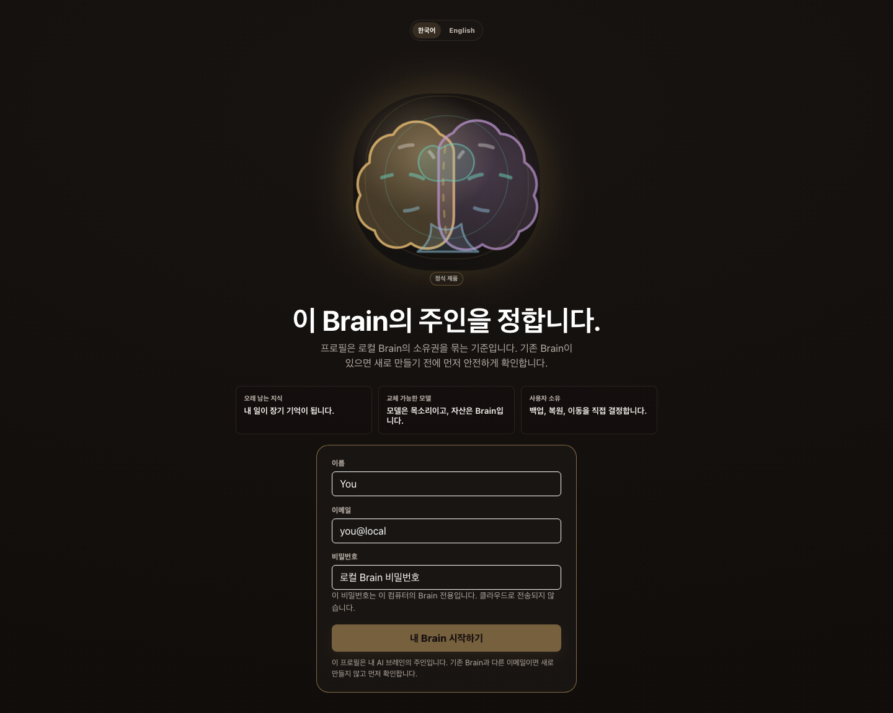
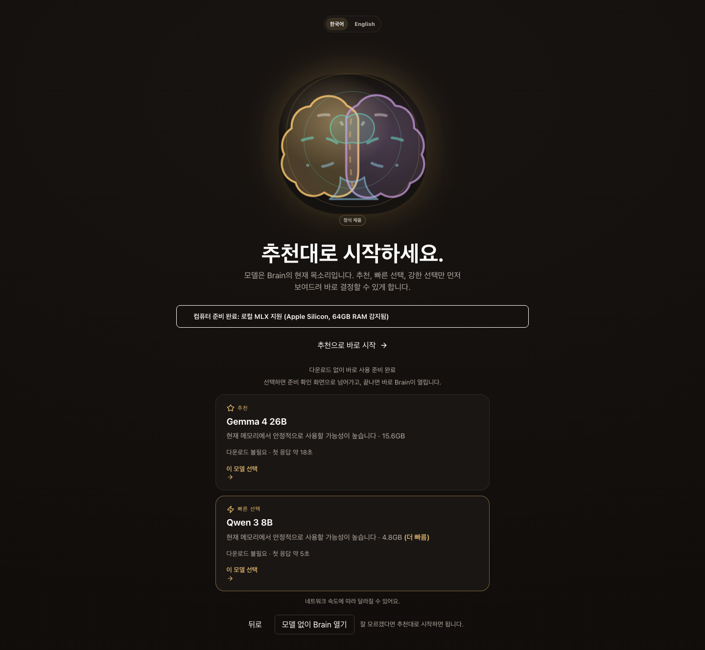
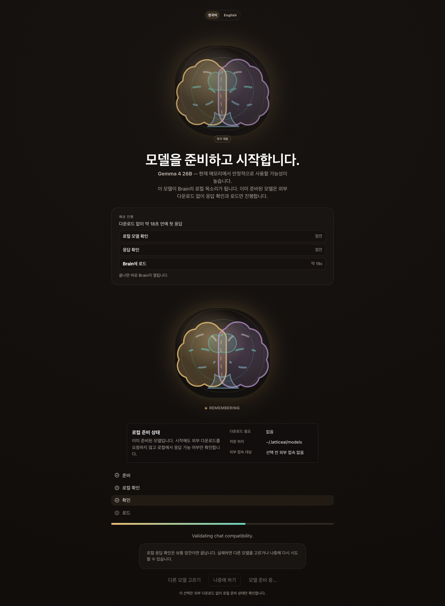
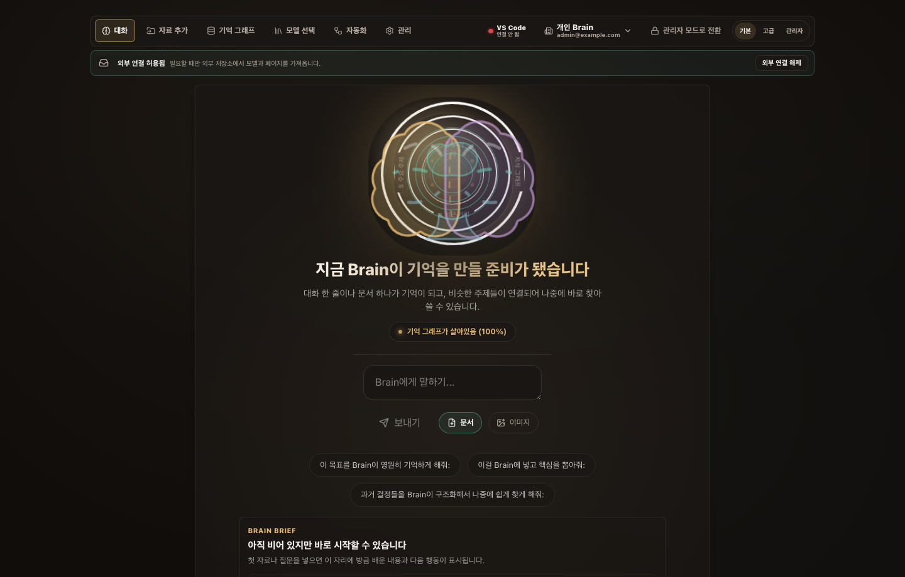
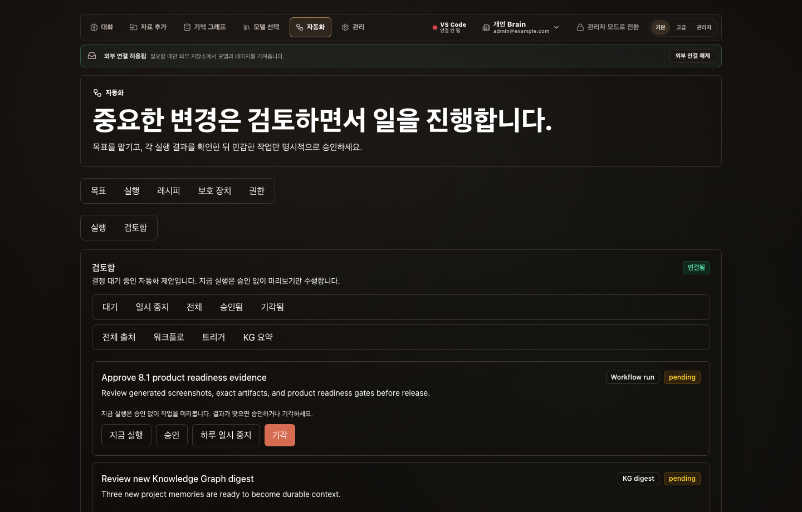
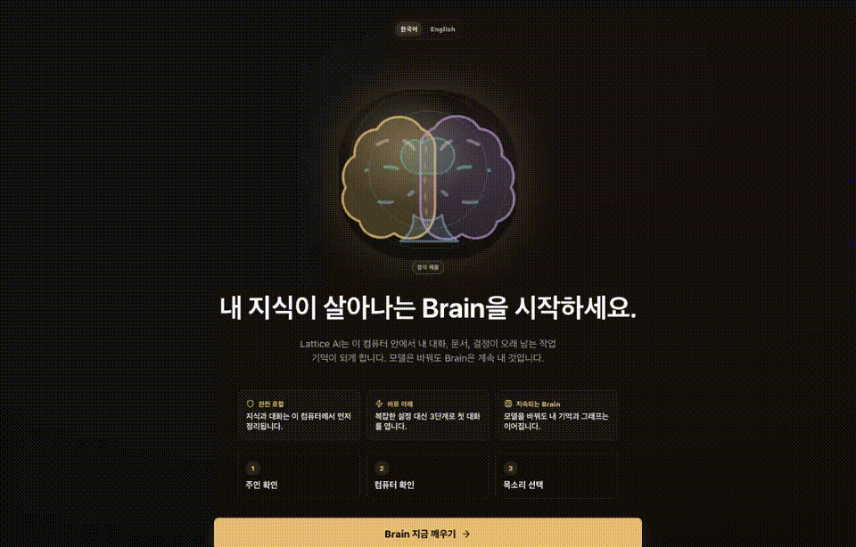

# Lattice AI

**Lattice AI 8.0 is the local-first Digital Brain platform with hardened runtime architecture. It keeps your knowledge durable across any AI model, with AgentRuntime, ToolRegistry, central Config, and Knowledge Graph stability tracked by explicit release contracts.**

**Lattice AI는 모델이 바뀌어도 내 지식과 맥락을 보존하는 로컬 우선 AI 브레인입니다.**

Your model is the voice you use today. Your Brain is the asset you keep.
Lattice AI preserves conversations, documents, decisions, project context,
relationships, and workflows on your computer by default. Cloud models, model
downloads, update checks, and other external communication happen only after
explicit consent.

It is not a ChatGPT clone, a model launcher, a graph database, or a note app.
It is the finished private AI memory layer wrapped in a Living Brain experience — now with the 8.0 runtime architecture contract behind it.

[](https://pypi.org/project/ltcai/)
[](https://www.npmjs.com/package/ltcai)
[](https://marketplace.visualstudio.com/items?itemName=parktaesoo.ltcai)
[](https://open-vsx.org/extension/parktaesoo/ltcai)
[](https://github.com/TaeSooPark-PTS/LatticeAI/actions/workflows/ci.yml)
[](LICENSE)

## Why You Need It

You need Lattice AI when:

- you ask different AI models about the same project and lose the context each time;
- your decisions are scattered across chats, notes, PDFs, folders, and tools;
- you want to switch models without rebuilding memory from zero;
- you want your AI Brain to stay on your computer by default;
- you want backup, restore, inspect, and export paths for your Brain.

이런 사람에게 필요합니다:

- 매번 AI를 바꿀 때마다 프로젝트 맥락을 다시 설명하는 사람
- 문서, 대화, 결정, 파일이 여기저기 흩어져 있는 사람
- 내 지식을 특정 AI 서비스 안에 묶어두고 싶지 않은 사람
- 로컬에 저장되는 개인 AI 브레인을 원하는 사람

## What You Can Do

- Chat with a Brain that remembers useful context instead of treating every
  session as disposable.
- Add documents, local folders, notes, screenshots, and conversations with
  source-aware memory.
- See recent memories, older memories, topics, relationships, and the full
  knowledge graph when you want deeper structure.
- Create consent-first Brain automation drafts for memory digests, project
  reviews, and follow-up suggestions before any schedule is enabled.
- Use a recommended local model without learning model internals first.
- Keep advanced controls, audit logs, roles, and retention in a separate Admin
  surface.
- Export or back up your Brain as an encrypted `.latticebrain` archive.

## One-Minute Flow

1. Launch the app and wake the Brain.
2. Create or open a local profile.
3. Let Lattice explain what this computer can run.
4. Start with the recommended model as the Brain's voice, or skip and choose later.
5. Talk to your Brain.
6. Use the memory rings to move from current context to the full knowledge graph.
7. Back up, inspect, export, or restore the Brain when you need ownership actions.

## Living Brain Flow

The screenshots below are release evidence captures. The 8.1 line keeps the
first-run flow and refreshes Brain Home so the living Brain, recent memory,
next action, and composer are understandable in one glance.

### 1. Wake Brain

The first screen makes the Brain the product. It explains the three-step path:
confirm owner, check the computer, choose the Brain voice.

### 2. Login

Choose the owner of the Brain. The profile is not a SaaS account by default; it
is the local identity for the knowledge you keep.



### 3. Recommended Models

Start with a short list: safest recommendation, faster model, stronger model.
Advanced details stay available without overwhelming first-time users.



### 4. Install And Load

Download and load only after consent. Lattice explains model size, local
execution, and network use before work starts.



### 5. Brain Chat

Talk normally. Useful decisions and context become memory, then appear later as
topics, relationships, graph structure, and the concentric memory rings around
the Brain.



### 6. Review Center

Automation results are staged for review before they become durable decisions.
Snooze, unsnooze, run now, approve, and dismiss actions stay explicit.



## Brain Depths

The user travels inward from everyday memory to deeper structure:

| Level | User name | What the user gets |
| --- | --- | --- |
| Level 1 | Now memory | The living Brain presence and current conversation context |
| Level 2 | Older memory | Durable memories with source-aware recall |
| Level 3 | Topics | Recurring themes across chats and documents |
| Level 4 | Relationships | How decisions, people, files, and ideas connect |
| Level 5 | Full knowledge graph | Nodes, edges, search, and focused detail for advanced exploration |

Walkthrough:



Screenshot index and capture notes:
[output/release/v8.2.0/SCREENSHOT_INDEX.md](output/release/v8.2.0/SCREENSHOT_INDEX.md)

## Install

Run from Python:

```bash
pip install ltcai
LTCAI
```

Run from npm:

```bash
npm install -g ltcai
ltcai
```

Open the local app:

```text
http://127.0.0.1:4825/app
```

Apple Silicon local model extras:

```bash
pip install "ltcai[local]"
```

## Architecture At A Glance

- **Product category**: local-first Digital Brain.
- **Core capability**: private AI memory layer for conversations, documents,
  decisions, relationships, workflows, and project context.
- **UX metaphor**: Living Brain.
- **Desktop shell**: Tauri 2 starts a localhost sidecar.
- **Frontend**: React, TypeScript, Vite, TanStack Query, Zustand, Cytoscape.js,
  React Flow, and generated OpenAPI types.
- **Backend**: FastAPI on localhost is the UI source of truth.
- **Brain Core**: independent `lattice_brain` package for graph, memory,
  context, conversations, ingestion, runtime, workflow, storage, and portability.
- **Storage**: SQLite default; PostgreSQL/pgvector is optional scale mode.
- **Portability**: encrypted `.latticebrain` archives plus backup, restore,
  inspect, verify, import dry-run, and confirmed restore/import flows.
- **Trust boundary**: local-first by default; cloud calls, downloads, Telegram,
  Brain Network, Docker/Postgres setup, and update checks are opt-in.
- **Admin separation**: normal Brain use stays separate from users, audit logs,
  policies, security events, retention, and index rebuilds.

See [ARCHITECTURE.md](ARCHITECTURE.md) for the current architecture.

## Local Development

```bash
npm install
npm run dev
```

Main validation set:

```bash
npm run check:python
node scripts/run_python.mjs -m ruff check .
npm run lint
npm run typecheck
npm run test:unit
npm run test:integration
npm run test:visual
npm run desktop:tauri:check
npm run docs:check-links
```

See [docs/DEVELOPMENT.md](docs/DEVELOPMENT.md) for developer workflow details.

## Current Release

The current release is **8.2.0 — Brain Brief**:

- Brain Home now includes an evidence-backed Brain Brief that says what to notice, why it is trustworthy, and what to do next.
- The brief is generated by `MemoryService` from real workspace memory, conversation, graph, vector, and source-health signals instead of frontend-only placeholders.
- Empty Brain states stay honest: the UI suggests adding a source or asking a first question without claiming model-continuity proof.
- Alive Brain states surface recall evidence, connected topics, model-continuity verification, and backup management as direct actions.
- The 8.0 runtime architecture contract remains active: AgentRuntime, ToolRegistry, Config, server decomposition, and KG hardening stay machine-checkable through readiness gates.
- CI and release workflows continue to run frontend lint/typecheck/build gates plus product readiness before a tag can be treated as release-safe.

Expected artifacts for 8.2.0 release must use exact filenames:

- `dist/ltcai-8.2.0-py3-none-any.whl`
- `dist/ltcai-8.2.0.tar.gz`
- `ltcai-8.2.0.tgz`
- `dist/ltcai-8.2.0.vsix`
- `src-tauri/target/release/bundle/dmg/Lattice AI_8.2.0_aarch64.dmg`

Do not use wildcard artifact uploads. Package registry publishing remains owner-run.

See [docs/ROADMAP_RECOMMENDATIONS.md](docs/ROADMAP_RECOMMENDATIONS.md) for the
strategic roadmap slices applied through 8.2.0 and the follow-up tracks.

## Known Limitations

- External package registries are owner-published and can lag behind GitHub.
- PostgreSQL/pgvector is optional scale mode. SQLite is the default local Brain.
- Docker, model downloads, cloud model calls, Telegram, Brain Network, and update
  checks require explicit user action.
- Conversation does not fabricate answers when no model is loaded.
- Agent/workflow simulation without a loaded LLM is deterministic and does not
  call a model; it is labeled as LLM-free/model-free rather than presented as
  autonomous model success.

## Release History

| Version | Theme |
| --- | --- |
| 8.2.0 | Brain Brief: evidence-backed home briefing, honest empty-state guidance, recall/graph/model-proof next actions, and continued model/workspace runtime extraction |
| 8.1.0 | Intuitive Brain Home: living Brain, recent memory, connected topic, next action, and composer are visible in one product-first screen with refreshed 8.1.0 evidence and artifacts |
| 8.0.0 | Runtime Architecture Contract: AgentRuntime, ToolRegistry, central Config, server decomposition, and KG hardening are captured as machine-checkable release boundaries with exact 8.0.0 artifacts |
| 7.9.0 | Agent Runtime Boundary Hardening: explicit `SingleAgentRuntime`, compatibility alias preservation, injected rollback port, and release/readiness docs aligned to the product AgentRuntime facade |
| 7.8.0 | Brain Chat Home UX Simplification: chat-first first viewport, visible workspace navigation, collapsed source/status utilities, hidden default depth controls, and removal of obsolete Brain UX components |
| 7.7.0 | Complete Product Polish: command-center Brain Home, repaired Review Center evidence, exact 7.7 docs/artifacts, product readiness gate, and stronger CI/release checks |
| 7.6.0 | Brain-Centered UX & Architecture Closure: Wake Brain first-run surface, concentric memory rings with direct depth controls, and machine-checkable closure of the two architecture/UX review files |
| 7.5.0 | Runtime Debt Burn-down & Release Risk Cleanup: API consumers get normalized contract views, retrieval quality uses a 250+ record corpus fixture, stale artifact risk is removed, npm audit is clean, and Tauri is updated past the old block warning |
| 7.4.0 | Runtime Contract Convergence & Corpus Retrieval: agent/workflow/audit/realtime records share the agent-run-contract/v1 family, and retrieval quality gates run against a real corpus-scale fixture |
| 7.3.0 | Runtime Contract & Retrieval Quality: shared agent-run contract across runtimes plus deterministic hybrid recall/ranking regression gates |
| 7.2.0 | Runtime Trust Baseline: agent run preview/readiness, simulation-mode guardrails, live ToolRegistry manifest/diagnostics, and tests for dispatch/governance/catalog drift |
| 7.1.0 | Brain Usability Completion: clearer first-run onboarding, ingestion progress/emergence, richer graph controls, inline answer proof, workspace/profile/admin discovery, empty/error/consent feedback, and VS Code sync status |
| 7.0.0 | Brain Productization Loop: first-screen ingestion for files/folders/notes/web, answer-level memory proof and source citations, model-continuity demo flow, five-minute first-run loop, and recall/KG quality eval in CI |

## Documentation

- [docs/WHY_LATTICE.md](docs/WHY_LATTICE.md) - product philosophy.
- [docs/TRUST_MODEL.md](docs/TRUST_MODEL.md) - local-first trust model.
- [PRIVACY.md](PRIVACY.md) - privacy and external communication policy.
- [ARCHITECTURE.md](ARCHITECTURE.md) - current technical architecture.
- [FEATURE_STATUS.md](FEATURE_STATUS.md) - current feature status and known limitations.
- [docs/DEVELOPMENT.md](docs/DEVELOPMENT.md) - developer workflow.
- [docs/LEGACY_COMPATIBILITY.md](docs/LEGACY_COMPATIBILITY.md) - root legacy shim map.
- [RELEASE.md](RELEASE.md) - release guide and current release notes.
- [docs/CHANGELOG.md](docs/CHANGELOG.md) - historical changes.
- [SECURITY.md](SECURITY.md) - security posture.

## License

MIT. See [LICENSE](LICENSE).
