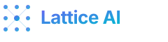
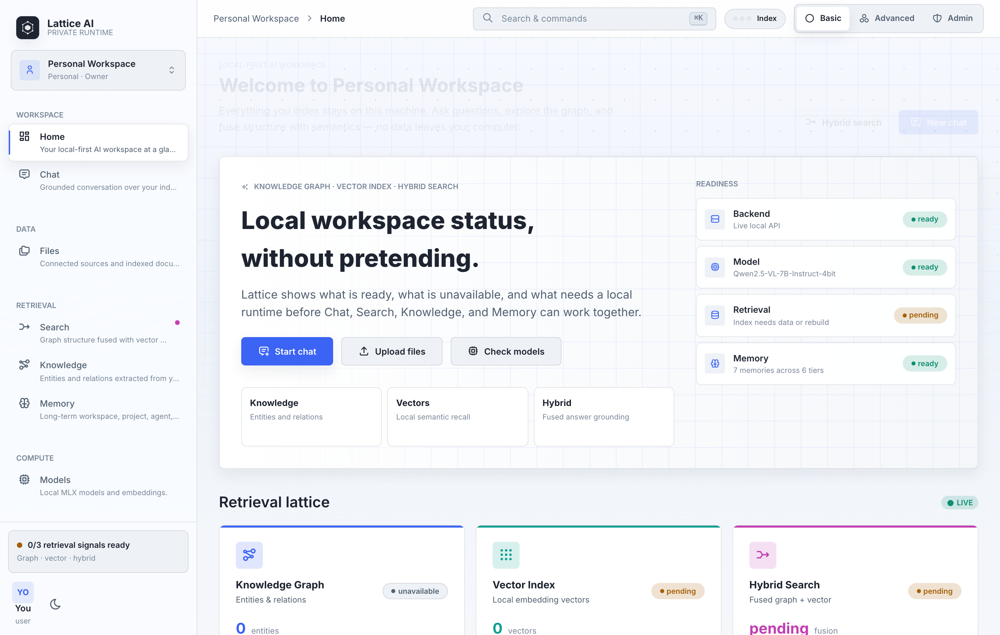
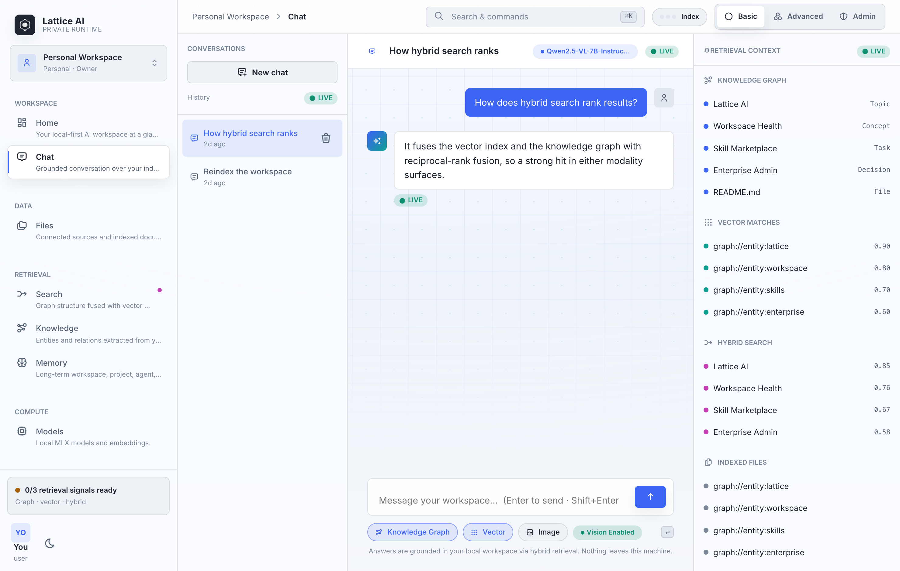
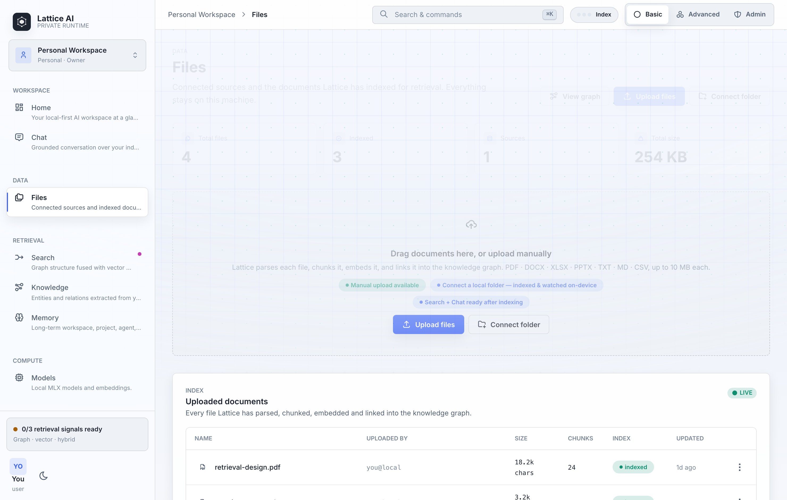
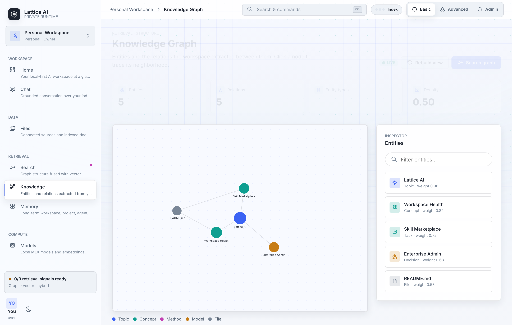
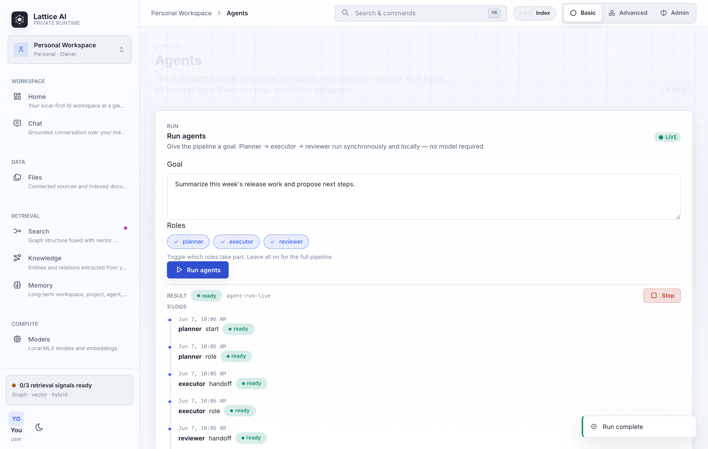
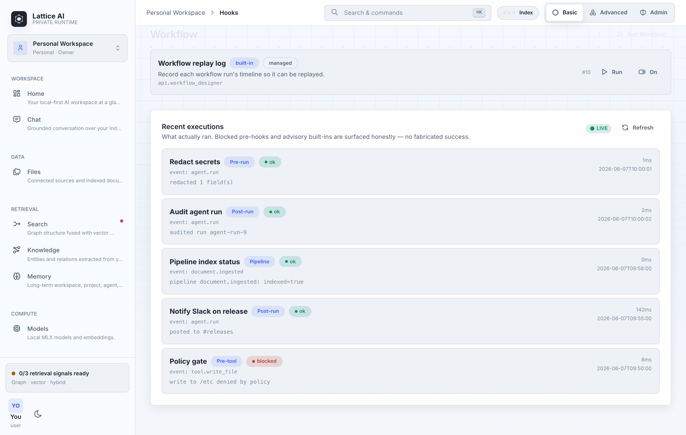
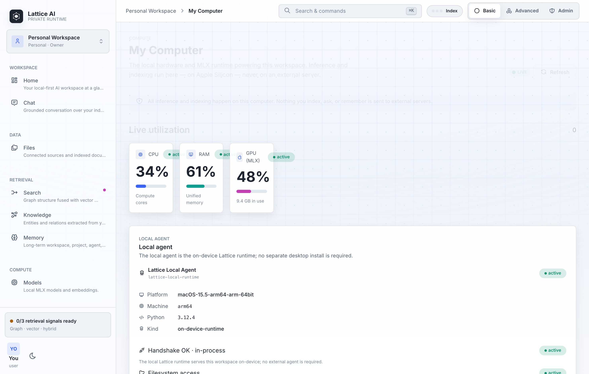

<div align="center">
  

  # Lattice AI

  **A local-first Digital Brain Platform. Your Knowledge Graph is the durable asset; models just read it.**

  Every source — files, folders, web pages, browser tabs — converges into one
  Knowledge Graph on your own machine. Connect models, agents, and search to that
  graph instead of placing your work inside any single model.
</div>

<div align="center">

[](https://pypi.org/project/ltcai/)
[](https://www.npmjs.com/package/ltcai)
[](https://marketplace.visualstudio.com/items?itemName=parktaesoo.ltcai)
[](https://open-vsx.org/extension/parktaesoo/ltcai)
[](https://github.com/TaeSooPark-PTS/LatticeAI/releases)
[](LICENSE)
[](https://www.python.org/)
[](https://marketplace.visualstudio.com/items?itemName=parktaesoo.ltcai)

</div>



> **Lattice AI is not a model-personalization system. It is a Digital Brain Platform.**
> The Knowledge Graph is your durable asset. **Models are replaceable. Knowledge is durable.**

It isn't another chat window, and it isn't a way to "fine-tune a model on you." The
purpose of Lattice AI is to **connect models to your Knowledge Graph** — your digital
brain — not to place you inside a model. AI reads your knowledge; you own it.

- **Models are replaceable.** Swap MLX, Ollama, LM Studio, or a cloud LLM at will.
- **Agents, RAG, and the UI are replaceable.** They are implementations, not the asset.
- **Your Knowledge Graph is durable.** It outlives every model and is yours to export,
  import, and back up locally — no cloud required.

Local-first by default; cloud only when you choose. (The Vercel site is a
landing/download/demo surface only — never the runtime. Lattice AI runs on your
machine over local SQLite.)

## Why install Lattice AI?

Most AI tools only answer questions in a chat window. Lattice AI gives you a
workspace around the work itself:

- **Keep everything in one place** — files, notes, chats, and decisions live
  together instead of scattered across tabs and apps.
- **Turn documents into knowledge** — uploads and connected folders become
  searchable, linked context you can reuse.
- **Search the way you think** — fuse keyword, vector, and knowledge-graph
  signals in a single query.
- **Stay private and offline-capable** — run local models through MLX, Ollama, or
  LM Studio; nothing leaves your machine unless you opt in.
- **Use cloud models only when you choose** — bring an API key for cloud LLMs
  when you want them, not by default.
- **Inspect every agent run** — runs persist queued/running/final state, plans,
  reviews, retries, cancellation, and replayable logs. With a loaded model the
  v4 runner uses it; without one, deterministic simulation mode is explicitly
  labeled and does not call a model.

Lattice AI is not a clone of ChatGPT, Claude, Cursor, Obsidian, or Notion. It
sits in a different place: a **workspace** that ties local/self-hosted AI, your
files, project knowledge, hybrid search, local and optional cloud models, agents,
and workflows together — and runs on your own hardware.

## What can you do with it?

- Build a private AI workspace for a project, scoped to your machine.
- Chat with your local files, images, and workspace memory.
- Upload documents — or connect a folder — and turn them into searchable knowledge.
- Explore how files, decisions, conversations, and entities connect in a
  Knowledge Graph.
- Run local models through MLX, Ollama, or LM Studio, and use cloud LLMs only when
  you want to.
- Define agent workflows and replay their run records step by step, including
  live tool execution, approval pauses, and cooperative cancellation.
- Separate personal work from organization work.
- Switch between Basic, Advanced, and Admin modes depending on your role.

## Product Tour

### Start from the workspace home


The home view shows workspace readiness, model state, retrieval status, and the
main entry points — derived from real local state, never placeholder counters.

### Chat with files, images, and workspace context



Chat is wired to your files, graph context, memory, and model routing — including
vision-capable image input by attach, drag-and-drop, or paste.

### Bring documents into the workspace



Uploads and connected folders become indexed workspace context, searchable from
chat and hybrid search.

### Understand knowledge visually



The Knowledge Graph shows how files, decisions, conversations, and entities
connect — context that stays useful even when you switch models.

### Inspect agent run records



The agent runner turns a goal into an inspectable, replayable run record — roles,
logs, review, retry, and cancellation state — that you can read back step by
step. Runs execute asynchronously and use the loaded model when one is available;
otherwise they are labeled as simulation.

### Extend with hooks and the local runtime





Advanced users wire lifecycle hooks into runs, tools, workflows, uploads, and
indexing — and see the on-device local runtime's real status, handshake, and
folder-watch activity.

## Install

Install the local workspace:

```bash
pip install ltcai
```

Add Apple Silicon local model support:

```bash
pip install "ltcai[local]"
```

Install the npm CLI:

```bash
npm install -g ltcai
```

Install the coding extension:

- [VS Code Marketplace: parktaesoo.ltcai](https://marketplace.visualstudio.com/items?itemName=parktaesoo.ltcai)
- [Open VSX: parktaesoo.ltcai](https://open-vsx.org/extension/parktaesoo/ltcai)
- [GitHub Releases](https://github.com/TaeSooPark-PTS/LatticeAI/releases)

## Quick Start

Start the workspace:

```bash
LTCAI
```

Then open:

```text
http://127.0.0.1:4825/app
```

Working from a development checkout:

```bash
npm install
npm run dev
```

## Core Features

- **Local-first workspace** — your data, models, and workspace state live on your
  machine by default; cloud is opt-in.
- **Files and connected folders** — upload documents or connect a local folder;
  Lattice indexes them and watches connected folders for changes.
- **Chat with workspace context** — conversations are grounded in your files,
  knowledge graph, and memory, with vision-capable image input.
- **Knowledge Graph** — files, images, notes, conversations, and decisions become
  linked entities and relationships you can explore.
- **Hybrid Search** — keyword, vector, and graph signals are fused into one ranked
  result set.
- **Local model support** — run multimodal models locally via MLX, Ollama, or LM
  Studio, with hardware-aware recommendations and source disclosure.
- **Optional cloud model routing** — add OpenAI-compatible or other cloud models
  when you choose; model cards disclose origin, run mode, and internet use.
- **Multi-agent workflows** — turn goals into runs with roles, handoffs, review,
  retries, and replayable timelines.
- **Skills, hooks, tools, and MCP** — extend the workspace with skills, lifecycle
  hooks, a governed tool registry, and Model Context Protocol servers.
- **Personal / Organization workspaces** — keep personal work separate from team
  work with role-aware views.
- **Basic / Advanced / Admin modes** — show only what each role needs, from core
  workflows to agent tooling to administration.

## Latest Release

### v4.2.0 — Brain Core & Storage Rebuild

- **Independent Brain Core package** — `lattice_brain` exposes the Knowledge
  Graph, durable conversations, memory/context, signed exchange, archives, and
  storage tools for FastAPI, CLI, tests, and future tools.
- **Pluggable storage layer** — `StorageEngine`, `SQLiteEngine`, and
  `PostgresEngine` give the backend an explicit storage boundary. SQLite stays
  the default.
- **Honest vector search** — sqlite-vec is detected when available; otherwise
  the real local hash-embedding cosine path remains active and reported.
- **Postgres scale mode** — pgvector setup and SQLite-to-Postgres migration are
  opt-in. Live Docker validation covers migration integrity, idempotence, and
  pgvector distance search. Explicit Postgres selection fails loudly when
  DSN/dependencies are missing; it never hides failure with a SQLite fallback.
- **Consent-gated Docker setup** — Docker Compose setup is generated locally
  and only starts Docker after explicit user consent.
- **Encrypted `.latticebrain` archives** — local encrypted backup/restore over
  the brain DB and blobs, with bad passphrases failing closed.

See [RELEASE_NOTES_v4.2.0.md](RELEASE_NOTES_v4.2.0.md),
[docs/kg-schema.md](docs/kg-schema.md),
[FEATURE_STATUS.md](FEATURE_STATUS.md).

## How it works — every source converges into the graph

As of v4.2.0, data sources flow through the brain ingestion pipeline into
the Knowledge Graph — no source bypasses it, none becomes an isolated silo:

```text
source (file · folder · PDF · web URL · browser tab · text)
  -> extraction -> normalization -> content hash (idempotent)
  -> chunking -> entity detection -> relationship detection -> embedding
  -> Knowledge Graph  (Source -[indexed_from]- content -[contains]- chunks)
  -> RAG / agents / memory / hybrid search
```

- **Every node is explainable.** Each ingested item carries provenance — where it
  came from, when, how it was processed, whether it was embedded or linked.
- **The graph is the asset.** Memory, search, and agents are views over it; models
  read it. Swap a model and your knowledge is unchanged.
- **Portable, no cloud.** Export/import the graph as JSON, or take a full local
  binary backup (DB + blobs), encrypted `.latticebrain` archive, or explicit
  SQLite-to-Postgres migration plan and restore it.
- **Local-first protects the graph.** It lives in local SQLite on your machine.

For the deeper design, see [ARCHITECTURE.md](ARCHITECTURE.md) and
[docs/architecture.md](docs/architecture.md).

## Documentation

### Product and principles

- [PROJECT_PRINCIPLES.md](PROJECT_PRINCIPLES.md) — product principles
- [AI_PHILOSOPHY.md](AI_PHILOSOPHY.md) — how AI is used in the workspace
- [MODEL_POLICY.md](MODEL_POLICY.md) — local model recommendation policy

### Architecture

- [ARCHITECTURE.md](ARCHITECTURE.md) — workspace, graph, pipeline, and model overview
- [docs/architecture.md](docs/architecture.md) — full architecture reference
- [docs/V4_2_BRAIN_CORE_ARCHITECTURE.md](docs/V4_2_BRAIN_CORE_ARCHITECTURE.md) — v4.2.0 Brain Core package and storage architecture
- [docs/V4_2_STORAGE_MIGRATION_REPORT.md](docs/V4_2_STORAGE_MIGRATION_REPORT.md) — v4.2.0 storage migration and archive report
- [docs/V4_2_VALIDATION_REPORT.md](docs/V4_2_VALIDATION_REPORT.md) — v4.2.0 validation report
- [docs/V4_1_FRONTEND_ARCHITECTURE_REVIEW.md](docs/V4_1_FRONTEND_ARCHITECTURE_REVIEW.md) — v4.1.0 frontend and desktop architecture review
- [docs/V4_1_FRONTEND_MIGRATION_REPORT.md](docs/V4_1_FRONTEND_MIGRATION_REPORT.md) — v4.1.0 capability migration report
- [docs/V4_1_VALIDATION_REPORT.md](docs/V4_1_VALIDATION_REPORT.md) — v4.1.0 validation report
- [docs/V3_BACKEND_ARCHITECTURE.md](docs/V3_BACKEND_ARCHITECTURE.md) — backend storage, search, and retrieval

### Knowledge and retrieval

- [KNOWLEDGE_GRAPH.md](KNOWLEDGE_GRAPH.md) — graph model and behavior

### Agents and workflows

- [docs/MULTI_AGENT_RUNTIME.md](docs/MULTI_AGENT_RUNTIME.md) — multi-agent workflow runtime
- [docs/WORKFLOW_DESIGNER.md](docs/WORKFLOW_DESIGNER.md) — AI pipeline designer

### Extensions

- [docs/PLUGIN_SDK.md](docs/PLUGIN_SDK.md) — plugin SDK

### Releases

- [RELEASE_NOTES.md](RELEASE_NOTES.md) — current release notes
- [RELEASE_NOTES_v4.2.0.md](RELEASE_NOTES_v4.2.0.md)
- [RELEASE_NOTES_v4.1.0.md](RELEASE_NOTES_v4.1.0.md)
- [RELEASE_NOTES_v4.0.1.md](RELEASE_NOTES_v4.0.1.md)
- [RELEASE_NOTES_v4.0.0.md](RELEASE_NOTES_v4.0.0.md)
- [RELEASE_NOTES_v3.6.0.md](RELEASE_NOTES_v3.6.0.md)
- [RELEASE_NOTES_v3.5.0.md](RELEASE_NOTES_v3.5.0.md)
- [RELEASE_NOTES_v3.4.1.md](RELEASE_NOTES_v3.4.1.md)
- [RELEASE_NOTES_v3.4.0.md](RELEASE_NOTES_v3.4.0.md)
- [CHANGELOG.md](CHANGELOG.md) and [docs/CHANGELOG.md](docs/CHANGELOG.md)

## Release History

| Version | Theme |
| --- | --- |
| **4.2.0** | Brain Core & Storage Rebuild — independent `lattice_brain` package, pluggable storage layer, sqlite-vec/pgvector capability reporting, explicit Postgres migration, consent-gated Docker setup, encrypted `.latticebrain` archives |
| **4.1.0** | Frontend & Desktop Rebuild RC — React/Vite/OpenAPI desktop SPA, Tauri 2.0 primary shell, graph-first navigation, and legacy static frontend removal |
| **4.0.1** | Digital Brain Platform maintenance — closes post-tag v4 gaps with durable async runs, stable identity/workspace state, full `/app` parity, and legacy UI retirement |
| **4.0.0** | Digital Brain Platform — decomposed brain store, v2 write-mastered Knowledge Graph, durable memory/context, real workflow/agent foundations, signed brain exchange |
| 3.6.0 | Knowledge Graph First — unified ingestion pipeline, formalized entity/relationship model, browser/web ingestion, local export/import/backup, provenance, KG as the primary surface |
| 3.5.0 | Foundation stabilization & verification — OIDC verifier, trusted-proxy gating, runtime hook coverage, `tools/` package, reproducible artifacts |
| 3.4.1 | Runtime completion — full hooks lifecycle, real Local Agent probes, Connect Folder and Folder Watch verified end-to-end |
| 3.4.0 | Platform completion — hooks execution, uploads in Files, vision image input, agent run trigger, on-device Local Agent / Connect Folder / Folder Watch |
| 3.3.1 | Visual product rebuild — rebuilt `/app` shell, Basic/Advanced/Admin navigation, refreshed design system |
| **3.3.0** | Product quality & honesty release — evidence-based feature audit, single-source version truth, working document upload, documented design system |
| 3.2.0 | Feature-complete platform — multi-agent collaboration, agent registry, marketplace + templates, workflow agents, long-term memory, skills/hooks/tool registries, MCP manager |
| 3.1.0 | Mainline platform completion — native `/app` workflows, production embedding profiles, AgentRuntime/registries, hashed v3 assets |
| 3.0.1 | Release-blocker remediation — provider-backed embeddings, unified AgentRuntime boundary, every v3 surface connected or clearly unavailable |
| 3.0.0 | v3 local-first AI workspace platform — `/app`, Native Chat, Knowledge Graph, Vector Index, Hybrid Search, workspace modes |
| 2.2.7 | Visual system stabilization — cohesive dark/light screens, crisp chat composer, dark graph canvas, Workspace OS polish |
| 2.2.6 | Token-native CSS foundation |
| 2.2.5 | Release hygiene hotfix — dark overlays, modal stack, cache-busting, favicon, and Telegram log masking |
| 2.2.4 | Chat dark-mode completion |
| 2.2.3 | Frontend stability and UX fixes |
| 2.2.2 | Frontend QA stabilization — mobile nav, admin actions, overflow fixes, and expanded visual tests |
| 2.2.1 | Frontend and UX overhaul for responsive workspace, themes, graph UX, admin reflow, and file attachment |
| 2.2.0 | Multimodal-first Knowledge Graph and local model source disclosure |
| 2.1.0 | Multi-agent workflow maturity |
| 2.0.0 | AI pipeline, workflow, and plugin platform foundation |
| 1.7.0 | Graph and collaboration |
| 1.6.0 | Product experience deepening |

## License

MIT
