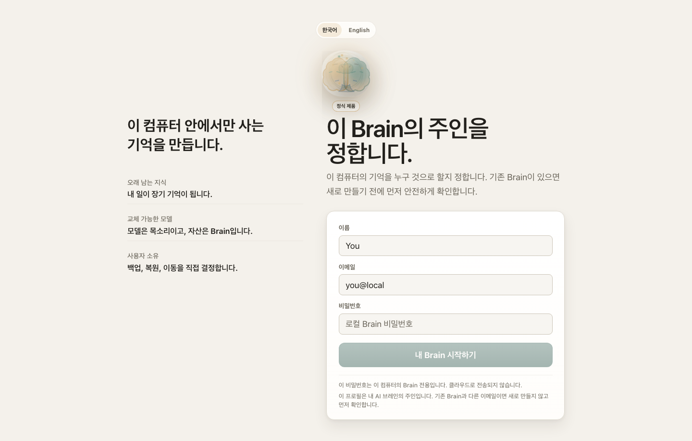
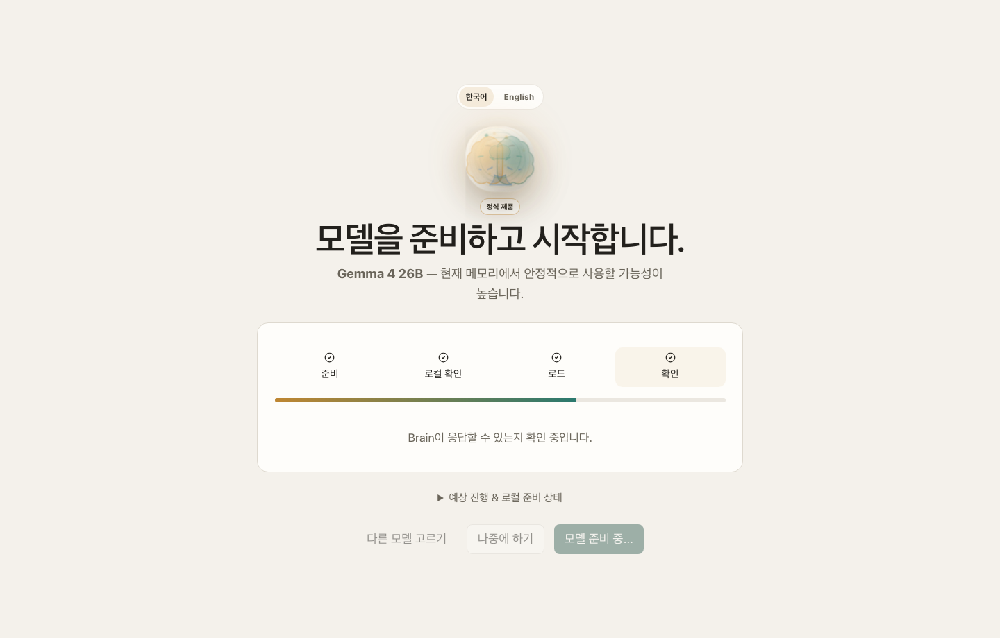
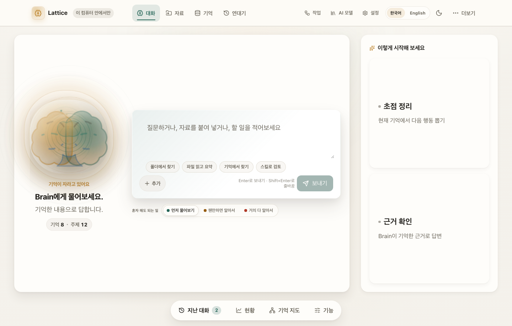
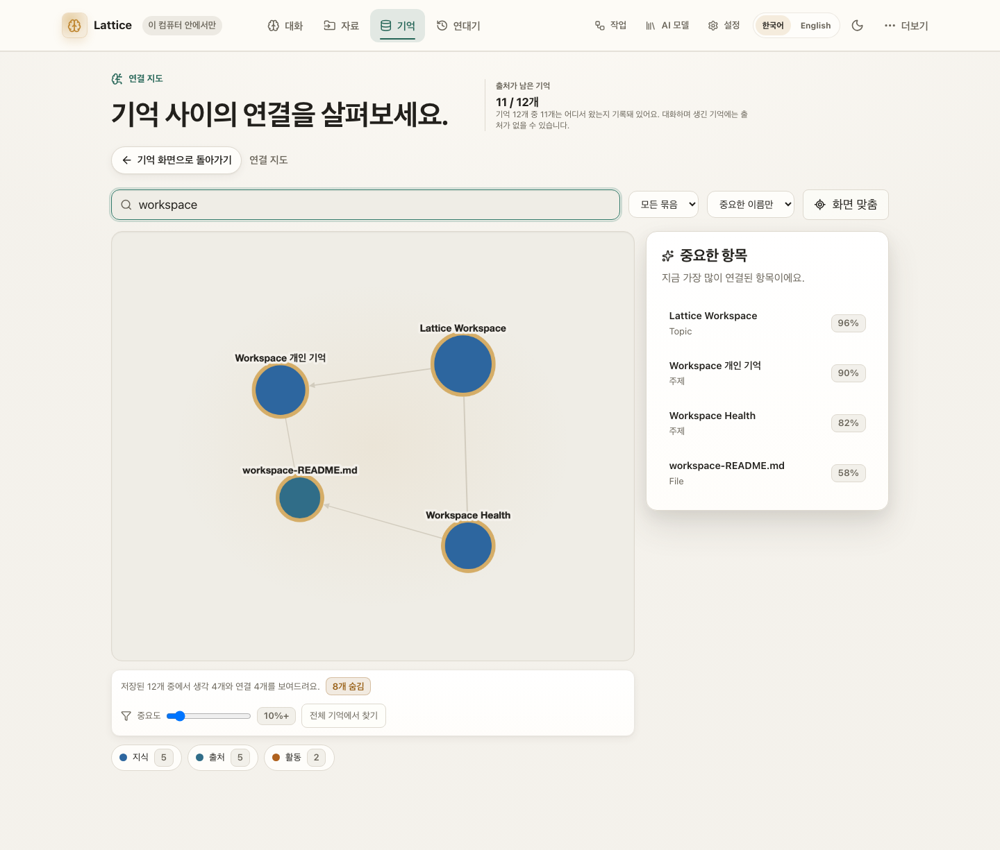
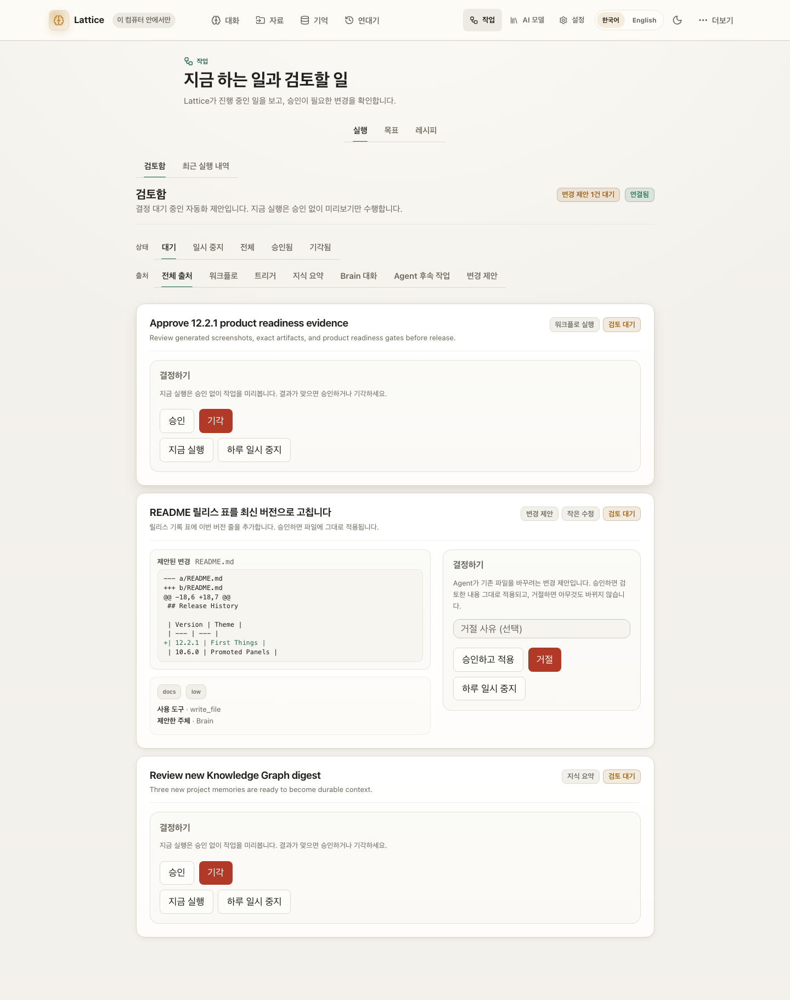
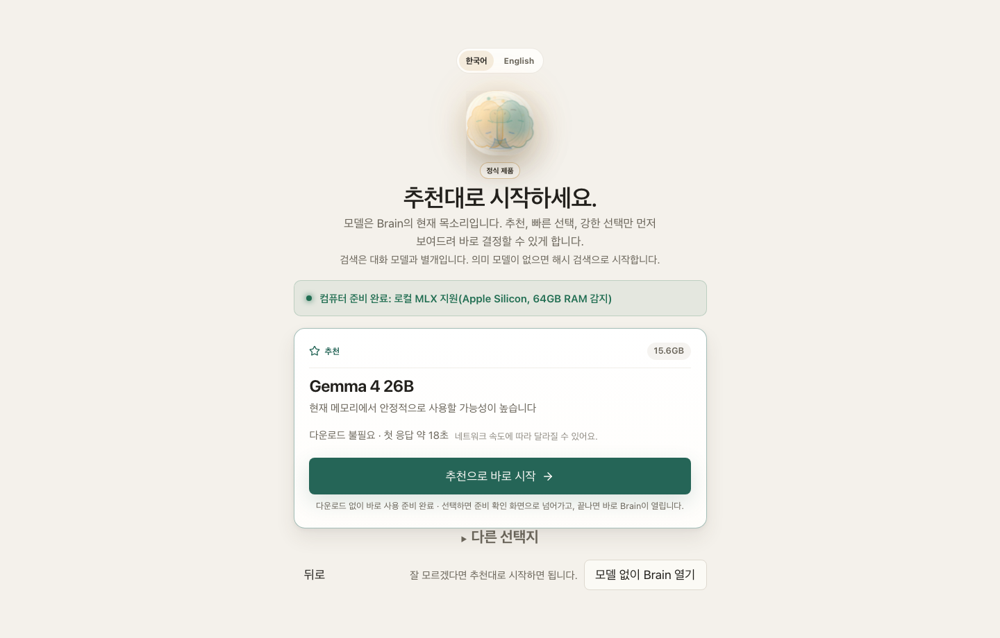
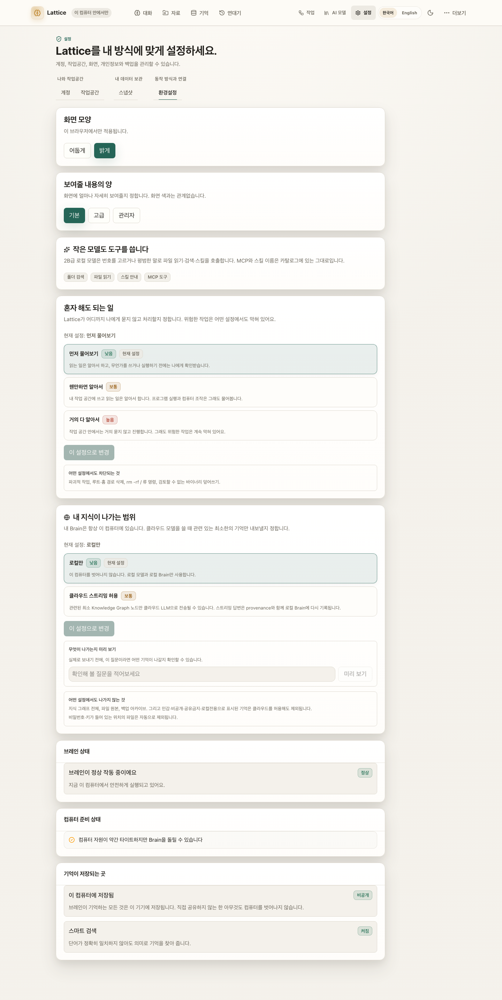

# Lattice AI

**Your model is the voice you use today. Your Brain is the asset you keep.**

**모델은 갈아타도, 내 지식은 내 컴퓨터에 남는 로컬 우선 AI 브레인.**

[](https://pypi.org/project/ltcai/)
[](https://www.npmjs.com/package/ltcai)
[](https://marketplace.visualstudio.com/items?itemName=parktaesoo.ltcai)
[](https://open-vsx.org/extension/parktaesoo/ltcai)
[](https://github.com/TaeSooPark-PTS/LatticeAI/actions/workflows/ci.yml)
[](https://github.com/TaeSooPark-PTS/LatticeAI/actions/workflows/publish.yml)
[](LICENSE)


Lattice AI is a Digital Brain that lives on your computer. Chat, files,
folders, notes, and web pages all land in one knowledge graph you own.
The default is local. Cloud is optional, and nothing leaves the machine
without your consent.

대화·파일·폴더·웹페이지가 전부 내 컴퓨터 안의 지식 그래프로 쌓입니다.
기본은 로컬이고, 클라우드는 선택입니다.

## Install

```bash
pip install ltcai        # or: npm install -g ltcai
LTCAI                    # then open http://127.0.0.1:4825/app
```

- Apple Silicon local models: `pip install "ltcai[local]"`
- Mac app: the `.dmg` on each [GitHub Release](https://github.com/TaeSooPark-PTS/LatticeAI/releases)
- Editor: the [VS Code / Cursor / Open VSX](https://marketplace.visualstudio.com/items?itemName=parktaesoo.ltcai) extension

## First five minutes

1. Open the app and sign in as the owner.
2. Pick a recommended local model for this computer.
3. Drop a folder, a file, or a note into Capture.
4. Ask the Brain a question in your own words.

| | | |
| --- | --- | --- |
|  |  |  |

Screenshot index:
[output/release/v12.2.1/SCREENSHOT_INDEX.md](output/release/v12.2.1/SCREENSHOT_INDEX.md)

## What you can do

| | |
| --- | --- |
| **See your Brain's story in time** — a growth curve, an activity heatmap, and each day's story  | **Chat with a Brain that remembers** — every conversation grows durable, source-linked memory  |
| **See how knowledge connects** — a real relationship graph, not a file list  | **Capture anything** — files, whole folders, notes, screenshots, web pages  |
| **Automate with review** — agent changes become proposals you approve first  | **Pick a model in one click** — recommended local models for your hardware  |
| **Watch a file become memory** — three named steps, not a pipeline diagram  | **Say how much it may do alone** — one dial in plain words  |

## Why this is yours

- **The memory stays.** Knowledge lives in a local SQLite Brain you can back up, export, inspect, and restore (`.latticebrain`).
- **The model is replaceable.** Switch local MLX and optional cloud without rebuilding context from zero.
- **It says when it does not know.** Thin retrieval, a poor page extract, or hash-only search is named, not dressed as meaning.
- **Edits wait for you.** New files can land with little friction. Changing or deleting existing files becomes a proposal with a diff.
- **Small models can still act.** A 2B-class local model can call tools and skills; a model too small to emit JSON is walked through numbered choices.

매번 AI에게 프로젝트 맥락을 다시 설명하고 있다면, 지식이 여러 서비스에 흩어져
있다면, 그 기억을 특정 회사가 아니라 내가 소유하고 싶다면 — Lattice AI가 그
브레인입니다.

## Current Release

The current release is **12.2.1 — True Count**:

Search, skip, watch, and small-model answers now count what is actually
there instead of dumping, rehashing, or pretending. The door is still
**422 operations / 41 families** over a **20-route worker**. Cloud is
still optional and the default is still local.

- **Search does not dump the Brain.** A warm HNSW query is `COUNT(*)`
  then, if needed, the missing vectors only. Writes stay on one
  `GraphWriter`.
- **A touch is a stamp, not a re-ingest.** Same bytes with a new mtime
  restamp provenance so the next scan skips by stamp.
- **A vanished watched file leaves the graph.** Disk is never deleted.
- **A thin summary is filled from the file that was read**, or held for
  review — never marked done with empty words.
- **MCP tools stay in the compact nine-row list.** `api_key` cloud
  verifies with a live `GET /models` (no billed completion). Hash
  search is named as hash, with a path to a meaning model.

Release notes live in [docs/releases/](docs/releases/). This version:
[docs/releases/RELEASE_NOTES_v12.2.1.md](docs/releases/RELEASE_NOTES_v12.2.1.md).
Guide: [RELEASE.md](RELEASE.md) · History: [docs/CHANGELOG.md](docs/CHANGELOG.md).

Expected artifacts for 12.2.1 must use exact filenames:

- `dist/ltcai-12.2.1-py3-none-any.whl`
- `dist/ltcai-12.2.1.tar.gz`
- `ltcai-12.2.1.tgz`
- `dist/ltcai-12.2.1.vsix`
- `src-tauri/target/release/bundle/dmg/Lattice AI_12.2.1_aarch64.dmg`

Do not use wildcard artifact uploads. Package registry publishing remains owner-run.

## Architecture At A Glance

One Rust server on localhost is the source of truth: `lattice-host` answers
every product route, owns every write to the Brain, and supervises a Python
**AI worker** it reaches over loopback for the things a model does — inference,
embedding, extraction, parsing, rendering, speech-to-text. The React/Vite
frontend and the Tauri desktop shell sit on top of that one door. Local-first
by default — cloud is optional (OAuth CLI or an API key you configure),
and downloads, Brain Network, and update checks are opt-in.

See [ARCHITECTURE.md](ARCHITECTURE.md) for details and
[docs/DEVELOPMENT.md](docs/DEVELOPMENT.md) for the developer workflow
(`npm start` / `bin/ltcai.js` is the product; `npm run dev` is the
20-route worker). Each of the two largest crates carries its own domain
map — [rust/lattice-agent/ARCHITECTURE.md](rust/lattice-agent/ARCHITECTURE.md)
and [rust/lattice-platform/ARCHITECTURE.md](rust/lattice-platform/ARCHITECTURE.md)
— and open gaps are tracked in [docs/ROADMAP.md](docs/ROADMAP.md).
Validation via `npm run lint`, `npm run test:unit`, `npm run test:visual`.

## Known Limitations

- External package registries are owner-published and can lag behind GitHub.
- SQLite is the live local Brain store. The optional PostgreSQL/pgvector
  migration tooling is not part of the 12.1.0 worker.
- Docker, model downloads, cloud model calls, Brain Network, and update checks
  require explicit user action. Cloud is optional: `cli_oauth` (`agy` /
  `grok`) was live-checked at zero billing; the `api_key` path probes
  `GET /models` with the key and fail-closes if the provider is
  unreachable — it does not run a billed completion to verify.
- **The Telegram bridge was removed in 11.6.0** — it lived in the platform code
  that became the AI worker. **SSO/OIDC login and callback flows were removed
  with it**; the configuration surface remains and password login is native.
- Conversation does not fabricate answers when no model is loaded. Agent and
  workflow simulation without a loaded LLM is deterministic and LLM-free (it
  does not call a model) — labeled as such, never presented as autonomous
  model success.
- `POST /worker/render/pdf` ships working out of the box: `reportlab` is a
  required dependency as of 11.6.0 (it used to be an undeclared lazy import
  that raised a 500; `ltcai[pdf]` remains as an empty alias for older
  install instructions).
- The multimodal image and video analysis functions have no HTTP door as of
  11.8.0: their only route wrapped a native image ingest that was never
  built. The observation code stays in Brain Core under unit test, and its
  module header says so.
- The Python coverage gate is a **line floor of 90** since 11.8.0 (the
  100%-lines-and-branches gate was removed). The enforced claim is the
  floor, not whatever a given run measures.
- **Small-model *content* quality is gated honestly.** With the `guided`
  profile even a 0.5B model writes the requested file and reaches DONE.
  A requested summary is filled from the file that was actually read;
  if those words are still missing the run is held for review, not
  marked done.
- Vector search env still defaults to `brute` — exact and byte-compatible
  on a small Brain. At 512+ vectors with a bound worker sidecar it tries
  `hnsw+rescore` first and falls back to the exact scan if the sidecar
  cannot answer. `LATTICEAI_VECTOR_INDEX=hnsw` is still the explicit
  opt-in.
- Watch prune removes vanished files from the **graph**, never from
  disk. A one-shot folder ingest still reports vanished files and
  waits for the confirmed prune door.
- The macOS dmg is ad-hoc signed — effectively unsigned — so first launch
  needs the usual Gatekeeper step.
- Pointer-control tools execute in the worker and are installed with
  `pip install "ltcai[pointer]"`. Remaining honest gaps (`open_keys`
  pending-only, no Self-Model refiner, `delete_node` leaving `PART_OF`,
  review events silent without an owner, KG-api ingest text-only, two
  store cycles per review mutation) are listed with their reasons in
  [docs/releases/RELEASE_NOTES_v12.2.1.md](docs/releases/RELEASE_NOTES_v12.2.1.md)
  and prioritized in [docs/ROADMAP.md](docs/ROADMAP.md).

## Release History

Public history starts at 11.0.0. 11.6.0 rebuilt the product server in Rust and
reduced the Python package to an AI worker, so a 10.x or 9.x install is a
different program; `SECURITY.md` supports only 11.x, and this table states the
same boundary. Earlier notes live in [docs/releases/](docs/releases/).

| Version | Theme |
| --- | --- |
| 12.2.1 | True Count |
| 12.2.0 | Small Voice |
| 12.1.0 | Fast Path |
| 12.0.0 | Open House |
| 11.9.0 | Working Order |
| 11.8.0 | Travel Light |
| 11.7.0 | Clean Sweep |
| 11.6.0 | One Door |
| 11.5.2 | Tight Ship |
| 11.5.1 | Rust Full Loop |
| 11.5.0 | Rust Complete |
| 11.4.0 | Rust Foundation |
| 11.3.0 | Time Remembers |
| 11.2.0 | All Systems On |
| 11.1.0 | Product Intelligence |
| 11.0.1 | Both Branches |
| 11.0.0 | Full Measure |

Per-release details: [RELEASE_NOTES.md](RELEASE_NOTES.md) · folder: [docs/releases/](docs/releases/)
