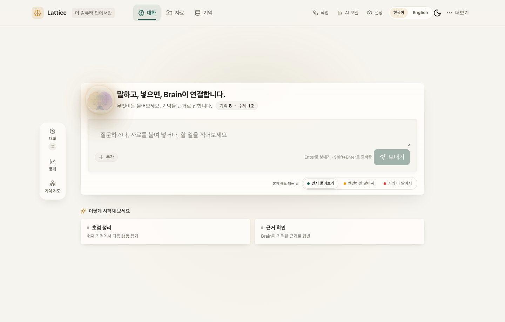
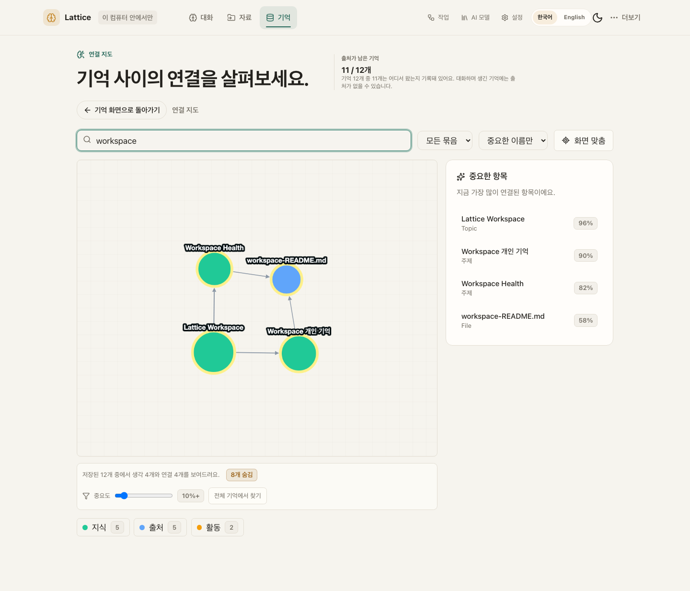
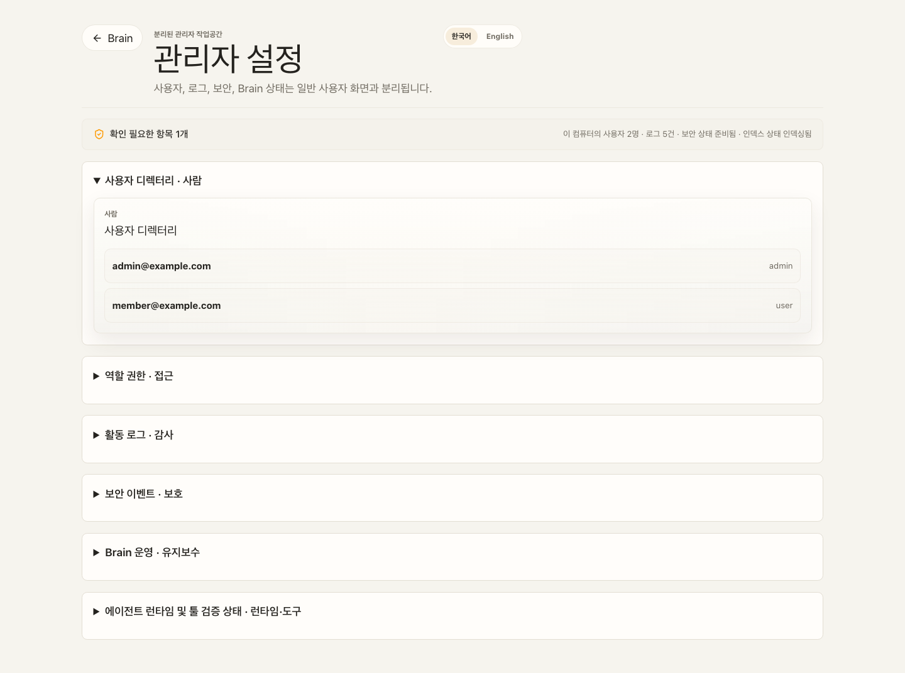
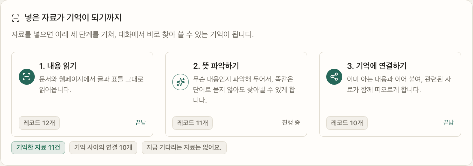
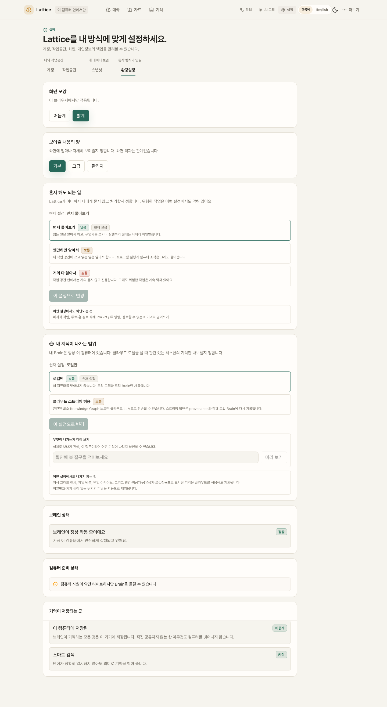
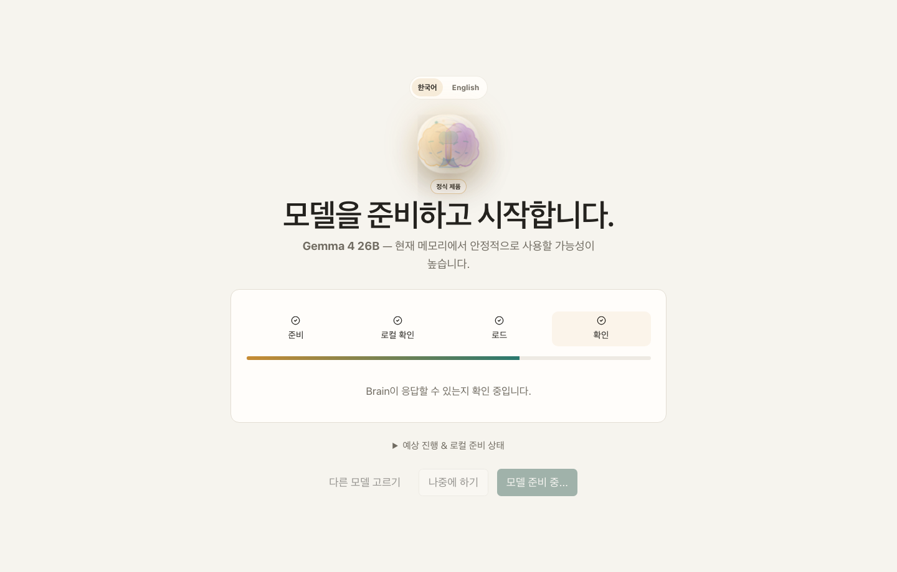
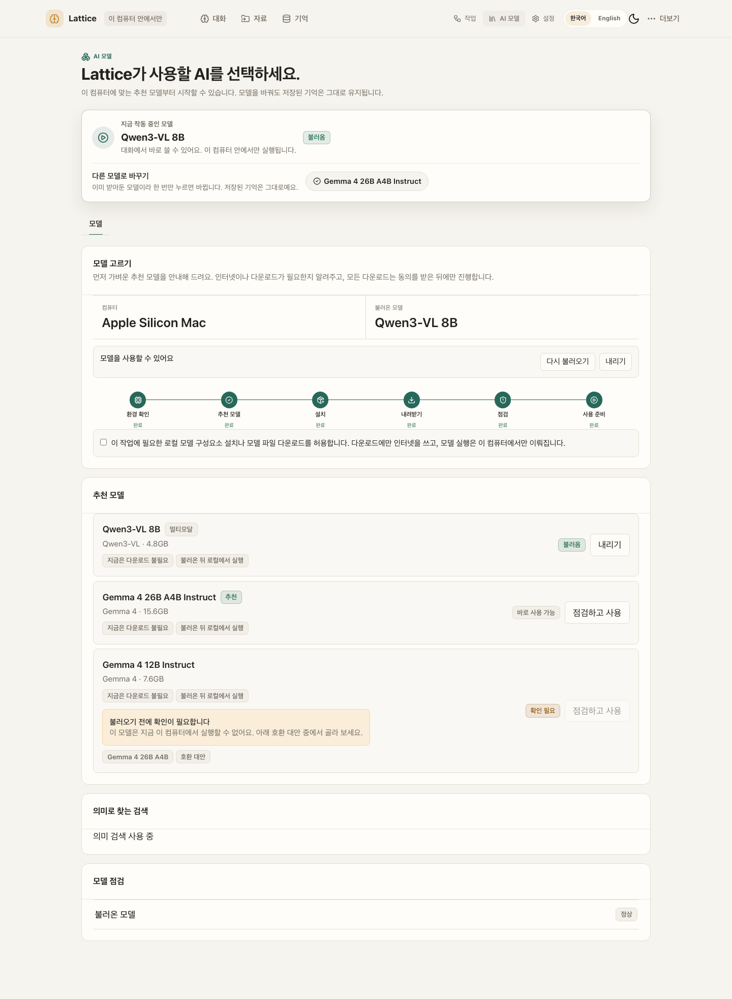

# Lattice AI

**Your model is the voice you use today. Your Brain is the asset you keep.**

**모델은 갈아타도, 내 지식은 내 컴퓨터에 남는 로컬 우선 AI 브레인.**

[](https://pypi.org/project/ltcai/)
[](https://www.npmjs.com/package/ltcai)
[](https://marketplace.visualstudio.com/items?itemName=parktaesoo.ltcai)
[](https://open-vsx.org/extension/parktaesoo/ltcai)
[](https://github.com/TaeSooPark-PTS/LatticeAI/actions/workflows/ci.yml)
[](LICENSE)


Chat, files, folders, notes, and web pages all flow into one durable knowledge
graph on your computer. Any model — local MLX or cloud — can speak with that
memory. Nothing leaves your machine without explicit consent.

대화·파일·폴더·웹페이지가 전부 내 컴퓨터 안의 지식 그래프로 쌓이고, 어떤
모델이든 그 기억을 이어받아 대화합니다.

## What You Can Do

| | |
| --- | --- |
| **Chat with a Brain that remembers** — every conversation grows durable, source-linked memory  | **See how knowledge connects** — a real relationship graph, not a file list  |
| **Capture anything** — files, whole folders, notes, screenshots, web pages  | **Automate with review** — agent changes become proposals you approve first  |
| **Pick a model in one click** — recommended local models for your hardware  | **Stay in control** — audit, roles, retention in a separate admin surface  |
| **Watch a file become memory** — three named steps, not a pipeline diagram  | **Say how much it may do alone** — one dial in plain words; dangerous actions stay blocked either way  |

## Why Lattice AI

- **Own your memory** — knowledge lives in a local SQLite Brain you can back up,
  export, inspect, and restore (`.latticebrain` encrypted archive).
- **Model-independent** — switch between local MLX models and cloud models
  without rebuilding context from zero.
- **Honest by design** — the Brain tells you when retrieval context is limited,
  when captured pages extracted poorly, and when the vector index is catching up.
- **Safe automation** — automations are consent-first drafts; edits to existing
  content always pass through a reviewable proposal with a diff.

매번 AI에게 프로젝트 맥락을 다시 설명하고 있다면, 지식이 여러 서비스에 흩어져
있다면, 그 기억을 특정 회사가 아니라 내가 소유하고 싶다면 — Lattice AI가 그
브레인입니다.

## Quick Start

```bash
pip install ltcai        # or: npm install -g ltcai
LTCAI                    # then open http://127.0.0.1:4825/app
```

Apple Silicon local models: `pip install "ltcai[local]"`. Desktop app (Tauri)
ships as a dmg on each [GitHub Release](https://github.com/TaeSooPark-PTS/LatticeAI/releases).

First-run flow — wake the Brain, pick the owner, load a recommended model:

| | | |
| --- | --- | --- |
|  |  |  |

Screenshot index and capture notes:
[output/release/v11.1.0/SCREENSHOT_INDEX.md](output/release/v11.1.0/SCREENSHOT_INDEX.md)

## Current Release

The current release is **11.1.0 — Product Intelligence**:

The v9–v11.0 line hardened the foundation — proposal-first trust, honest
signals, a 100% line-and-branch test floor. 11.1.0 builds the intelligence
layer on top of it: **the Brain gets fast at scale, notices things on its
own, remembers pictures and recordings, learns who you are, and connects to
the tools you already use.**

- **Fast at scale.** A pluggable vector-index layer (brute-force default,
  int8 quantized and HNSW opt-in via the `hnsw` extra) plus a durable
  background embed queue. Measured on Apple Silicon: hybrid search p50 at
  10k vectors went from 299 ms to **10.1 ms**, and stays at 43.9 ms at 50k
  (recall@10 0.987) — the plan's <50 ms target met at 5× the target corpus.
  Approximate results say `approx: true`; quantized's honest verdict (no RAM
  win here, ~2.2× slower) is printed, not hidden.
- **Alive, not just searchable.** Contradiction detection now files
  review-queue proposals with plain-language resolutions; approving one
  stamps the temporal model (`valid_from`/`valid_to`/`superseded_by`, with
  `as_of(timestamp)` slicing). Event-driven synthesis proposes parent
  concepts, missing links and a proactive Brain Brief after every 25th
  ingest — every write goes through the proposal path, asserted by tests.
- **Pictures and recordings are memories.** Behind `allow_multimodal`
  (default off, off ⇒ byte-identical): images become first-class `Image`
  nodes with OCR text, real captions only when a vision model produced one
  (the caption-fabricating stub was deleted), separate image vectors with
  late fusion, and inline thumbnails in the Evidence panel that never bypass
  the local-file approval gate. Recordings are first-class `Audio` nodes
  with honest transcription degradation.
- **It knows you — transparently.** A Self-Model subgraph (Self /
  Preference / Decision / Habit / Relationship) built only from proposals
  you approve, injected into answer context under a strict token budget,
  fully listable and deletable. Agents can propose whole-folder
  reorganizations — structurally incapable of proposing deletions.
- **Connected, selectively.** An approval-gated Obsidian vault bridge
  (wikilinks become edges, idempotent re-runs) and a signed, encrypted
  subgraph-share prototype where received knowledge arrives as proposals —
  off by default behind `LATTICEAI_BRAIN_NETWORK`.

All of it lands with the floor intact: **6,261 tests, 100.00% of 37,590
statements and 10,658 branches**, verified on macOS 3.14, a fresh-resolve
python 3.11 environment, and a clean linux python:3.14 container.

Release notes: [RELEASE.md](RELEASE.md) · Full history: [docs/CHANGELOG.md](docs/CHANGELOG.md)

Expected artifacts for 11.1.0 release must use exact filenames:

- `dist/ltcai-11.1.0-py3-none-any.whl`
- `dist/ltcai-11.1.0.tar.gz`
- `ltcai-11.1.0.tgz`
- `dist/ltcai-11.1.0.vsix`
- `src-tauri/target/release/bundle/dmg/Lattice AI_11.1.0_aarch64.dmg`

Do not use wildcard artifact uploads. Package registry publishing remains owner-run.

## Architecture At A Glance

FastAPI on localhost is the source of truth; the React/Vite frontend and the
Tauri desktop shell sit on top; the independent `lattice_brain` package owns
the graph, memory, ingestion, and portability. Local-first by default — cloud
calls, downloads, Telegram, and update checks are opt-in.

See [ARCHITECTURE.md](ARCHITECTURE.md) for details and
[docs/DEVELOPMENT.md](docs/DEVELOPMENT.md) for the developer workflow
(`npm install && npm run dev`, validation via `npm run lint`,
`npm run test:unit`, `npm run test:visual`).

## Known Limitations

- External package registries are owner-published and can lag behind GitHub.
- PostgreSQL/pgvector is optional scale/migration tooling. SQLite remains the
  live local Brain store in 10.3.0.
- Docker, model downloads, cloud model calls, Telegram, Brain Network, and
  update checks require explicit user action.
- Conversation does not fabricate answers when no model is loaded. Agent and
  workflow simulation without a loaded LLM is deterministic and LLM-free (it
  does not call a model) — labeled as such, never presented as autonomous
  model success.
- Some backend-generated messages (for example the Postgres DSN notice) are
  produced server-side in English and are shown as-is; server-side i18n is not
  part of 10.3.0.

## Release History

| Version | Theme |
| --- | --- |
| 11.1.0 | Product Intelligence |
| 11.0.1 | Both Branches |
| 11.0.0 | Full Measure |
| 10.10.0 | Quiet Station |
| 10.9.0 | Never Blocks |
| 10.8.0 | Within Reach |
| 10.7.0 | Plain Surface |
| 10.6.4 | Loud Limits |
| 10.6.3 | Loud Limits |
| 10.6.2 | Ask First |
| 10.6.1 | First Things |
| 10.6.0 | Promoted Panels |
| 10.5.0 | Everyday Words |
| 10.4.0 | Named Ground |
| 10.3.0 | Measured Ground |
| 10.2.0 | Load-Bearing Fixes |
| 10.1.1 | Reachable Boundary |
| 10.1.0 | Hybrid Brain |
| 10.0.1 | One Source of Truth |
| 10.0.0 | Plain Language |
| 9.9.9 | Lean Shell |
| 9.9.8 | Autonomy Dial |
| 9.9.7 | No Gaps Left |
| 9.9.6 | Same Brain Everywhere |
| 9.9.5 | Closed Gaps |
| 9.9.4 | Durable Loops |
| 9.9.3 | Closed Loops |
| 9.9.2 | Artifact Trust |
| 9.9.1 | Clean Foundations |
| 9.9.0 | Fail-Closed Trust |
| 9.8.0 | Honest Knowledge Pipeline |
| 9.7.0 | Proactive Hybrid Brain |
| 9.6.0 | Trusted Agent Loop |
| 9.5.0 | Command Center |
| 9.4.0 | Question-Driven Everyday Automation |
| 9.3.0 | Proactive Brain Intelligence |
| 9.2.0 | Model-Agnostic File Generation |
| 9.1.0 | Code Review Completion & Fail-Closed Runtime |
| 9.0.0 | Code Review Closure & Runtime Cleanup |

Per-release details: [RELEASE_NOTES.md](RELEASE_NOTES.md)

## Documentation

- [docs/WHY_LATTICE.md](docs/WHY_LATTICE.md) — product philosophy
- [docs/TRUST_MODEL.md](docs/TRUST_MODEL.md) — local-first trust model
- [PRIVACY.md](PRIVACY.md) — privacy and external communication policy
- [FEATURE_STATUS.md](FEATURE_STATUS.md) — feature status and limitations
- [SECURITY.md](SECURITY.md) — security posture
- [RELEASE.md](RELEASE.md) — release guide and notes

## License

MIT. See [LICENSE](LICENSE).
