# Lattice AI

[](https://pypi.org/project/ltcai/)
[](https://www.npmjs.com/package/ltcai)
[](https://marketplace.visualstudio.com/items?itemName=parktaesoo.ltcai)
[](https://open-vsx.org/extension/parktaesoo/ltcai)
[](https://github.com/TaeSooPark-PTS/LatticeAI/actions/workflows/ci.yml)
[](LICENSE)

**Lattice AI v5.0.0 is the local-first Living Brain multilingual foundation release.**
It keeps the v4 Brain Core, StorageEngine, FastAPI localhost API, Tauri shell,
backup, restore, model runtime, graph, and portability architecture intact while
making the normal user surface easier for non-technical users: safer login,
clearer model setup, one-click Memory/Topic/Relationship/Graph views, visible feedback when conversation becomes Brain memory, and Korean/English language choice across first-run and Brain screens. Admin logs, role
permissions, security events, retention posture, and Brain operations remain in
the separate Admin Console.

The product opens by stating the core reason to exist: models will change, but
the user's knowledge should not. It creates a private local profile, studies the
computer, recommends a replaceable model voice, asks before install/download/load
work, then lands in Brain Chat with starter prompts for durable decisions,
projects, documents, and context. The Brain home now gives direct buttons for
memory, topics, relationships, and the full graph, so the graph is still real
and searchable without becoming the first screen or a separate dashboard.

External package registries are owner-published and can lag behind this GitHub
Release. Release uploads must use the exact v5.0.0 artifact filenames below.

## Living Brain Flow

### 1. Login

First launch opens to Login only. The local profile is the beginning of the
Brain, not a dashboard, graph, or setup grid. The first screen frames Lattice as
a durable knowledge home where models are replaceable and ownership stays with
the user. v5.0.0 also prevents an email typo or wrong saved-user password from
silently creating a new empty Brain.

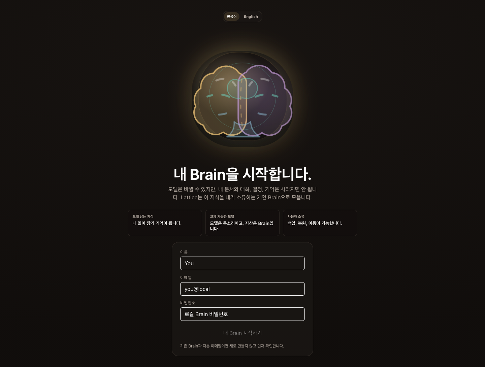

### 2. Environment Analysis

Lattice reads the machine locally and summarizes what kind of Brain this
computer can support.

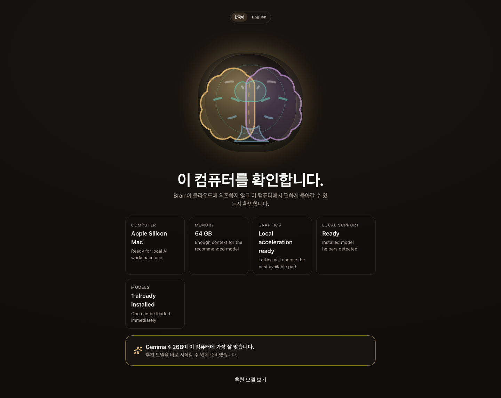

### 3. Recommended Models

The model step is a short recommendation list. It avoids catalog noise and keeps
runtime/install details behind clear user consent. Users who do not know which
model to choose can start with the recommended model in one click.

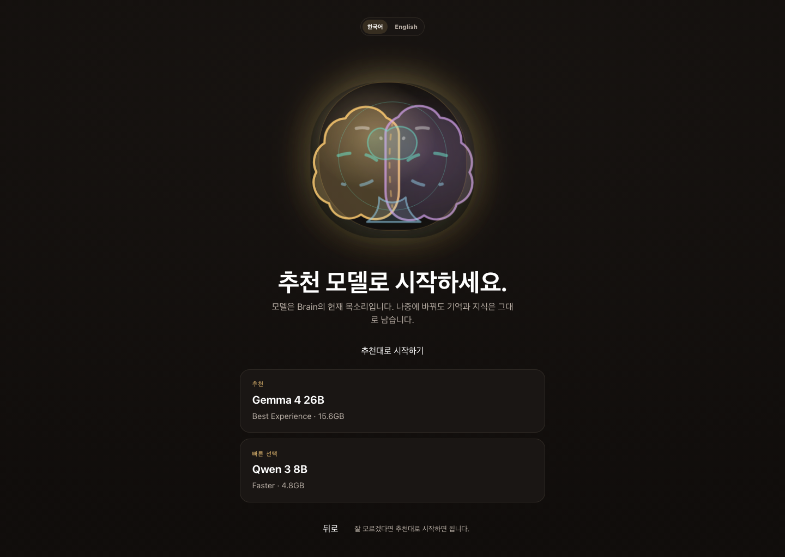

### 4. Install And Load

The install screen keeps consent visible and shows install, download, validate,
and load progress. No model download or runtime install starts silently, and the
screen explains that large downloads may take minutes without inventing fake ETA
data.

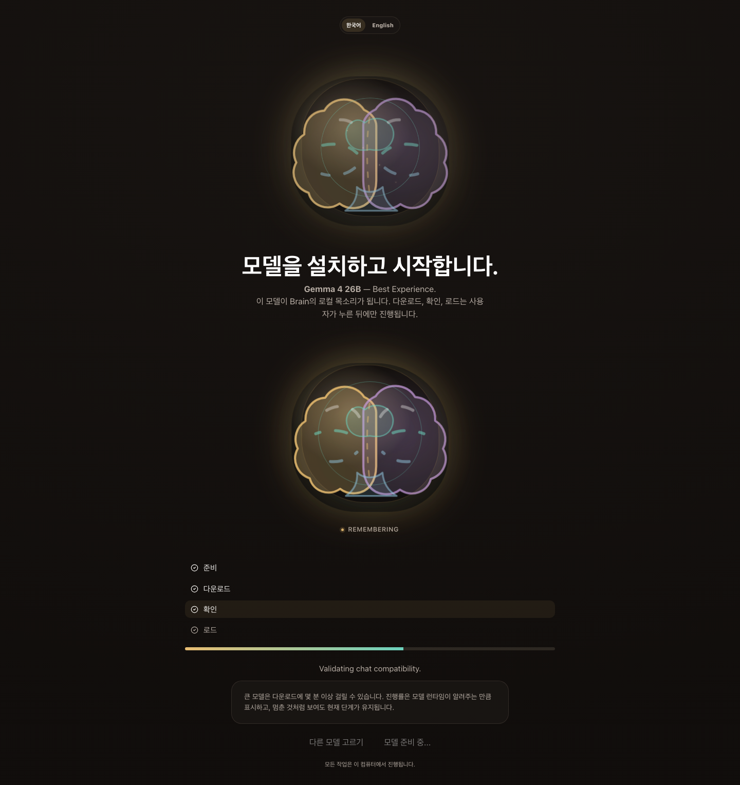

### 5. Brain Chat

After setup, the home experience is the living Brain plus conversation. The Brain
stays present while the user types, recalls context, and receives responses. The
home now includes a compact Brain overview for recent memories, older memories,
and major topics, plus saved-to-memory feedback after chat.

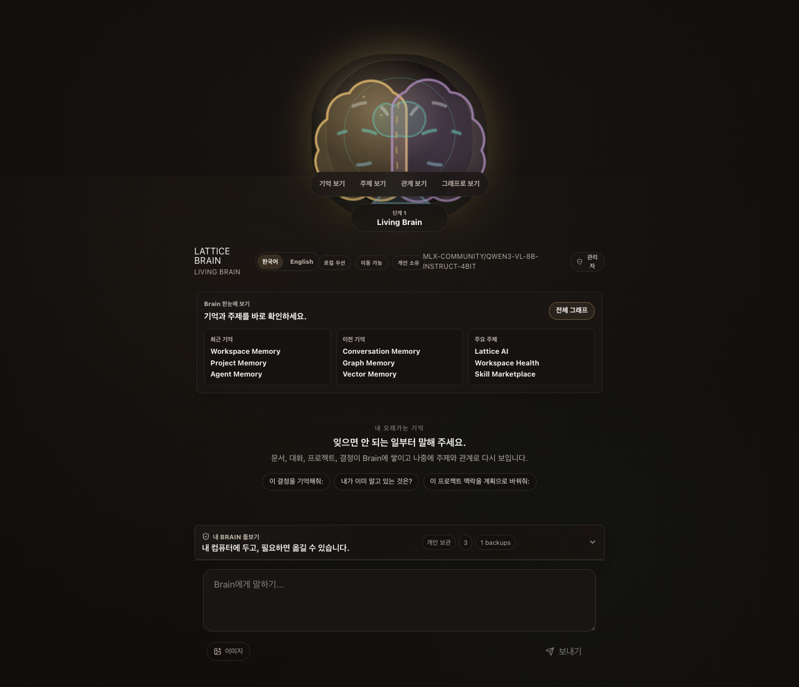

## Brain Depths

The user travels inward through the Brain. Each depth keeps conversation nearby
while revealing more structure.

| Depth | Experience | Evidence |
| --- | --- | --- |
| Level 1 | Living Brain presence |  |
| Level 2 | Memory Layer | 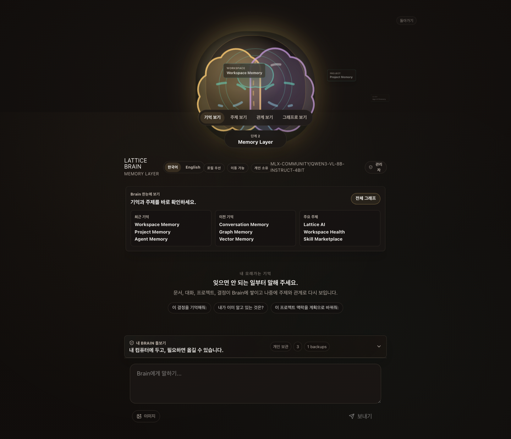 |
| Level 3 | Knowledge Layer | 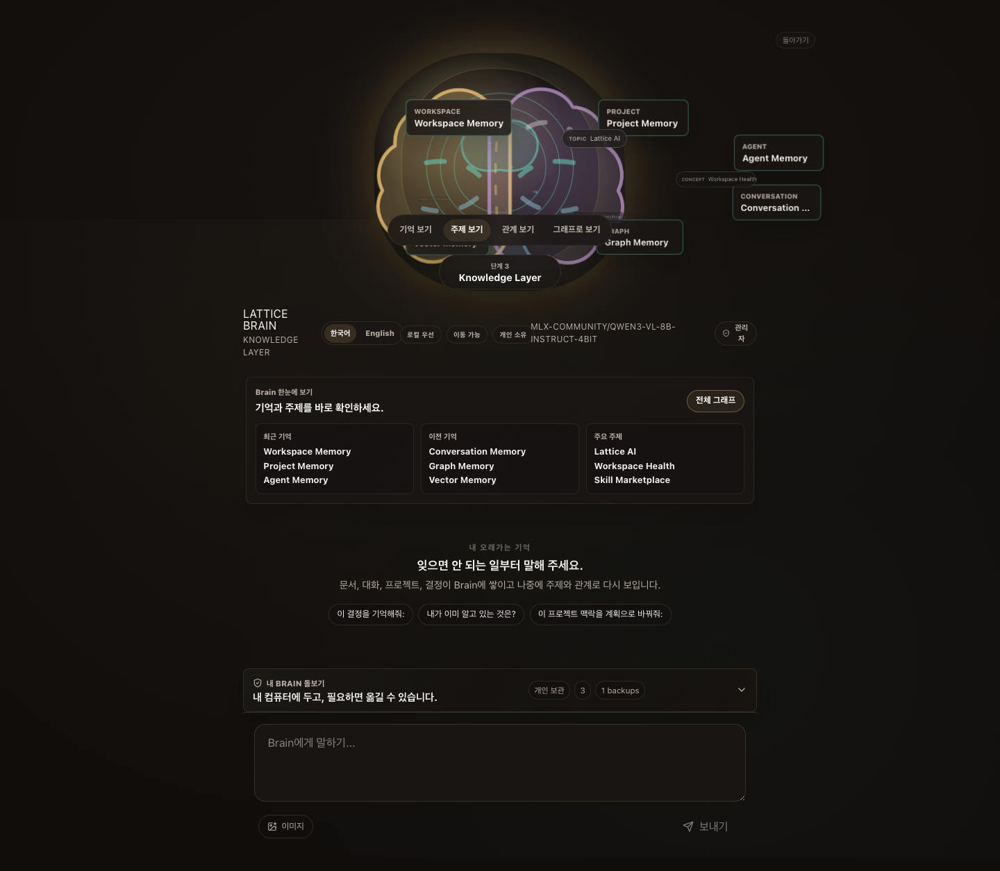 |
| Level 4 | Relationship Layer | 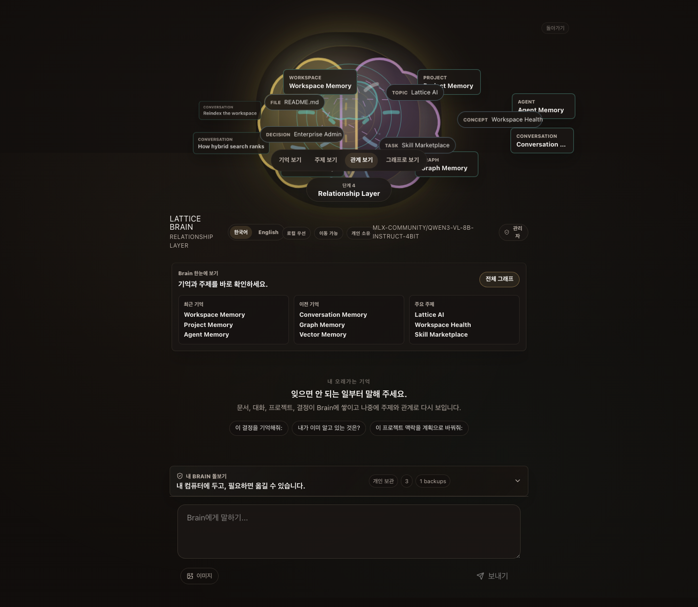 |
| Level 5 | Knowledge Graph with nodes, edges, search, and focus detail | 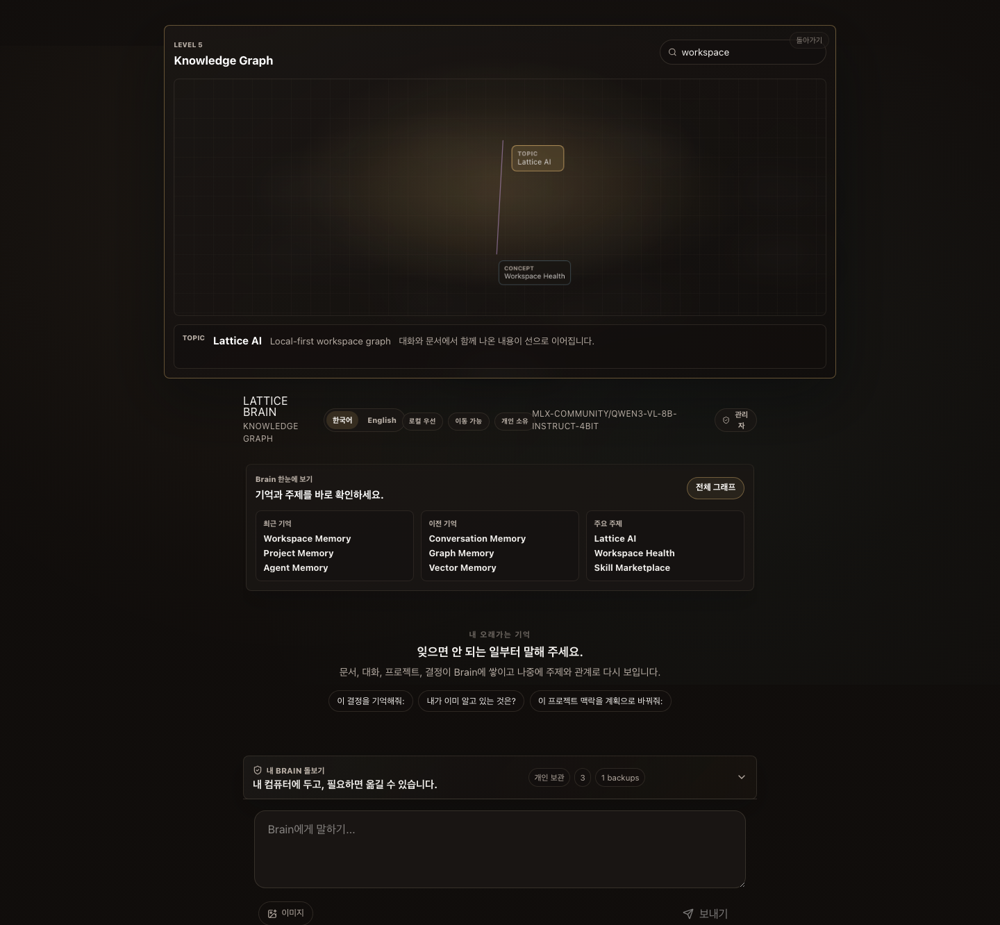 |

Walkthrough:

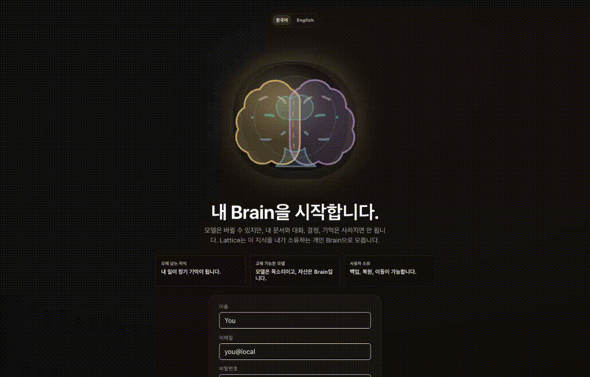

Model setup status evidence:

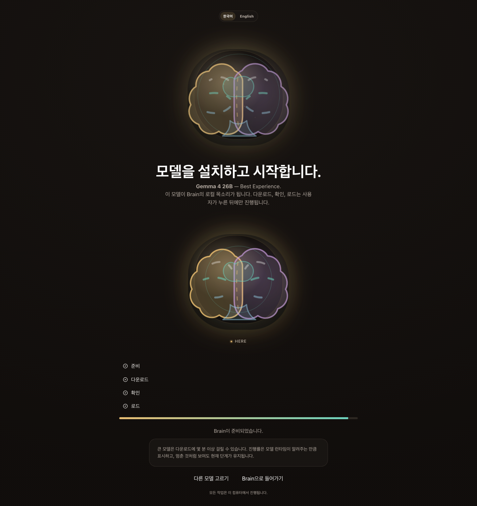

Separate admin console evidence:

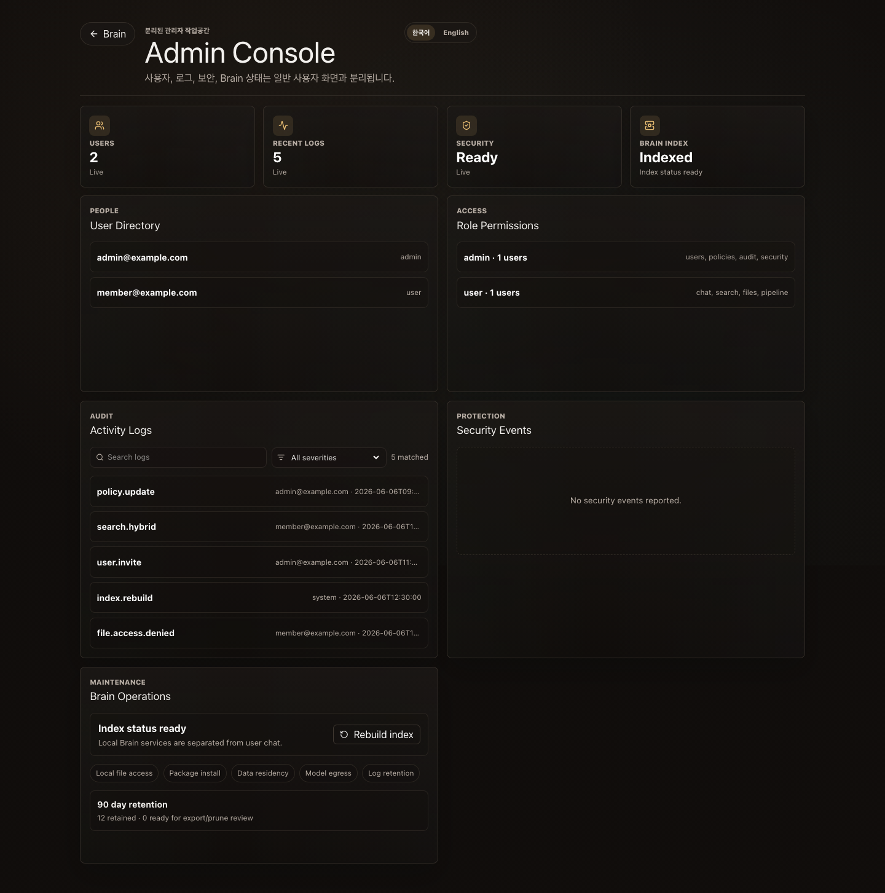

Screenshot index and capture notes:
[output/release/v5.0.0/SCREENSHOT_INDEX.md](output/release/v5.0.0/SCREENSHOT_INDEX.md)

## Architecture At A Glance

- **Desktop shell**: Tauri 2 is the release desktop shell and starts the
  localhost sidecar.
- **Frontend**: React, TypeScript, Vite, TanStack Query, Zustand, Cytoscape.js,
  React Flow, Tailwind/shadcn-style primitives, and generated OpenAPI types.
- **Backend**: FastAPI on localhost is the UI source of truth.
- **Brain Core**: independent `lattice_brain` package for graph, memory,
  context, conversations, ingestion, runtime, workflow, storage, and
  portability. Isolation tests prevent `lattice_brain` from importing
  `latticeai`.
- **Storage**: `StorageEngine` abstraction with SQLite default and optional
  PostgreSQL/pgvector scale mode.
- **Portability**: encrypted `.latticebrain` archives plus backup, restore,
  inspect, verify, import dry-run, and confirmed restore/import flows. The
  Brain home keeps conversation first and surfaces the everyday "Care for my
  Brain" ownership path as a collapsed control with export, backup, archive,
  inspect, and restore preview actions while keeping destructive confirmed
  restore in Settings. Restore operations create pre-restore backups and roll
  back failed DB/blob swaps so the current Brain is not left half-restored.
- **Privacy**: local-first and private-first by default. Cloud models, Telegram,
  Brain Network, Docker/Postgres setup, model downloads, and update checks are
  opt-in paths.
- **Admin separation**: user chat and Brain ownership stay in the main Brain
  surface; user directory, audit logs, security events, policies, and index
  rebuild controls live under the separate `#/admin` console. Admin history,
  audit, stats, and sensitivity reads honor the active workspace when present.

See [ARCHITECTURE.md](ARCHITECTURE.md) for the detailed v5.0.0 architecture.

## Installation

Run from Python:

```bash
pip install ltcai
LTCAI
```

Run from npm:

```bash
npm install -g ltcai
ltcai
```

Open the local app:

```text
http://127.0.0.1:4825/app
```

Apple Silicon local model extras:

```bash
pip install "ltcai[local]"
```

## Release Artifacts

Validated v5.0.0 artifacts:

- `dist/ltcai-5.0.0-py3-none-any.whl`
- `dist/ltcai-5.0.0.tar.gz`
- `ltcai-5.0.0.tgz`
- `dist/ltcai-5.0.0.vsix`
- `src-tauri/target/release/bundle/dmg/Lattice AI_5.0.0_aarch64.dmg`

Attach only those exact files to the GitHub Release. Do not upload `dist/*`.

## Local Development

```bash
npm install
npm run dev
```

Build and validate release artifacts:

```bash
npm run release:artifacts
npm run release:validate
```

Main validation set:

```bash
npm run check:python
node scripts/run_python.mjs -m ruff check .
npm run lint
npm run typecheck
npm run test:unit
npm run test:integration
npm run test:visual
npm run desktop:tauri:check
node scripts/run_python.mjs scripts/wheel_smoke.py --wheel dist/ltcai-5.0.0-py3-none-any.whl
npm pack --dry-run
npm run docs:check-links
```

## Known Limitations

- External package registries are owner-published and can lag behind the GitHub
  Release.
- PostgreSQL/pgvector is optional scale mode. SQLite is the default local brain.
- Docker, model downloads, cloud model calls, Telegram, Brain Network, and
  update checks require explicit user action.
- Conversation does not fabricate answers when no model is loaded.
- Agent/workflow simulation without a loaded LLM is deterministic and does not call a model.
  It is labeled as LLM-free/model-free rather than presented as autonomous model
  success.
- Historical artifacts can remain in `dist/`; uploads must use exact v5.0.0
  filenames.

## Release History

| Version | Theme |
| --- | --- |
| 5.0.0 | Multilingual Brain Foundation Release: adds persisted Korean/English language choice across first-run onboarding, Brain home, graph exploration, and Admin Console while preserving the v4 runtime foundations |
| 4.7.2 | Intuitive Brain UX Release: safer login, one-click recommended setup, direct Brain views, memory-save feedback, and exact v4.7.2 artifacts |
| 4.7.0 | Admin Separation Release: added the separate Admin Console for users/logs/security/Brain operations, refreshed screenshots/GIFs, synchronized release docs, and built exact v4.7.0 artifacts |
| 4.6.1 | Living Brain Release Refresh: publishable version bump after v4.6.0 PyPI immutability, refreshed README/screenshots/GIFs, synchronized release docs, and exact v4.6.1 artifacts |
| 4.6.0 | Living Brain Experience: made Brain plus conversation the home product, added an animated living Brain presence, and moved graph exploration to the deepest intentional layer |
| 4.5.1 | Product Reimagining RC: replaced the desktop shell, navigation model, onboarding journey, first-viewport hierarchy, and visual system while preserving capabilities and local-first architecture |
| 4.5.0 | Product Experience Recovery RC: restored first-run setup, workspace/model onboarding, explicit model install/download/validate/load flow, Gemma 4 runtime compatibility gating, Basic-mode polish, and graph discoverability |
| 4.4.0 | Brain Engine Extraction: Brain Core physically moved into `lattice_brain` with isolation tests |
| 4.3.3 | Dead-Code Cleanup Release |
| 4.3.2 | Product Polish & Graph UX Overhaul RC |
| 4.3.1 | End-User Audit Repair RC |
| 4.3.0 | Portability & Product Hardening RC |
| 4.2.0 | Brain Core & Storage Rebuild |
| 4.1.0 | Frontend & Desktop Rebuild |
| 4.0.1 | Digital Brain maintenance |
| 4.0.0 | Digital Brain Platform foundation |
| 3.0.0 | v3 local-first AI workspace platform |

## Current Documentation

- [ARCHITECTURE.md](ARCHITECTURE.md) - v5.0.0 architecture.
- [docs/PRODUCT_DIRECTION_REVIEW.md](docs/PRODUCT_DIRECTION_REVIEW.md) -
  Brain-first product direction review.
- [FEATURE_STATUS.md](FEATURE_STATUS.md) - current feature status and historical
  status ledger.
- [RELEASE_NOTES.md](RELEASE_NOTES.md) - release notes index.
- [RELEASE_NOTES_v5.0.0.md](RELEASE_NOTES_v5.0.0.md) - v5.0.0 intuitive Brain UX release notes.
- [RELEASE_NOTES_v4.6.1.md](RELEASE_NOTES_v4.6.1.md) - v4.6.1 release refresh history.
- [RELEASE_NOTES_v4.6.0.md](RELEASE_NOTES_v4.6.0.md) - v4.6.0 Living Brain history.
- [RELEASE.md](RELEASE.md) - release checklist and exact artifact guidance.
- [SECURITY.md](SECURITY.md) - security posture.
- [docs/CHANGELOG.md](docs/CHANGELOG.md) - changelog.
- [docs/V4_7_1_ADMIN_OPERATIONS_REPORT.md](docs/V4_7_1_ADMIN_OPERATIONS_REPORT.md) - v5.0.0 admin operations report.
- [docs/V4_7_0_ADMIN_SEPARATION_REPORT.md](docs/V4_7_0_ADMIN_SEPARATION_REPORT.md) - v4.7.0 admin separation history.
- [docs/V4_6_1_RELEASE_REFRESH_REPORT.md](docs/V4_6_1_RELEASE_REFRESH_REPORT.md) - v4.6.1 release refresh report.
- [docs/V4_6_0_LIVING_BRAIN_EXPERIENCE_REPORT.md](docs/V4_6_0_LIVING_BRAIN_EXPERIENCE_REPORT.md) - v4.6.0 Living Brain design notes.

## License

MIT. See [LICENSE](LICENSE).
