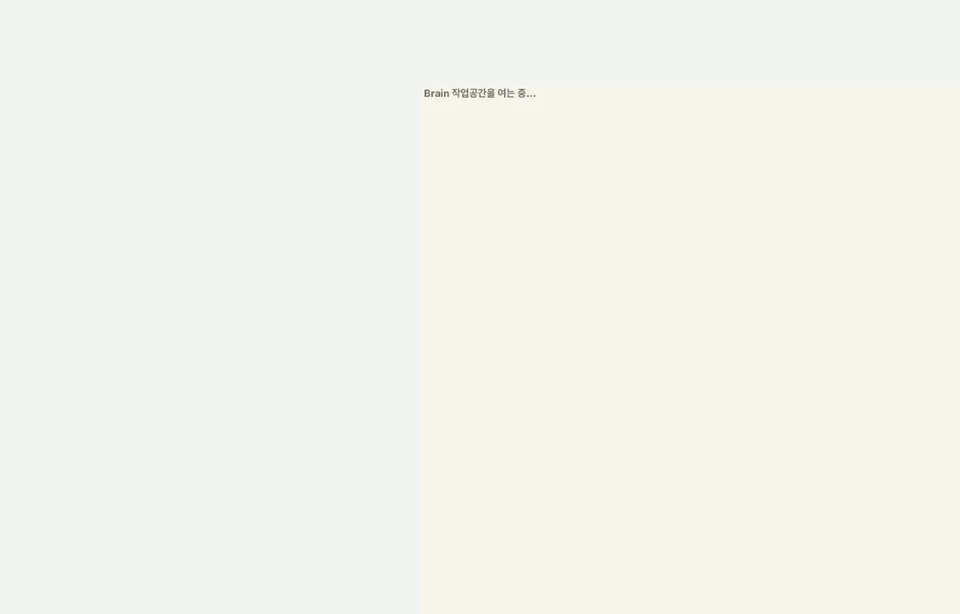
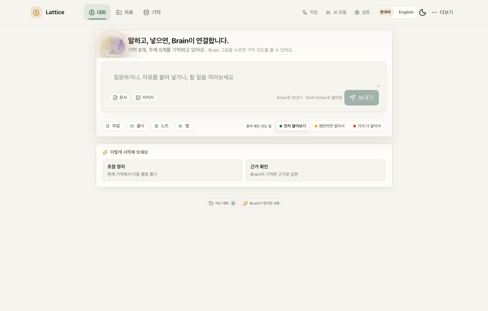
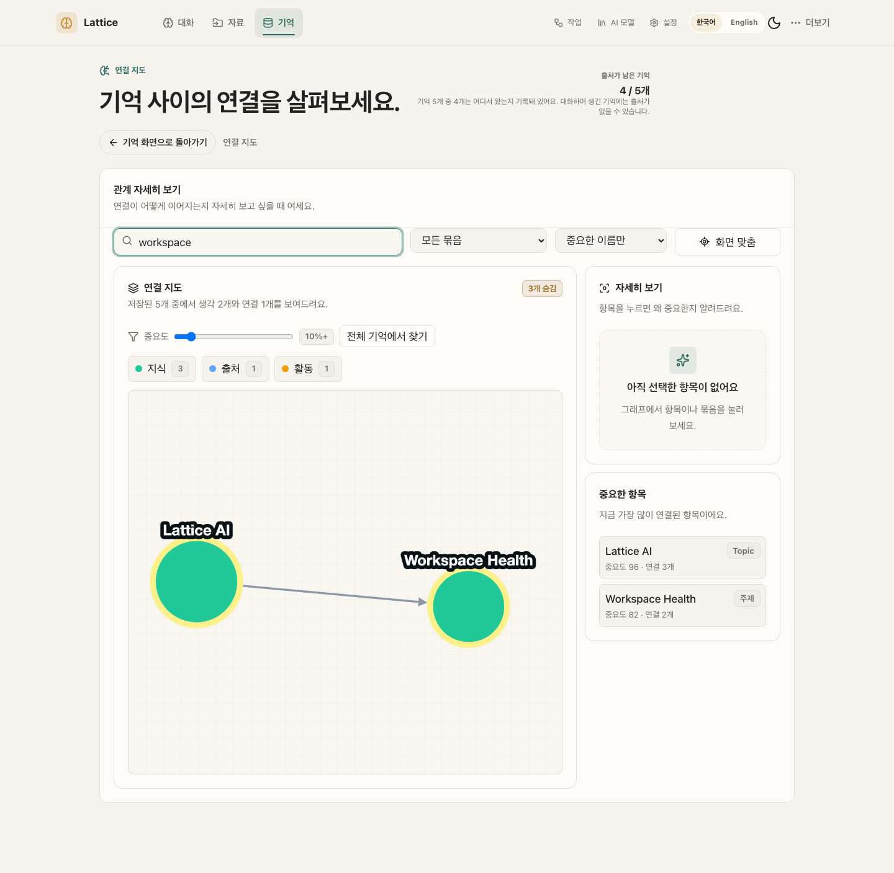
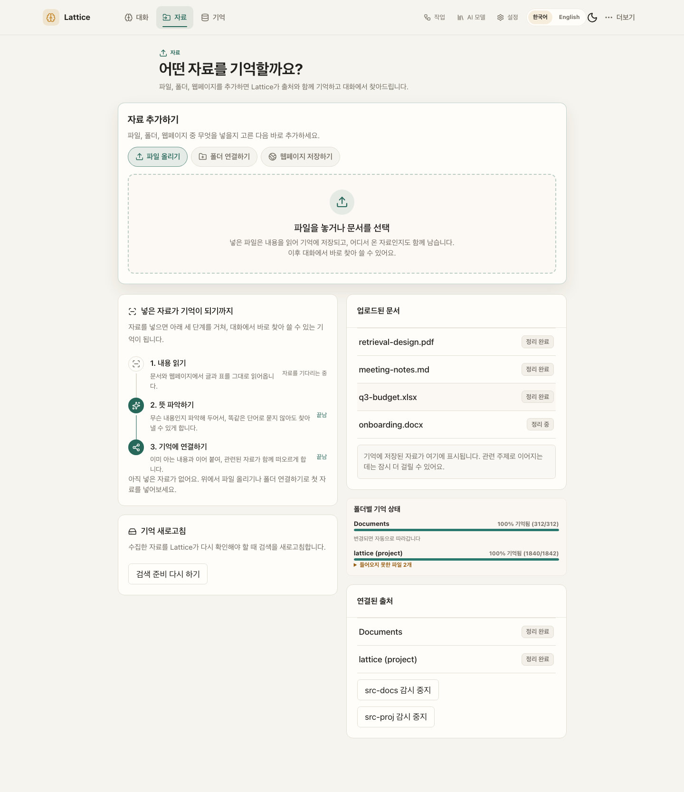
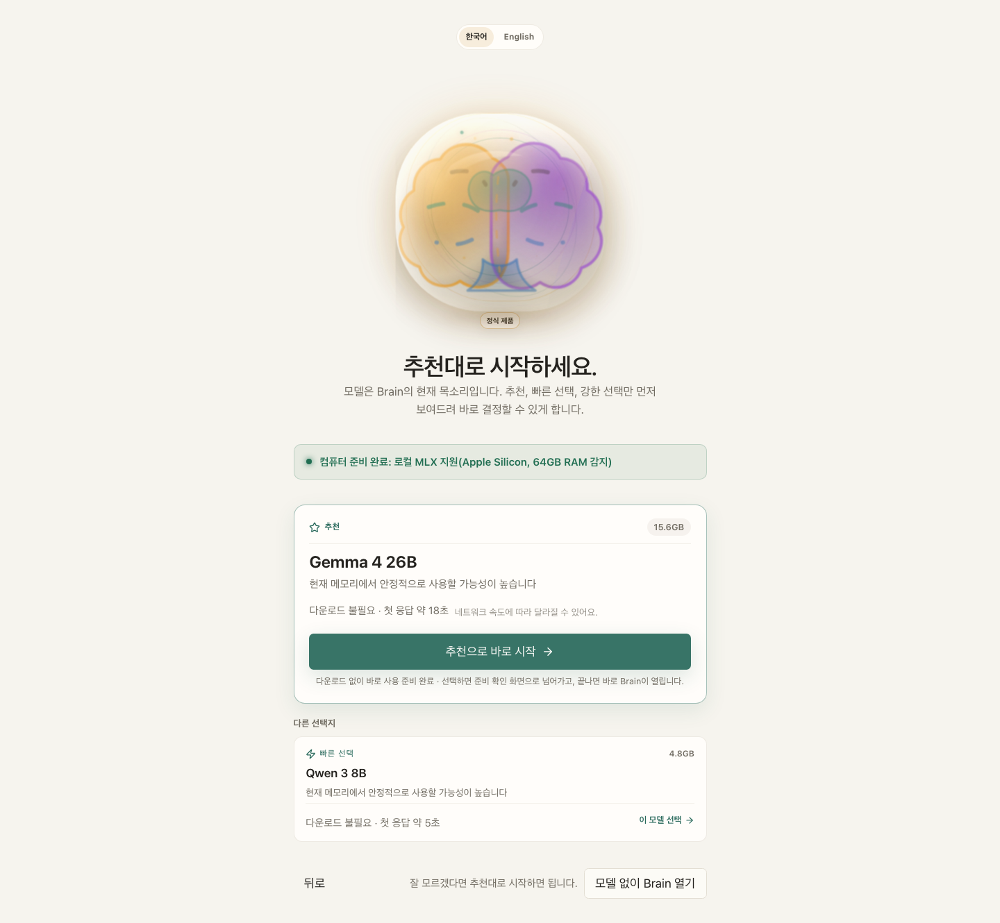
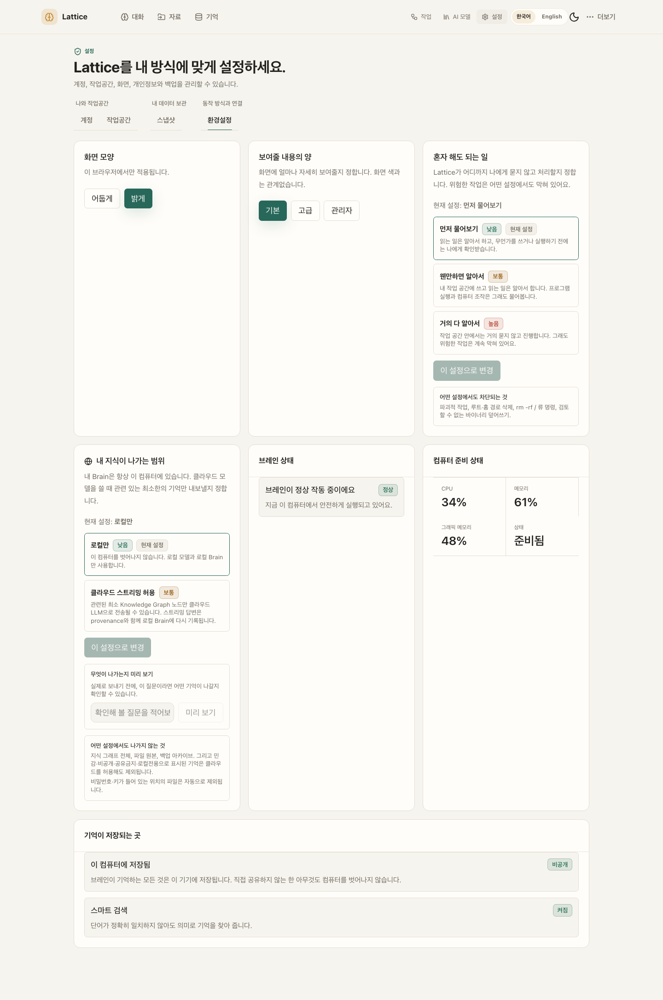
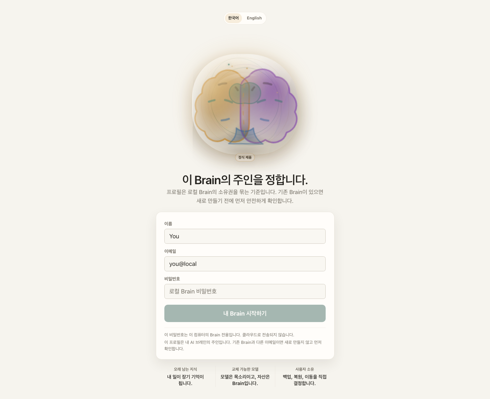
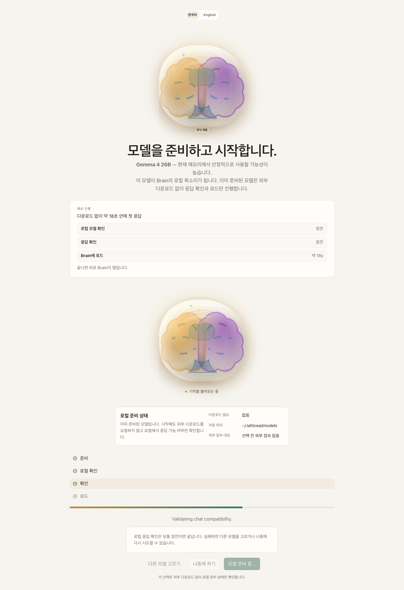

# Lattice AI

**Your model is the voice you use today. Your Brain is the asset you keep.**

**모델은 갈아타도, 내 지식은 내 컴퓨터에 남는 로컬 우선 AI 브레인.**

[](https://pypi.org/project/ltcai/)
[](https://www.npmjs.com/package/ltcai)
[](https://marketplace.visualstudio.com/items?itemName=parktaesoo.ltcai)
[](https://open-vsx.org/extension/parktaesoo/ltcai)
[](https://github.com/TaeSooPark-PTS/LatticeAI/actions/workflows/ci.yml)
[](LICENSE)



Chat, files, folders, notes, and web pages all flow into one durable knowledge
graph on your computer. Any model — local MLX or cloud — can speak with that
memory. Nothing leaves your machine without explicit consent.

대화·파일·폴더·웹페이지가 전부 내 컴퓨터 안의 지식 그래프로 쌓이고, 어떤
모델이든 그 기억을 이어받아 대화합니다.

## What You Can Do

| | |
| --- | --- |
| **Chat with a Brain that remembers** — every conversation grows durable, source-linked memory  | **See how knowledge connects** — a real relationship graph, not a file list  |
| **Capture anything** — files, whole folders, notes, screenshots, web pages  | **Automate with review** — agent changes become proposals you approve first  |
| **Pick a model in one click** — recommended local models for your hardware  | **Stay in control** — audit, roles, retention in a separate admin surface  |
| **Watch a file become memory** — three named steps, not a pipeline diagram  | **Say how much it may do alone** — one dial in plain words; dangerous actions stay blocked either way  |

## Why Lattice AI

- **Own your memory** — knowledge lives in a local SQLite Brain you can back up,
  export, inspect, and restore (`.latticebrain` encrypted archive).
- **Model-independent** — switch between local MLX models and cloud models
  without rebuilding context from zero.
- **Honest by design** — the Brain tells you when retrieval context is limited,
  when captured pages extracted poorly, and when the vector index is catching up.
- **Safe automation** — automations are consent-first drafts; edits to existing
  content always pass through a reviewable proposal with a diff.

매번 AI에게 프로젝트 맥락을 다시 설명하고 있다면, 지식이 여러 서비스에 흩어져
있다면, 그 기억을 특정 회사가 아니라 내가 소유하고 싶다면 — Lattice AI가 그
브레인입니다.

## Quick Start

```bash
pip install ltcai        # or: npm install -g ltcai
LTCAI                    # then open http://127.0.0.1:4825/app
```

Apple Silicon local models: `pip install "ltcai[local]"`. Desktop app (Tauri)
ships as a dmg on each [GitHub Release](https://github.com/TaeSooPark-PTS/LatticeAI/releases).

First-run flow — wake the Brain, pick the owner, load a recommended model:

| | | |
| --- | --- | --- |
|  |  |  |

Screenshot index and capture notes:
[output/release/v10.6.3/SCREENSHOT_INDEX.md](output/release/v10.6.3/SCREENSHOT_INDEX.md)

## Current Release

The current release is **10.6.3 — Loud Limits**:

10.6.1 rebuilt five screens, and the Brain home is the one it only half
rebuilt: the order changed, the shape did not. A large Brain and a centred
headline still ran down the middle of the screen before the box you type into,
and the three suggestions still sat between that box and its own toolbar — so
the alternative to typing wore the same border as typing, and the composer was
separated from its own controls by an unrelated block. This release splits the
screen into two surfaces. Nothing was removed; the second choice stopped
sharing a card with the first.

- **The greeting introduces the composer instead of headlining the screen.**
  The Brain and the greeting were a centred column above the input; they are a
  compact banner across the top of the card now — a small Brain beside the title
  and the memory count, on a tinted strip closed by a hairline. The Brain is
  still the button that opens the memory map, and the banner stacks back into a
  centred column on a phone.
- **One card is the first move, and only the first move.** The station reads
  greeting → the box you type into → one row for 자료 추가 and 혼자 해도 되는 일,
  with nothing between the box and its own controls.
- **What to try is a card of its own.** The three suggestions moved out of the
  station onto a second surface below it, where they read as an offer rather
  than a step. That card is a named `<section>`, so a screen reader announces it
  as a region — the label used to sit on a plain `<div>`, where the browser
  discards it.
- **The empty state is designed rather than inherited.** A Brain with nothing to
  suggest yet — every Brain on its first day — shows starter pills instead of
  suggestion cards. That row had never been styled for this screen: it borrowed
  a pill height drawn for live conversations and sat noticeably taller than the
  cards it stands in for. Both branches read as peers now, and a pill fills the
  composer rather than sending a question you did not choose to ask.
- **Three bugs that only moving things could find.** The Brain's halo is written
  as an inline `box-shadow`, so no stylesheet could shrink it — a 60px glow
  stayed wrapped around a 58px Brain until the blur became a CSS variable the
  host can set (every other screen keeps its old value through the fallback).
  Clipping the card would have hidden the 노트 / 웹 popover and turned the card
  into a scroll container that scrolls the greeting away on focus, so the banner
  clips its own corners instead. And the reduced-motion rule that cancels the
  card lift had to follow the cards to their new selector, or a reader who asked
  the system to hold still would have got the animation back.
- **Guarded, not asserted.** Unit tests hold the split itself — station, deck
  and footer as three siblings, with the suggestions provably *not* inside the
  station. Browser tests hold what only a browser can see: the popover opens
  unclipped, the cards fill their card, they collapse to chips under 900px and
  stay visible under 760px, reduced motion is honoured, the empty-state pill row
  renders, and the halo is measured against the Brain it surrounds.

Release notes: [RELEASE.md](RELEASE.md) · Full history: [docs/CHANGELOG.md](docs/CHANGELOG.md)

Expected artifacts for 10.6.3 release must use exact filenames:

- `dist/ltcai-10.6.3-py3-none-any.whl`
- `dist/ltcai-10.6.3.tar.gz`
- `ltcai-10.6.3.tgz`
- `dist/ltcai-10.6.3.vsix`
- `src-tauri/target/release/bundle/dmg/Lattice AI_10.6.3_aarch64.dmg`

Do not use wildcard artifact uploads. Package registry publishing remains owner-run.

## Architecture At A Glance

FastAPI on localhost is the source of truth; the React/Vite frontend and the
Tauri desktop shell sit on top; the independent `lattice_brain` package owns
the graph, memory, ingestion, and portability. Local-first by default — cloud
calls, downloads, Telegram, and update checks are opt-in.

See [ARCHITECTURE.md](ARCHITECTURE.md) for details and
[docs/DEVELOPMENT.md](docs/DEVELOPMENT.md) for the developer workflow
(`npm install && npm run dev`, validation via `npm run lint`,
`npm run test:unit`, `npm run test:visual`).

## Known Limitations

- External package registries are owner-published and can lag behind GitHub.
- PostgreSQL/pgvector is optional scale/migration tooling. SQLite remains the
  live local Brain store in 10.3.0.
- Docker, model downloads, cloud model calls, Telegram, Brain Network, and
  update checks require explicit user action.
- Conversation does not fabricate answers when no model is loaded. Agent and
  workflow simulation without a loaded LLM is deterministic and LLM-free (it
  does not call a model) — labeled as such, never presented as autonomous
  model success.
- Some backend-generated messages (for example the Postgres DSN notice) are
  produced server-side in English and are shown as-is; server-side i18n is not
  part of 10.3.0.

## Release History

| Version | Theme |
| --- | --- |
| 10.6.3 | Loud Limits |
| 10.6.2 | Ask First |
| 10.6.1 | First Things |
| 10.6.0 | Promoted Panels |
| 10.5.0 | Everyday Words |
| 10.4.0 | Named Ground |
| 10.3.0 | Measured Ground |
| 10.2.0 | Load-Bearing Fixes |
| 10.1.1 | Reachable Boundary |
| 10.1.0 | Hybrid Brain |
| 10.0.1 | One Source of Truth |
| 10.0.0 | Plain Language |
| 9.9.9 | Lean Shell |
| 9.9.8 | Autonomy Dial |
| 9.9.7 | No Gaps Left |
| 9.9.6 | Same Brain Everywhere |
| 9.9.5 | Closed Gaps |
| 9.9.4 | Durable Loops |
| 9.9.3 | Closed Loops |
| 9.9.2 | Artifact Trust |
| 9.9.1 | Clean Foundations |
| 9.9.0 | Fail-Closed Trust |
| 9.8.0 | Honest Knowledge Pipeline |
| 9.7.0 | Proactive Hybrid Brain |
| 9.6.0 | Trusted Agent Loop |
| 9.5.0 | Command Center |
| 9.4.0 | Question-Driven Everyday Automation |
| 9.3.0 | Proactive Brain Intelligence |
| 9.2.0 | Model-Agnostic File Generation |
| 9.1.0 | Code Review Completion & Fail-Closed Runtime |
| 9.0.0 | Code Review Closure & Runtime Cleanup |
| 8.9.0 | Scoped Memory & Tool Policy Hardening |
| 8.8.0 | Brain Core Extraction & Recall Proof Hardening |
| 8.7.0 | Runtime State Hygiene & Release Evidence Refresh |
| 8.6.0 | Desktop Capture & Navigation Reliability |
| 8.5.0 | Tool Registry Readiness & Config DI |
| 8.4.0 | Action-Aware Brain Chat |
| 8.3.0 | Orchestrated Brain Readiness |
| 8.2.0 | Brain Brief |
| 8.1.0 | Intuitive Brain Home |
| 8.0.0 | Runtime Architecture Contract |

Per-release details: [RELEASE_NOTES.md](RELEASE_NOTES.md)

## Documentation

- [docs/WHY_LATTICE.md](docs/WHY_LATTICE.md) — product philosophy
- [docs/TRUST_MODEL.md](docs/TRUST_MODEL.md) — local-first trust model
- [PRIVACY.md](PRIVACY.md) — privacy and external communication policy
- [FEATURE_STATUS.md](FEATURE_STATUS.md) — feature status and limitations
- [SECURITY.md](SECURITY.md) — security posture
- [RELEASE.md](RELEASE.md) — release guide and notes

## License

MIT. See [LICENSE](LICENSE).
