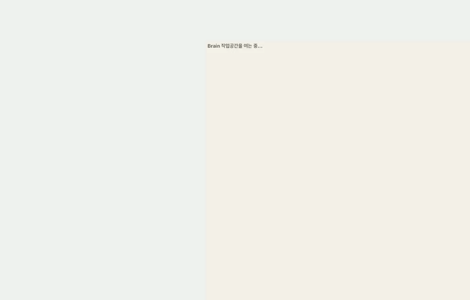
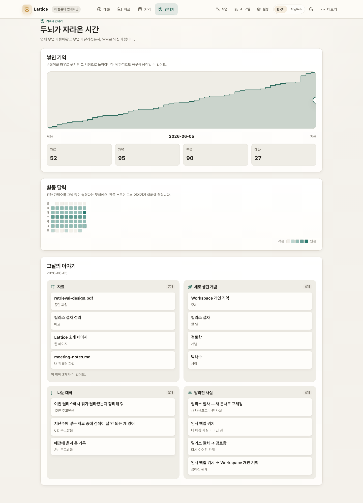
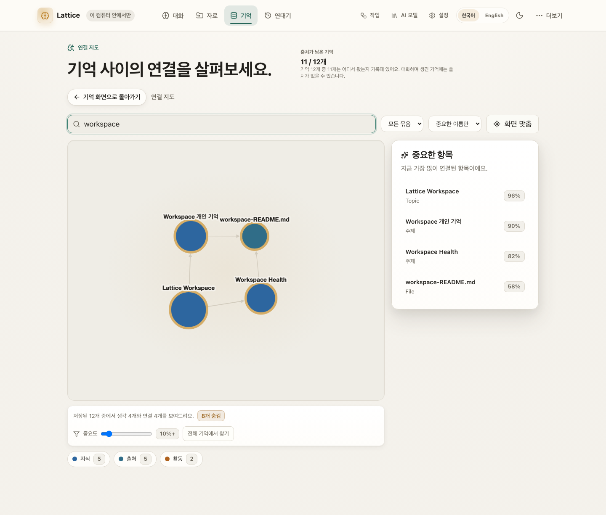
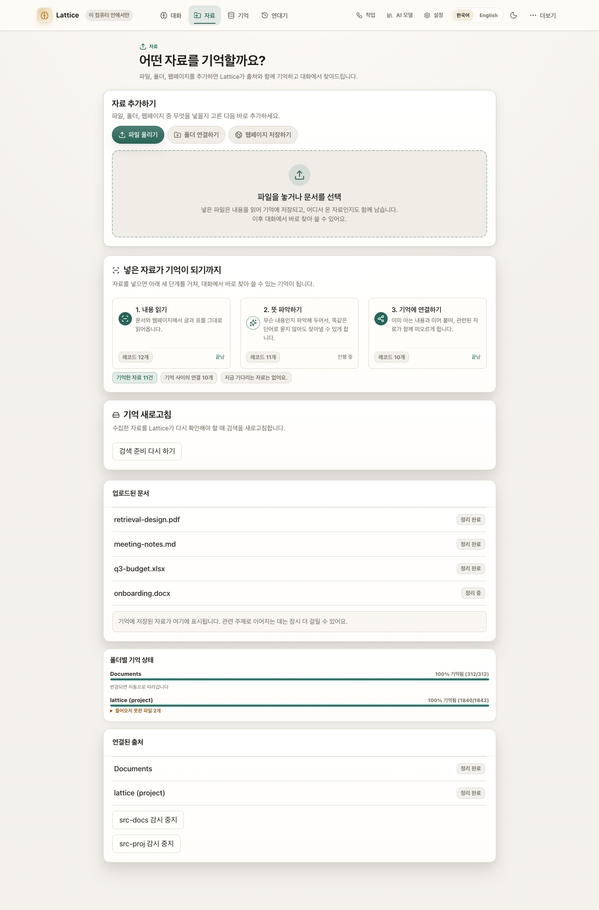
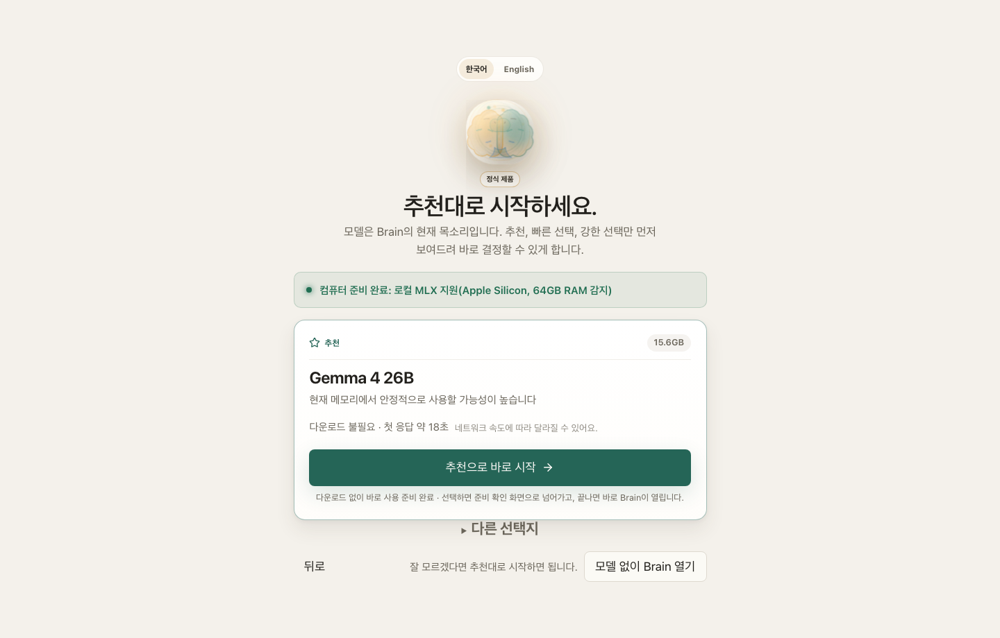
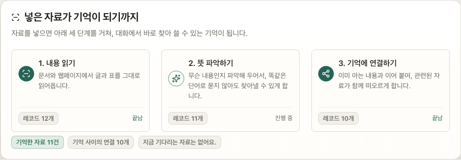

# Lattice AI

**Your model is the voice you use today. Your Brain is the asset you keep.**

**모델은 갈아타도, 내 지식은 내 컴퓨터에 남는 로컬 우선 AI 브레인.**

[](https://pypi.org/project/ltcai/)
[](https://www.npmjs.com/package/ltcai)
[](https://marketplace.visualstudio.com/items?itemName=parktaesoo.ltcai)
[](https://open-vsx.org/extension/parktaesoo/ltcai)
[](https://github.com/TaeSooPark-PTS/LatticeAI/actions/workflows/ci.yml)
[](LICENSE)



Chat, files, folders, notes, and web pages all flow into one durable knowledge
graph on your computer. Any model — local MLX or cloud — can speak with that
memory. Nothing leaves your machine without explicit consent.

대화·파일·폴더·웹페이지가 전부 내 컴퓨터 안의 지식 그래프로 쌓이고, 어떤
모델이든 그 기억을 이어받아 대화합니다.

## What You Can Do

| | |
| --- | --- |
| **See your Brain's story in time** — a growth curve, an activity heatmap, and each day's story, rewindable to any past moment  | **Chat with a Brain that remembers** — every conversation grows durable, source-linked memory  |
| **See how knowledge connects** — a real relationship graph, not a file list  | **Capture anything** — files, whole folders, notes, screenshots, web pages  |
| **Automate with review** — agent changes become proposals you approve first  | **Pick a model in one click** — recommended local models for your hardware  |
| **Watch a file become memory** — three named steps, not a pipeline diagram  | **Say how much it may do alone** — one dial in plain words; dangerous actions stay blocked either way  |

## Why Lattice AI

- **Own your memory** — knowledge lives in a local SQLite Brain you can back up,
  export, inspect, and restore (`.latticebrain` encrypted archive).
- **Model-independent** — switch between local MLX models and cloud models
  without rebuilding context from zero.
- **Honest by design** — the Brain tells you when retrieval context is limited,
  when captured pages extracted poorly, and when the vector index is catching up.
- **Safe automation** — automations are consent-first drafts; edits to existing
  content always pass through a reviewable proposal with a diff.

매번 AI에게 프로젝트 맥락을 다시 설명하고 있다면, 지식이 여러 서비스에 흩어져
있다면, 그 기억을 특정 회사가 아니라 내가 소유하고 싶다면 — Lattice AI가 그
브레인입니다.

## Quick Start

```bash
pip install ltcai        # or: npm install -g ltcai
LTCAI                    # then open http://127.0.0.1:4825/app
```

Apple Silicon local models: `pip install "ltcai[local]"`. Desktop app (Tauri)
ships as a dmg on each [GitHub Release](https://github.com/TaeSooPark-PTS/LatticeAI/releases).

First-run flow — wake the Brain, pick the owner, load a recommended model:

| | | |
| --- | --- | --- |
|  |  |  |

Screenshot index and capture notes:
[output/release/v11.8.0/SCREENSHOT_INDEX.md](output/release/v11.8.0/SCREENSHOT_INDEX.md)

## Current Release

The current release is **11.8.0 — Travel Light**:

11.7.0 emptied the backlog. This release removes what was left carrying
its own weight and nothing else — routes with no caller, gates that stop
nothing, goldens that prove the same thing twice, and blanket lint
suppressions that hid what the compiler was already saying. The door is
unchanged: `lattice-host` still serves **420 operations across 41 route
families**. What changed is the Python side of that door — the AI worker
is now **19 routes, not 28**.

- **Nine caller-less worker routes are gone end to end.**
  `GET /api/embeddings/providers`, `POST /tools/read_document`,
  `GET /tools/pdf_pages`, `POST /worker/multimodal/describe`,
  `GET /api/ingestion/multimodal`, `POST /models/switch/{model_id}`,
  `DELETE /models/unload-all`, `POST /engines/pull-model` and
  `GET /api/capture/voice/status` were deleted along with their
  implementations, their allowlist entries and their gateway tables. The
  committed allowlist reads 19, `pypdfium2` left with `/tools/pdf_pages`,
  and new negative tests assert the gateway answers `404` rather than
  forwarding.
- **Rust lint suppression removed at the source.** The blanket `#![allow]`
  headers on roughly 191 files across `lattice-platform`,
  `lattice-retrieval`, `lattice-ingest` and `lattice-jobs` are gone, and
  the ~650 clippy/rustc diagnostics they were hiding were fixed rather
  than re-silenced. Zero workspace-level allowances were added; the eight
  survivors are local `#[allow(clippy::too_many_arguments)]` with stated
  reasons. Test binaries were consolidated 98 → 56 without deleting a
  single test function.
- **Goldens shrank without losing coverage.** Two 702-row agent decision
  grids became named unit tests that say which rule broke; the other two
  files were reduced to 171 representative rows, one per equivalence
  class, with a drift guard that fails when the kernel grows a class the
  sample does not cover. Retrieval, graph-write, agent-loop and HTTP
  goldens are untouched, and every fixture family now carries a
  `FROZEN.md`.
- **A real bug surfaced while deleting dead code.** The worker read
  `sessions.json` once at boot even though `lattice-auth` is its only
  writer, so a login *after* worker start was invisible to it — silently
  under `trusted_local_owner`, and as a 401 under
  `LATTICEAI_REQUIRE_AUTH=true`. A missed lookup now re-reads, guarded by
  an mtime/size check and a one-second throttle so a guessing burst cannot
  become a disk-read burst.
- **The Brain home is redesigned.** The composer is the hero, the Living
  Brain is three times larger (60px → 179px at 1440) and accretes gold and
  jade growth rings as memory grows, with a readiness-tied caption. Past
  conversations, status, the memory map and feature switches sit on a
  continuity bar along the floor instead of under the fold.

What this release does not close — the enforced coverage floor moving from
100 to line-90, the multimodal image/video half having no HTTP door, the
ad-hoc-signed dmg, and the leftovers 11.7.0 already disclosed — is listed
in [RELEASE_NOTES_v11.8.0.md](RELEASE_NOTES_v11.8.0.md).

Expected artifacts for 11.8.0 release must use exact filenames:

- `dist/ltcai-11.8.0-py3-none-any.whl`
- `dist/ltcai-11.8.0.tar.gz`
- `ltcai-11.8.0.tgz`
- `dist/ltcai-11.8.0.vsix`
- `src-tauri/target/release/bundle/dmg/Lattice AI_11.8.0_aarch64.dmg`

Do not use wildcard artifact uploads. Package registry publishing remains owner-run.

Release notes: [RELEASE.md](RELEASE.md) · Full history: [docs/CHANGELOG.md](docs/CHANGELOG.md)

## Architecture At A Glance

One Rust server on localhost is the source of truth: `lattice-host` answers
every product route, owns every write to the Brain, and supervises a Python
**AI worker** it reaches over loopback for the things a model does — inference,
embedding, extraction, parsing, rendering, speech-to-text. The React/Vite
frontend and the Tauri desktop shell sit on top of that one door. Local-first
by default — cloud model calls, downloads, Brain Network, and update checks are
opt-in.

See [ARCHITECTURE.md](ARCHITECTURE.md) for details and
[docs/DEVELOPMENT.md](docs/DEVELOPMENT.md) for the developer workflow
(`npm install && npm run dev`, validation via `npm run lint`,
`npm run test:unit`, `npm run test:visual`).

## Known Limitations

- External package registries are owner-published and can lag behind GitHub.
- SQLite is the live local Brain store. The optional PostgreSQL/pgvector
  migration tooling is not part of the 11.8.0 worker.
- Docker, model downloads, cloud model calls, Brain Network, and update checks
  require explicit user action.
- **The Telegram bridge was removed in 11.6.0** — it lived in the platform code
  that became the AI worker. **SSO/OIDC login and callback flows were removed
  with it**; the configuration surface remains and password login is native.
- Conversation does not fabricate answers when no model is loaded. Agent and
  workflow simulation without a loaded LLM is deterministic and LLM-free (it
  does not call a model) — labeled as such, never presented as autonomous
  model success.
- `POST /worker/render/pdf` ships working out of the box: `reportlab` is a
  required dependency as of 11.6.0 (it used to be an undeclared lazy import
  that raised a 500; `ltcai[pdf]` remains as an empty alias for older
  install instructions).
- The multimodal image and video analysis functions have no HTTP door as of
  11.8.0: their only route wrapped a native image ingest that was never
  built. The observation code stays in Brain Core under unit test, and its
  module header says so.
- The Python coverage gate is a **line floor of 90** since 11.8.0 (the
  100%-lines-and-branches gate was removed). The measured figure is still
  100%, but the enforced floor is the smaller claim.
- The macOS dmg is ad-hoc signed — effectively unsigned — so first launch
  needs the usual Gatekeeper step.
- Pointer-control tools still execute in the worker. Remaining honest gaps
  (`open_keys` pending-only, no Self-Model refiner, `PART_OF` left on
  delete, review events silent without an owner, KG-api ingest text-only,
  two store cycles per review mutation) are listed with their reasons in
  [RELEASE_NOTES_v11.8.0.md](RELEASE_NOTES_v11.8.0.md).

## Release History

Public history starts at 11.0.0. 11.6.0 rebuilt the product server in Rust and
reduced the Python package to an AI worker, so a 10.x or 9.x install is a
different program; `SECURITY.md` supports only 11.x, and this table states the
same boundary. Earlier notes stay in the tree as `RELEASE_NOTES_v*.md` files.

| Version | Theme |
| --- | --- |
| 11.8.0 | Travel Light |
| 11.7.0 | Clean Sweep |
| 11.6.0 | One Door |
| 11.5.2 | Tight Ship |
| 11.5.1 | Rust Full Loop |
| 11.5.0 | Rust Complete |
| 11.4.0 | Rust Foundation |
| 11.3.0 | Time Remembers |
| 11.2.0 | All Systems On |
| 11.1.0 | Product Intelligence |
| 11.0.1 | Both Branches |
| 11.0.0 | Full Measure |

Per-release details: [RELEASE_NOTES.md](RELEASE_NOTES.md)
