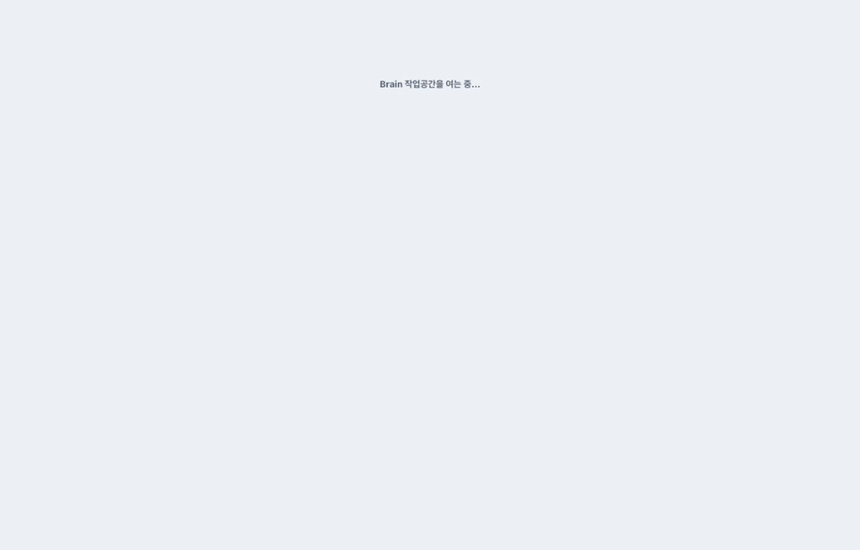
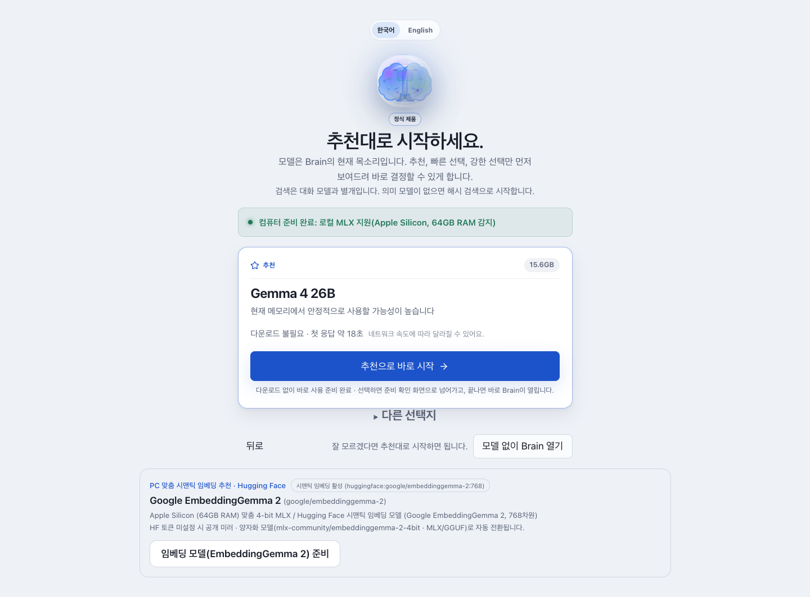
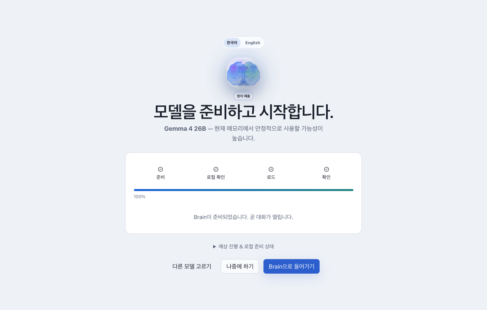
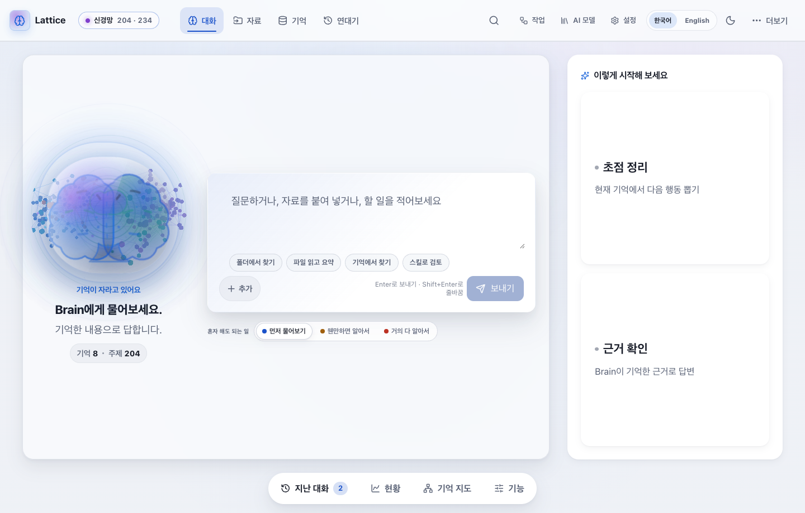
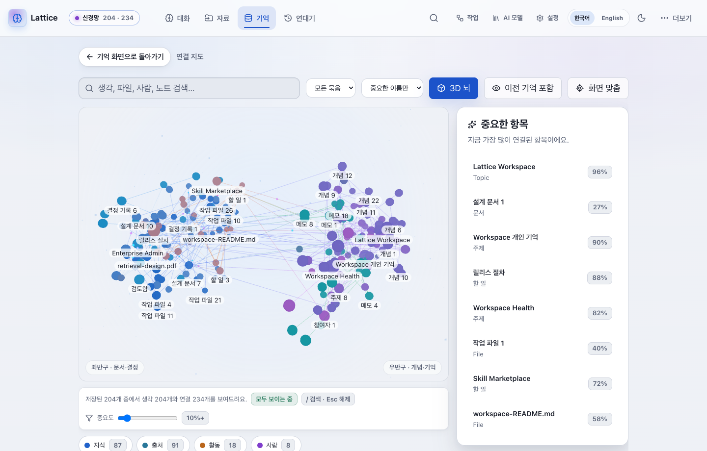
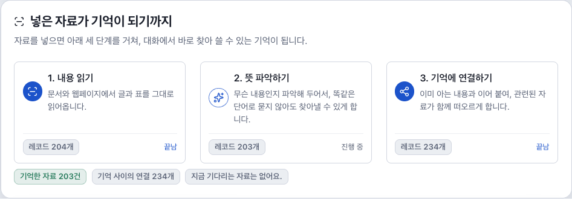
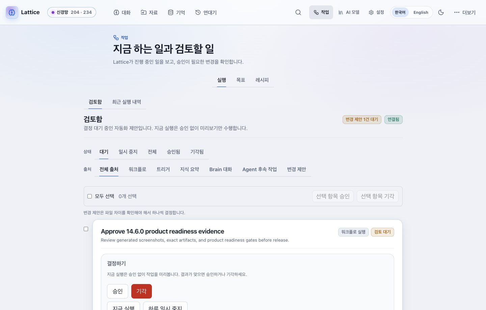
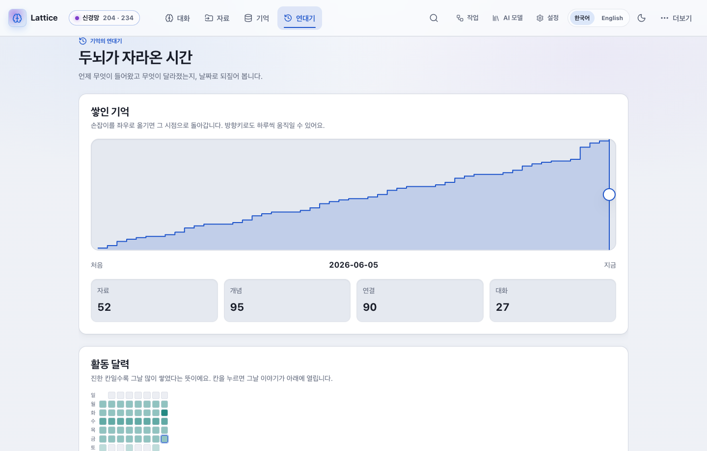
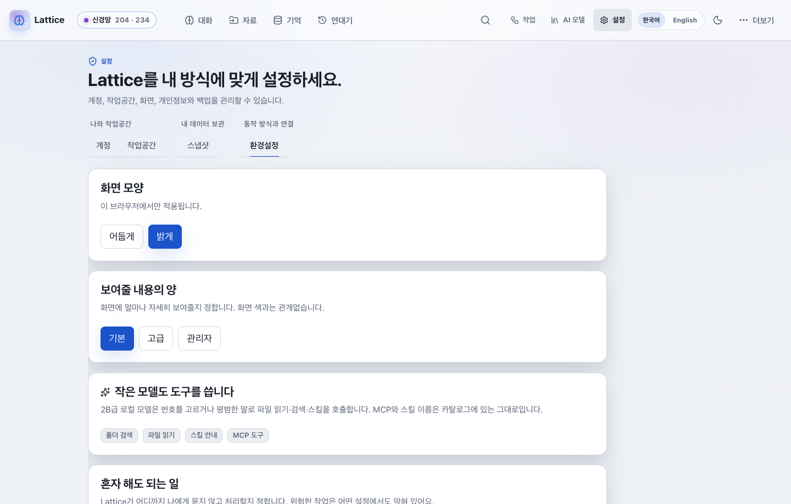

<div align="center">

[](README.md) [](README.ko.md)

# Lattice AI

**Your model is the voice you use today. Your Brain is the asset you keep.**

[](https://pypi.org/project/ltcai/)
[](https://www.npmjs.com/package/ltcai)
[](https://marketplace.visualstudio.com/items?itemName=parktaesoo.ltcai)
[](https://open-vsx.org/extension/parktaesoo/ltcai)
[](https://github.com/TaeSooPark-PTS/LatticeAI/actions/workflows/ci.yml)
[](https://github.com/TaeSooPark-PTS/LatticeAI/actions/workflows/publish.yml)
[](LICENSE)

<br/>



</div>

Lattice AI is a **local-first Digital Brain** that unifies your conversations, files, folders, notes, and web captures into one private Knowledge Graph you own. Local inference is the default; cloud models are strictly optional, and nothing leaves your machine without explicit consent.

---

## Why Lattice AI

- **Local-First Digital Brain & Hardware Auto-Fit** — All memories, provenance, and graph relationships live locally in SQLite and portable encrypted `.latticebrain` archives. Embeddings default to `auto`: a locally cached model such as **EmbeddingGemma 2** (`768d`, needs `pip install "ltcai[rag]"`) or a local Ollama embedding model is used when available, otherwise the deterministic offline `lattice-local-hash-v1` lexical/hash embedder. Model downloads show **live SSE progress (`MB/s` & `ETA`)**.
- **Hybrid GraphRAG (BM25F + Vector + 2-Hop Knowledge Graph RRF)** — Combines field-weighted Okapi BM25F (with Korean particle stripping, CJK bigrams, and identifier subwords), dense/subword vector recall, and 1-hop/2-hop Knowledge Graph structural expansion (`RELATES_TO`, `MENTIONS`, `PART_OF`, `[[wikilinks]]`, `#tags`) via Reciprocal Rank Fusion — backed by graph-aware agent skills and MCP search tools.
- **Proposal-First Safe Autonomy & Review Center** — Additive creations run with minimal friction; edits or deletions of existing user files and cloud-extracted memories stage as hash-verified **Review Center** proposals with side-by-side diffs before applying. Even small 2B-class local models can safely act via guided prompts, and workflow/agent simulation without a loaded LLM is explicitly **deterministic** and **LLM-free** (it does not call a model).
- **One Brain Across Every Surface** — Use the **macOS Desktop App (`.dmg`)**, the **Web Studio (`/app`)**, the **VS Code / Cursor / Open VSX Extension**, the **Browser Extension**, or the **`LTCAI` CLI** against the same local Brain.

---

## Universal Adaptive Agent Harness Benchmark (v13.4.0)

LatticeAI 13.4.0 introduces the **Universal Adaptive Agent Harness** (`rust/lattice-agent/src/kernel/`): an architectural harness that elevates small, local instruction-tuned models (0.5B to 7B parameters) to frontier-grade reliability across tool chains, web interaction, computer use, and bi-temporal RAG grounding with **zero per-model branches**.

Empirical results measured against `Qwen2.5-0.5B-Instruct-Q4_K_M` across 25 real-world benchmark tasks:

| Capability Category | Raw Baseline (No Harness) | Standard Loop (v13.3) | Adaptive Harness (v13.4.0) | Absolute Improvement |
| :--- | :---: | :---: | :---: | :---: |
| **Tool Calling** | 20.0% (1/5) | 0.0% (0/5) | **80.0%** (4/5) | **+60.0 pp** |
| **Web Handling** | 0.0% (0/5) | 80.0% (4/5) | **80.0%** (4/5) | **+80.0 pp** |
| **Computer Use** | 0.0% (0/5) | 0.0% (0/5) | **100.0%** (5/5) | **+100.0 pp** |
| **Answer Quality** | 60.0% (3/5) | 20.0% (1/5) | **60.0%** (3/5) | **0.0 pp** (+40 pp vs std) |
| **RAG Grounding** | 60.0% (3/5) | 20.0% (1/5) | **100.0%** (5/5) | **+40.0 pp** (+80 pp vs std) |
| **Overall Pass Rate** | **28.0%** (7/25) | **24.0%** (6/25) | **84.0%** (21/25) | **+56.0 pp (+200.0% relative gain)** |

Read the full empirical benchmark report, methodology, and reproducibility guide in [ADAPTIVE_HARNESS_BENCHMARK.md](docs/ADAPTIVE_HARNESS_BENCHMARK.md) (or [Korean mirror](docs/ko/ADAPTIVE_HARNESS_BENCHMARK.md)).

---

## Quick Start

### 1. Desktop App (macOS)

Download `Lattice AI_14.6.0_aarch64.dmg` from [GitHub Releases](https://github.com/TaeSooPark-PTS/LatticeAI/releases) and launch the app.

### 2. One-Command CLI & Web Studio

```bash
pip install ltcai          # or: npm install -g ltcai
LTCAI                      # opens the Web Studio at http://127.0.0.1:4825/app
```

- **Apple Silicon local models (MLX)**: `pip install "ltcai[local]"`
- **EmbeddingGemma 2 and cross-encoder reranking (optional)**: `pip install "ltcai[rag]"` (weights must already be cached; they are not fetched at query time)
- **Pointer automation tools (optional)**: `pip install "ltcai[pointer]"`

### Search From the Terminal

```bash
ltcai search "release owner" --sort newest --limit 5
```

Queries a running server and prints ranked results with timestamps. Options: `--sort relevance|newest`, `--limit 1-100`, `--host`, `--port`; set `LATTICEAI_API_TOKEN` when authentication is required. The same `sort_by` option is accepted by the search API, command search, and the MCP `knowledge_search` tool. The command ships with the npm package.

### 3. Editor Extension (VS Code · Cursor · Antigravity)

Install [`parktaesoo.ltcai`](https://marketplace.visualstudio.com/items?itemName=parktaesoo.ltcai) from [VS Code Marketplace](https://marketplace.visualstudio.com/items?itemName=parktaesoo.ltcai) or [Open VSX](https://open-vsx.org/extension/parktaesoo/ltcai) to sync files, ask Brain-grounded questions, and review proposals directly inside your editor.

### First Five Minutes

1. **Wake your Brain** and confirm your local owner profile.
2. **Pick a recommended local model & embedder** sized for your hardware (with real-time SSE download progress).
3. **Capture a source** — drop a folder, document, note, or web page.
4. **Ask in your own words** and inspect the grounded citations, Knowledge Graph connections, and Review Center diffs.

---

## Product Tour

| Onboarding & Hardware Fit | Live Model Library & SSE Progress |
| --- | --- |
|  |  |
| **Brain Chat Home** — grounded answers with source proof | **Memory Graph** — explore 2-hop concept & file links |
|  |  |
| **Capture & Knowledge Journey** — watch material become memory | **Review Center** — inspect diffs before any edit applies |
|  |  |
| **Brain Chronicle** — growth curve, heatmap & daily story | **Autonomy Dial & System** — plain-language permission controls |
|  |  |

Full visual index: [output/release/v14.6.0/SCREENSHOT_INDEX.md](output/release/v14.6.0/SCREENSHOT_INDEX.md) (login & library views: [01-login.png](output/release/v14.6.0/screenshots/01-login.png), [06-capture.png](output/release/v14.6.0/screenshots/06-capture.png), [07-model-library.png](output/release/v14.6.0/screenshots/07-model-library.png)).

---

## Documentation & Architecture Hub

| Area | Document | What You'll Find |
| --- | --- | --- |
| **Getting Started** | [docs/ONBOARDING.md](docs/ONBOARDING.md) | 5-minute product flow and first-run guarantees |
| **Product Philosophy** | [docs/WHY_LATTICE.md](docs/WHY_LATTICE.md) | Why the Brain outlives any individual AI model |
| **System Architecture** | [ARCHITECTURE.md](ARCHITECTURE.md) | `lattice-host` Rust server, single `GraphWriter`, and 21-route Python AI worker |
| **Feature Matrix** | [FEATURE_STATUS.md](FEATURE_STATUS.md) | Current shipped capabilities and honest system boundaries |
| **Adaptive Harness Benchmark** | [docs/ADAPTIVE_HARNESS_BENCHMARK.md](docs/ADAPTIVE_HARNESS_BENCHMARK.md) | 25-task empirical study (`28.0% → 84.0%` on `Qwen2.5-0.5B-Instruct-Q4_K_M`) |
| **Operations & Self-Hosting** | [docs/OPERATIONS.md](docs/OPERATIONS.md) | Storage layout, `.latticebrain` backup/restore, and public mode checklist |
| **Enterprise & Open Core** | [docs/ENTERPRISE.md](docs/ENTERPRISE.md) | Open-core capability seam and [EDITION_STRATEGY.md](docs/EDITION_STRATEGY.md) |
| **Security & Privacy** | [SECURITY.md](SECURITY.md) · [PRIVACY.md](PRIVACY.md) | Threat model, loopback defaults, egress audit, and [TRUST_MODEL.md](docs/TRUST_MODEL.md) |
| **Contributor Guide** | [docs/DEVELOPMENT.md](docs/DEVELOPMENT.md) · [CONTRIBUTING.md](CONTRIBUTING.md) | Local build, Rust crate maps, quality gates, and [docs/ROADMAP.md](docs/ROADMAP.md) |
| **CI / CD & Release Gates** | [docs/CI_AND_RELEASE_GATES.md](docs/CI_AND_RELEASE_GATES.md) | Hard CI-gated auto-CD, parallel test matrix, and supply-chain hardening |
| **Releases & Changelog** | [RELEASE.md](RELEASE.md) · [docs/CHANGELOG.md](docs/CHANGELOG.md) | Per-release notes ([`docs/releases/`](docs/releases/)) and [RELEASE_NOTES.md](RELEASE_NOTES.md) |

---

## Current Release

The current release is **14.6.0 — Within Your Scope**:

- **Owner-scoped automations** — `brain_event` automations fire only on your own items by default. Choose the **Workspace** scope to react to shared items from colleagues; private and conversation items never fire across owners or workspaces.
- **Honest fixes** — dismissed or approved synthesis proposals stop blocking re-proposals, Hugging Face revision pins are applied on download and load, and the hooks catalog states what actually executes.
- **Everyday UI** — the command palette opens conversation hits, Search results are actionable, and the memory manager, document library and run history gained the controls described in the release notes.

See the [release notes](docs/releases/RELEASE_NOTES_v14.6.0.md) for details and verification notes.

<details>
<summary>Release notes & exact 14.6.0 distribution artifacts</summary>

Release notes: [docs/releases/RELEASE_NOTES_v14.6.0.md](docs/releases/RELEASE_NOTES_v14.6.0.md) · Guide: [RELEASE.md](RELEASE.md) · History: [docs/CHANGELOG.md](docs/CHANGELOG.md).

Expected artifacts for 14.6.0 must use exact filenames:

- `dist/ltcai-14.6.0-py3-none-any.whl`
- `dist/ltcai-14.6.0.tar.gz`
- `ltcai-14.6.0.tgz`
- `dist/ltcai-14.6.0.vsix`
- `src-tauri/target/release/bundle/dmg/Lattice AI_14.6.0_aarch64.dmg`

Do not use wildcard artifact uploads. Package registry publishing runs via `.github/workflows/publish.yml` (CD) when the GitHub Release is published.

</details>

---

## Honest Boundaries

- **Local by default**: SQLite is the live Brain store; cloud models (`cli_oauth` or `api_key` probed via `GET /models`), model downloads, Brain Network, and update checks require explicit user action.
- **Honest retrieval & simulation**: When no LLM is loaded, agent and workflow simulation is deterministic and LLM-free (it does not call a model) and is labeled as such. Exact brute-force vector search is the default (`LATTICEAI_VECTOR_INDEX=hnsw` opts into `hnsw+rescore` at 512+ vectors).
- **Safe deletion & signing**: Watch prune removes vanished files from the Knowledge Graph only after confirmation (never from disk). The macOS `.dmg` is ad-hoc signed, so first launch uses the standard Gatekeeper allow step. Remaining honest gaps are tracked in [docs/ROADMAP.md](docs/ROADMAP.md) and [FEATURE_STATUS.md](FEATURE_STATUS.md).
- **Per-user privacy**: In multi-user mode, conversation-derived graph nodes are visible only to their owner. Documents and uploads are scoped by workspace, not per user.

---

## Release History

Public release history in this repository covers `v13.0.0+` (the Rust-host + domain-grouped architecture). Full per-release notes live in [RELEASE_NOTES.md](RELEASE_NOTES.md) and [docs/releases/](docs/releases/).

| Version | Theme | Release Note |
| --- | --- | --- |
| 14.6.0 | Within Your Scope | [RELEASE_NOTES_v14.6.0.md](docs/releases/RELEASE_NOTES_v14.6.0.md) |
| 14.5.0 | Living Automations | [RELEASE_NOTES_v14.5.0.md](docs/releases/RELEASE_NOTES_v14.5.0.md) |
| 14.4.0 | Measured Retrieval | [RELEASE_NOTES_v14.4.0.md](docs/releases/RELEASE_NOTES_v14.4.0.md) |
| 14.3.0 | Temporal Synthesis | [RELEASE_NOTES_v14.3.0.md](docs/releases/RELEASE_NOTES_v14.3.0.md) |
| 14.2.0 | Temporal Synthesis | [RELEASE_NOTES_v14.2.0.md](docs/releases/RELEASE_NOTES_v14.2.0.md) |
| 14.1.2 | Living Synthesis | [RELEASE_NOTES_v14.1.2.md](docs/releases/RELEASE_NOTES_v14.1.2.md) |
| 14.1.1 | Living Synthesis | [RELEASE_NOTES_v14.1.1.md](docs/releases/RELEASE_NOTES_v14.1.1.md) |
| 14.1.0 | Living Synthesis | [RELEASE_NOTES_v14.1.0.md](docs/releases/RELEASE_NOTES_v14.1.0.md) |
| 14.0.0 | Living Synthesis | [RELEASE_NOTES_v14.0.0.md](docs/releases/RELEASE_NOTES_v14.0.0.md) |
| 13.9.0 | Living Synthesis | [RELEASE_NOTES_v13.9.0.md](docs/releases/RELEASE_NOTES_v13.9.0.md) |
| 13.8.0 | Living Synthesis | [RELEASE_NOTES_v13.8.0.md](docs/releases/RELEASE_NOTES_v13.8.0.md) |
| 13.7.2 | Living Synthesis | [RELEASE_NOTES_v13.7.2.md](docs/releases/RELEASE_NOTES_v13.7.2.md) |
| 13.7.1 | Living Synthesis | [RELEASE_NOTES_v13.7.1.md](docs/releases/RELEASE_NOTES_v13.7.1.md) |
| 13.7.0 | Living Synthesis | [RELEASE_NOTES_v13.7.0.md](docs/releases/RELEASE_NOTES_v13.7.0.md) |
| 13.6.0 | Living Synthesis | [RELEASE_NOTES_v13.6.0.md](docs/releases/RELEASE_NOTES_v13.6.0.md) |
| 13.5.0 | Living Synthesis | [RELEASE_NOTES_v13.5.0.md](docs/releases/RELEASE_NOTES_v13.5.0.md) |
| 13.4.2 | Living Synthesis | [RELEASE_NOTES_v13.4.2.md](docs/releases/RELEASE_NOTES_v13.4.2.md) |
| 13.4.1 | Living Synthesis | [RELEASE_NOTES_v13.4.1.md](docs/releases/RELEASE_NOTES_v13.4.1.md) |
| 13.4.0 | Living Synthesis | [RELEASE_NOTES_v13.4.0.md](docs/releases/RELEASE_NOTES_v13.4.0.md) |
| 13.3.1 | Living Synthesis | [RELEASE_NOTES_v13.3.1.md](docs/releases/RELEASE_NOTES_v13.3.1.md) |
| 13.3.0 | Living Synthesis | [RELEASE_NOTES_v13.3.0.md](docs/releases/RELEASE_NOTES_v13.3.0.md) |
| 13.2.1 | Living Synthesis | [RELEASE_NOTES_v13.2.1.md](docs/releases/RELEASE_NOTES_v13.2.1.md) |
| 13.2.0 | Living Synthesis | [RELEASE_NOTES_v13.2.0.md](docs/releases/RELEASE_NOTES_v13.2.0.md) |
| 13.1.0 | Living Synthesis | [RELEASE_NOTES_v13.1.0.md](docs/releases/RELEASE_NOTES_v13.1.0.md) |
| 13.0.0 | Sovereign Synthesis | [RELEASE_NOTES_v13.0.0.md](docs/releases/RELEASE_NOTES_v13.0.0.md) |
