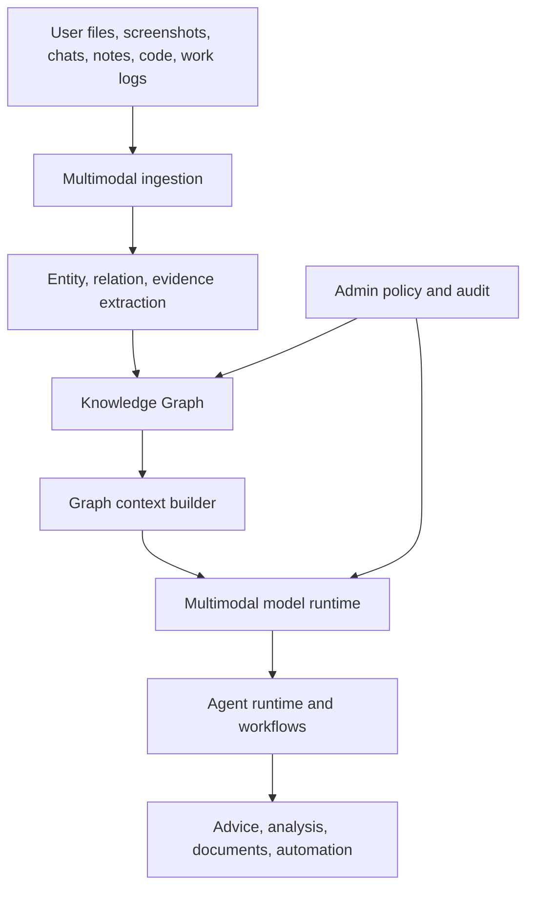

# Lattice AI Architecture

Lattice AI v2.2.0 is a local-first **AI Knowledge OS**. The architecture is
organized around one durable center: the Knowledge Graph. Models, tools,
agents, workflows, and UI modes are replaceable layers that operate on top of
the graph.

## Architecture Goals

- Keep user knowledge local-first by default.
- Treat multimodal input as the normal path, not an add-on.
- Preserve evidence, decisions, files, artifacts, and work history.
- Keep models replaceable and policy-governed.
- Explain risk and source facts instead of hiding capability.
- Keep basic and advanced modes feature-equivalent.
- Keep admin-only capabilities explicit and auditable.

## System View



## Durable Core

The Knowledge Graph stores the durable user and organization memory:

- files and document evidence
- images and screenshots
- conversations and notes
- user decisions
- work history
- generated artifacts
- agent and workflow events

The LLM is not the product core. It is an execution worker that can be replaced
when hardware, policy, or user preference changes.

## Multimodal Ingestion

Lattice AI assumes users will provide source material directly. The expected
input set includes:

- PDF
- Word
- Excel
- PowerPoint
- images
- screenshots
- chat history
- notes
- web content
- code
- work logs

The architecture must not ask users to convert these to plain text before AI can
work on them.

## Model Runtime Policy

Local recommended models must be multimodal. The v2.2 local runtime policy is:

- macOS Apple Silicon: MLX-VLM first
- Windows: llama.cpp multimodal path, with LM Studio as a user-friendly option
- Linux: llama.cpp or vLLM multimodal path depending on GPU support
- Ollama: kept as an option, not the default priority

The removed path is the old text-only MLX-LM recommendation route. Low-spec
machines use smaller or quantized multimodal models.

## Model Source Disclosure

Model catalog entries carry source disclosure fields:

1. `source_country`
2. `source_company`
3. `execution_method`
4. `internet_requirement`
5. `model_name`

These are first-class model facts, not advanced-only metadata.

## Recommendation Flow

```text
hardware scan
  -> CPU/GPU/RAM/disk/OS analysis
  -> multimodal model shortlist
  -> same-family old generation removal
  -> source disclosure
  -> recommendation reason
  -> download/install/load/verify
```

The current default recommendation family is Gemma 4. Qwen3-VL and Llama 4
remain current multimodal alternatives.

## Modes

Basic mode and advanced mode have the same feature access.

- Basic mode uses plain language and source facts.
- Advanced mode adds execution, memory, quantization, and load/unload detail.
- Admin mode adds actual authority: user management, permissions, audit logs,
  organization policy, security policy, sensitive-data monitoring, model approval
  policy, and Private VPC.

## Main Modules

| Module | Responsibility |
| --- | --- |
| `latticeai/services/model_catalog.py` | Multimodal model catalog, source metadata, aliases |
| `latticeai/services/model_recommendation.py` | Hardware-aware multimodal recommendation |
| `latticeai/services/model_runtime.py` | Download, load, server, and runtime orchestration |
| `llm_router.py` | MLX-VLM and OpenAI-compatible model routing |
| `knowledge_graph.py` | Graph storage, extraction, local folder graph RAG |
| `latticeai/core/context_builder.py` | Graph context for generation |
| `latticeai/core/workspace_os.py` | Workspace state, timeline, snapshots, memory |
| `latticeai/core/multi_agent.py` | Planner/executor/reviewer/researcher orchestration |
| `latticeai/core/workflow_engine.py` | Workflow definitions and run history |
| `latticeai/core/plugins.py` | Plugin manifest, registry, permission boundary |
| `latticeai/core/security.py` | Local security primitives |

## Compatibility

v2.2.0 preserves the additive Workspace OS and API compatibility posture from
v2.x. Existing graph/workspace data is migrated non-destructively. The release
does remove current recommendation entries for old or text-only model paths, but
it does not destructively mutate existing user graph data.
