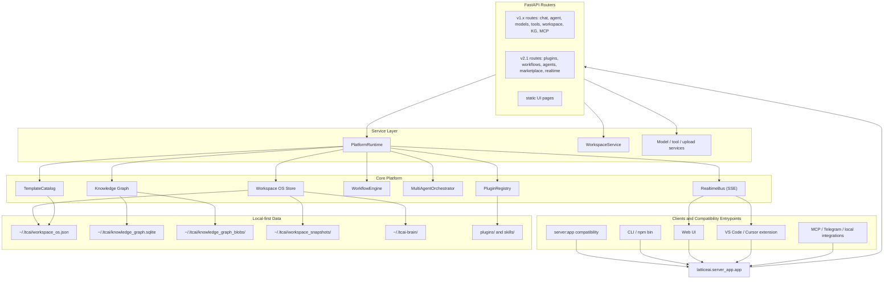
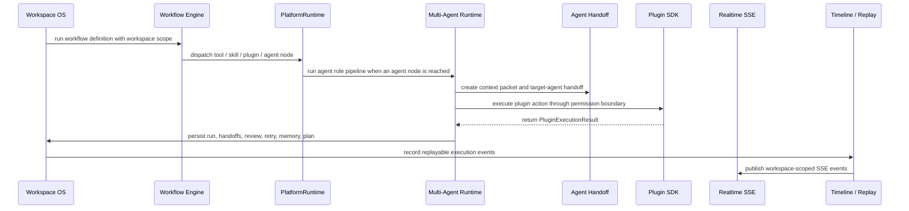

# Lattice AI v2.1 Architecture

Lattice AI v2.1.0 is a local-first Agentic Workspace Platform. The current
architecture is no longer the older v1.x "single `server.py` owns everything"
shape; `server.py` remains only a compatibility shim while
`latticeai.server_app.app` assembles focused routers, services, and core runtime
modules.

The current platform centers on these layers:

- **Workspace OS**: local-first state, workspace scopes, timeline, memory,
  agent/workflow run history, handoffs, snapshots, and marketplace registry.
- **Knowledge Graph**: graph ingestion and relationship lookup for chats,
  files, workflows, agent runs, memories, and workspace events.
- **PlatformRuntime**: the service layer that gates requests and wires
  workflows, agents, plugins, tools, skills, realtime, and graph persistence.
- **Plugin SDK**: local `plugin.json` manifests, permission grants, lifecycle,
  bundled skills, and permissioned action execution.
- **Workflow Designer / Workflow Engine**: bounded node graphs that run tools,
  skills, plugins, agents, conditions, and outputs.
- **Multi-Agent Runtime**: role orchestration, handoffs, context packets,
  review/retry loops, planning records, memory snapshots, and replay frames.
- **Realtime Collaboration**: SSE activity feed, presence, scoped event replay,
  and timeline-driven execution observability.
- **Marketplace Foundation**: local plugin, workflow, and agent templates with
  export/import/install hooks.

`docs/V2_ARCHITECTURE.md` is the deeper design note for these subsystems. This
file is the concise current architecture map and compatibility/security boundary
reference.

## Current Architecture Diagram



## Source Of Truth

| Surface | Current source |
| --- | --- |
| ASGI app assembly | `latticeai/server_app.py` |
| Compatibility entrypoint | `server.py` exposes `server:app` |
| Cross-subsystem wiring | `latticeai/services/platform_runtime.py` |
| Workspace OS and timeline | `latticeai/core/workspace_os.py` |
| Knowledge Graph | `knowledge_graph.py` plus Workspace OS graph hooks |
| Plugin SDK | `latticeai/core/plugins.py`, `latticeai/api/plugins.py` |
| Workflow Designer / Engine | `latticeai/core/workflow_engine.py`, `latticeai/api/workflow_designer.py` |
| Multi-Agent Runtime | `latticeai/core/multi_agent.py`, `latticeai/api/agents.py` |
| Realtime SSE | `latticeai/core/realtime.py`, `latticeai/api/realtime.py` |
| Marketplace Foundation | `latticeai/core/marketplace.py`, `latticeai/api/marketplace.py` |
| CLI | `ltcai_cli.py`, `bin/ltcai.js` |
| VS Code extension | `vscode-extension/` |

## Execution Flow

The v2.1 execution flow is:

```text
Workspace -> Workflow -> Agent -> Handoff -> Plugin -> Realtime -> Timeline
```



In practice, the chain is bidirectional where the product needs it:

- A workflow can run a tool, skill, plugin, or agent node through
  `PlatformRuntime.build_workflow_runners`.
- An agent executor can call a plugin or workflow through injected runners.
- A plugin action can call a skill, tool, workflow, or agent when its manifest
  declares the capability and the user/admin has granted the permission.
- Every persisted activity becomes a timeline event. The Workspace OS `event_sink`
  publishes those events to the `RealtimeBus`, so activity pages and SSE clients
  observe the same state mutations that are stored for replay.

Recursion is bounded by construction: workflow-to-agent runs do not receive a
workflow runner, and agent-to-workflow runs do not receive an agent runner.
Separately, workflows have a hard step cap and agent review retries are bounded.

## Workspace OS And Knowledge Graph

Workspace OS is the local state authority. It stores workspaces, users' current
workspace context, skill and plugin registries, workflow definitions and runs,
agent runs, handoffs, memory snapshots, marketplace templates, timeline events,
and feature flags. v2.1.0 state additions are additive and deep-merged on load,
so older `workspace_os.json` files are upgraded in memory without destructive
migration.

The Knowledge Graph remains the relationship layer. Chats, files, uploads,
workflow runs, agent runs, memories, snapshots, and other workspace events are
linked through graph ingestion. v2.1.0 adds more graph linkage; it does not
replace legacy graph APIs or rewrite existing graph content.

## PlatformRuntime

`PlatformRuntime` is the only intended cross-wiring point for v2.1 subsystems.
Routers ask it for:

- workspace read/write gates and allowed realtime scopes;
- plugin lifecycle hooks that register bundled skills in the existing skill
  registry;
- workflow runners for tools, skills, plugins, and agents;
- agent orchestrators with workspace context, plugin runners, workflow runners,
  memory, handoff, and review/retry persistence;
- graph linkage for workflow and agent runs;
- bounded cross-system execution so workflows, agents, and plugins can compose
  without unbounded recursion.

Keeping this wiring in the service layer keeps `server_app.py` as assembly code
and preserves testable core modules with explicit interfaces.

## Compatibility Boundaries

v2.1.0 is additive. These boundaries are intentionally stable:

- **`server:app`**: `server.py` continues to expose the ASGI app for uvicorn,
  scripts, tests, and existing deployment commands. The canonical app is
  `latticeai.server_app.app`.
- **CLI**: `LTCAI`, `ltcai_cli.py`, and `bin/ltcai.js` continue to start the
  local server and point at the same FastAPI app.
- **VS Code extension**: the extension keeps using the local server integration;
  v2.1 adds platform surfaces without removing existing chat, command, or send
  flows.
- **v1.x workspaces**: Workspace OS uses deep-merge backfill for new state keys
  and non-destructive workspace migration. Existing chats, snapshots, memories,
  skills, workflows, agent history, and graph data remain readable.
- **Existing skills and workflows**: standalone skills stay in the skill
  registry. Plugins extend that surface instead of replacing it. Legacy workflow
  `steps` definitions are normalized into node graphs at runtime without
  rewriting historical records.
- **Existing route families**: chat, single-agent, model, MCP, workspace,
  account, admin, tools, and Knowledge Graph routes remain in their established
  namespaces. v2.1 routes are additive under `/plugins`, `/workflows`,
  `/agents`, `/marketplace`, and `/realtime`.

## Security Boundaries

The security model is local-first but scoped:

- **Workspace scoping**: API routers use `PlatformRuntime.gate_read`,
  `gate_write`, and `allowed_scopes`, backed by `WorkspaceService`, before
  exposing workspace data or realtime streams. Records carry `workspace_id`
  wherever cross-workspace visibility matters.
- **Plugin permissions**: plugins declare an allow-listed permission set in
  `plugin.json`; install/lifecycle state records granted permissions; execution
  returns `blocked` when a plugin tries to use an undeclared or ungranted
  capability.
- **Workflow permissions**: workflow nodes execute only through injected runners.
  Missing runners are skipped safely, condition nodes use a fixed comparison set
  instead of `eval`, and step counts are capped.
- **Agent context packets**: handoffs carry structured context packets and
  obvious secret fields are redacted before persistence.
- **Realtime event scoping**: every realtime event can carry `workspace_id`.
  Subscribers receive only events inside their allowed workspace scope; the feed
  is bounded and publishing is best-effort so event delivery cannot break a
  state write.
- **Local data boundary**: package publishing, cloud marketplace service, and
  deployment are outside the v2.1 runtime path. Local artifacts and state remain
  under the configured Lattice AI data directories unless the user opts into
  external services.

## Related Documents

- `docs/V2_ARCHITECTURE.md`: deeper subsystem design, integration seams, route
  surface, compatibility notes, and test coverage.
- `docs/PLUGIN_SDK.md`: plugin manifest, permissions, lifecycle, and examples.
- `docs/WORKFLOW_DESIGNER.md`: workflow definition schema and execution model.
- `docs/MULTI_AGENT_RUNTIME.md`: role pipeline, handoffs, review/retry, memory,
  and replay details.
- `docs/REALTIME_COLLABORATION.md`: SSE bus, presence, feed, and scope behavior.
- `docs/CHANGELOG.md`: historical release entries. Historical v1.x references are
  preserved and should not be rewritten as current architecture.
